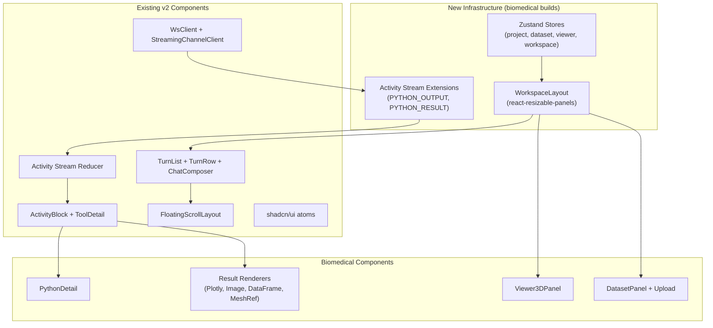

# Frontend Architecture — Biomedical MVP

All frontend work targets `frontend-v2/`. This doc explains how the biomedical components integrate with v2's existing architecture and what new infrastructure is needed. See [design overview](../overview.md) for system context.

## What v2 Has Today

| Layer | Status | Key Files |
|-------|--------|-----------|
| **UI atoms** | Done (Phase 1-2) | `src/components/ui/` — 33 shadcn/ui components |
| **Editor** | Done (Phase 3) | `src/editor/` — CM6 + Yjs collab |
| **Activity stream** | Done (Phase 5 partial) | `src/features/activity-stream/` — reducer, types, renderers |
| **Thread UI** | Done (Phase 5 partial) | `src/features/threads/` — TurnList, TurnRow, ChatComposer |
| **WebSocket** | Done | `src/lib/ws/` — WsClient, protocol, binary frame support |
| **Streaming** | Done | `src/features/threads/streaming/` — StreamingChannelClient, ThreadWsProvider |
| **Chat scroll** | Done | `src/features/chat-scroll/` — FloatingScrollLayout |

| Layer | Not Started | Biomedical MVP Builds It |
|-------|-------------|-------------------------|
| **Layouts** | Phase 6 | [layout.md](layout.md) — workspace shell |
| **Data integration** | Phase 7 | [state.md](state.md) — zustand stores, API client |
| **Routes** | Phase 8 | Minimal routing for project/thread navigation |

## Architecture Diagram



## Integration Points

### 1. Activity Stream Reducer
The existing reducer in `src/features/activity-stream/streaming/reducer.ts` processes `StreamEvent` into `ActivityBlockData`. We extend it with two new event types:

- `PYTHON_OUTPUT` → appends to ToolItem's `pythonOutput` field
- `PYTHON_RESULT` → creates new `ResultItem` in the activity items array

See [activity-stream-extensions.md](activity-stream-extensions.md) for types and reducer logic.

### 2. ToolDetail Routing
The existing `ToolDetail.tsx` routes to specialized detail renderers by tool category. We add `execute_python` as a new category with its own `PythonDetail` component that renders streaming stdout and rich results.

See [inline-results.md](inline-results.md) for component details.

### 3. WebSocket Binary Frames
The existing `WsClient` supports `onBinaryMessage(subId, data)` callback. Mesh binary frames use this path. `ThreadWsProvider` needs to wire the callback to the viewer store.

See [viewer-3d.md](viewer-3d.md) for binary parsing.

### 4. Workspace Layout
v2 has no layout shell yet (Phase 6 not started). The biomedical MVP builds a workspace layout using `react-resizable-panels` with chat on the left and a content panel on the right that switches between editor, 3D viewer, and dataset browser.

See [layout.md](layout.md) for layout design.

### 5. State Management
v2 has no data stores yet (Phase 7 not started). The biomedical MVP introduces zustand stores for project context, dataset management, viewer state, and workspace panel state.

See [state.md](state.md) for store designs.

## Component Hierarchy

```
App
└── WorkspaceLayout (react-resizable-panels)
    ├── ChatPanel (left, resizable)
    │   └── FloatingScrollLayout (existing)
    │       ├── topSlot: thread header
    │       ├── TurnList (existing)
    │       │   └── TurnRow (existing)
    │       │       ├── UserBubble (existing)
    │       │       └── ActivityBlock (extended)
    │       │           ├── ToolRow → PythonDetail (NEW)
    │       │           ├── ResultRow (NEW)
    │       │           │   ├── PlotlyBlock
    │       │           │   ├── ImageBlock
    │       │           │   ├── DataFrameBlock
    │       │           │   └── MeshRefBlock
    │       │           └── ContentRow (existing)
    │       └── bottomSlot: ChatComposer (existing)
    │
    └── ContentPanel (right, resizable)
        ├── Viewer3DPanel (when activeMeshId set)
        ├── DatasetPanel (when viewing datasets)
        └── EditorPanel (when editing documents)
```

## Conventions

All new components follow frontend-v2 conventions from `frontend-v2/CLAUDE.md` and `frontend-v2/src/features/CLAUDE.md`:

- **Storybook-first**: Every component has co-located `.stories.tsx`
- **shadcn/ui**: Use Radix primitives + CVA + tailwind-merge
- **Phosphor Icons**: `@phosphor-icons/react`
- **Tailwind v4**: Design system tokens (`accent-fill`, `muted-foreground`, etc.)
- **`cn()` utility**: Class merging via `clsx` + `tailwind-merge`
- **Story testing**: Modify the component, not the story; shared mock factories

## New Dependencies

```
react-resizable-panels         # Layout (Phase 6 dependency)
zustand                        # State management (Phase 7 dependency)
@react-three/fiber             # 3D rendering
@react-three/drei              # Three.js helpers
three                          # Three.js core
react-plotly.js                # Plotly chart rendering
plotly.js-dist-min             # Plotly core (minified)
@tanstack/react-router         # Routing (minimal)
```

Already in `package.json`:
- `@tanstack/react-query` — data fetching
- `dompurify` — HTML sanitization
- `@radix-ui/*` — UI primitives
- All shadcn/ui dependencies

## Related Docs

- [Layout](layout.md) — workspace shell and panel design
- [Activity Stream Extensions](activity-stream-extensions.md) — reducer and type extensions
- [State Management](state.md) — zustand store designs
- [3D Viewer](viewer-3d.md) — mesh rendering component
- [Inline Results](inline-results.md) — chart/table/image renderers
- [Dataset Upload](dataset-upload.md) — DICOM upload interface
