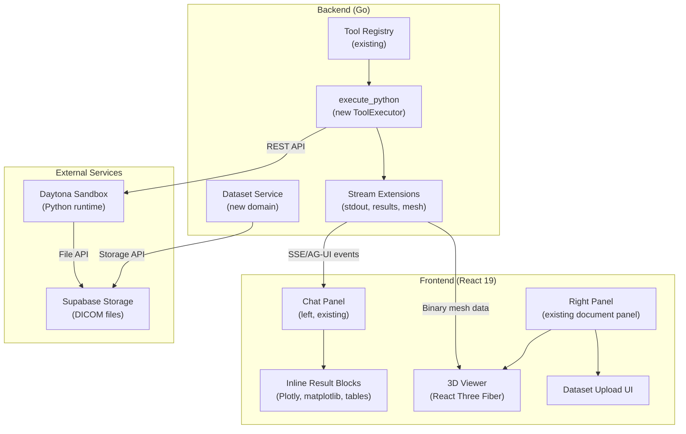
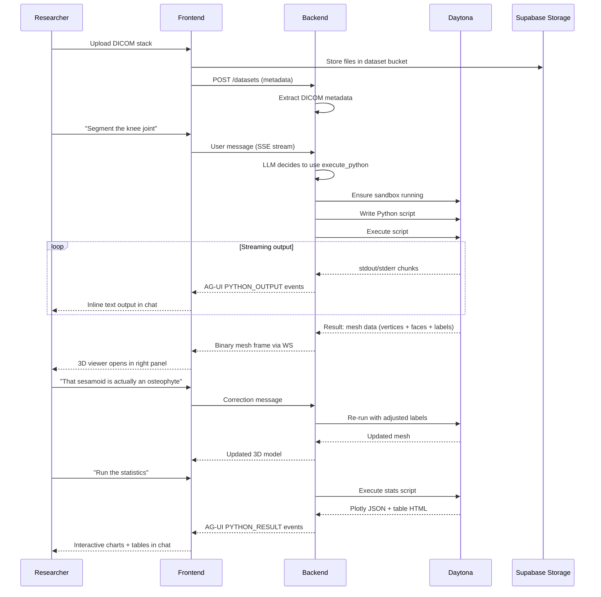

# Biomedical MVP — Design Overview

Transform Meridian from a fiction writing platform into a biomedical data analysis platform. The customer is a musculoskeletal researcher who needs an AI agent that autonomously processes uCT scans end-to-end: DICOM upload → segmentation → 3D validation → measurements → statistics → figures → paper sections.

## Architecture Summary



## What We Extend vs What We Add

### Extend (existing infrastructure)

| Component | Extension |
|-----------|-----------|
| **Tool Registry** | Register new `execute_python` tool via existing `RegisterWithMetadata` |
| **ToolRegistryBuilder** | Add conditional Daytona client wiring (same pattern as web_search) |
| **AG-UI Event Stream** | New event subtypes for Python stdout/stderr and rich results |
| **TurnBlock types** | New `BlockType` constants for code output, charts, tables, meshes |
| **PersonaCatalog** | New `.agents/agents/data-analyst.md` file (no code changes) |
| **Two-panel layout** | Right panel gains 3D viewer as new content type alongside editor |
| **SSE Event Handlers** | New handlers for Python execution events |
| **Supabase Storage** | New bucket for DICOM datasets |

### Add (new components)

| Component | Description | Design Doc |
|-----------|-------------|------------|
| **execute_python tool** | ToolExecutor wrapping Daytona sandbox API | [execute-python.md](backend/execute-python.md) |
| **Daytona service** | Sandbox lifecycle management | [daytona-service.md](backend/daytona-service.md) |
| **Dataset domain** | Upload, storage, metadata for DICOM stacks | [dataset-domain.md](backend/dataset-domain.md) |
| **Stream extensions** | New AG-UI events for Python output | [stream-extensions.md](backend/stream-extensions.md) |
| **3D viewer** | React Three Fiber mesh renderer | [viewer-3d.md](frontend/viewer-3d.md) |
| **Inline results** | Plotly/matplotlib/table rendering in chat | [inline-results.md](frontend/inline-results.md) |
| **Dataset upload UI** | DICOM drag-and-drop with metadata | [dataset-upload.md](frontend/dataset-upload.md) |
| **Data analyst agent** | Biomedical persona profile | [data-analyst-agent.md](agent/data-analyst-agent.md) |

## Key Architectural Decisions

### 1. Daytona over Pyodide
SimpleITK requires native C++ — Pyodide (WebAssembly) cannot run it. Daytona provides real Linux sandboxes with configurable CPU/RAM. One persistent sandbox per project with auto-stop on idle keeps costs manageable.

### 2. Streaming Python output via AG-UI events
Python stdout/stderr and rich results (charts, tables, mesh data) stream through the existing AG-UI event pipeline. New event subtypes (`PYTHON_OUTPUT`, `PYTHON_RESULT`) carry typed payloads. No new transport layer needed.

### 3. Binary mesh via existing WS binary frames
The WS client already supports binary frames (`sendBinary` with subId + null delimiter + payload). Mesh data (vertices + faces + labels) uses this path. No protocol changes needed.

### 4. 3D viewer replaces editor in right panel
The right panel's `DocumentPanel` already switches content type based on state. The 3D viewer becomes a new content type triggered when mesh data arrives. Same pattern as editor vs. skill editor vs. project home.

### 5. Dataset as new domain
DICOM datasets are project-scoped resources stored in Supabase Storage with metadata in a `datasets` table. This follows the existing domain pattern (`docsystem`, `agents`, `billing`, etc.) with its own service, repository, and handler.

### 6. Single agent profile
One `data-analyst` persona with domain knowledge baked into the system prompt. No agent switching needed — the researcher talks to one AI that handles the full pipeline. Uses `execute_python` as its primary tool.

## Data Flow: End-to-End Pipeline



## Directory Map

```
backend/
  internal/
    domain/datasets/           # New domain: interfaces + types
    service/datasets/          # Dataset service implementation
    service/sandbox/           # Daytona sandbox service
    service/llm/tools/
      execute_python.go        # New ToolExecutor
      execute_python_meta.go   # Metadata for system prompt
    handler/dataset.go         # HTTP endpoints
    repository/postgres/
      dataset.go               # Dataset repository
  migrations/
    NNNNNN_create_datasets.up.sql

frontend/ (or frontend-v2/)
  src/
    features/
      viewer-3d/              # React Three Fiber viewer
      datasets/               # Upload UI + metadata display
      threads/
        components/blocks/    # New block renderers (chart, table, code output)
        hooks/sse/
          eventHandlers/      # New Python event handlers

.agents/
  agents/
    data-analyst.md           # Biomedical persona profile
```

## Related Design Docs

- [execute_python Tool](backend/execute-python.md) — ToolExecutor implementation and Daytona integration
- [Daytona Service](backend/daytona-service.md) — Sandbox lifecycle management
- [Dataset Domain](backend/dataset-domain.md) — DICOM upload, storage, metadata
- [Stream Extensions](backend/stream-extensions.md) — New AG-UI events for Python output
- [3D Viewer](frontend/viewer-3d.md) — React Three Fiber mesh rendering
- [Inline Results](frontend/inline-results.md) — Chart/table/image rendering in chat
- [Dataset Upload UI](frontend/dataset-upload.md) — DICOM drag-and-drop interface
- [Data Analyst Agent](agent/data-analyst-agent.md) — Biomedical persona profile design
