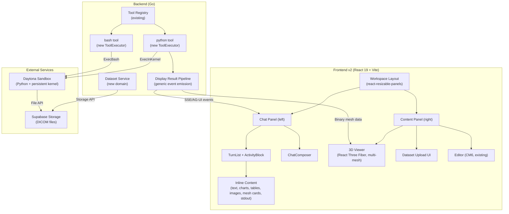
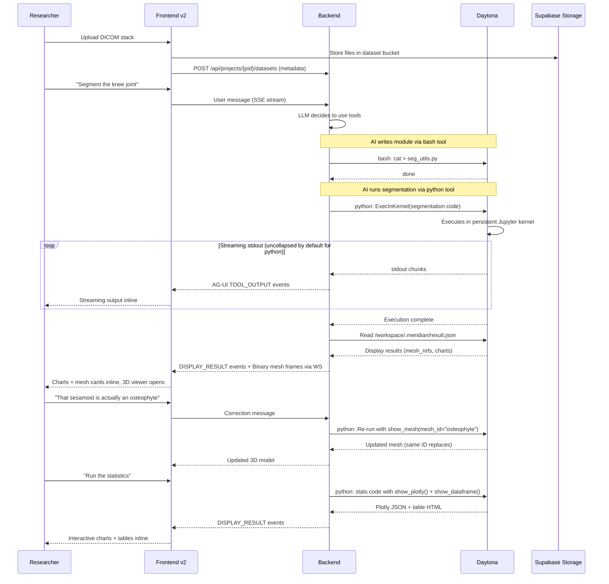

# Biomedical MVP — Design Overview

Transform Meridian from a fiction writing platform into a biomedical data analysis platform. The customer is a musculoskeletal researcher who needs an AI agent that autonomously processes uCT scans end-to-end: DICOM upload → segmentation → 3D validation → measurements → statistics → figures → paper sections.

## Architecture Summary



## What We Extend vs What We Add

### Extend (existing infrastructure)

| Component | Extension |
|-----------|-----------|
| **Tool Registry** | Register `python` and `bash` tools via existing `RegisterWithMetadata` |
| **ToolRegistryBuilder** | Add conditional Daytona client wiring (same pattern as web_search) |
| **AG-UI Event Stream** | New event subtypes `TOOL_OUTPUT` and `DISPLAY_RESULT` for rich output |
| **TurnBlock types** | New `BlockType` constants for tool output and display results |
| **PersonaCatalog** | New `.agents/agents/data-analyst.md` file (no code changes) |
| **SSE Event Handlers** | New handlers for `TOOL_OUTPUT` and `DISPLAY_RESULT` events |
| **Supabase Storage** | New bucket for DICOM datasets |
| **Activity stream reducer** | New event types + per-item collapse defaults model |
| **ToolDetail routing** | New `PythonDetail` + extended `BashDetail` for sandbox output rendering |

### Add (new components)

| Component | Description | Design Doc |
|-----------|-------------|------------|
| **python tool** | ToolExecutor for Jupyter kernel execution + result capture | [python-tool.md](backend/python-tool.md) |
| **bash tool** | ToolExecutor for shell commands in Daytona sandbox | [bash-tool.md](backend/bash-tool.md) |
| **Daytona service** | Sandbox lifecycle + persistent Jupyter kernel management | [daytona-service.md](backend/daytona-service.md) |
| **Dataset domain** | Upload, storage, metadata for DICOM stacks | [dataset-domain.md](backend/dataset-domain.md) |
| **Display result pipeline** | Generic AG-UI events + OutputSink for rich results | [display-results.md](backend/display-results.md) |
| **Workspace layout** | Two-panel resizable layout | [layout.md](frontend/layout.md) |
| **Activity stream redesign** | Per-item collapse defaults model + per-tool display config | [activity-stream.md](frontend/activity-stream.md) |
| **Zustand stores** | Project, dataset, multi-mesh viewer state | [state.md](frontend/state.md) |
| **3D viewer** | React Three Fiber multi-mesh renderer | [viewer-3d.md](frontend/viewer-3d.md) |
| **Inline results** | Plotly/matplotlib/table/mesh rendering inline with text | [inline-results.md](frontend/inline-results.md) |
| **Dataset upload UI** | DICOM drag-and-drop with metadata | [dataset-upload.md](frontend/dataset-upload.md) |
| **Data analyst agent** | Biomedical persona profile | [agent/data-analyst-agent.md](agent/data-analyst-agent.md) |

## Key Architectural Decisions

### 1. Two tools: `python` + `bash`
The AI uses two tools in the Daytona sandbox:
- **`python` tool**: Input is raw Python code. Always executes in a persistent Jupyter kernel. Always wrapped with result_helper (captures images, charts, tables, meshes via `show_*` helpers). Primary tool for analysis.
- **`bash` tool**: Input is a shell command. For file operations, pip install, non-Python tasks. No kernel, no result capture.

Both share the same Daytona sandbox service. The AI writes reusable modules via `bash` (file writes), then runs analysis code via `python` (kernel execution).

### 2. Trigger-agnostic downstream flow
The `python` tool is designed to be replaceable by a streaming code fence interceptor (`python:run` blocks). The downstream flow — ExecInKernel → stream stdout → read result.json → emit results → render — is identical regardless of trigger. The Daytona service, result_helper.py, DISPLAY_RESULT events, and frontend rendering are all decoupled from how code arrives.

### 3. Generic display results, inline with text
Any tool can emit `DISPLAY_RESULT` events — the concept is not Python-specific. Results (charts, images, tables, mesh refs) render **inline with text** in the ActivityBlock, never collapsed by default. They are content, not a separate category.

### 4. ActivityBlock with per-item collapse defaults
One ActivityBlock per assistant turn. Each item has a default collapse state based on its kind and tool category:
- **Collapsed by default**: thinking, tool input/args. Expandable for debugging.
- **Depends on tool category**: tool stdout (python: uncollapsed, bash: collapsed).
- **Hidden by default**: tool stderr (click for popup).
- **Never collapsed**: text content, display results (charts, images, tables, mesh cards) — inline with text.

Per-tool-category display config (extensible) controls collapse defaults. User can toggle any item.

### 5. Multi-mesh 3D scene
The 3D viewer manages multiple named meshes by ID:
- `show_mesh(verts, faces, mesh_id="femur", label="Femur", color="#4488ff")`
- Same `mesh_id` = replace. New `mesh_id` = add to scene.
- No per-vertex label splitting on frontend — each call is one complete mesh.
- User toggles visibility per mesh via checkboxes.

### 6. Binary mesh via existing WS binary frames
The WS client already supports binary frames (`subId UTF-8 0x00 payload`). Mesh data (vertices + faces) uses this path. No protocol changes needed.

### 7. Frontend target: `frontend-v2/`
Ship on `frontend-v2/` (ground-up rebuild). See [decisions.md](../decisions.md) D4 for full rationale.

### 8. Dataset as new domain
DICOM datasets are project-scoped resources stored in Supabase Storage with metadata in a `datasets` table. Follows existing domain pattern.

### 9. Single agent profile
One `data-analyst` persona with domain knowledge. Uses `python` for analysis and `bash` for file operations.

## Data Flow: End-to-End Pipeline



## Directory Map

```
backend/
  internal/
    domain/datasets/           # New domain: interfaces + types
    domain/sandbox/            # Sandbox domain: interfaces + types
    service/datasets/          # Dataset service implementation
    service/sandbox/           # Daytona sandbox service + kernel manager
    service/llm/tools/
      python_tool.go           # New ToolExecutor (kernel + result capture)
      python_tool_meta.go      # Metadata for system prompt
      bash_tool.go             # New ToolExecutor (shell commands)
      bash_tool_meta.go        # Metadata for system prompt
      output_sink.go           # OutputSink interface for streaming
      display_result.go        # DisplayResult types
    service/llm/streaming/
      agui_output_sink.go      # OutputSink -> emitter bridge
    handler/dataset.go         # HTTP endpoints
    repository/postgres/
      dataset.go               # Dataset repository
      sandbox.go               # Sandbox repository
  migrations/
    NNNNNN_create_datasets.up.sql
    NNNNNN_create_project_sandboxes.up.sql

frontend-v2/                   # Target frontend (NOT frontend/)
  src/
    features/
      activity-stream/
        streaming/
          events.ts            # Extended with TOOL_OUTPUT, DISPLAY_RESULT
          reducer.ts           # Revised: per-item collapse defaults + per-tool display config
        types.ts               # Extended with DisplayResultItem
        tool-display-config.ts # Per-tool-category collapse defaults
        ActivityBlock.tsx       # Revised: per-item collapse defaults
        items/
          DisplayResultRow.tsx  # Inline result renderer
      viewer-3d/               # React Three Fiber multi-mesh viewer
        Viewer3DPanel.tsx
        MeshScene.tsx
        BoneMesh.tsx
        StructureToggle.tsx
        ViewerToolbar.tsx
        hooks/
        types.ts
      datasets/                # Upload UI + metadata display
        DatasetPanel.tsx
        DatasetUploadZone.tsx
        DatasetList.tsx
        DatasetCard.tsx
        hooks/
      inline-results/          # Display result block renderers
        PlotlyBlock.tsx
        ImageBlock.tsx
        DataFrameBlock.tsx
        MeshRefBlock.tsx
        ToolOutputBlock.tsx
        StderrPopover.tsx
        types.ts
      workspace/               # Layout shell
        WorkspaceLayout.tsx
        ContentPanel.tsx
    stores/                    # Zustand stores
      workspace-store.ts
      dataset-store.ts
      viewer-store.ts

.agents/
  agents/
    data-analyst.md            # Biomedical persona profile
```

## Related Design Docs

### Backend
- [Python Tool](backend/python-tool.md) — ToolExecutor for Jupyter kernel execution + result capture
- [Bash Tool](backend/bash-tool.md) — ToolExecutor for shell commands
- [Daytona Service](backend/daytona-service.md) — Sandbox lifecycle + persistent kernel
- [Dataset Domain](backend/dataset-domain.md) — DICOM upload, storage, metadata
- [Display Result Pipeline](backend/display-results.md) — Generic AG-UI events for rich results

### Frontend
- [Frontend Overview](frontend/overview.md) — How all frontend pieces connect
- [Activity Stream](frontend/activity-stream.md) — Per-item collapse defaults + per-tool display config
- [Workspace Layout](frontend/layout.md) — Two-panel resizable workspace
- [State Management](frontend/state.md) — Zustand stores for project/dataset/viewer state
- [3D Viewer](frontend/viewer-3d.md) — React Three Fiber multi-mesh rendering
- [Inline Results](frontend/inline-results.md) — Chart/table/image/mesh rendering inline
- [Dataset Upload UI](frontend/dataset-upload.md) — DICOM drag-and-drop interface

### Agent
- [Data Analyst Agent](agent/data-analyst-agent.md) — Biomedical persona profile design
