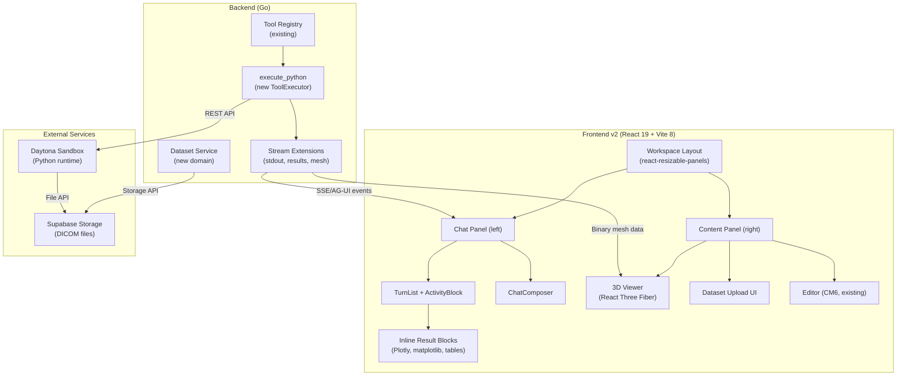
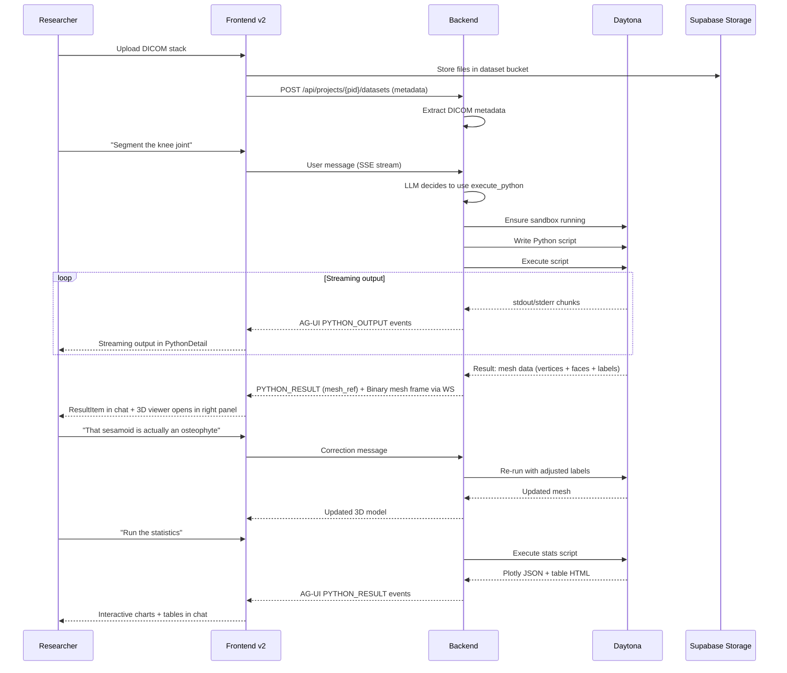

# Biomedical MVP — Design Overview

Transform Meridian from a fiction writing platform into a biomedical data analysis platform. The customer is a musculoskeletal researcher who needs an AI agent that autonomously processes uCT scans end-to-end: DICOM upload → segmentation → 3D validation → measurements → statistics → figures → paper sections.

## Architecture Summary



## What We Extend vs What We Add

### Extend (existing infrastructure)

| Component | Extension |
|-----------|-----------|
| **Tool Registry** | Register new `execute_python` tool via existing `RegisterWithMetadata` |
| **ToolRegistryBuilder** | Add conditional Daytona client wiring (same pattern as web_search) |
| **AG-UI Event Stream** | New event subtypes for Python stdout/stderr and rich results |
| **TurnBlock types** | New `BlockType` constants for code output, charts, tables, meshes |
| **PersonaCatalog** | New `.agents/agents/data-analyst.md` file (no code changes) |
| **SSE Event Handlers** | New handlers for Python execution events |
| **Supabase Storage** | New bucket for DICOM datasets |
| **Activity stream reducer** | New event types `PYTHON_OUTPUT` and `PYTHON_RESULT` |
| **ToolDetail routing** | New `PythonDetail` component for `execute_python` tool |

### Add (new components)

| Component | Description | Design Doc |
|-----------|-------------|------------|
| **execute_python tool** | ToolExecutor wrapping Daytona sandbox API | [execute-python.md](backend/execute-python.md) |
| **Daytona service** | Sandbox lifecycle management | [daytona-service.md](backend/daytona-service.md) |
| **Dataset domain** | Upload, storage, metadata for DICOM stacks | [dataset-domain.md](backend/dataset-domain.md) |
| **Stream extensions** | New AG-UI events for Python output | [stream-extensions.md](backend/stream-extensions.md) |
| **Workspace layout** | Two-panel resizable layout | [layout.md](frontend/layout.md) |
| **Activity stream extensions** | Reducer + types for Python events | [activity-stream-extensions.md](frontend/activity-stream-extensions.md) |
| **Zustand stores** | Project, dataset, viewer state | [state.md](frontend/state.md) |
| **3D viewer** | React Three Fiber mesh renderer | [viewer-3d.md](frontend/viewer-3d.md) |
| **Inline results** | Plotly/matplotlib/table rendering in chat | [inline-results.md](frontend/inline-results.md) |
| **Dataset upload UI** | DICOM drag-and-drop with metadata | [dataset-upload.md](frontend/dataset-upload.md) |
| **Data analyst agent** | Biomedical persona profile | [data-analyst-agent.md](agent/data-analyst-agent.md) |

## Key Architectural Decisions

### 1. Daytona over Pyodide
SimpleITK requires native C++ — Pyodide (WebAssembly) cannot run it. Daytona provides real Linux sandboxes with configurable CPU/RAM. One persistent sandbox per project with auto-stop on idle keeps costs manageable.

### 2. Streaming Python output via AG-UI events
Python stdout/stderr and rich results (charts, tables, mesh data) stream through the existing AG-UI event pipeline. New event subtypes (`PYTHON_OUTPUT`, `PYTHON_RESULT`) carry typed payloads. The frontend-v2 activity stream reducer processes these into the ActivityBlockData model.

### 3. Binary mesh via existing WS binary frames
The WS client already supports binary frames (`subId UTF-8 0x00 payload`). Mesh data (vertices + faces + labels) uses this path. No protocol changes needed. `frontend-v2/src/lib/ws/ws-client.ts` already has `onBinaryMessage` callback support.

### 4. Frontend target: `frontend-v2/`
Ship on `frontend-v2/` (ground-up rebuild). See [decisions.md](../decisions.md) D4 for full rationale. This means building the data integration layer (layouts, stores, routing, API client) as part of the biomedical MVP, targeted for biomedical needs rather than retrofitting v1 patterns.

### 5. Dataset as new domain
DICOM datasets are project-scoped resources stored in Supabase Storage with metadata in a `datasets` table. This follows the existing domain pattern (`docsystem`, `agents`, `billing`, etc.) with its own service, repository, and handler.

### 6. Single agent profile
One `data-analyst` persona with domain knowledge baked into the system prompt. No agent switching needed — the researcher talks to one AI that handles the full pipeline. Uses `execute_python` as its primary tool.

### 7. Activity stream integration approach
`PYTHON_OUTPUT` events accumulate on the ToolItem (rendered in PythonDetail). `PYTHON_RESULT` events create `ResultItem` entries in the activity items array that render as prominent, always-visible result blocks below the collapsible activity card. See [activity-stream-extensions.md](frontend/activity-stream-extensions.md).

## Data Flow: End-to-End Pipeline



## Directory Map

```
backend/
  internal/
    domain/datasets/           # New domain: interfaces + types
    domain/sandbox/            # Sandbox domain: interfaces + types
    service/datasets/          # Dataset service implementation
    service/sandbox/           # Daytona sandbox service
    service/llm/tools/
      execute_python.go        # New ToolExecutor
      execute_python_meta.go   # Metadata for system prompt
      output_sink.go           # OutputSink interface for streaming
    service/llm/streaming/
      agui_output_sink.go      # OutputSink implementation wrapping emitter
    handler/dataset.go         # HTTP endpoints
    repository/postgres/
      dataset.go               # Dataset repository
      sandbox.go               # Sandbox repository
  migrations/
    NNNNNN_create_datasets.up.sql
    NNNNNN_create_project_sandboxes.up.sql

frontend-v2/                   # Target frontend (NOT frontend/)
  src/
    features/
      activity-stream/
        streaming/
          events.ts            # Extended with PYTHON_OUTPUT, PYTHON_RESULT
          reducer.ts           # Extended with new event handlers
        types.ts               # Extended with ResultItem, PythonOutputLine
        items/
          ResultRow.tsx        # New result block renderer
        PythonDetail.tsx       # New ToolDetail for execute_python
      viewer-3d/               # React Three Fiber viewer
        Viewer3DPanel.tsx
        MeshScene.tsx
        BoneMesh.tsx
        StructureToggle.tsx
        ViewerToolbar.tsx
        hooks/
        types.ts
      datasets/                # Upload UI + metadata display
        DatasetPanel.tsx
        DatasetUploadZone.tsx
        DatasetList.tsx
        DatasetCard.tsx
        hooks/
      workspace/               # Layout shell
        WorkspaceLayout.tsx
        ContentPanel.tsx
    stores/                    # Zustand stores
      project-store.ts
      dataset-store.ts
      viewer-store.ts
      workspace-store.ts

.agents/
  agents/
    data-analyst.md            # Biomedical persona profile
```

## Related Design Docs

### Backend (unchanged)
- [execute_python Tool](backend/execute-python.md) — ToolExecutor implementation and Daytona integration
- [Daytona Service](backend/daytona-service.md) — Sandbox lifecycle management
- [Dataset Domain](backend/dataset-domain.md) — DICOM upload, storage, metadata
- [Stream Extensions](backend/stream-extensions.md) — New AG-UI events for Python output

### Frontend (revised for v2)
- [Frontend Overview](frontend/overview.md) — How all frontend pieces connect
- [Workspace Layout](frontend/layout.md) — Two-panel resizable workspace
- [Activity Stream Extensions](frontend/activity-stream-extensions.md) — Reducer + types for Python events
- [State Management](frontend/state.md) — Zustand stores for project/dataset/viewer state
- [3D Viewer](frontend/viewer-3d.md) — React Three Fiber mesh rendering
- [Inline Results](frontend/inline-results.md) — Chart/table/image rendering in chat
- [Dataset Upload UI](frontend/dataset-upload.md) — DICOM drag-and-drop interface

### Agent
- [Data Analyst Agent](agent/data-analyst-agent.md) — Biomedical persona profile design
