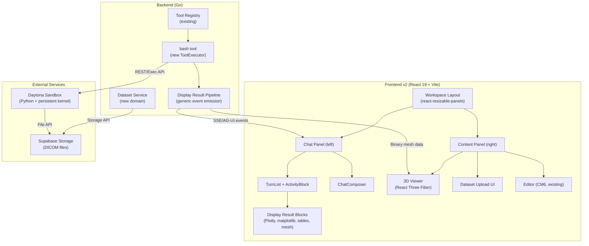
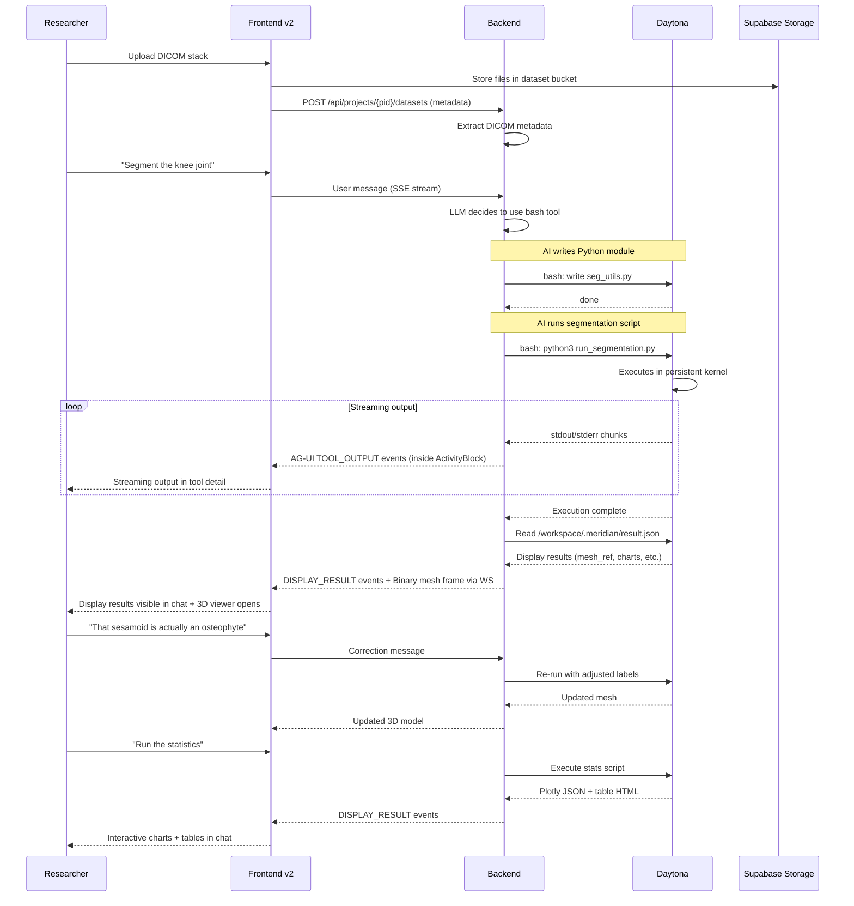

# Biomedical MVP — Design Overview

Transform Meridian from a fiction writing platform into a biomedical data analysis platform. The customer is a musculoskeletal researcher who needs an AI agent that autonomously processes uCT scans end-to-end: DICOM upload → segmentation → 3D validation → measurements → statistics → figures → paper sections.

## Architecture Summary



## What We Extend vs What We Add

### Extend (existing infrastructure)

| Component | Extension |
|-----------|-----------|
| **Tool Registry** | Register new `bash` tool via existing `RegisterWithMetadata` |
| **ToolRegistryBuilder** | Add conditional Daytona client wiring (same pattern as web_search) |
| **AG-UI Event Stream** | New event subtype `DISPLAY_RESULT` for rich output from any tool |
| **TurnBlock types** | New `BlockType` constants for tool output and display results |
| **PersonaCatalog** | New `.agents/agents/data-analyst.md` file (no code changes) |
| **SSE Event Handlers** | New handler for `DISPLAY_RESULT` events |
| **Supabase Storage** | New bucket for DICOM datasets |
| **Activity stream reducer** | New event type `DISPLAY_RESULT` + revised ActivityBlock model |
| **ToolDetail routing** | New `BashDetail` enhancement for sandbox stdout rendering |

### Add (new components)

| Component | Description | Design Doc |
|-----------|-------------|------------|
| **bash tool** | ToolExecutor wrapping Daytona sandbox for shell + kernel execution | [bash-tool.md](backend/bash-tool.md) |
| **Daytona service** | Sandbox lifecycle + persistent Jupyter kernel management | [daytona-service.md](backend/daytona-service.md) |
| **Dataset domain** | Upload, storage, metadata for DICOM stacks | [dataset-domain.md](backend/dataset-domain.md) |
| **Display result pipeline** | Generic AG-UI events + OutputSink for rich results | [display-results.md](backend/display-results.md) |
| **Workspace layout** | Two-panel resizable layout | [layout.md](frontend/layout.md) |
| **Activity stream redesign** | One ActivityBlock per turn, display results outside | [activity-stream.md](frontend/activity-stream.md) |
| **Zustand stores** | Project, dataset, viewer state | [state.md](frontend/state.md) |
| **3D viewer** | React Three Fiber mesh renderer | [viewer-3d.md](frontend/viewer-3d.md) |
| **Inline results** | Plotly/matplotlib/table rendering in chat | [inline-results.md](frontend/inline-results.md) |
| **Dataset upload UI** | DICOM drag-and-drop with metadata | [dataset-upload.md](frontend/dataset-upload.md) |
| **Data analyst agent** | Biomedical persona profile | [data-analyst-agent.md](agent/data-analyst-agent.md) |

## Key Architectural Decisions

### 1. Bash tool + Daytona (not a dedicated execute_python tool)
The AI uses a generic `bash` tool to run commands in a persistent Daytona sandbox. No dedicated `execute_python` ToolExecutor. The AI writes Python files to the sandbox filesystem, then runs them via bash. Python scripts execute through a persistent Jupyter kernel so variables and imports survive between executions. This keeps the tool interface simple and familiar to the AI model.

### 2. Generic Display Results (not Python-specific events)
Any tool can emit "display results" — rich outputs (charts, images, tables, mesh refs) that render prominently outside the collapsed ActivityBlock. The backend emits `DISPLAY_RESULT` events; the frontend renders them regardless of which tool produced them. Python's `show_*` helpers write to a result file that the bash tool reads post-execution.

### 3. ActivityBlock model: all work collapses, results punch out
One ActivityBlock per assistant turn. ALL work (thinking, tool calls, text between tool calls) collapses inside it. Display results render OUTSIDE the block, always visible. Final response text is always visible. The user expands the ActivityBlock to see tool call details.

### 4. Extensibility for code fence execution (option 2)
The execution path is designed so a streaming code fence interceptor (`python:run` blocks) can replace the bash tool as the trigger mechanism later. The downstream flow — execute in kernel → stream stdout → emit display results → render — is identical regardless of trigger. The Daytona service interface, `result_helper.py` protocol, `DISPLAY_RESULT` events, and frontend rendering are all decoupled from how code arrives.

### 5. Binary mesh via existing WS binary frames
The WS client already supports binary frames (`subId UTF-8 0x00 payload`). Mesh data (vertices + faces + labels) uses this path. No protocol changes needed.

### 6. Frontend target: `frontend-v2/`
Ship on `frontend-v2/` (ground-up rebuild). See [decisions.md](../decisions.md) D4 for full rationale.

### 7. Dataset as new domain
DICOM datasets are project-scoped resources stored in Supabase Storage with metadata in a `datasets` table. Follows existing domain pattern.

### 8. Single agent profile
One `data-analyst` persona with domain knowledge. Uses `bash` as its primary tool for all sandbox execution.

## Data Flow: End-to-End Pipeline



## Directory Map

```
backend/
  internal/
    domain/datasets/           # New domain: interfaces + types
    domain/sandbox/            # Sandbox domain: interfaces + types
    service/datasets/          # Dataset service implementation
    service/sandbox/           # Daytona sandbox service + kernel manager
    service/llm/tools/
      bash_tool.go             # New ToolExecutor (Daytona bash + kernel)
      bash_tool_meta.go        # Metadata for system prompt
      output_sink.go           # OutputSink interface for streaming
      display_result.go        # DisplayResult types
    service/llm/streaming/
      agui_output_sink.go      # OutputSink → emitter bridge
    handler/dataset.go         # HTTP endpoints
    repository/postgres/
      dataset.go               # Dataset repository
      sandbox.go               # Sandbox repository
  migrations/
    NNNNNN_create_datasets.up.sql
    NNNNNN_create_project_sandboxes.up.sql

frontend-v2/                   # Target frontend (NOT frontend/)
  src/
    features/
      activity-stream/
        streaming/
          events.ts            # Extended with DISPLAY_RESULT
          reducer.ts           # Revised: ActivityBlock model + display results
        types.ts               # Extended with DisplayResultItem
        ActivityBlock.tsx       # Revised: all work inside, results outside
        items/
          DisplayResultRow.tsx  # New display result renderer
      viewer-3d/               # React Three Fiber viewer
        Viewer3DPanel.tsx
        MeshScene.tsx
        BoneMesh.tsx
        StructureToggle.tsx
        ViewerToolbar.tsx
        hooks/
        types.ts
      datasets/                # Upload UI + metadata display
        DatasetPanel.tsx
        DatasetUploadZone.tsx
        DatasetList.tsx
        DatasetCard.tsx
        hooks/
      inline-results/          # Display result block renderers
        PlotlyBlock.tsx
        ImageBlock.tsx
        DataFrameBlock.tsx
        MeshRefBlock.tsx
        types.ts
      workspace/               # Layout shell
        WorkspaceLayout.tsx
        ContentPanel.tsx
    stores/                    # Zustand stores
      workspace-store.ts
      dataset-store.ts
      viewer-store.ts

.agents/
  agents/
    data-analyst.md            # Biomedical persona profile
```

## Related Design Docs

### Backend
- [bash Tool](backend/bash-tool.md) — ToolExecutor for Daytona sandbox execution
- [Daytona Service](backend/daytona-service.md) — Sandbox lifecycle + persistent kernel
- [Dataset Domain](backend/dataset-domain.md) — DICOM upload, storage, metadata
- [Display Result Pipeline](backend/display-results.md) — Generic AG-UI events for rich results

### Frontend
- [Frontend Overview](frontend/overview.md) — How all frontend pieces connect
- [Activity Stream](frontend/activity-stream.md) — Revised ActivityBlock model + display results
- [Workspace Layout](frontend/layout.md) — Two-panel resizable workspace
- [State Management](frontend/state.md) — Zustand stores for project/dataset/viewer state
- [3D Viewer](frontend/viewer-3d.md) — React Three Fiber mesh rendering
- [Inline Results](frontend/inline-results.md) — Chart/table/image rendering in chat
- [Dataset Upload UI](frontend/dataset-upload.md) — DICOM drag-and-drop interface

### Agent
- [Data Analyst Agent](agent/data-analyst-agent.md) — Biomedical persona profile design
