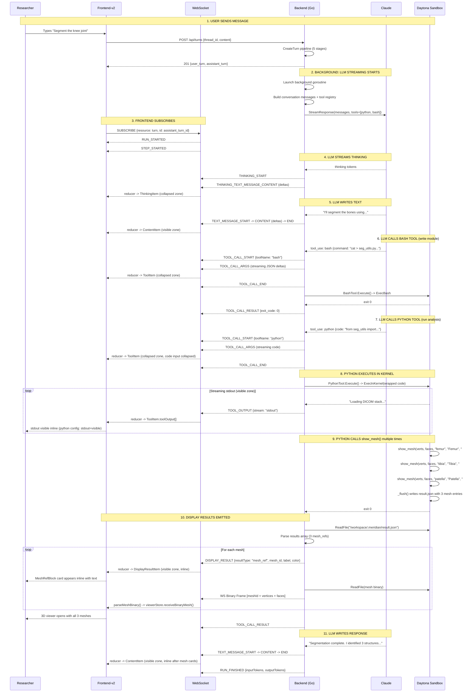

# Streaming Walkthrough: End-to-End Flow

How a researcher's message flows through the system, from "Segment the knee joint" to a 3D model on screen. Traces the actual code paths in both backend and frontend.

## Sequence Diagram



## Step-by-Step Walkthrough

### Step 1: User Sends Message

**Frontend**: ChatComposer captures the message, sends `POST /api/turns`.

**Backend** (`handler/thread.go` → `CreateTurnV2()`): Runs a 5-stage pipeline:

1. **TurnContextResolver** — resolves thread, persona, model, provider. Acquires a stream slot.
2. **TurnWriter** — creates user turn and empty assistant turn (status: `pending`).
3. **ToolRegistryFactory** — builds tool registry with enabled tools. Both `python` and `bash` tools are registered via `builder.WithPythonTool(sandboxSvc, datasetSvc).WithBashTool(sandboxSvc, datasetSvc)`.
4. **StreamRuntime.Launch()** — creates `StreamExecutor`, registers in `mstream.Registry`, launches background goroutine.
5. HTTP 201 returns immediately with both turns.

### Step 2: Background Streaming

The background goroutine emits `RUN_STARTED`, calls `provider.StreamResponse()`, and enters `processProviderStream()` loop.

### Step 3: Frontend Subscribes

The frontend subscribes to the assistant turn via WebSocket. Events flow through `StreamingChannelClient` to the activity stream reducer.

### Steps 4-5: Thinking + Text

Standard AG-UI flow. Thinking goes to collapsed zone, text to visible zone.

### Step 6: LLM Writes a Module (bash tool)

The AI writes a Python module file using the bash tool:

```json
{"name": "bash", "input": {"command": "cat > /workspace/scripts/seg_utils.py << 'EOF'\nimport SimpleITK as sitk\n..."}}
```

`BashTool.Execute()` → `sandboxSvc.ExecBash()`. No kernel, no display results. The tool row appears in the collapsed zone (bash config: input=collapsed, stdout=collapsed).

### Step 7-8: LLM Runs Analysis (python tool)

The AI runs analysis code directly:

```json
{"name": "python", "input": {"code": "from seg_utils import load_dicom_stack\nimport numpy as np\n..."}}
```

`PythonTool.Execute()`:
1. Wraps code with result_helper preamble
2. Calls `sandboxSvc.ExecInKernel(wrappedCode, onOutput)`
3. Stdout streams via `sink.EmitToolOutput()` → `TOOL_OUTPUT` events
4. Python tool config says `stdout: "visible"` → stdout appears **inline in the visible zone**

### Step 9: Python Calls show_mesh() Multiple Times

The code calls `show_mesh()` three times, each with a unique `mesh_id`:

```python
show_mesh(femur_verts, femur_faces, mesh_id="femur", label="Femur", color="#4488ff")
show_mesh(tibia_verts, tibia_faces, mesh_id="tibia", label="Tibia", color="#44cc66")
show_mesh(patella_verts, patella_faces, mesh_id="patella", label="Patella", color="#9966cc")
```

Each writes a separate binary file. `_flush()` writes a result.json with 3 entries.

### Step 10: Display Results Emitted

`PythonTool.emitDisplayResults()`:
1. Reads result.json (3 mesh_ref entries)
2. For each: emits `DISPLAY_RESULT` event + reads binary file + sends WS binary frame
3. Frontend: each DISPLAY_RESULT creates a `DisplayResultItem` → MeshRefBlock card inline
4. Frontend: each binary frame → `parseMeshBinary()` → `viewerStore.receiveBinaryMesh()`
5. Viewer store accumulates all 3 meshes, scene renders all simultaneously

### Step 11: LLM Response Text

The final response text appears inline in the visible zone, after the mesh cards.

## What the User Sees (Final State)

```
+------------------------------------------------------+
| Chat Panel (left, 45%)                               |
|                                                      |
| [User] "Segment the knee joint"                      |
|                                                      |
| +-- Collapsed Zone (expand for details) -----------+ |
| | > Ran 1 command, 1 analysis                 done | |
| | (expand to see thinking, tool inputs)            | |
| +--------------------------------------------------+ |
|                                                      |
| -- Visible Zone (always shown) --------------------  |
| "I'll segment the bones using threshold..."          |
|                                                      |
| Loading DICOM stack...                               |
| Processing slice 342/342...                          |
| Found 5 regions                                      |
|                                                      |
| [Mesh: Femur - 45,000 verts]            [View 3D]   |
| [Mesh: Tibia - 38,000 verts]            [View 3D]   |
| [Mesh: Patella - 12,000 verts]          [View 3D]   |
|                                                      |
| "Segmentation complete. I identified 3 bones..."     |
|                                                      |
| [input box]                                          |
+------------------------------------------------------+
| Content Panel (right, 55%)                           |
| -- after clicking [View 3D] or auto-open --          |
|                                                      |
| +--------------------------------------------------+ |
| |                                                  | |
| |         [Interactive 3D scene]                   | |
| |         femur (blue)                             | |
| |         tibia (green)                            | |
| |         patella (purple)                         | |
| |                                                  | |
| |         rotate / zoom / pan                      | |
| |                                                  | |
| +--------------------------------------------------+ |
|                                                      |
| Structures:                                          |
|   [x] Femur (blue)      [x] Tibia (green)           |
|   [x] Patella (purple)                              |
|                                                      |
| [Screenshot] [Reset View] [Export STL]               |
+------------------------------------------------------+
```

## Backend Code Path Summary

```
POST /api/turns
  -> handler/thread.go: CreateTurnV2()
  -> service/llm/streaming/service.go: CreateTurn()
    -> tool_registry_factory.go: build registry with python + bash tools
    -> stream_runtime.go: Launch() -> background goroutine
      -> stream_executor.go: workFunc()
        -> processProviderStream() loop:
            -> on tool_use "bash": BashTool.Execute()
              -> sandboxSvc.ExecBash() + OutputSink streaming
            -> on tool_use "python": PythonTool.Execute()
              -> wrap code with result_helper
              -> sandboxSvc.ExecInKernel() + OutputSink streaming
              -> emitDisplayResults() -> read result.json
                -> EmitDisplayResult + SendBinary for each result
            -> emitter.EmitToolCallResult()
```

## Frontend Code Path Summary

```
WebSocket message arrives
  -> ws-client.ts: onmessage()
    -> Binary? -> binaryDispatch.dispatch()
      -> mesh handler -> parseMeshBinary() -> viewerStore.receiveBinaryMesh()
    -> Text? -> parseEnvelope() -> dispatch:
      -> "stream" -> StreamingChannelClient
        -> useReducer(reduceStreamEvent)
          -> TOOL_CALL_START -> ToolItem (collapsed zone)
          -> TOOL_OUTPUT -> append to toolOutput[]
            -> python config: stdout visible -> renders in visible zone
            -> bash config: stdout collapsed -> renders in collapsed zone
          -> DISPLAY_RESULT -> DisplayResultItem (visible zone, inline)
            -> mesh_ref? -> viewerStore.setPendingMeta()
          -> TEXT_MESSAGE_CONTENT -> ContentItem (visible zone)
          -> RUN_FINISHED -> isStreaming: false
        -> ActivityBlock renders two zones
```

## Two Transports

| What | Transport | Format |
|------|-----------|--------|
| AG-UI events (text, thinking, tool calls, tool output, display results) | SSE-over-WebSocket | JSON envelope |
| Binary mesh data | WS binary frame | Raw bytes: `[subId] 0x00 [meshId] 0x00 [vertices + faces]` |

Both go through the same WebSocket connection. Binary frames no longer include per-vertex labels.

## Related Docs

- [Backend: Python Tool](backend/python-tool.md)
- [Backend: Bash Tool](backend/bash-tool.md)
- [Backend: Display Results](backend/display-results.md)
- [Backend: Daytona Service](backend/daytona-service.md)
- [Frontend: Activity Stream](frontend/activity-stream.md)
- [Frontend: Inline Results](frontend/inline-results.md)
- [Frontend: 3D Viewer](frontend/viewer-3d.md)
- [Frontend: State Management](frontend/state.md)
