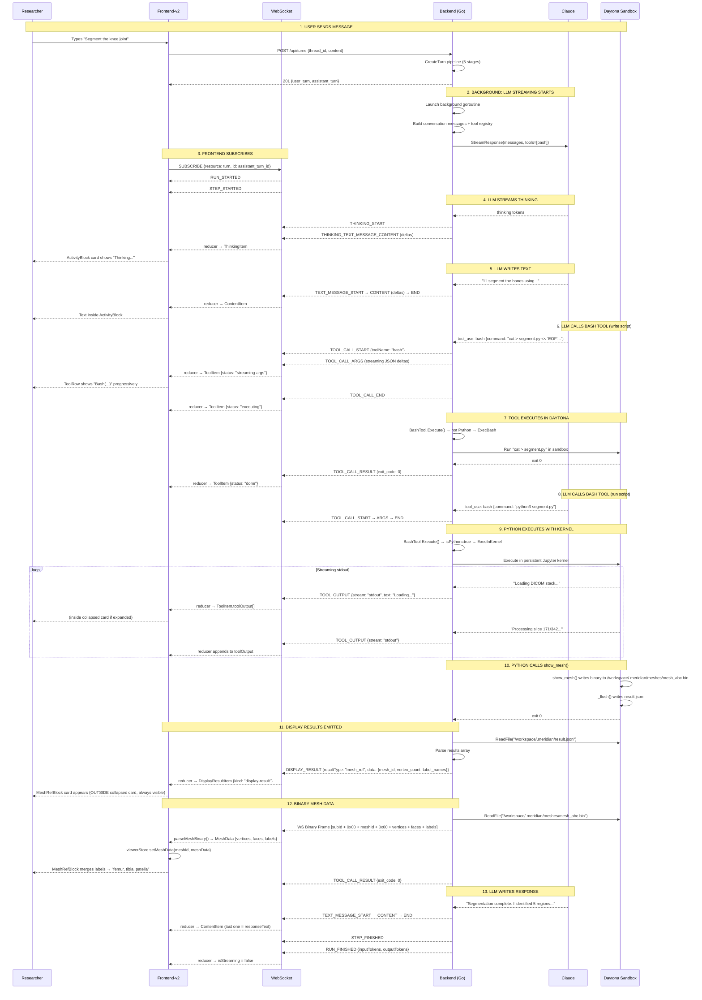

# Streaming Walkthrough: End-to-End Flow

How a researcher's message flows through the system, from "Segment the knee joint" to a 3D model on screen. Traces the actual code paths in both backend and frontend.

## Sequence Diagram



## Step-by-Step Walkthrough

### Step 1: User Sends Message

**Frontend**: ChatComposer captures the message, sends `POST /api/turns`.

**Backend** (`handler/thread.go` → `CreateTurnV2()`): Runs a 5-stage pipeline:

1. **TurnContextResolver** — resolves thread, persona, model, provider. Acquires a stream slot (concurrency limit: 3 free, 10 paid).
2. **TurnWriter** — creates user turn (with message blocks) and empty assistant turn (status: `pending`).
3. **ToolRegistryFactory** — builds tool registry with enabled tools. The `bash` tool is registered via `builder.WithBashTool(sandboxSvc, datasetSvc)`.
4. **StreamRuntime.Launch()** — creates `StreamExecutor`, registers in `mstream.Registry`, launches background goroutine.
5. HTTP 201 returns immediately with both turns. Streaming hasn't started yet.

**Key file**: `backend/internal/service/llm/streaming/service.go`

### Step 2: Background Streaming

**Backend** (`stream_executor.go` → `workFunc()`): The background goroutine:

1. Updates turn status to `streaming`
2. Creates AG-UI emitter with the `send` callback from mstream
3. Emits `RUN_STARTED`
4. Checks credit admission
5. Emits `STEP_STARTED`
6. Calls `provider.StreamResponse()` — returns a channel of `StreamEvent`
7. Enters `processProviderStream()` loop

The provider streams AG-UI events. The emitter serializes each to JSON, wraps in an `mstream.Event`, and calls `send()` — which broadcasts to all subscribed clients.

**Key files**: `stream_executor.go`, `agui/emitter.go`

### Step 3: Frontend Subscribes

**Frontend** (`StreamingChannelClient`): When the assistant turn arrives, the frontend subscribes:

```
WS → SUBSCRIBE {resource: "turn", id: assistant_turn_id}
```

The backend's `TurnStreamHandler.OnSubscribe()` looks up the turn in `mstream.Registry`, subscribes with catchup (replaying any events the client missed), and begins forwarding live events.

Events arrive as WebSocket messages with `kind: "stream"`, `op: "event"`. The `StreamingChannelClient` validates the event type against `STREAM_EVENT_TYPE_SET` and passes it to the subscriber callback, which dispatches to the activity stream reducer.

**Key files**: `frontend-v2/src/features/threads/streaming/streaming-channel-client.ts`, `frontend-v2/src/lib/ws/ws-client.ts`

### Steps 4-5: Thinking + Text

**Backend**: Provider streams `THINKING_START`, `THINKING_TEXT_MESSAGE_CONTENT` (deltas), then `TEXT_MESSAGE_START`, `TEXT_MESSAGE_CONTENT` (deltas), `TEXT_MESSAGE_END`.

**Frontend reducer** (`reducer.ts`):
- `THINKING_START` → creates `ThinkingItem` in `items[]`
- `THINKING_TEXT_MESSAGE_CONTENT` → appends to `ThinkingItem.text`
- `TEXT_MESSAGE_START` → creates `ContentItem` in `items[]`
- `TEXT_MESSAGE_CONTENT` → appends to `ContentItem.text`

**User sees**: ActivityBlock card with thinking indicator. Text accumulates inside the card.

### Steps 6-7: LLM Writes a Python Script (bash tool call)

**Backend**: Provider emits `stop_reason: "tool_use"`. The `StreamExecutor`:
1. Collects tool_use blocks via `collectToolUse()`
2. Calls `toolRegistry.ExecuteParallel()` — dispatches to `BashTool.Execute()`
3. `BashTool` detects `cat > segment.py` is NOT a Python execution → calls `sandboxSvc.ExecBash()`
4. Daytona writes the file, returns exit 0
5. `BashTool` checks for display results (none for a file write)
6. Returns `{success: true, exit_code: 0}` to the executor

**Frontend reducer**:
- `TOOL_CALL_START` → creates `ToolItem {status: "streaming-args"}`
- `TOOL_CALL_ARGS` (multiple deltas) → accumulates `argsText`, partial-parses with `partial-json`
- `TOOL_CALL_END` → status transitions to `"executing"`
- `TOOL_CALL_RESULT` → status transitions to `"done"`

**User sees**: Inside the collapsed ActivityBlock card, a tool row: `Bash("cat > segment.py...") ✓`. Not visible unless the user expands the card.

**Key file**: `backend/internal/service/llm/tools/bash_tool.go`

### Steps 8-9: LLM Runs the Python Script (bash tool call with kernel)

**Backend**: Second tool_use — `bash {command: "python3 segment.py"}`.

`BashTool.Execute()`:
1. Calls `isPythonExecution("python3 segment.py")` → true
2. Reads `segment.py` content from sandbox via `sandboxSvc.ReadFile()`
3. Wraps code with result_helper preamble (imports `show_*` functions, `_results.clear()`, `try/finally _flush()`)
4. Calls `sandboxSvc.ExecInKernel(projectID, wrappedCode, onOutput)`
5. The `onOutput` callback receives each stdout/stderr line from the Jupyter kernel
6. For each line: `sink.EmitToolOutput(stream, text, seq)` → emits `TOOL_OUTPUT` AG-UI event

**Frontend reducer**:
- `TOOL_OUTPUT` events → appends to `ToolItem.toolOutput[]`
- First `TOOL_OUTPUT` transitions status to `"executing"` if still `"streaming-args"`

**User sees**: If they expand the ActivityBlock, they see streaming stdout: "Loading DICOM stack...", "Processing slice 171/342...", etc. This is inside the collapsed card — not visible by default.

**Key files**: `bash_tool.go`, `backend/internal/service/sandbox/daytona.go`

### Step 10: Python Calls show_mesh()

**In the Daytona sandbox**: The Python script calls `show_mesh(vertices, faces, labels, label_names)` from `result_helper.py`:

1. Generates a unique `mesh_id`
2. Writes binary data to `/workspace/.meridian/meshes/mesh_abc.bin` (header: vertex_count + face_count, then float32 vertices, uint32 faces, uint8 labels)
3. Appends metadata to `_results` list
4. When script finishes, `_flush()` writes `_results` to `/workspace/.meridian/result.json`

Nothing streams to the backend yet — this all happens inside the sandbox.

**Key file**: `/workspace/.meridian/result_helper.py` (pre-installed in sandbox snapshot)

### Step 11: Display Results Emitted

**Backend**: After `ExecInKernel` returns, `BashTool.emitDisplayResults()`:

1. Reads `/workspace/.meridian/result.json` from sandbox
2. Parses the JSON array
3. For each result: `sink.EmitDisplayResult(payload)` → emits `DISPLAY_RESULT` AG-UI event
4. For mesh results: reads the binary file, calls `sink.SendBinary(meshID, binaryData)`
5. Cleans up result.json

The `aguiOutputSink` implementation delegates:
- `EmitDisplayResult()` → `emitter.EmitDisplayResult()` → JSON event via mstream
- `SendBinary()` → `wsSession.SendBinaryToSub()` → raw WS binary frame

**Frontend reducer**:
- `DISPLAY_RESULT` → creates `DisplayResultItem {kind: "display-result"}` in `items[]`

**User sees**: A MeshRefBlock card appears OUTSIDE the collapsed ActivityBlock — always visible:
```
🧊 3D Model Generated
45,000 vertices — femur, tibia, patella
                                [View 3D]
```

**Key files**: `bash_tool.go`, `agui_output_sink.go`, `agui/emitter.go`

### Step 12: Binary Mesh Data

**Backend**: `sink.SendBinary(meshID, data)` sends a WS binary frame:
```
[subId UTF-8] 0x00 [meshId UTF-8] 0x00 [binary payload]
```

The binary payload is: `vertex_count(u32) + face_count(u32) + vertices(float32[]) + faces(uint32[]) + labels(uint8[])`.

**Frontend** (`WsClient.onmessage`): Detects `ArrayBuffer`, extracts `subId`, routes to binary handler.

`parseMeshBinary()`:
1. Finds null delimiters to extract meshId
2. Reads vertex_count and face_count from header (DataView, little-endian)
3. Copies vertex/face data into aligned ArrayBuffers (typed arrays require alignment)
4. Constructs `MeshData {meshId, vertices: Float32Array, faces: Uint32Array, labels: Uint8Array}`

The viewer store receives the mesh data. The MeshRefBlock (already rendered from the DISPLAY_RESULT event) merges the label names from the metadata event.

**User sees**: The MeshRefBlock now shows structure names ("femur, tibia, patella"). Clicking "View 3D" opens the React Three Fiber canvas in the right panel.

**Key files**: `frontend-v2/src/features/viewer-3d/hooks/useMeshData.ts`, `frontend-v2/src/lib/ws/ws-client.ts`

### Step 13: LLM Response Text

**Backend**: After tool execution completes, the `StreamExecutor` checks for interjections (none), then continues the LLM with tool results. The LLM streams its final response text.

**Frontend reducer**: The last `ContentItem` in the items array becomes the response text, rendered OUTSIDE the collapsed ActivityBlock — always visible.

**User sees**:
```
"Segmentation complete. I identified 5 regions: femur (blue),
 tibia (green), patella (purple), and 2 suspected osteophytes.
 Does this look correct?"
```

`RUN_FINISHED` arrives with token counts. `isStreaming` flips to false. The ActivityBlock header shows "done" badge.

## Two Transports

| What | Transport | Format |
|------|-----------|--------|
| AG-UI events (text, thinking, tool calls, tool output, display results) | SSE-over-WebSocket | JSON envelope: `{kind: "stream", op: "event", payload: {type: "...", ...}}` |
| Binary mesh data | WS binary frame | Raw bytes: `[subId] 0x00 [meshId] 0x00 [vertex_count, face_count, vertices, faces, labels]` |

Both go through the same WebSocket connection. The frontend dispatches based on message type — text frames to the reducer, binary frames to the viewer store.

## What the User Sees (Final State)

```
┌──────────────────────────────────────────────────────┐
│ Chat Panel (left, 45%)                               │
│                                                      │
│ ┌──────────────────────────────────────────────────┐ │
│ │ 👤 "Segment the knee joint"                      │ │
│ └──────────────────────────────────────────────────┘ │
│                                                      │
│ ┌─ ActivityBlock (collapsed) ──────────────────────┐ │
│ │ ▶ Ran 2 commands, processed 342 slices      done │ │
│ │                                                  │ │
│ │  (expand to see:)                                │ │
│ │  💭 "I need to load the DICOM stack and..."      │ │
│ │  📝 "I'll segment the bones using threshold..."  │ │
│ │  🔧 Bash("cat > segment.py << 'EOF'...")    ✓   │ │
│ │  🔧 Bash("python3 segment.py")              ✓   │ │
│ │      stdout: Loading DICOM stack...              │ │
│ │      stdout: Processing slice 342/342...         │ │
│ │      stdout: Found 5 regions                     │ │
│ └──────────────────────────────────────────────────┘ │
│                                                      │
│ ┌─ Display Result (always visible) ────────────────┐ │
│ │ 🧊 3D Model Generated                           │ │
│ │ 45,000 vertices — femur, tibia, patella          │ │
│ │                                     [View 3D]    │ │
│ └──────────────────────────────────────────────────┘ │
│                                                      │
│ "Segmentation complete. I identified 5 regions:      │
│  femur (blue), tibia (green), patella (purple),      │
│  and 2 suspected osteophytes on the medial condyle.  │
│  Does the segmentation look correct?"                │
│                                                      │
│ [input box]                                          │
├──────────────────────────────────────────────────────┤
│ Content Panel (right, 55%)                           │
│ — after clicking [View 3D] —                         │
│                                                      │
│ ┌──────────────────────────────────────────────────┐ │
│ │                                                  │ │
│ │         [Interactive 3D mesh]                     │ │
│ │         femur (blue)                              │ │
│ │         tibia (green)                             │ │
│ │         patella (purple)                          │ │
│ │         osteophytes (red)                         │ │
│ │                                                  │ │
│ │         rotate / zoom / pan                       │ │
│ │                                                  │ │
│ └──────────────────────────────────────────────────┘ │
│                                                      │
│ Structures:                                          │
│   ☑ Femur (blue)      ☑ Tibia (green)               │
│   ☑ Patella (purple)  ☑ Osteophyte 1 (red)          │
│                       ☑ Osteophyte 2 (red)           │
│                                                      │
│ [Export STL] [Screenshot] [Reset View] [Close]       │
└──────────────────────────────────────────────────────┘
```

## Backend Code Path Summary

```
POST /api/turns
  → handler/thread.go: CreateTurnV2()
  → service/llm/streaming/service.go: CreateTurn()
    → turn_context_resolver.go: resolve thread, persona, model, slot
    → turn_creation.go: create user + assistant turns
    → tool_registry_factory.go: build registry with bash tool
    → stream_runtime.go: Launch() → background goroutine
      → stream_executor.go: workFunc()
        → agui/emitter.go: EmitRunStarted()
        → provider.StreamResponse() → channel of StreamEvents
        → processProviderStream() loop:
            → processAGUIEvent() → emitter forwards to mstream → WS
            → on tool_use: collectToolUse() → ExecuteParallel()
              → tools/bash_tool.go: Execute()
                → isPythonExecution()? 
                  → yes: sandboxSvc.ExecInKernel() + OutputSink streaming
                  → no:  sandboxSvc.ExecBash()
                → emitDisplayResults() → read result.json → EmitDisplayResult + SendBinary
              → emitter.EmitToolCallResult()
              → check interjection → continue or switch stream
            → on metadata: handleCompletion() → Terminate()
```

## Frontend Code Path Summary

```
WebSocket message arrives
  → ws-client.ts: onmessage()
    → Binary? → handleBinaryFrame() → extract subId → onBinaryMessage callback
      → parseMeshBinary() → viewerStore.setMeshData()
    → Text? → parseEnvelope() → dispatch by kind:
      → "stream" → StreamingChannelClient.handleStreamMessage()
        → validate event type → subscriber callback
          → useReducer(reduceStreamEvent)
            → TOOL_CALL_START → ToolItem {status: "streaming-args"}
            → TOOL_CALL_ARGS → accumulate argsText, partial-parse
            → TOOL_CALL_END → status: "executing"
            → TOOL_OUTPUT → append to toolOutput[]
            → DISPLAY_RESULT → DisplayResultItem {kind: "display-result"}
            → TOOL_CALL_RESULT → status: "done"
            → TEXT_MESSAGE_CONTENT → append to ContentItem.text
            → RUN_FINISHED → isStreaming: false
          → ActivityBlock.tsx renders:
            → Card (collapsible): ThinkingRow, ContentRow, ToolRow
            → DisplayResultRow (outside card): PlotlyBlock, ImageBlock, DataFrameBlock, MeshRefBlock
            → Response text (outside card): last ContentItem
```

## Related Docs

- [Backend: Bash Tool](backend/bash-tool.md)
- [Backend: Display Results](backend/display-results.md)
- [Backend: Daytona Service](backend/daytona-service.md)
- [Frontend: Activity Stream](frontend/activity-stream.md)
- [Frontend: Inline Results](frontend/inline-results.md)
- [Frontend: 3D Viewer](frontend/viewer-3d.md)
- [Frontend: State Management](frontend/state.md)
