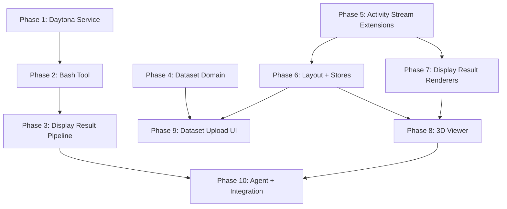

# Implementation Plan — Status

## Execution Rounds

```
Round 1: Phase 1 (Daytona) + Phase 4 (Dataset Domain) + Phase 5 (Frontend Activity Stream)  [all parallel]
Round 2: Phase 2 (Bash Tool) + Phase 6 (Layout+Stores) + Phase 7 (Display Result Renderers)  [2 needs P1; 6,7 need P5]
Round 3: Phase 3 (Display Pipeline) + Phase 8 (3D Viewer) + Phase 9 (Dataset Upload)         [3 needs P2; 8 needs P6+P7; 9 needs P6]
Round 4: Phase 10 (Agent + Integration)                                                       [needs P3+P8]
```

## Dependency Graph



## Key Changes from Previous Plan

- Phases renumbered and restructured for the new architecture
- execute_python replaced by bash tool (Phase 2)
- Stream extensions replaced by display result pipeline (Phase 3)
- Frontend activity stream extensions (Phase 5) revised for generic model
- Frontend builds with mock events — no backend dependency for rounds 1-2

## Phase Status

| Phase | Status | Notes |
|-------|--------|-------|
| 1. Daytona Service | not started | Backend |
| 2. Bash Tool + OutputSink | not started | Backend, blocked by P1 |
| 3. Display Result Pipeline | not started | Backend, blocked by P2 |
| 4. Dataset Domain | not started | Backend, independent |
| 5. Activity Stream Extensions | not started | Frontend, independent |
| 6. Layout + Stores | not started | Frontend, blocked by P5 |
| 7. Display Result Renderers | not started | Frontend, blocked by P5 |
| 8. 3D Viewer | not started | Frontend, blocked by P6 + P7 |
| 9. Dataset Upload UI | not started | Frontend, blocked by P4 + P6 |
| 10. Agent + Integration | not started | Blocked by P3 + P8 |
