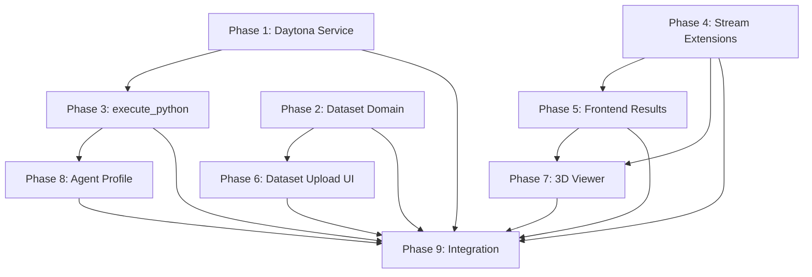

# Implementation Plan — Status

## Execution Rounds

```
Round 1: Phase 1 (Daytona Service) + Phase 2 (Dataset Domain)     [parallel]
Round 2: Phase 3 (execute_python) + Phase 4 (Stream Extensions)   [parallel]
Round 3: Phase 5 (Frontend Results) + Phase 6 (Dataset Upload UI) [parallel]
Round 4: Phase 7 (3D Viewer) + Phase 8 (Agent Profile)           [parallel]
Round 5: Phase 9 (Integration)                                    [sequential]
```

## Dependency Graph



## Phase Status

| Phase | Status | Notes |
|-------|--------|-------|
| 1. Daytona Service | not started | |
| 2. Dataset Domain | not started | |
| 3. execute_python Tool | not started | Blocked by Phase 1 |
| 4. Stream Extensions | not started | |
| 5. Frontend Results | not started | Blocked by Phase 4 |
| 6. Dataset Upload UI | not started | Blocked by Phase 2 |
| 7. 3D Viewer | not started | Blocked by Phase 4, 5 |
| 8. Agent Profile | not started | Blocked by Phase 3 |
| 9. Integration | not started | Blocked by all |
