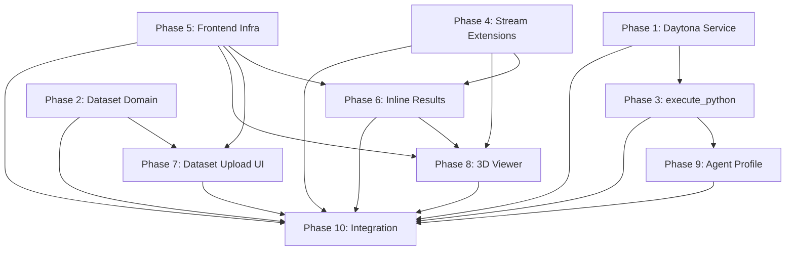

# Implementation Plan — Status

## Execution Rounds

```
Round 1: Phase 1 (Daytona) + Phase 2 (Dataset Domain) + Phase 5 (Frontend Infra)    [all parallel]
Round 2: Phase 3 (execute_python) + Phase 4 (Stream Extensions)                       [parallel, need P1]
Round 3: Phase 6 (Inline Results) + Phase 7 (Dataset Upload) + Phase 9 (Agent Profile) [parallel]
Round 4: Phase 8 (3D Viewer)                                                           [needs P5,P6]
Round 5: Phase 10 (Integration)                                                        [needs all]
```

## Dependency Graph



## Key Change from Previous Plan

Frontend phases now target `frontend-v2/` instead of `frontend/`. New Phase 5 (Frontend Infrastructure) builds the layout, stores, and reducer extensions that all frontend phases need. This runs in Round 1 with no backend dependency, enabling earlier frontend work.

Old phases 5-7 and 9 have been renumbered to 6-8 and 10. Old plan files replaced with new versions.

## Phase Status

| Phase | Status | Notes |
|-------|--------|-------|
| 1. Daytona Service | not started | Backend |
| 2. Dataset Domain | not started | Backend |
| 3. execute_python Tool | not started | Backend, blocked by P1 |
| 4. Stream Extensions | not started | Backend |
| 5. Frontend Infrastructure | not started | NEW — layout + stores + reducer extensions |
| 6. Inline Results | not started | Frontend v2, blocked by P4 + P5 |
| 7. Dataset Upload UI | not started | Frontend v2, blocked by P2 + P5 |
| 8. 3D Viewer | not started | Frontend v2, blocked by P4 + P5 + P6 |
| 9. Agent Profile | not started | Backend, blocked by P3 |
| 10. Integration | not started | Blocked by all |
