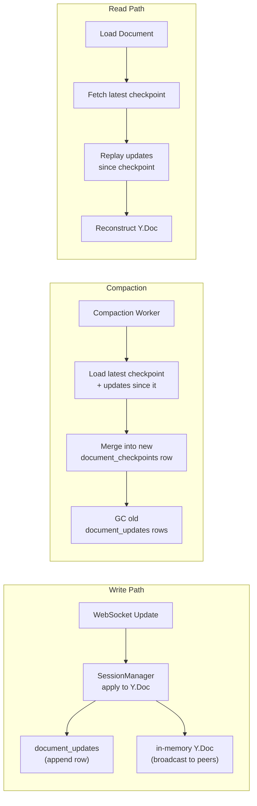

# Append-Only Yjs Update Log

Migrate from merged-snapshot persistence to an append-only update log, enabling point-in-time document history.

## Current Model

Each update merges into an in-memory Y.Doc, then:

| Trigger | Action |
|---------|--------|
| Debounce 2s | Overwrite `documents.yjs_state` with full merged blob |
| Every 500 updates | Write full snapshot to `collab_document_snapshots` |
| Last WS disconnect | Write full snapshot to `collab_document_snapshots` |

Individual update bytes are discarded after merging. History is irrecoverable.

See `service/collab/session_manager.go` and `_docs/technical/collab/yjs-state-lifecycle.md`.

## Target Model



## Schema

```sql
-- Replaces documents.yjs_state (overwritten blob)
CREATE TABLE document_updates (
    id          BIGSERIAL PRIMARY KEY,
    document_id UUID NOT NULL REFERENCES documents(id),
    update      BYTEA NOT NULL,        -- raw Yjs update bytes
    origin      TEXT,                  -- "human" | "accept" | "reject" | "gc" | "thread"
    user_id     UUID,
    created_at  TIMESTAMPTZ DEFAULT now()
);

-- Replaces collab_document_snapshots for compaction storage
CREATE TABLE document_checkpoints (
    id          BIGSERIAL PRIMARY KEY,
    document_id UUID NOT NULL REFERENCES documents(id),
    state       BYTEA NOT NULL,        -- merged Yjs state up to up_to_id
    up_to_id    BIGINT NOT NULL REFERENCES document_updates(id),
    created_at  TIMESTAMPTZ DEFAULT now()
);

-- Bookmarks into the update log — named points in time
CREATE TABLE document_bookmarks (
    id              UUID PRIMARY KEY DEFAULT gen_random_uuid(),
    document_id     UUID NOT NULL REFERENCES documents(id),
    update_id       BIGINT REFERENCES document_updates(id),  -- NULL once materialized
    state           BYTEA,                                    -- materialized blob, NULL while pointer
    bookmark_type   TEXT NOT NULL,       -- "manual" | "daily" | "ai_turn"
    name            TEXT,                -- user-provided label (manual only)
    created_by      UUID,
    created_at      TIMESTAMPTZ DEFAULT now()
);
```

`collab_document_snapshots` is replaced by:
- `document_checkpoints` for compaction state (system-managed merged Yjs blobs)
- `document_bookmarks` for named restore points (user/system-visible versions)

## Snapshot Migration (Bookmarks)

The old snapshot table is split into checkpoint storage + bookmark semantics:
- `collab_document_snapshots` is removed
- `document_checkpoints` stores compaction checkpoints
- `document_bookmarks` stores restore points (`manual`, `daily`, `ai_turn`)

Retention and creation rules:
- Daily snapshots: auto-created at end of the last editing session each day, materialized on compaction, retained forever
- Manual snapshots: created by user "Save Version", materialized on compaction, retained forever
- AI turn bookmarks: created before each AI turn's proposals are applied, capturing the document state before the turn touched anything. Discarded during compaction.

Compaction preservation rule:
- Manual and daily bookmarks are preserved by materializing full `state` blobs
- AI turn bookmarks are deleted once they age into the compacted window

### Bookmark Tiers

Bookmarks are lightweight pointers into the update log. On compaction, some are materialized into full state blobs, others are discarded.

| Type | Created | On compaction | Retention |
|------|---------|--------------|-----------|
| Manual | User clicks "Save Version" | Materialize into blob | Forever |
| Daily | End of last editing session each day | Materialize into blob | Forever |
| AI turn | Before AI turn's proposals apply | Delete | Only within update window |

Within the retained update window (10k updates), all bookmark types work as free pointers — replay the log to that `update_id`. Beyond the window, only manual and daily bookmarks survive as materialized blobs.

AI turn bookmarks enable the thread UI's "Restore to before this turn" action (see [Undo Design](undo.md) — Turn-Level Restore). When the bookmark is compacted away, the restore button disappears from the UI. Per-proposal undo/reapply still works (it uses text search, not bookmarks).

## Write Path

Each Yjs update byte slice is appended as a row — no merge required on write. Writes are tiny and fast. The in-memory Y.Doc continues to hold merged state for broadcasting to connected peers.

## Read Path

1. Load latest `document_checkpoints` row for the document
2. Query `document_updates` rows with `id > up_to_id`
3. Apply updates to a fresh Y.Doc seeded from the checkpoint state

Yjs updates are order-independent (CRDT) — forward application converges regardless of order.

## Compaction

Threshold-based per document: accumulate up to 20,000 updates, then compact the oldest 10,000 into a new checkpoint. Always retains at least 10,000 updates of undo headroom.

```
Updates accumulate → hit 20k → compact oldest 10k into checkpoint → 10k remain
                               → accumulate → hit 20k → compact → 10k remain
```

Compaction steps:
1. Count `document_updates` rows for the document
2. If count >= 20,000:
3. Find manual and daily bookmarks in the oldest 10,000 updates — materialize their state blobs by replaying the log to each bookmark's `update_id`
4. Delete AI turn bookmarks in the oldest 10,000 updates
5. Load the oldest 10,000 updates + latest checkpoint, merge into a new `document_checkpoints` row
6. Delete the oldest 10,000 `document_updates` rows

### Example: Compaction Lifecycle

```
Day 1: Writer types 2,000 updates
  document_updates:      rows 1-2000
  document_checkpoints:  (none)
  document_bookmarks:    daily bookmark → update_id=2000

Day 2-7: More writing + AI edits accumulate to 20,000 updates
  document_updates:      rows 1-20000  ← hits 20k threshold
  document_bookmarks:    daily bookmarks at rows 2000, 5000, 8000, ...

Compaction runs (compact oldest 10,000):
  1. Daily bookmark at row 2000 is in compaction range
     → Materialize: replay updates 1-2000 into full state blob
     → Bookmark preserved forever with its own state
  2. Daily bookmark at row 5000 is in compaction range
     → Materialize similarly
  3. AI turn bookmarks in rows 1-10000
     → Deleted (ephemeral, not worth materializing)
  4. Merge rows 1-10000 into new document_checkpoints row
  5. Delete rows 1-10000

After compaction:
  document_updates:      rows 10001-20000 (10k remaining)
  document_checkpoints:  1 row (state through row 10000)
  document_bookmarks:    2 materialized daily bookmarks (rows 2000, 5000)

Next compaction triggers at 30,000 total (20k remaining again).
```

### GC Strategy: Two-Phase

Yjs GC operates in two phases — disabled at runtime, enabled during compaction:

| Phase | `doc.gc` | Tombstone behavior |
|-------|----------|-------------------|
| **Runtime** | `false` | Tombstones preserved — needed for undo and concurrent merge |
| **Compaction** | `true` | Tombstones from compacted range are GC'd into lightweight ID placeholders |

Compaction GC bounds tombstone growth: tombstones accumulate within the retained 10k update window, then get cleaned up when those updates are compacted into a checkpoint. The checkpoint blob stays proportional to current document size plus recent tombstones, not the entire editing history.

GC'd placeholders preserve item IDs (so future updates with left/right references still resolve), but drop the deleted content. Replaying retained updates on top of a GC'd checkpoint is safe.

### Undo Window

The retained 10,000 updates provide replay headroom for recent timeline/history operations and short-lived AI turn bookmarks. Thread-level undo/reapply uses offset-anchored text search (`region_text_before`/`region_text_after` + `accepted_at_offset`) and therefore survives compaction -- it only needs current document text, not CRDT history.

### Storage Estimate

| Component | Per doc (at 20k threshold) | 100 chapters |
|-----------|--------------------------|-------------|
| Update log rows (~200 bytes avg) | ~4MB max | ~400MB |
| Checkpoint blob (GC'd on compaction) | ~2-3MB | ~250MB |
| **Total** | **~6-7MB** | **~650MB** |

## Undo / Restore Semantics

With GC disabled, all Items (including deleted ones) remain as tombstones. This means:

- **Session undo**: UndoManager handles accept/reject/edit via Ctrl-Z (session-scoped)
- **Thread-level undo**: offset-anchored text search using `region_text_before` and `region_text_after` on the proposal row. Search near `accepted_at_offset` for `region_text_after`, then replace with `region_text_before`. This is persistence-model-agnostic and survives compaction.
- **Thread-level reapply**: search near stored offset for `region_text_before`, then replace with `region_text_after`.
- **No CRDT dependency**: thread-level undo/reapply only needs stored text strings and offset, which survive compaction. No inverse operations or tombstone references.

Undo/reapply writes are normal document mutations and are appended to the log. The log is always append-only.

## Why Yjs (not @codemirror/collab)

There is no Go server library for CodeMirror's OT-based `@codemirror/collab` transforms. The backend uses `github.com/y-crdt/y-crdt` (Go). Yjs was chosen because of this library availability, not the other way around.

## Migration Path

| Step | File | Change |
|------|------|--------|
| 1 | `service/collab/session_manager.go` | Append update row instead of debounce-overwrite |
| 2 | `repository/postgres/collab/document_store.go` | Load = checkpoint + replay; save = insert row |
| 3 | New compaction worker | Goroutine or cron job merging checkpoints |
| 4 | Schema migration | Add `document_updates`, `document_checkpoints`, `document_bookmarks`; migrate off `collab_document_snapshots`; deprecate `documents.yjs_state` |

This is Phase 0 of collab data model v2 and must land before subsequent phases.

## Cross-References

- [Architecture](architecture.md)
- [Undo Design](undo.md) — thread undo survives compaction via offset-anchored text search
- [Schema Design](schema-design.md) — `document_updates`, `document_checkpoints`, `document_bookmarks` tables
- [Implementation Plan](plan.md) — Phase 0

## Related

- `_docs/future/features/document-timeline.md` — product motivation
- `_docs/technical/collab/yjs-state-lifecycle.md` — current persistence model (what this replaces)
- `service/collab/session_manager.go` — persist logic to change
- `repository/postgres/collab/document_store.go` — load/save logic to change
