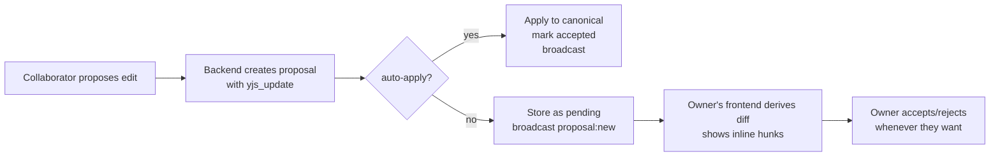
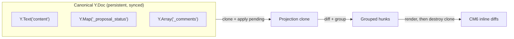
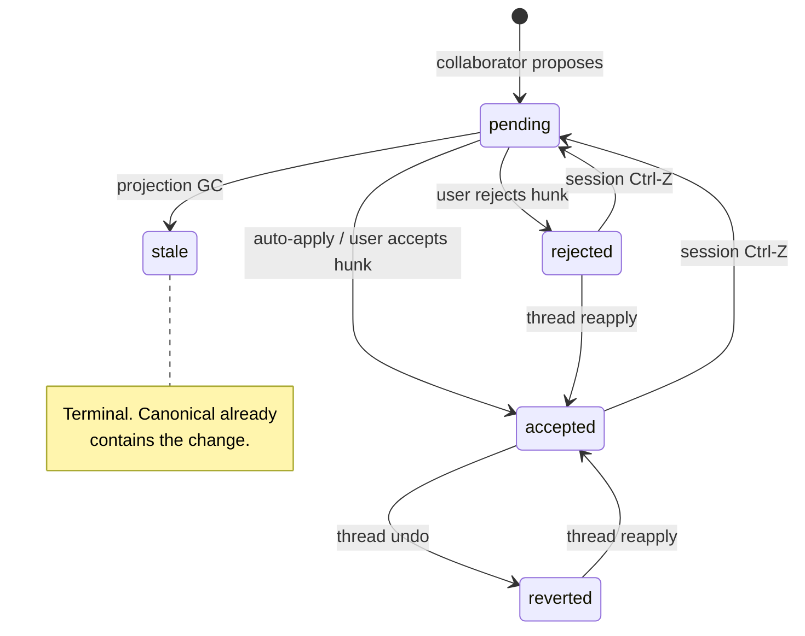

# Architecture: Collab Data Model Evolution

## Overview

This plan covers core data model changes to the collaboration system. The proposal model is participant-agnostic -- proposals can come from AI agents or human collaborators. The projection, diff, and undo primitives work the same regardless of who created the proposal.

### What's Changing

1. **Append-only persistence** -- replace `documents.yjs_state` overwrite with an update log, checkpoints, and bookmarks.
2. **Proposal payload model** -- proposals store `yjs_update` (binary Yjs operation) instead of derived text diffs.
3. **Decision state in Yjs** -- `Y.Map('_proposal_status')` on canonical Y.Doc tracks accept/reject/stale per proposal, enabling undo and sync.
4. **Ephemeral projection** -- no persistent projection document. Diff view is computed on demand from canonical + pending proposals, then discarded.
5. **Projection GC** -- auto-resolves proposals whose changes are already in canonical.

### Two Collaboration Modes

Collaborators (AI or human) write through the same pipeline regardless of mode. The mode is per-user and determines when incoming proposals land on canonical.

| Mode | When a proposal arrives... | User experience |
|------|---------------------------|-----------------|
| **Auto-apply** | yjs_update applied to canonical immediately, proposal marked `accepted` | Changes appear inline. User can revert via thread undo. |
| **Manual** | yjs_update stored as `pending` proposal | User sees diff hunks, accepts/rejects/edits when ready. No session -- changes accumulate continuously. |

Both modes are continuous. There is no "review session" with entry/exit. In manual mode, pending proposals are always visible as inline diffs whenever they exist.

When switching modes, pending proposals retain their pending status. New proposals follow the new mode's behavior. No proposals are auto-applied, discarded, or force-resolved on mode switch.

### Per-User Projection

Projection is per-user: only pending proposals where `created_by_user_id = current_user` are included. This means:

- Each user sees only their own pending proposals as diff hunks
- Other users' pending proposals are invisible until accepted into canonical
- The AI sees the same projected view as its thread owner (backend computes the same projection)
- Other users' AI activity can be shown as awareness indicators without revealing content



### Backend Projection for AI Context

When an AI agent reads the document (e.g., to generate its next `edit_document` call), the backend computes the same projection:

1. Load canonical Y.Doc state
2. Clone
3. Apply pending proposals where `created_by_user_id = thread_owner`
4. Extract text -- this is what the AI sees

This ensures the AI works against the same view its owner sees. Without this, an AI in manual mode would propose edits against canonical text that doesn't include its own pending proposals -- leading to conflicts and incoherent edits.

### Proposal Independence

Proposals store `yjs_update` computed against canonical (not the projected view). The AI sees the projected view for writing context, but the `yjs_update` is diffed against canonical. Attribution cloning from canonical is intentional -- it ensures proposals are portable and apply cleanly regardless of projection state.

## Canonical + Projection Model

There is one materialized document authority: canonical `Y.Doc`. The projection is ephemeral and computed wherever needed -- frontend for diff UI, backend for AI document context.



- `Y.Text('content')` stores canonical text.
- `Y.Map('_proposal_status')` stores decision state by proposal.
- `Y.Array('_comments')` stores review comment annotations (see [Review Comments](../future/review-comments.md)).
- Projection is a throwaway clone. No projection state is stored in Postgres or Yjs.
- Frontend uses projection for diff UI (hunk rendering). Backend uses projection to give the AI the document view its owner sees.

### Example: What Lives Where

```
Canonical Y.Doc at some point in time:

  Y.Text('content'): "The cat sat on the mat."

  Y.Map('_proposal_status'):
    P1 -> 'accepted'     (writer accepted earlier)
    P3 -> 'rejected'     (writer rejected earlier)
    (P5 has no entry)   -> means pending

Pending proposals in DB (status = 'pending'):
  P5: yjs_update that inserts "fluffy " before "cat"

Projection (ephemeral):
  1. clone -> "The cat sat on the mat."
  2. apply P5 -> "The fluffy cat sat on the mat."
  3. diff -> one hunk: insert "fluffy " at pos 4, carries [P5]
  4. writer sees inline diff, acts when ready
  5. clone destroyed
```

P1 and P3 are skipped because they already have decisions. Only `pending` proposals feed the projection.

### Multi-User Hunk Visibility

One projection includes all pending proposals for the current user. In multi-user collaboration, other users' pending proposals are not in your projection. However, the frontend can query all pending proposals to render awareness indicators ("User B's AI edited near paragraph 3") without showing the actual content.

## Core Data Flow (Manual Path)

| Step | Operation | Persisted outcome |
|------|-----------|-------------------|
| Derive diff | Clone canonical, apply each `pending` proposal update, diff, group nearby regions | None (ephemeral) |
| Projection GC | Pending proposal yields no diff -- mark `stale` | `_proposal_status` entry + proposal row |
| Accept hunk | Apply grouped hunk proposal updates to canonical + set `_proposal_status` to `accepted` in one transaction | Canonical text + status entries |
| Reject hunk | Set `_proposal_status` to `rejected` for each proposal in hunk | Status entries only |
| Edit | User types after reject, or modifies after accept (`ORIGIN_HUMAN`) | Canonical text mutation |
| Session undo | `undoManager.undo()` on unified stack | Reverts most recent tracked transaction |
| Thread undo | Offset-anchored find/replace (`region_text_after` -> `region_text_before`) + set `_proposal_status` to `reverted` | Canonical text + proposal row |
| Thread reapply | Offset-anchored find/replace (`region_text_before` -> `region_text_after`) + set `_proposal_status` to `accepted` | Canonical text + proposal row |
| Backend mirror | Observe `_proposal_status` deltas from Yjs sync | `proposals.status` mirrored |

### Example: Ephemeral Projection

Canonical document:

```
The cat sat on the mat.
```

Two pending proposals from different agents:

- **P1** (yjs_update): insert "black " before "cat" -> `The black cat sat on the mat.`
- **P2** (yjs_update): replace "mat" with "rug" -> `The cat sat on the rug.`

Projection pipeline:

1. Clone canonical -> `The cat sat on the mat.`
2. Apply P1 -> `The black cat sat on the mat.`
3. Apply P2 -> `The black cat sat on the rug.`
4. Diff vs canonical -> two raw hunks: insert "black " at pos 4, replace "mat" with "rug" at pos 24
5. These are far apart -> two separate hunk regions
6. Hunk A carries `[P1]`, Hunk B carries `[P2]`
7. Writer sees two inline diffs, acts on each independently

If P1 and P2 edited adjacent text (e.g., both touching "cat sat"), they'd merge into one grouped hunk carrying `[P1, P2]` -- accepting that hunk applies both.

### Example: Projection GC (Stale Proposal)

Canonical (writer already typed "black"):

```
The black cat sat on the mat.
```

Agent P3 proposes: insert "black " before "cat" -- but the canonical already has it.

1. Clone canonical -> `The black cat sat on the mat.`
2. Apply P3 yjs_update -> `The black cat sat on the mat.` (no change -- Yjs is idempotent for already-applied content)
3. Diff vs canonical -> empty
4. P3 is auto-marked `stale` (uses `ORIGIN_GC`, not tracked by UndoManager)
5. Thread UI shows "No longer relevant" -- no hunk rendered

## State Model

| Layer | Authority | Shape |
|------|-----------|-------|
| Canonical document | Yjs | `Y.Text('content')` |
| Decision state | Yjs | `Y.Map('_proposal_status'): proposalId -> status` |
| Diff hunks | Frontend only | Ephemeral grouped regions from projection |
| Proposal row | Backend | `pending | accepted | rejected | stale | reverted` |

## Proposal Statuses



| Status | Meaning | Undo/Redo? |
|--------|---------|-----------|
| `pending` | Proposed, waiting for action | N/A |
| `accepted` | User accepted (or auto-applied) | Session Ctrl-Z or thread undo |
| `rejected` | User rejected | Session Ctrl-Z while in stack, or thread reapply |
| `stale` | Canonical already contains the change -- auto-resolved by projection GC | No |
| `reverted` | Was accepted, then thread-undone | Thread reapply |

## Proposal Creation

- Every proposal (from AI `edit_document` or human suggest-mode edit) creates one proposal row with `status = 'pending'` and its `yjs_update`.
- `proposal -> yjs_update -> status` chain stays current after every recompute and action.
- Projection GC marks no-diff pending proposals as `stale` on every derive.
- Thread UI reads proposal row status to show `accepted`, `rejected`, `stale`, `reverted`.

## Key Decisions

| Decision | Rationale |
|----------|-----------|
| No persistent projection document | Removes stale state and convergence machinery. Diff is computed on demand. |
| Proposals store `yjs_update` | Binary Yjs operations compose cleanly. No text-diff translation layer. |
| `_proposal_status` in Y.Doc | Enables Ctrl-Z for reject (Y.Map mutation is tracked by UndoManager) and delta-based backend sync. |
| Grouped region hunks | Users act on visible regions, not individual proposals. Multiple proposals can contribute to one hunk. |
| Immediate actions | No finalization step. Accept/reject are durable immediately. |
| Projection GC | Stale proposals are cleaned up automatically -- no manual resolution needed. |
| Edit is plain typing | No separate status. User types with `ORIGIN_HUMAN` after accept or reject. |
| Single UndoManager | One stack across `Y.Text` + `Y.Map`. `clear()` isolates undo history at mode transitions. |
| Append-only persistence | Update log with checkpoints and bookmarks. Foundation for timeline features. |

## Scope

**In scope:**
- Append-only persistence (update log, checkpoints, bookmarks)
- Ephemeral projection + diff pipeline for manual path
- Grouped hunk accept/reject as immediate Yjs transactions
- Projection GC for stale proposal auto-resolution
- `_proposal_status` Y.Map semantics, undo, and backend sync
- Thread-level undo/reapply via offset-anchored text search

**Out of scope:**
- Multi-user concurrent conflict policy
- Backend hunk derivation or persistence
- Persistent projection Y.Doc

## Cross-References

- [Append-Only Persistence](append-only-persistence.md)
- [Frontend Diff Model](frontend-diff-model.md)
- [Local-First Authority](local-first-authority.md)
- [Undo Design](undo.md)
- [Schema Design](schema-design.md)
- [Implementation Plan](plan.md)
