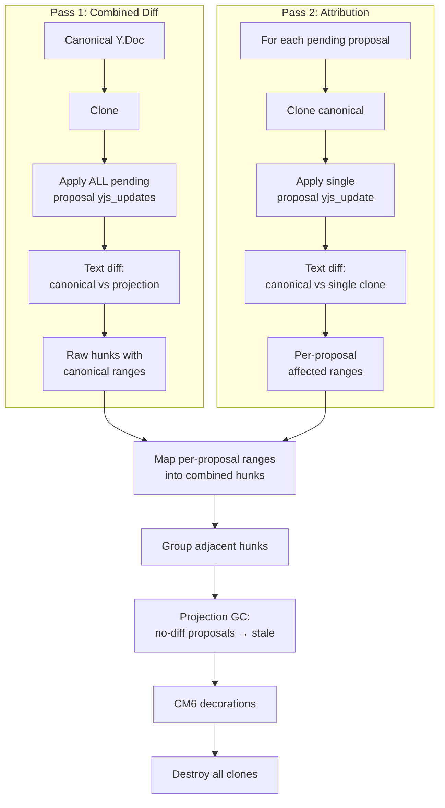
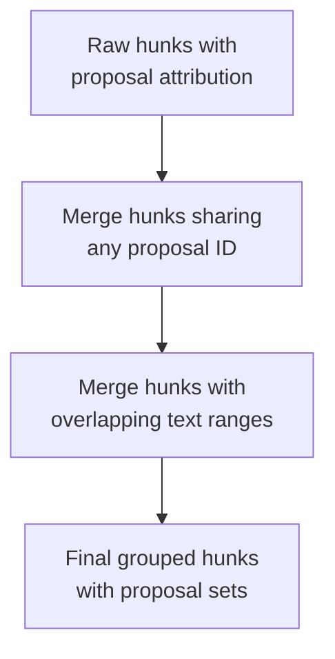

# Frontend Diff Model

## Overview

The frontend derives diff hunks by comparing canonical text with an ephemeral projection. The projection is per-user: only pending proposals where `created_by_user_id = current_user` are applied. Hunks are grouped text regions — the writer acts on what they see, not on individual proposals.

The projection computation itself is shared logic (frontend for diff UI, backend for AI context -- see [Architecture](architecture.md)). This spec covers the frontend-specific diff and rendering pipeline on top of it.

## Derivation Pipeline

Two passes: one combined projection for the diff, then per-proposal clones for attribution.



Full re-derive triggers: `_proposal_status` map change or proposal-set change. Canonical text changes (user typing) only remap existing decoration positions via CM6 `map()` — no re-derive needed.

### How Yjs Handles Overlapping Updates

When two proposals edit the same text region, Yjs CRDT composition (YATA algorithm) merges them automatically via left/right origin references. Applying both yjs_updates to a clone produces one merged result — the text diff shows one hunk naturally.

| Case | Yjs behavior | Grouping needed? |
|------|-------------|-----------------|
| Overlapping (same region) | CRDT composition → one merged result | No — one hunk naturally |
| Adjacent (nearby lines) | Separate text changes | Yes — threshold determines merge |
| Distant (far apart) | Separate text changes | No — separate hunks |

### Attribution Algorithm

Yjs has no built-in API for "which update changed which text region." We compute this by cloning canonical once per pending proposal, applying each individually, and diffing:

```
Pass 1 — combined diff:
  projection = clone(canonical)
  for each pending P: applyUpdate(projection, P.yjs_update)
  combinedHunks = textDiff(canonical.text, projection.text)

Pass 2 — per-proposal attribution:
  for each pending P:
    solo = clone(canonical)
    applyUpdate(solo, P.yjs_update)
    P.regions = textDiff(canonical.text, solo.text)

  for each combinedHunk:
    hunk.proposals = [P for P where P.regions overlaps hunk.range]
```

This correctly attributes even when proposals interact:

```
P1: insert "black " before "cat"   → solo diff: insert at pos 4
P2: insert "big " before "cat"     → solo diff: insert at pos 4
Combined (CRDT ordering):          → "big black cat" (one hunk at pos 4)
Both P1.regions and P2.regions overlap → hunk carries [P1, P2]
```

## Grouped Hunk Identity

Each hunk represents one visible region that may include one or more proposals. The writer acts on regions, not on proposal rows.

### Grouping Algorithm

Two rules, applied via transitive closure:

1. **Proposal atomicity**: Hunks that share any contributing proposal must be in the same group. A proposal's `yjs_update` is atomic -- you can't partially apply it.
2. **Overlapping ranges**: Hunks whose text ranges overlap merge into one group.

Both rules are transitive: if hunk A overlaps B and B shares a proposal with C, all three merge.



No paragraph-level heuristic. If two edits don't overlap and don't share a proposal, the writer can accept/reject each independently -- even within the same paragraph.

### Example: Non-Overlapping Edits Stay Separate

```
Canonical: "She walked to the store and bought some milk."

Three separate proposals:
  P1: "walked" → "ran"
  P2: "store" → "market"
  P3: "milk" → "oat milk"

No overlapping ranges, no shared proposals → three independent hunks.
Writer acts on each one separately.
```

### Example: Overlapping Edits Merge

```
Canonical: "The cat sat on the mat."

P1: "cat sat" → "cat lazily sat"    (insert "lazily ")
P2: "cat sat" → "cat quietly sat"   (insert "quietly ")

CRDT composition → "cat quietly lazily sat" (one combined hunk)
Both P1 and P2 attributed → grouped hunk [P1, P2].
```

### Example: Multi-Paragraph Proposal

```
Canonical:
  "The sun set behind the hills.\n\nShe turned and walked home."

P1 rewrites both paragraphs (one edit_document call):
  "The sun dipped below the ridge.\n\nShe turned and ran home."

Raw hunks span two paragraphs, but both carry [P1] → one grouped hunk.
Writer accepts or rejects the entire edit.
```

If the writer wants finer-grained control over multi-paragraph edits, the AI should produce smaller proposals. That's a prompt/tool concern, not a diff model concern.

## Projection GC and Stale Proposals

During projection recompute:

- If applying a pending proposal yields no diff in any grouped hunk, that proposal is stale.
- Stale proposals are auto-resolved to `stale` and never rendered as hunks.
- Thread UI shows stale proposals as "No longer relevant".

## Hunk Actions

| User action | Canonical/map mutation | Next derive result |
|-------------|------------------------|--------------------|
| Accept hunk | Apply all hunk proposal updates + set each proposal status `accepted` in one transaction | Hunk disappears (canonical catches up) |
| Reject hunk | Set each hunk proposal status `rejected` in one transaction | Hunk disappears (pending set shrinks) |
| Edit hunk | Reject then type, or accept then modify (`ORIGIN_HUMAN`) | Hunk disappears or reshapes around new canonical text |
| Undo accept hunk | Revert full transaction | Entire hunk reappears as one undo step |
| Undo reject hunk | Revert full transaction | Entire hunk reappears as one undo step |

## CM6 Rendering

Hunk rendering remains decoration-based:

- Deletions: mark decorations on canonical ranges.
- Insertions: widget decorations for inserted text.
- Replacements: deletion mark + insertion widget.
- Action controls: Keep / Edit / Discard widgets bound to grouped hunk region data.

## Performance

| Workload | Expected cost |
|----------|---------------|
| Pass 1: clone + apply all updates | ~2ms |
| Pass 1: text diff (~2000 words) | ~3-10ms |
| Pass 2: N solo clones + diffs (attribution) | ~2-5ms per proposal |
| Group + decorate | ~1-3ms |
| Total derive cycle (5 pending proposals) | ~20-35ms |

With 5 pending proposals, the attribution pass dominates. This is acceptable -- the pipeline only runs on proposal events, not keystrokes. If proposal counts grow large, the solo-clone pass can be optimized by caching per-proposal diffs and only recomputing changed proposals.

### Re-Derive Strategy

The full clone/apply/diff pipeline only runs on **proposal events**, not on every keystroke:

| Trigger | Action |
|---------|--------|
| New proposal arrives | Full re-derive |
| Proposal status changes (accept/reject/stale) | Full re-derive |
| User types (canonical text change, no proposal change) | CM6 decoration `map()` shifts hunk positions — no re-derive |
| User pauses typing (500ms debounce) | Full re-derive — catches staleness from user edits |

CM6 decorations automatically remap their positions when the document changes via `map()`. User typing shifts existing hunk positions without recomputing the diff. The expensive pipeline only runs when the set of pending proposals or their statuses change.

If proposal events arrive in bursts (e.g., AI streaming multiple `edit_document` calls), debounce re-derive by 50-100ms. Decoration updates lagging by one frame are invisible to the writer. When no proposals are pending, the pipeline is skipped entirely.

## Cross-References

- [Architecture](architecture.md)
- [Local-First Authority](local-first-authority.md)
- [Undo Design](undo.md)
- [Implementation Plan](plan.md)
