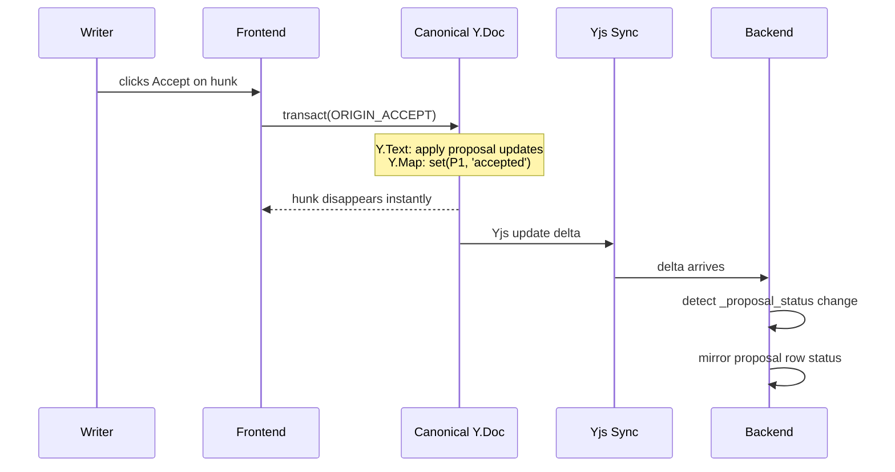

# Local-First Authority

## Overview

Actions are local-first on canonical Yjs data structures. The frontend applies accept/reject immediately; the backend mirrors status from synced Yjs state. No round-trip needed for any user action.



The writer sees the result immediately. Backend mirroring is asynchronous and driven by Yjs sync deltas.

## Authority Boundary

| Concern | Authority | Storage | Notes |
|---|---|---|---|
| Canonical document text | Yjs | `Y.Text('content')` | Synced via existing collab transport |
| Proposal status map | Yjs | `Y.Map('_proposal_status')` | Decision ledger for `accepted`, `rejected`, `stale` |
| Diff derivation | Frontend | Ephemeral | Projection + diff only |
| Accept/reject hunk actions | Frontend | Yjs transactions | Immediate, undoable |
| Projection GC | Frontend | Yjs transaction | Auto-marks stale proposals during recompute |
| Session undo/redo | Frontend | UndoManager in memory | Session-scoped |
| Proposal status row | Backend + mirror | `proposals.status` | Always current: `pending`, `accepted`, `rejected`, `stale`, `reverted` |
| Thread undo/reapply | Frontend | `ORIGIN_THREAD` Yjs transaction | Local-first, tracked in undo stack |

## Immediate Operations

### Accept Hunk

```typescript
canonicalDoc.transact(() => {
  for (const proposal of hunk.proposals) {
    Y.applyUpdate(canonicalDoc, proposal.yjs_update);
    canonicalDoc.getMap('_proposal_status').set(proposal.id, 'accepted');
  }
}, ORIGIN_ACCEPT);
```

- Applies all grouped hunk proposal updates to canonical text.
- Writes all proposal statuses in the same transaction.
- Syncs to backend through normal Yjs update flow.

### Reject Hunk

```typescript
canonicalDoc.transact(() => {
  for (const proposal of hunk.proposals) {
    canonicalDoc.getMap('_proposal_status').set(proposal.id, 'rejected');
  }
}, ORIGIN_REJECT);
```

- No canonical text mutation.
- Projection excludes this hunk's proposals on the next derive.

### Edit

```typescript
canonicalDoc.transact(() => {
  applyUserEditToCanonical(canonicalDoc.getText('content'), editPatch);
}, ORIGIN_HUMAN);
```

- User edit lands directly in canonical text.
- No separate review-edit status value exists.
- Edit flow is reject + type, or accept + modify.

### Projection GC

```typescript
canonicalDoc.transact(() => {
  for (const proposal of pendingProposalsWithoutDiff) {
    canonicalDoc.getMap('_proposal_status').set(proposal.id, 'stale');
  }
}, ORIGIN_GC);
```

- Runs on every projection recompute.
- Keeps the `edit_tool -> proposal -> yjs_update -> status` chain current.
- Stale proposals are removed from hunk UI and shown as "No longer relevant" in thread UI.

### Undo

```typescript
undoManager.undo();
```

- Reverts the last tracked mutation from text or status map.
- No backend command path is required for undo semantics.

## Backend Status Mirroring

Backend logic on Yjs sync:

1. Detect `_proposal_status` key changes by `proposalId`.
2. Upsert proposal-row status to match map value (`accepted`, `rejected`, `stale`, `reverted`). Key removal (from session Ctrl-Z undoing a reject) sets row back to `pending`.
3. Thread undo/reapply writes to `_proposal_status` Y.Map (using `ORIGIN_THREAD`), mirrored to row like all other status changes.
4. Keep row status current for UI (`pending`, `accepted`, `rejected`, `stale`, `reverted`).

## Reconnect / Reload

| State | Reconnect (same tab) | Reload (new tab) |
|-------|-----------------------|------------------|
| Canonical text | Synced | Rehydrated from backend |
| `_proposal_status` | Synced via Yjs deltas | Rehydrated from canonical Yjs state |
| Undo stack | Preserved | Lost |
| Display hunks | Re-derived | Re-derived |

### Example: Tab Reload

```
Writer has accepted P1 and rejected P2. Undo stack has both.

Tab reloads:
  1. Canonical Y.Doc rehydrated from backend (includes P1 text + _proposal_status)
  2. _proposal_status already has P1='accepted', P2='rejected' (persisted in Y.Doc)
  3. Projection re-derives — P1 and P2 excluded (not pending), only P3 shows
  4. Undo stack is empty — session undo for P1/P2 is lost
  5. Thread undo for P1 is still available (uses stored text, not undo stack)
```

No full-state reconciliation needed — Yjs sync guarantees convergence. Backend mirrors `_proposal_status` changes as they arrive via delta, not by scanning the full map.

## Cross-References

- [Architecture](architecture.md)
- [Frontend Diff Model](frontend-diff-model.md)
- [Undo Design](undo.md)
- [Schema Design](schema-design.md)
- [Implementation Plan](plan.md)
