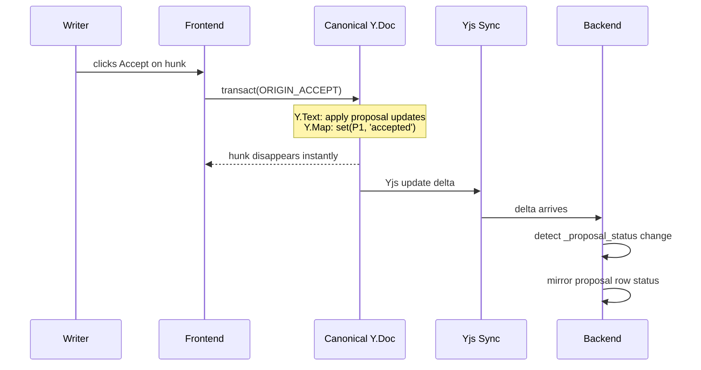
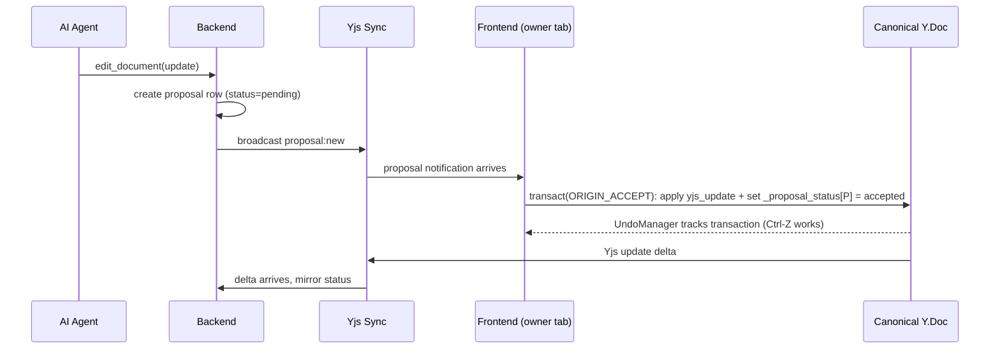

# Local-First Authority

## Overview

Actions are local-first on canonical Yjs data structures. The frontend applies accept/reject immediately; the backend mirrors status from synced Yjs state. No round-trip needed for any user action.



The writer sees the result immediately. Backend mirroring is asynchronous and driven by Yjs sync deltas.

## Auto-Apply Path

In auto-apply mode, the **owner's frontend** applies the update — not the backend. This ensures the transaction uses `ORIGIN_ACCEPT`, which is tracked by UndoManager, making Ctrl-Z work.



### Auto-Apply Tab Election

The backend tracks connected owner tabs via WebSocket presence:

- If ≥1 owner tab is connected → backend broadcasts `proposal:new`, does NOT apply the update itself
- If 0 owner tabs are connected → backend applies the update directly (no `ORIGIN_ACCEPT`, not undoable via Ctrl-Z)
- If a tab reconnects after backend already applied → the proposal is already `accepted`, which is a no-op for the frontend (idempotent by proposal_id + status check)

This is not full leader election — just a binary "any owner tab connected?" check. The backend does not need to pick a specific tab. Any connected owner tab that receives `proposal:new` applies it.

**Multi-tab guard:** Before applying, the frontend checks `_proposal_status` Y.Map for the proposal key. If already set (any value), skip — another tab already applied. This is a local CRDT check (no network), making multi-tab auto-apply idempotent for UndoManager purposes. Without this guard, each tab would create a separate Y.Map write with different Yjs struct IDs, causing Ctrl-Z on the second tab to silently fail (its undo would delete its MapItem, but the first tab's MapItem persists as the winner).

**Why frontend-driven?** Yjs update origins are local apply-time metadata, not carried in the update payload. If the backend applied with `ORIGIN_ACCEPT`, the frontend's UndoManager would see the update arriving via the sync provider with no tracked origin — making it invisible to Ctrl-Z.

### `proposal:new` Delivery

`proposal:new` is a WebSocket event (not Yjs awareness). Payload: `{ proposal_id, document_id, status }`. The frontend does NOT need the full proposal payload from the event — it fetches proposal data (including `yjs_update`) via REST after receiving the notification.

On reconnect, the frontend queries pending proposals for the current user via REST to catch up on any missed `proposal:new` events.

**Reconnect race guard:** After receiving `proposal:new` in auto-apply mode, the frontend fetches the proposal via REST before applying. If `status != 'pending'` (e.g., backend already applied it during the tab's disconnection), skip — do not apply. This prevents creating a duplicate Y.Map write when Yjs sync hasn't yet delivered the backend's prior write.

## Authority Boundary

| Concern | Authority | Storage | Notes |
|---|---|---|---|
| Canonical document text | Yjs | `Y.Text('content')` | Synced via existing collab transport |
| Proposal status map | Yjs | `Y.Map('_proposal_status')` | Decision ledger for `accepted`, `rejected`, `stale`, `reverted` |
| Diff derivation | Frontend | Ephemeral | Projection + diff only |
| Accept/reject hunk actions | Frontend | Yjs transactions | Immediate, undoable |
| Projection GC | Frontend | Yjs transaction | Auto-marks stale proposals during recompute |
| Session undo/redo | Frontend | UndoManager in memory | Session-scoped |
| Proposal status row | Backend + mirror | `proposals.status` | Always current: `pending`, `accepted`, `rejected`, `stale`, `reverted`, `invalid` |
| Offset persistence | Backend | `proposals.accepted_at_offset` | Frontend API call after accept transaction; `proposed_at_offset` set at creation |
| Thread undo/reapply | Frontend | `ORIGIN_THREAD` Yjs transaction | Local-first, tracked in undo stack |

## Immediate Operations

### Accept Hunk

```typescript
undoManager.stopCapturing(); // Force capture boundary — prevents merging with adjacent typing
canonicalDoc.transact(() => {
  // Y.applyUpdate inside transact() inherits the outer origin (ORIGIN_ACCEPT).
  // This is load-bearing: UndoManager sees one transaction, producing one Ctrl-Z step.
  // Do NOT move applyUpdate outside this transaction block.
  for (const proposal of hunk.proposals) {
    Y.applyUpdate(canonicalDoc, proposal.yjs_update);
    canonicalDoc.getMap('_proposal_status').set(proposal.id, 'accepted');
  }
}, ORIGIN_ACCEPT);

// After transaction succeeds, persist offset to backend for thread undo.
// Uses a monotonic version counter to prevent stale writes from overwriting
// newer offsets (e.g., accept offset arriving after a reapply offset).
// This same call is also made after thread reapply (any transition into 'accepted').
for (const proposal of hunk.proposals) {
  const offset = /* compute character position where edit landed */;
  api.setAcceptedAtOffset(proposal.id, offset, version);  // async, non-blocking
}
```

- Applies all grouped hunk proposal updates to canonical text.
- Writes all proposal statuses in the same transaction.
- `stopCapturing()` ensures this is a discrete undo step, not merged with adjacent typing.
- Syncs to backend through normal Yjs update flow.

### Reject Hunk

```typescript
undoManager.stopCapturing(); // Force capture boundary
canonicalDoc.transact(() => {
  for (const proposal of hunk.proposals) {
    canonicalDoc.getMap('_proposal_status').set(proposal.id, 'rejected');
  }
}, ORIGIN_REJECT);
```

- No canonical text mutation.
- Projection excludes this hunk's proposals on the next derive.

### Edit

```typescript
canonicalDoc.transact(() => {
  applyUserEditToCanonical(canonicalDoc.getText('content'), editPatch);
}, ORIGIN_HUMAN);
```

- User edit lands directly in canonical text.
- No separate review-edit status value exists.
- Edit flow is reject + type, or accept + modify.

### Projection GC

```typescript
canonicalDoc.transact(() => {
  for (const proposal of pendingProposalsWithoutDiff) {
    canonicalDoc.getMap('_proposal_status').set(proposal.id, 'stale');
  }
}, ORIGIN_GC);
```

Runs on every projection recompute. See [Frontend Diff Model](frontend-diff-model.md) — Projection GC for the full text pre-check algorithm and empty-attribution-diff catch.

### Undo

```typescript
undoManager.undo();
```

- Reverts the last tracked mutation from text or status map.
- No backend command path is required for undo semantics.

## Backend Status Mirroring

**Bootstrap:** On document creation or first load, the backend must ensure `_proposal_status` Y.Map exists in the canonical Y.Doc (access it via `doc.getMap('_proposal_status')` which auto-creates it). This guarantees that `yjs_update` validation can detect unexpected Y.Map mutations — if the map doesn't exist yet, a malicious update that creates it would evade the `Transaction.Changed` check.

**Known gap (authorization):** Any client connected to the document WebSocket can send Yjs updates that modify `_proposal_status`. A malicious client could accept another user's proposal or reject proposals to block work. For the current stage (no untrusted users), this is acceptable. For production, validate `_proposal_status` changes in the Yjs sync path: only allow the `created_by_user_id` of a proposal to modify its status entry.

Backend logic on Yjs sync:

1. Detect `_proposal_status` key changes by `proposalId`.
2. Upsert proposal-row status to match map value (`accepted`, `rejected`, `stale`, `reverted`). Key removal (from session Ctrl-Z undoing a reject) sets row back to `pending`.
3. Thread undo/reapply writes to `_proposal_status` Y.Map (using `ORIGIN_THREAD`), mirrored to row like all other status changes.
4. Keep row status current for UI (`pending`, `accepted`, `rejected`, `stale`, `reverted`).
5. On document load (new connection or reconnect), read the full `_proposal_status` Y.Map and reconcile all proposal rows against it. Delta-driven mirroring handles steady-state; full reconciliation on load handles missed deltas. Key removal (missing key) sets row back to `pending` **unless** the row status is `invalid` or `stale` — these are terminal statuses excluded from missing-key reconciliation.

## Reconnect / Reload

| State | Reconnect (same tab) | Reload (new tab) |
|-------|-----------------------|------------------|
| Canonical text | Synced | Rehydrated from backend |
| `_proposal_status` | Synced via Yjs deltas | Rehydrated from canonical Yjs state |
| Undo stack | Preserved | Lost |
| Display hunks | Re-derived | Re-derived |

### Example: Tab Reload

```
Writer has accepted P1 and rejected P2. Undo stack has both.

Tab reloads:
  1. Canonical Y.Doc rehydrated from backend (includes P1 text + _proposal_status)
  2. _proposal_status already has P1='accepted', P2='rejected' (persisted in Y.Doc)
  3. Projection re-derives — P1 and P2 excluded (not pending), only P3 shows
  4. Undo stack is empty — session undo for P1/P2 is lost
  5. Thread undo for P1 is still available (uses stored region_text + accepted_at_offset, not undo stack)
```

Yjs sync guarantees convergence. Backend mirrors `_proposal_status` changes as they arrive via delta, with full reconciliation on load as a safety net (see Backend Status Mirroring above).

### Hunk Action Freshness

Before executing Accept/Reject, the frontend checks whether the hunk's source derivation is still current (canonical text and proposal set haven't changed since the hunk was rendered). If stale, force a synchronous re-derive before committing. This prevents accepting against a projection the user hasn't seen.

Implementation: attach a derivation sequence number to each hunk. Bump on every re-derive. Accept/Reject checks that the current sequence matches the hunk's sequence.

## Cross-References

- [Architecture](architecture.md)
- [Frontend Diff Model](frontend-diff-model.md)
- [Undo Design](undo.md)
- [Schema Design](schema-design.md)
- [Implementation Plan](plan.md)
