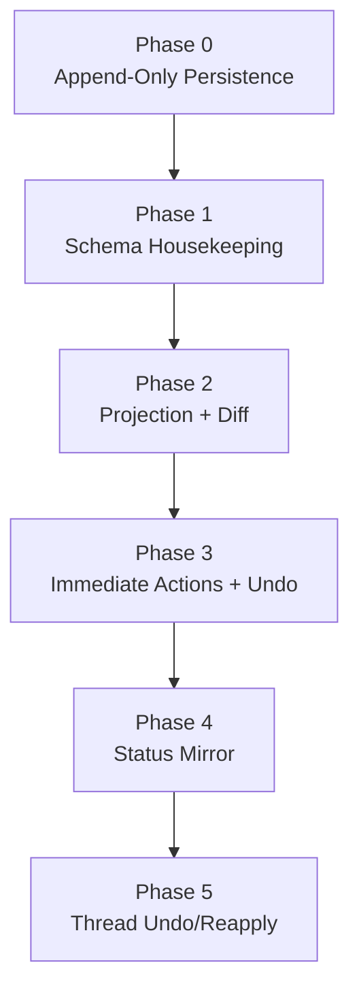

# Implementation Plan

**Status:** approved

## Locked Decisions

| #   | Decision                 | Detail                                                                                                                        |
| --- | ------------------------ | ----------------------------------------------------------------------------------------------------------------------------- |
| 1   | One canonical Y.Doc      | Canonical state lives in `Y.Text('content')` and `Y.Map('_proposal_status')`.                                                   |
| 2   | Ephemeral projection     | Diff view is `clone(canonical) + apply(pending proposal updates) + diff + group`.                                             |
| 3   | Hunk identity            | Hunks are grouped text regions with contributing proposal sets.                                                               |
| 4   | Accept is immediate      | Apply all grouped hunk proposal updates and set `_proposal_status[proposalId]='accepted'` in one transaction.                   |
| 5   | Reject is immediate      | Set `_proposal_status[proposalId]='rejected'` for all proposals in the grouped hunk.                                            |
| 6   | Edit is plain typing     | Edit is reject + type or accept + modify with `ORIGIN_HUMAN`; no separate review-edit status value.                           |
| 7   | Unified UndoManager      | One stack over `[Y.Text('content'), Y.Map('_proposal_status')]`.                                                                |
| 8   | Undo boundaries          | Keep single UndoManager; call `clear()` when collaboration mode changes (auto-apply to manual or vice versa).                 |
| 9   | Projection GC            | Text pre-check: if canonical already contains `region_text_after` at `proposed_at_offset`, mark `stale`. No apply-then-diff.  |
| 10  | Status chain             | `edit_tool -> proposal -> yjs_update -> status` is always current in backend row and thread UI.                               |
| 11  | Thread undo/reapply      | Offset-anchored text search using `region_text_before`/`region_text_after` + stored offset (`accepted_at_offset` or `proposed_at_offset`). No full-document fallback — conflict if not found within ±500 char window. |
| 12  | Thread undo map behavior | Thread undo/reapply writes to both canonical text and `_proposal_status` Y.Map in one transaction (`ORIGIN_THREAD`).           |
| 13  | Immutable thread history | Thread messages are never modified. Tool call status is a UI-only overlay derived from proposal row status.                    |

## Phases

### Phase 0: Append-Only Persistence

Goal: migrate from merged-snapshot persistence to append-only update log. Must land before subsequent phases.

Tasks:

1. Schema migration: add `document_updates`, `document_checkpoints`, `document_bookmarks` tables.
2. Modify `SessionManager.persist()`: replace `documents.yjs_state` overwrite with `document_updates` row insert (append).
3. Modify `SessionManager.loadState()`: load latest `document_checkpoints` row + replay `document_updates` rows since checkpoint.
4. Implement compaction worker: count updates per document, compact oldest 10k into new checkpoint at 20k threshold. Acquire `pg_advisory_xact_lock(document_id)`, materialize manual/daily bookmarks, delete ai_turn/safety_restore bookmarks, merge updates into checkpoint, delete compacted update rows. Single transaction.
5. Remove `documents.yjs_state` column (after append-only is live and verified).
6. Migrate `collab_document_snapshots` to `document_bookmarks` (map existing named snapshots to manual bookmarks, drop old table).
7. Verify: document load via checkpoint + replay produces identical Y.Doc state to old `yjs_state` overwrite.

### Phase 1: Schema Housekeeping

Tasks:

1. Ensure proposal table supports `pending`, `accepted`, `rejected`, `stale`, `reverted`.
2. Add `created_by_user_id` to proposal schema.
3. Ensure `region_text_before`, `region_text_after` are present. Add `proposed_at_offset INT NULL` (set at creation by backend), `accepted_at_offset INT NULL` (set at accept time by frontend), and `turn_id UUID NULL`.
4. Add `accepted_at_offset` API endpoint with monotonic version guard — frontend calls this after any transition into `accepted` (hunk accept or thread reapply) to persist the offset to the proposal row. Add `offset_version INT DEFAULT 0` to proposal table; endpoint checks `request_version > stored_version`.
5. Remove `ai_content` from document schema and consumers.

**Transition sub-phase:** Keep `ai_content` as canonical text (without per-user projection) during transition. Old consumers that read `ai_content` get canonical text, which is what they got before the projection concept existed. New consumers use the per-user projection API. Remove `ai_content` once all old consumers are migrated.

### Phase 2: Projection + Diff Pipeline

Tasks:

1. Implement projection derivation from canonical + pending proposal updates with region tracking. Clone via `new Y.Doc()` + `applyUpdate(clone, encodeStateAsUpdate(source))` (no public `Y.Doc.clone()` API).
2. Lock `yjs_update` generation algorithm: `encodeStateAsUpdate(tempDoc, encodeStateVector(canonical))` — ensures proposals carry only the delta, not full state.
3. Validate `yjs_update` at proposal creation time on the backend. If `Y.applyUpdate` fails against canonical, reject the proposal before storing. Validate that the `yjs_update` only modifies `Y.Text('content')` — reject with `invalid` if it includes `Y.Map` or `Y.Array` mutations (prevents accidental `_proposal_status` contamination). Ensure `_proposal_status` Y.Map is bootstrapped in canonical docs so `Transaction.Changed` can detect unexpected mutations. Verify `y-crdt` Go library supports inspecting which shared types an update touches before applying; fallback: apply to a test doc, check for unexpected Y.Map/Y.Array mutations, reject if found. Validate `region_text_before` exists in canonical at `proposed_at_offset` (within tolerance). Derive `region_text_after` server-side from the solo diff — enforce that the update produces exactly one contiguous text replacement at creation time (reject with `invalid` if multiple disjoint changes detected via delta inspection). This constraint applies to the `yjs_update` when diffed against canonical at creation time; when the same update is later applied to a diverged canonical via CRDT composition during projection, the textual result may differ, but the diff pipeline handles this naturally (hunks carry proposal IDs and get grouped by proposal atomicity). Add `invalid` as a terminal status for defense-in-depth (`invalid` is backend-only, never enters `_proposal_status` Y.Map).
4. Diff into raw hunks, then group overlapping hunks into user-facing regions (overlap + proposal atomicity only — no proximity threshold).
5. Attach contributing proposal sets and update references to each grouped hunk.
6. Re-derive triggers: proposal-set changes and `_proposal_status` changes trigger full re-derive. Local typing remaps decorations via CM6 `map()` (debounced 500ms re-derive for staleness). Remote canonical text changes (other users' accepts, thread undo) trigger immediate full re-derive.
7. Run projection GC via text pre-check: if canonical already contains `region_text_after` at `proposed_at_offset`, mark `stale` without applying. Skip stale proposals in projection clone.
8. Render CM6 decorations for grouped hunk actions.

### Phase 3: Immediate Hunk Actions + Session Undo

Tasks:

1. Wire grouped hunk accept/reject to immediate Yjs transactions.
2. Ensure hunk accept performs multi-update text apply + status writes atomically.
3. Wire auto-apply mode: owner's frontend receives `proposal:new` (WebSocket event with `{ proposal_id, document_id, status }`), fetches proposal via REST, applies `yjs_update` with `ORIGIN_ACCEPT` locally (UndoManager tracks it for Ctrl-Z). Backend tracks owner tab presence via WebSocket — if 0 owner tabs connected, backend applies directly.
4. Initialize a single UndoManager over text + status map.
5. Call `undoManager.stopCapturing()` before every discrete action (Accept, Reject, Thread op) to prevent merging with adjacent typing via UndoManager's default 500ms `captureTimeout`.
6. Call `undoManager.clear()` on collaboration mode changes (auto-apply to manual or vice versa).
7. Verify one Ctrl-Z undoes the whole grouped hunk transaction (multi-proposal accept = exactly one undo entry).
8. Verify interleaved undo/redo across typing and hunk actions.

### Phase 4: Backend Status Mirror

Tasks:

1. Mirror `_proposal_status` changes into proposal row status.
2. Verify status mirroring is driven by `_proposal_status` key deltas from Yjs sync.
3. Verify row status stays current for `pending`, `accepted`, `rejected`, `stale`, `reverted`.
4. Pin all Yjs wire format to v1 (`update`/`encodeStateAsUpdate`). Reject or gate v2 payloads. Add JS↔Go compatibility tests for both Y.Text and Y.Map updates.
5. Add full `_proposal_status` reconciliation on document load (read Y.Map, reconcile all proposal rows). Delta-driven mirroring for steady-state; full reconciliation on load as safety net.

**API contract:** The API surface between frontend and backend is minimal given the local-first model. Proposal CRUD (REST), document sync (Yjs provider), awareness (Yjs awareness protocol), `accepted_at_offset` persistence (REST endpoint), and `proposal:new` WebSocket event. Exact endpoint signatures are defined at implementation time.

### Phase 5: Thread-Level Undo/Reapply

Tasks:

1. Implement `thread:undo` (`accepted -> reverted`) via offset-anchored `region_text_after -> region_text_before` replacement.
2. Implement `thread:reapply` (`reverted -> accepted` and `rejected -> accepted`) via offset-anchored `region_text_before -> region_text_after` replacement.
3. Implement `thread:undo_all` — iterate accepted proposals in a thread, undo each independently, return per-proposal results.
4. Apply undo/reapply as canonical Yjs updates appended to `document_updates`.
5. Return conflict when target text not found within ±500 char tolerance window of stored offset. No full-document fallback — prevents wrong-occurrence replacement in fiction with repeated phrases.
6. Thread UI renders proposal status as overlay on tool calls — no thread message mutation.
7. Create `ai_turn` bookmark (update log pointer, per-document, linked by `turn_id`) before each AI turn's proposals are applied.
8. Implement turn-level restore: query all documents with `ai_turn` bookmark for `turn_id`, create `safety_restore` bookmarks, replace Y.Doc state, `undoManager.clear()`. Backend-coordinated (not local-first).
9. Implement undo restore: restore from `safety_restore` bookmark, `undoManager.clear()`. Thread UI shows `[Restored] [Undo restore]` on the turn while bookmarks exist (pre-compaction).

## Dependency Graph

## Risk Summary

| Phase | Risk   | Notes                                                 |
| ----- | ------ | ----------------------------------------------------- |
| 1     | Low    | Mostly schema cleanup                                 |
| 2     | Medium | Diff quality and UI derivation correctness            |
| 3     | Medium | Transaction and undo boundary correctness             |
| 4     | Medium | Status mirror consistency                             |
| 5     | Low    | Offset-anchored text replacement with conflict handling |

## Related Work (Separate Scope)

These specs are part of the v2 design but are separate work streams -- not gated by the phases above:

- [Review Comments](../future/review-comments.md) -- annotation comments (Y.Array), `add_comment` tool
- [Editor Strategy](../future/editor-strategy.md) -- block rendering (KaTeX, Mermaid), DOCX/PDF import/export

## Cross-References

- [Architecture](architecture.md)
- [Frontend Diff Model](frontend-diff-model.md)
- [Local-First Authority](local-first-authority.md)
- [Undo Design](undo.md)
- [Schema Design](schema-design.md)
- [Review Comments](../future/review-comments.md)
- [Editor Strategy](../future/editor-strategy.md)

