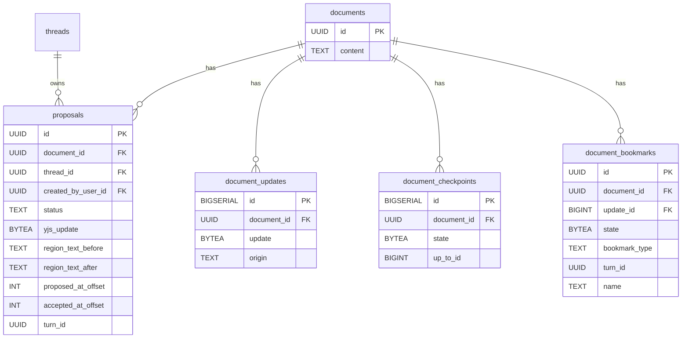
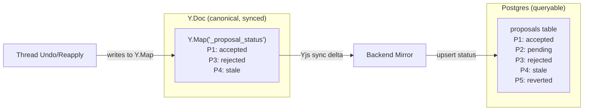

# Schema Design

## Overview

Database schema stays minimal. Decision state lives in Yjs (`_proposal_status`) and is mirrored to proposal rows for querying.

## Dual Authority: Y.Map + Proposal Rows

Decision state has two representations that stay in sync:

- `pending` = no Y.Map entry, proposal row exists with `status = 'pending'`
- `accepted`, `rejected`, `stale` = Y.Map entry, mirrored to row
- `reverted` = thread undo writes to Y.Map, mirrored to row
- `rejected -> accepted` = thread reapply writes to Y.Map, mirrored to row

## Implementation Notes

- Clean-slate schema: define `${TABLE_PREFIX}proposals` fresh with canonical names (`pending` status) and no legacy columns.

## Tables

### `${TABLE_PREFIX}proposals`

Stores proposal payload and lifecycle status.

| Column | Type | Notes |
|---|---|---|
| `id` | `UUID PRIMARY KEY` | Proposal key |
| `document_id` | `UUID NOT NULL` | FK to `documents` |
| `thread_id` | `UUID NOT NULL` | Thread owner |
| `created_by_user_id` | `UUID NOT NULL` | User who initiated the AI proposal request |
| `status` | `TEXT NOT NULL` | `pending`, `accepted`, `rejected`, `stale`, `reverted`, `invalid` |
| `yjs_update` | `BYTEA NOT NULL` | Proposal payload |
| `region_text_before` | `TEXT NULL` | Original text before the edit (from `edit_document` find param) |
| `region_text_after` | `TEXT NULL` | Replacement text after the edit (from `edit_document` replacement param) |
| `proposed_at_offset` | `INT NULL` | Character offset where the edit targets in canonical; set at proposal creation time by backend. Used as search anchor for reapply-from-rejected. |
| `accepted_at_offset` | `INT NULL` | Character offset where edit was applied; set at accept time by frontend API call. Used as search anchor for undo-of-accepted. |
| `turn_id` | `UUID NULL` | Tool call turn; used for per-tool-call status overlays in thread UI |
| `created_at` | `TIMESTAMPTZ DEFAULT NOW()` | Created time |

Backend mirrors `status` from `_proposal_status` map updates, keyed by `proposalId`.
Thread undo/reapply also writes to `_proposal_status`, so all status changes flow through the same mirror path.

### `${TABLE_PREFIX}documents`

| Column | Type | Notes |
|---|---|---|
| `id` | `UUID PRIMARY KEY` | Document key |
| `content` | `TEXT` | Plain-text cache |

`yjs_state` is removed — replaced by `document_updates` + `document_checkpoints` (see [Append-Only Persistence](append-only-persistence.md)).
`ai_content` is removed — derived on demand from projection.

### `${TABLE_PREFIX}idempotency_keys`

Unchanged request-idempotency table.

## Yjs Proposal State Shape

`_proposal_status` lives inside canonical Y.Doc:

- key: `proposalId`
- value: status string (`accepted`, `rejected`, `stale`, `reverted`)

Pending proposals are represented by missing keys plus proposal row `status = 'pending'`.

Offsets (`proposed_at_offset`, `accepted_at_offset`) are stored in the Postgres proposal row only, not in the Y.Map. Offsets don't need CRDT merge semantics — they are metadata set once (at creation or accept time) and read later for thread undo.

## What Was Eliminated

| Eliminated | Reason |
|---|---|
| `documents.ai_content` | Derived on demand from projection |
| Backend hunk tables | Hunks are frontend-only ephemeral view data |
| One-proposal-to-one-hunk identity | Hunks are grouped regions with proposal sets |
| Legacy proposal grouping linkage columns | Grouped hunks are derived dynamically from projection diff regions |
| Separate review-edit proposal status | Edit is plain user typing after reject or after accept |
| Separate decision persistence stores | Canonical `_proposal_status` already persists via Yjs |
| Persistent AI-version Y.Doc or Y.Text | Projection is ephemeral, computed on demand |
| Extra review command protocol | Actions are immediate Yjs transactions |

For the full proposal status lifecycle, see [Architecture](architecture.md).

## Cross-References

- [Architecture](architecture.md)
- [Local-First Authority](local-first-authority.md)
- [Undo Design](undo.md)
- [Frontend Diff Model](frontend-diff-model.md) -- grouped hunks derived from proposals
- [Append-Only Persistence](append-only-persistence.md) -- `document_updates`, `document_checkpoints`, `document_bookmarks` tables
- [Implementation Plan](plan.md)
