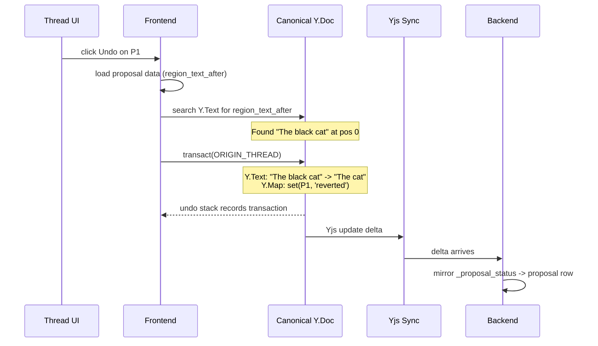

# Undo Design

## Overview

Two complementary undo systems handle different scopes:

| System | Trigger | Scope | Persistence | Mechanism |
|--------|---------|-------|-------------|-----------|
| **Session Ctrl-Z** | Keyboard shortcut | Recent local history | No (session-scoped) | UndoManager over Yjs shared types |
| **Thread-level** | Click in thread UI | One persisted proposal | Yes (survives reload) | Text find-and-replace using stored regions |

Both systems write to `_proposal_status` Y.Map and both are tracked in the session undo stack. They compose: a thread undo can be Ctrl-Z'd, and vice versa.

## Session Undo (Ctrl-Z)

### UndoManager Setup

```typescript
const ORIGIN_HUMAN = 'human';
const ORIGIN_ACCEPT = 'accept';
const ORIGIN_REJECT = 'reject';
const ORIGIN_GC = 'gc';
const ORIGIN_THREAD = 'thread';

const undoManager = new Y.UndoManager(
  [doc.getText('content'), doc.getMap('_proposal_status')],
  {
    trackedOrigins: new Set([
      ORIGIN_HUMAN,
      ORIGIN_ACCEPT,
      ORIGIN_REJECT,
      ORIGIN_THREAD,
    ]),
  }
);

// On collaboration mode change (auto-apply <-> manual)
undoManager.clear();
```

### Ctrl-Z Behavior

`undoManager.undo()` reverts the most recent tracked transaction.

| Last action | Undo effect |
|-------------|-------------|
| Accept hunk | Reverts all grouped proposal updates and status writes as one step |
| Reject hunk | Reverts all grouped status writes as one step |
| Typing | Reverts recent text change |

### Example: Interleaved Undo Stack

Writer performs these actions in order:

```
1. Type "Hello "                          (ORIGIN_HUMAN)
2. Accept hunk [P1]                       (ORIGIN_ACCEPT)
3. Type "world"                           (ORIGIN_HUMAN)
4. Reject hunk [P2, P3]                   (ORIGIN_REJECT)
```

Undo stack (top = most recent):

```
[4] Reject [P2,P3]:  Y.Map set(P2,'rejected') + set(P3,'rejected')
[3] Type:            Y.Text insert "world"
[2] Accept [P1]:     Y.Text apply P1 update + Y.Map set(P1,'accepted')
[1] Type:            Y.Text insert "Hello "
```

Ctrl-Z sequence:

```
1st Ctrl-Z -> undo [4]: P2 and P3 rejections reverted, both hunks reappear
2nd Ctrl-Z -> undo [3]: "world" removed from text
3rd Ctrl-Z -> undo [2]: P1 text reverted + P1 back to pending, hunk reappears
4th Ctrl-Z -> undo [1]: "Hello " removed
```

All operations interleave in one chronological stack. No separate stacks for typing vs actions.

### Why ORIGIN_GC Is Not Tracked

Projection GC uses `ORIGIN_GC` which is NOT in `trackedOrigins`. If GC marks P4 as `stale`, that write is invisible to UndoManager. Ctrl-Z will never "un-stale" a proposal -- stale is terminal and automatic.

### Persistence

| State | Persistent? | Notes |
|-------|-------------|-------|
| Canonical text | Yes | Yjs synced |
| `_proposal_status` entries | Yes | Yjs synced |
| Undo stack | No | In-memory session state |

## Thread-Level Undo

Thread-level undo lets the writer revert or reapply any individual proposal through the conversation thread UI. It persists across sessions and works days or weeks later, as long as the target text hasn't been modified.

This works in both collaboration modes:
- **Auto-apply**: the edit landed automatically -- writer clicks undo in thread UI to revert it
- **Manual**: the writer accepted or rejected a hunk containing the proposal -- later clicks undo/reapply in thread UI



Thread ops are **local-first** -- the frontend applies the transaction directly, same as accept/reject hunk. `ORIGIN_THREAD` is tracked by UndoManager, so the operation enters the session undo stack.

### Storage

Thread-level operations use fields on `${TABLE_PREFIX}proposals` (see [Schema Design](schema-design.md)):

| Column | Type | Purpose |
|---|---|---|
| `region_text_before` | `TEXT NULL` | Captured at proposal creation from `edit_document` find text |
| `region_text_after` | `TEXT NULL` | Captured at proposal creation from `edit_document` replacement text |
| `status` | `TEXT` | Gates which operations are available |

### Operations

All thread operations use the same text find-and-replace mechanism:

| Operation | Source status | Find | Replace with | Target status |
|-----------|-------------|------|-------------|---------------|
| Undo | `accepted` | `region_text_after` | `region_text_before` | `reverted` |
| Reapply | `reverted` | `region_text_before` | `region_text_after` | `accepted` |
| Reapply | `rejected` | `region_text_before` | `region_text_after` | `accepted` |

If the find text is not found in canonical, the operation returns a conflict.

### Undo Flow (`accepted -> reverted`)

1. User clicks Undo on tool call in thread UI.
2. Frontend loads proposal data (`region_text_after`, `region_text_before`).
3. Search local `Y.Text('content')` for `region_text_after`.
4. If found, transact with `ORIGIN_THREAD`:
   - Delete match and insert `region_text_before` on `Y.Text('content')`.
   - Set `_proposal_status[proposalId] = 'reverted'` on `Y.Map('_proposal_status')`.
5. Transaction enters session undo stack (Ctrl-Z can reverse it).
6. Yjs sync delivers delta to backend; backend mirrors status to proposal row.
7. If not found, show conflict in thread UI.

### Reapply Flow (`reverted -> accepted` or `rejected -> accepted`)

1. User clicks Reapply on tool call in thread UI.
2. Frontend loads proposal data (`region_text_before`, `region_text_after`).
3. Search local `Y.Text('content')` for `region_text_before`.
4. If found, transact with `ORIGIN_THREAD`:
   - Delete match and insert `region_text_after` on `Y.Text('content')`.
   - Set `_proposal_status[proposalId] = 'accepted'` on `Y.Map('_proposal_status')`.
5. Transaction enters session undo stack (Ctrl-Z can reverse it).
6. Yjs sync delivers delta to backend; backend mirrors status to proposal row.
7. If not found, show conflict in thread UI.

### Undo All

Writers can undo all proposals in a thread at once. This iterates through each `accepted` proposal in the thread in **reverse chronological order** (newest first) and attempts to undo it individually.

- Reverse order minimizes avoidable conflicts -- a later proposal may have edited text introduced by an earlier one, so undoing newest first succeeds where oldest first would conflict.
- Each proposal is independent -- some may succeed while others conflict.
- Per-proposal results (success or conflict) are returned to the UI.
- Proposals that conflict stay `accepted`; successfully undone proposals become `reverted`.

### Thread UI: Immutable History + Status Overlay

Thread messages (tool_use, tool_result) are **immutable**. Thread-level undo/reapply does not modify conversation history. This preserves prompt caching and conversation integrity.

Instead, the thread UI renders a **status overlay** on each `edit_document` tool call by reading the associated proposal's current status from the proposal row:

```
Tool call: edit_document("insert black before cat")
  tool_result: "Edit applied successfully"     <- immutable, never changes
  overlay: [Undo]                               <- from proposal.status = 'accepted'

After writer clicks Undo:
  tool_result: "Edit applied successfully"     <- still immutable
  overlay: [Undone] [Reapply]                   <- from proposal.status = 'reverted'

After conflict:
  tool_result: "Edit applied successfully"     <- still immutable
  overlay: [Undo failed -- text was edited]      <- transient UI state
```

The overlay is purely derived from proposal row status. No writes to thread/message storage.

### Relationship to `_proposal_status`

Thread-level undo/reapply writes to `_proposal_status` Y.Map in the same transaction as the text mutation. This keeps the Y.Map, proposal row (via backend mirror), and canonical text in sync.

Reverted proposals are not projection inputs. After accept, proposal CRDT items were already applied to canonical; thread undo then replaces canonical text. There is no remaining pending proposal update to project.

### Design Rationale: Text Search over Yjs Inverse

Thread-level undo uses text find-and-replace rather than Yjs inverse operations because:

- **Survives compaction**: text search only needs current document content, while Yjs inverse depends on CRDT item IDs that may be GC'd during compaction
- **Natural conflict detection**: text not found = conflict, no additional checks needed
- **Simple implementation**: string search vs hooking into Yjs UndoManager internals

The tradeoff is ambiguity when identical text appears multiple times (rare for fiction writing, mitigated by capturing surrounding context in `region_text_before` / `region_text_after` at proposal creation time).

### Grouped Hunk Limitation

When a hunk groups multiple proposals and they are accepted together, the per-proposal `region_text_after` may not appear as an exact substring in the combined result (e.g., two adjacent insertions merge into one text span). Thread-level undo for individual proposals within a grouped accept may conflict. This is acceptable -- the conflict UI handles it gracefully, and writers can use session Ctrl-Z to undo the entire grouped accept as one step.

## Examples

### Undo, Reapply, and Conflict

```
Original: "The cat sat on the mat."
Agent proposes P1: insert "black " -> region_text_before="The cat", region_text_after="The black cat"
Writer accepts P1 (or auto-applied).
Canonical: "The black cat sat on the mat."
```

**Thread undo (days later):**

```
1. Load P1 (status = accepted)
2. Search canonical for "The black cat" -> found at pos 0
3. Replace with "The cat"
4. Canonical: "The cat sat on the mat."
5. P1 status -> reverted
6. Thread UI: tool call shows [Undone] [Reapply]
```

**Reapply (from reverted):**

```
1. Load P1 (status = reverted)
2. Search canonical for "The cat" -> found at pos 0
3. Replace with "The black cat"
4. Canonical: "The black cat sat on the mat."
5. P1 status -> accepted
6. Thread UI: tool call shows [Undo]
```

**Reapply (from rejected):**

```
Writer rejected P1 in manual mode. Canonical still has "The cat".
Writer later clicks Reapply in thread UI:
  1. Load P1 (status = rejected)
  2. Search canonical for "The cat" -> found at pos 0
  3. Replace with "The black cat"
  4. Canonical: "The black cat sat on the mat."
  5. P1 status -> accepted
  6. Thread UI: tool call shows [Undo]
```

**Conflict (writer edited the region):**

```
After accepting P1, writer manually changed "black cat" to "big black cat."
Canonical: "The big black cat sat on the mat."

Writer clicks Undo for P1:
  1. Search for "The black cat" -> NOT FOUND
  2. Return conflict: text has been modified since accept
  3. Thread UI: tool call shows [Undo failed -- text was edited]
```

### Why Reject Needs Y.Map

Reject doesn't change the document text -- the proposal was never applied to canonical. So how is Ctrl-Z possible?

Canonical: `The cat sat on the mat.`
Pending P1: insert "black " -> would produce `The black cat sat on the mat.`

**Writer rejects P1:**

```
Transaction (ORIGIN_REJECT):
  Y.Text('content'):       unchanged -- "The cat sat on the mat."
  Y.Map('_proposal_status'): set(P1, 'rejected')
```

The text didn't change, but the Y.Map mutation IS a Yjs operation. UndoManager tracks it.

**Writer presses Ctrl-Z:**

```
UndoManager reverses the transaction:
  Y.Map('_proposal_status'): delete(P1) -> back to no entry = pending
  Projection re-derives -> P1 reappears as a diff hunk
```

Without Y.Map, reject would be invisible to Yjs and un-undoable.

### Accept Then Session Undo

Canonical: `The cat sat on the mat.`
Pending P1: insert "black "

**Writer accepts:**

```
Transaction (ORIGIN_ACCEPT):
  Y.Text('content'):       "The cat sat" -> "The black cat sat on the mat."
  Y.Map('_proposal_status'): set(P1, 'accepted')
```

Both mutations in one transaction = one undo entry.

**Writer presses Ctrl-Z:**

```
UndoManager reverses:
  Y.Text('content'):       "The black cat sat" -> "The cat sat on the mat."
  Y.Map('_proposal_status'): delete(P1) -> back to pending
  P1 reappears as a diff hunk
```

## Implementation Notes

- Projection GC stale writes must use a non-tracked origin (`ORIGIN_GC`) so they never pollute the undo stack.
- `ORIGIN_THREAD` is tracked -- thread undo/reapply enters the session undo stack and is Ctrl-Z-able.

## Cross-References

- [Architecture](architecture.md)
- [Local-First Authority](local-first-authority.md) -- transaction code, backend mirror
- [Frontend Diff Model](frontend-diff-model.md)
- [Schema Design](schema-design.md) -- proposal table, `_proposal_status` shape
- [Implementation Plan](plan.md)
