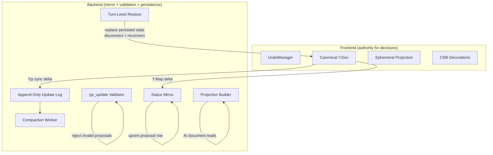
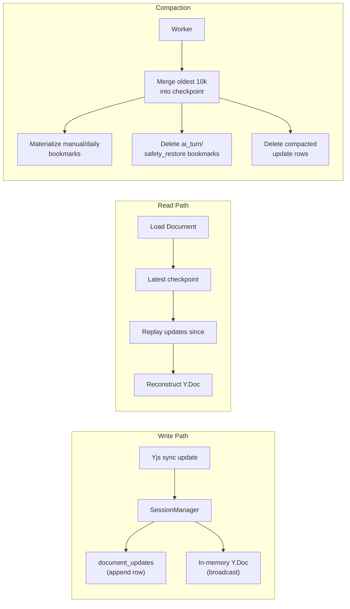

# Target Architecture

What the system looks like when v2 is complete. Use this as the verification reference -- if any component doesn't match what's described here, implementation is incomplete.

## Authority Model



| Concern | Authority | Location |
|---|---|---|
| Accept/reject decision | **Frontend** | Local Yjs transaction (`ORIGIN_ACCEPT` / `ORIGIN_REJECT`) |
| Proposal status (source of truth) | **Yjs** | `Y.Map('_proposal_status')` in canonical Y.Doc |
| Proposal status (queryable mirror) | **Backend** | `proposals.status` column, mirrored from Y.Map deltas |
| Proposal validation | **Backend** | Validates `yjs_update` at creation time; rejects `invalid` |
| Diff/hunk computation | **Frontend** | Ephemeral projection, computed on demand, never stored |
| Session undo | **Frontend** | UndoManager (in-memory, session-scoped) |
| Thread undo/reapply | **Frontend** | `ORIGIN_THREAD` Yjs transaction (local-first) |
| Turn-level restore | **Backend** | Backend-coordinated, multi-document bookmark restore |
| Persistence | **Backend** | Append-only update log + checkpoints + bookmarks |
| Compaction | **Backend** | Background worker, advisory lock, single transaction |

## Canonical Y.Doc Shape

```
Y.Doc (gc: false at runtime)
  Y.Text('content')           -- document text
  Y.Map('_proposal_status')   -- decision ledger
    key: proposalId (UUID string)
    value: "accepted" | "rejected" | "stale" | "reverted"
    missing key = pending
  Y.Array('_comments')         -- future: review comments (separate work stream, not in v2 scope)
```

## Persistence Layer



### Tables

| Table | Purpose | Replaces |
|---|---|---|
| `document_updates` | Append-only Yjs update log | `documents.yjs_state` (overwrite) |
| `document_checkpoints` | Compacted merged state | `collab_document_snapshots` (partial) |
| `document_bookmarks` | Named restore points (manual, daily, ai_turn, safety_restore) | `collab_document_snapshots` (partial) |
| `proposals` | Proposal rows with `yjs_update` + status mirror | `collab_document_edit_proposals` (restructured) |

### Columns Removed from `documents`

| Column | Reason |
|---|---|
| `yjs_state` | Replaced by update log + checkpoints |
| `ai_content` | Projection is ephemeral, computed on demand |

## Proposal Lifecycle

```
                 +--> accepted --> reverted --> accepted (thread reapply)
                 |        |            ^
  [create] --> pending ---+            |
                 |        +-- (Ctrl-Z of thread undo)
                 +--> rejected --> accepted (thread reapply)
                 |        ^
                 |        +-- (Ctrl-Z of reject) --> pending
                 +--> stale (terminal, auto-resolved by projection GC)

  [create, validation fails] --> invalid (terminal, backend-only, never enters Y.Map)
```

### Status Storage

| Status | Y.Map entry | Proposal row | Notes |
|---|---|---|---|
| `pending` | Missing key | `status = 'pending'` | Default on creation |
| `accepted` | `proposalId: 'accepted'` | `status = 'accepted'` | Mirrored |
| `rejected` | `proposalId: 'rejected'` | `status = 'rejected'` | Mirrored |
| `stale` | `proposalId: 'stale'` | `status = 'stale'` | Terminal, GC origin |
| `reverted` | `proposalId: 'reverted'` | `status = 'reverted'` | Thread undo |
| `invalid` | Never enters Y.Map | `status = 'invalid'` | Backend-only |

## Separation of Concerns

### Frontend Responsibilities

1. **Projection pipeline**: clone canonical + apply current-user pending proposals + diff + group hunks + CM6 decorations
2. **Hunk actions**: accept (apply yjs_update + set Y.Map) and reject (set Y.Map) as local Yjs transactions
3. **Session undo**: single UndoManager over Y.Text + Y.Map, `stopCapturing()` between actions, `clear()` on mode switch
4. **Thread undo/reapply**: offset-anchored text search, `ORIGIN_THREAD` transaction
5. **Projection GC**: text pre-check + empty-attribution catch, `ORIGIN_GC` (not tracked by UndoManager)
6. **Auto-apply**: owner tab receives `proposal:new`, applies with `ORIGIN_ACCEPT`, multi-tab guard via Y.Map check
7. **Re-derive triggers**: proposal events (immediate), typing pause (500ms debounce), remote canonical changes (immediate)
8. **Hunk freshness guard**: derivation sequence number, force re-derive if stale before committing
9. **`accepted_at_offset` persistence**: async REST call after accept or thread reapply transaction, monotonic version

### Backend Responsibilities

1. **Proposal creation**: validate `yjs_update` (Y.Text only, contiguous edit, `region_text_before` check), store row with `pending` status
2. **Status mirror**: observe `_proposal_status` Y.Map deltas from Yjs sync, upsert proposal row status
3. **Full reconciliation on load**: read entire Y.Map, reconcile all proposal rows (skip `invalid`/`stale` for missing-key)
4. **Bootstrap `_proposal_status` Y.Map**: ensure it exists in canonical Y.Doc on creation/load
5. **Append-only persistence**: append update rows, never overwrite
6. **Compaction**: threshold-based (20k trigger, compact oldest 10k), advisory lock, materialize manual/daily bookmarks, delete ai_turn/safety_restore bookmarks
7. **Auto-apply tab election**: track owner WebSocket presence, apply directly if 0 owner tabs
8. **`proposal:new` broadcast**: WebSocket event with `{ proposal_id, document_id, status }`
9. **`accepted_at_offset` endpoint**: persist offset with monotonic version guard
10. **Turn-level restore**: query bookmarks by `turn_id`, create safety bookmarks for ALL affected documents atomically first, then replace persisted state (new checkpoint from bookmark), disconnect all document WebSocket clients, clients reconnect and rehydrate from fresh state. Broadcast `document:restored` event so all tabs call `undoManager.clear()`.
11. **AI context projection**: compute same projection as frontend (clone + apply specified user's pending proposals) for AI document reads. `BuildProjectedState(ctx, documentID, userID)` — user-scoped, not document-global.

### What the Backend Does NOT Do

- Accept or reject proposals (no server round-trip for decisions)
- Compute or store diff hunks
- Persist projection state (`ai_content` column is gone)
- Manage undo stacks
- Own idempotency for accept/reject (no idempotency keys needed)
- Run the arbiter chain at decision time (auto-accept is frontend-driven)

## Two WebSocket Connections

| Endpoint | Protocol | Purpose |
|---|---|---|
| `GET /ws/documents/{documentId}` | Binary (Yjs sync + awareness) | Document-level CRDT sync |
| `GET /ws/projects/{projectId}` | JSON | `proposal:new` broadcast, awareness indicators |

The project WS no longer handles `proposal:accept`, `proposal:reject`, `proposal:groupAccept`, or `proposal:requestUpdate` commands. Those are replaced by local Yjs transactions.

## Cross-References

- [Architecture](../spec/architecture.md)
- [Append-Only Persistence](../spec/append-only-persistence.md)
- [Local-First Authority](../spec/local-first-authority.md)
- [Cleanup Checklist](cleanup-checklist.md)
- [Target API](target-api.md)
