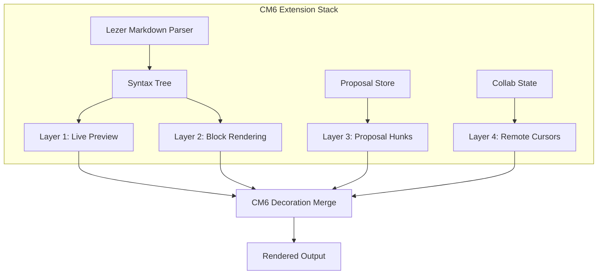

# Editor Direction

## Decision: Live Preview Done Right

The frontend-v2 editor is a **clean reimplementation** of the Obsidian-style live preview approach. Same concept as the current frontend, but rebuilt from scratch to fix decoration conflicts, content jumping, and viewport instability.

The canonical document model remains **markdown text in `Y.Text`**. No change to the collab v2 data model.

## What "Live Preview" Means

Markdown syntax is the source of truth. The editor renders formatted output **inline** using CM6 decorations, revealing raw syntax only when the cursor is nearby.

```
Cursor away:        This is bold text and italic text
Cursor on "bold":   This is **bold** text and italic text
                         ^^^^^^^^ raw syntax revealed
```

This is the Obsidian model: 95% WYSIWYG feel without the edge-case explosion of full syntax hiding.

## Current Problems (Why Rebuild)

| Problem | Root cause | Fix in v2 |
|---|---|---|
| Content jumping on cursor move | Decoration replace/show races with cursor updates | Single-pass decoration compute, sync with cursor position |
| Flickering on rapid edits | Decorations rebuilt on every transaction, including intermediate states | Batch decoration updates, debounce rapid transactions |
| Conflicting decoration layers | Live preview + proposal hunks + syntax highlighting compete | Explicit layer ordering with defined precedence |
| Viewport scroll jumps | Height changes from decoration show/hide not compensated | `requestMeasure` + scroll anchor preservation |
| Stale decorations after undo | Decoration state not properly invalidated on Y.UndoManager operations | Decorations derived purely from current doc state, never cached |

## Architecture

### Decoration Layers

Each concern gets its own `ViewPlugin` producing an independent `DecorationSet`:



### Layer 1: Live Preview Decorations

Transforms markdown syntax into visual formatting using `Decoration.mark` and `Decoration.replace`.

| Syntax | Decoration type | Behavior |
|---|---|---|
| `**bold**` | `mark` with bold class | Hides `**` when cursor is away |
| `*italic*` | `mark` with italic class | Hides `*` when cursor is away |
| `# Heading` | `mark` with heading class | Hides `#` when cursor is away |
| `[text](url)` | `mark` + `replace` | Shows styled link, hides URL when away |
| `` `code` `` | `mark` with code class | Always shows backticks (minimal hiding) |
| `---` | `replace` with `<hr>` widget | Shows horizontal rule when cursor is away |

**Cursor proximity rule**: "away" means the cursor is on a different line. Within the same line, all syntax is visible.

### Layer 2: Block Rendering

Complex blocks rendered as widgets using `Decoration.replace`:

| Block | Syntax | Widget | Interaction |
|---|---|---|---|
| Math | `$$...$$` or ` ```math ` | KaTeX rendered output | Click to edit raw LaTeX |
| Diagrams | ` ```mermaid ` | Mermaid SVG | Click to edit raw source |
| Images | `` | `` element | Click to edit URL/alt |
| Code | ` ```lang ` | Shiki-highlighted block | Always editable (no widget toggle) |

Click-to-edit pattern:

1. Block renders as read-only widget
2. Click widget -> `Decoration.replace` removed, raw markdown visible + editable
3. Click away or press Escape -> re-render as widget

### Layer 3: Proposal Hunks

See [collab-v2-integration.md](collab-v2-integration.md) for details. This layer is independent of live preview -- it adds colored highlights on top of whatever Layer 1 and 2 produce.

### Layer 4: Remote Cursors

Colored cursor markers and selection ranges for other collaborators. Lightest layer, just `Decoration.widget` for cursor markers.

## Key Design Decisions

### Single-Pass Decoration Compute

Each `ViewPlugin.update()` produces a **complete** `DecorationSet` from the current state. No incremental patching, no cached partial results. This eliminates stale decoration bugs at the cost of more computation per update.

Performance is acceptable because:
- CM6 only recomputes visible viewport + margin
- Lezer parse tree is incremental (only re-parses changed regions)
- Decoration creation is cheap (just range + spec objects)

### Scroll Anchor Preservation

When decorations change height (e.g., cursor enters a heading line, `#` appears), the viewport must not jump:

1. Before decoration update: record anchor element + offset
2. Apply decorations
3. After layout: `requestMeasure` to compute new anchor position
4. Adjust scroll to maintain visual stability

This is CM6's built-in `scrollIntoView` + `EditorView.scrollSnapshot()` mechanism, used correctly.

### Formatting Toolbar

Floating toolbar appears on text selection (or fixed toolbar above editor, configurable):

| Button | Action | Shortcut |
|---|---|---|
| Bold | Wrap/unwrap `**` | `Cmd+B` |
| Italic | Wrap/unwrap `*` | `Cmd+I` |
| Code | Wrap/unwrap `` ` `` | `Cmd+E` |
| Link | Insert `[](url)` template | `Cmd+K` |
| H1-H3 | Toggle heading prefix | `Cmd+1/2/3` |
| List | Toggle `- ` prefix | `Cmd+Shift+L` |
| Quote | Toggle `> ` prefix | `Cmd+Shift+Q` |

All formatting operations are text-level: insert/remove markdown syntax characters. The decoration layer reacts automatically.

### Keyboard Shortcuts

Writer-first shortcuts, same philosophy as current frontend:

- `Cmd+[` / `Cmd+]` are **not** bound to indentation (reserved for browser navigation)
- `Tab` / `Shift+Tab` for indentation in list contexts
- `Enter` in lists: continue list, double-enter to exit
- `Cmd+Z` / `Cmd+Shift+Z`: standard undo/redo (character-level, CM6 built-in)

## Storybook Testing Strategy

The editor is the core Storybook focus. Stories exercise:

| Story | What it tests |
|---|---|
| `BasicEditing` | Type text, formatting toolbar, keyboard shortcuts |
| `LivePreview` | Cursor proximity show/hide, no jumping, no flickering |
| `DecorationStability` | Rapid edits, undo/redo cycles, decoration consistency |
| `MockCollab` | Simulated proposal hunks arrive, accept/reject, hunk navigation |
| `MockStreaming` | Simulated server edits arriving (like AI writing), cursor stability |
| `BlockRendering` | Math, mermaid, images: render + click-to-edit cycle |
| `LargeDocument` | 10K+ line document, scroll performance, viewport-only rendering |

Mock connections simulate collab scenarios without requiring a real backend.

## What This Does NOT Change

- Canonical model: still markdown in `Y.Text`
- Collab protocol: still Yjs WebSocket sync
- Proposal data model: still collab v2 hunks
- Editor choice: still CodeMirror 6

## Cross-References

- [Collab v2 Editor Strategy](../../collab-data-model-v2/future/editor-strategy.md) -- why CM6, why not ProseMirror
- [Collab v2 Integration](collab-v2-integration.md) -- proposal decorations in both modes
- [Layout Architecture](layout-architecture.md) -- where the editor sits in each mode
