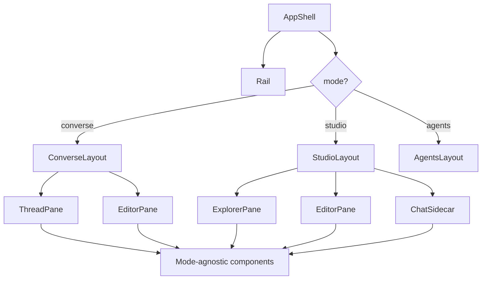

# Layout Architecture

## Principle: Mode = Layout, Not Logic

Workspace modes (`Converse`, `Studio`) are a **layout concern only**. Components are mode-agnostic. The layout shell selects which panels are visible and how they are sized -- nothing else changes between modes.

## Mode Definitions

### Converse

Chat-primary, editor-secondary.

```
┌─────────────────────────────────────────────────┐
│  Rail │  Thread (primary)    │  Editor (secondary)│
│       │                      │  (collapsible)     │
│  [A]  │  ┌──────────────┐   │  ┌──────────────┐  │
│  [C]  │  │  messages     │   │  │  document     │  │
│  [S]  │  │              │   │  │  content      │  │
│       │  │              │   │  │              │  │
│       │  ├──────────────┤   │  │              │  │
│       │  │  composer     │   │  └──────────────┘  │
│       │  └──────────────┘   │                     │
└─────────────────────────────────────────────────┘
```

- Thread pane: ~55% width, always visible
- Editor pane: ~45% width, collapsible to zero
- Resizable divider between panes
- Editor collapse/expand toggle in the divider or toolbar

### Studio

Editor-primary, chat-secondary.

```
┌──────────────────────────────────────────────────┐
│ Rail │ Explorer │  Editor (primary)   │  Chat     │
│      │          │  (tabbed)           │  (sidecar)│
│ [A]  │ folders/ │  ┌──────────────┐  │  ┌──────┐ │
│ [C]  │ files    │  │  tab bar     │  │  │ msgs │ │
│ [S]  │          │  ├──────────────┤  │  │      │ │
│      │          │  │  document    │  │  │      │ │
│      │          │  │  content     │  │  ├──────┤ │
│      │          │  │             │  │  │ comp │ │
│      │          │  └──────────────┘  │  └──────┘ │
└──────────────────────────────────────────────────┘
```

- File explorer: ~200px fixed, collapsible
- Editor pane: ~60% of remaining width, always visible
- Chat sidecar: ~40% of remaining width, collapsible
- Tab bar above editor for open documents

## Mode Switching

- Rail icons switch modes instantly
- **All state preserved**: active thread, open documents, scroll positions, editor content
- Mode switch is a CSS/layout transition, not a data operation
- URL reflects mode: `/projects/{id}/converse/...` vs `/projects/{id}/studio/...`

## State Scoping

| State | Scope | Survives mode switch |
|---|---|---|
| Active thread | Session | Yes |
| Open documents | Session | Yes |
| Editor content (Y.Doc) | Document | Yes |
| Scroll positions | Per-pane | Yes (restored on re-show) |
| Panel sizes | Per-mode | Yes (each mode remembers its own sizes) |
| File explorer state | Session | Yes |

## Panel Sizing

Use `react-resizable-panels` for all resizable layouts. Each mode stores its own panel size configuration independently.

### Persistence

Panel sizes persist to localStorage keyed by mode:

```
meridian:panels:converse -> { thread: 55, editor: 45 }
meridian:panels:studio -> { explorer: 200, editor: 60, chat: 40 }
```

### Collapse Behavior

- Collapsed panels animate to zero width
- Collapse state persists per-mode
- Double-click divider resets to default sizes

## Rail

The rail is the leftmost column, shared across all modes.

| Icon | Mode | Shortcut |
|---|---|---|
| Agents | Agents view | `Cmd+1` |
| Converse | Converse mode | `Cmd+2` |
| Studio | Studio mode | `Cmd+3` |

Rail width: 48px fixed. Icons are 24px with tooltips on hover.

## Responsive Behavior

Desktop-only for v2 launch. Mobile layout (full-screen tabs) deferred to later.

## Component Boundaries



Only `AppShell`, `ConverseLayout`, `StudioLayout`, and `AgentsLayout` are mode-aware. Everything below them is reusable.

## Cross-References

- [Workspace Modes README](../README.md) -- mode rationale and writer profiles
- [Studio Chrome](studio-chrome.md) -- tab bar, explorer details
- [Collab v2 Integration](collab-v2-integration.md) -- how proposal review works in both modes
