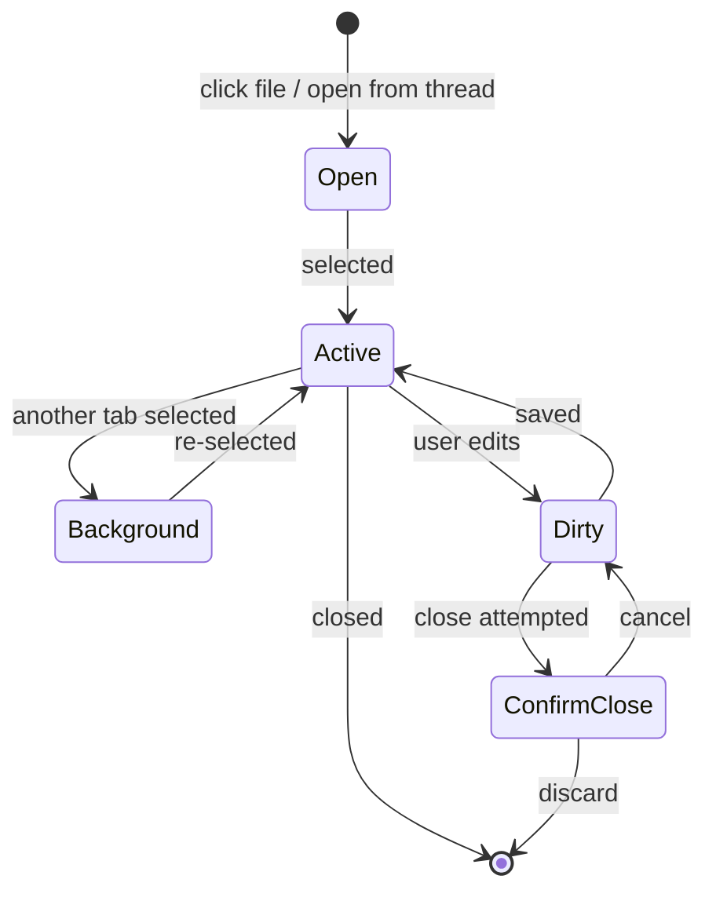

# Studio Chrome

## Overview

Studio mode's primary navigation is a file explorer + tabbed editor. This doc specifies the tab bar, explorer, and their interactions.

## File Explorer

Left sidebar, primary navigation in Studio mode.

### Structure

```
Explorer (200px default, collapsible)
┌──────────────────┐
│ ▾ World Building │
│   characters.md  │
│   locations.md   │
│ ▾ Volume 1      │
│   ▾ Arc 1       │
│     chapter-1.md │
│     chapter-2.md │
│   ▾ Arc 2       │
│     chapter-3.md │
│ ▸ Notes          │
└──────────────────┘
```

- Tree structure mirrors the project's document tree
- Folders expand/collapse with persistent state
- Single-click opens file in editor (reuses existing tab if open)
- Active file highlighted in tree
- Context menu: rename, move, delete, new file, new folder

### Data Source

Explorer reads from the same tree store (`useTreeStore`) as the current frontend. No new data model needed.

### Drag and Drop

Deferred to later. Initial implementation is click-only navigation.

## Tab Bar

Horizontal tab strip above the editor pane.

### Layout

```
┌──────────────────────────────────────────────────┐
│ [chapter-1.md ×] [chapter-2.md ×] [notes.md ●×] │
├──────────────────────────────────────────────────┤
│                                                  │
│  Editor content                                  │
│                                                  │
└──────────────────────────────────────────────────┘
```

- Each tab shows filename (not full path)
- Hover tooltip shows full path
- `×` close button on each tab
- `●` dot indicator for unsaved changes
- Active tab visually distinct (background color, bottom border)

### Tab Lifecycle



### Tab Behavior

| Action | Result |
|---|---|
| Click file in explorer | Open tab (or focus existing) |
| Click tab | Switch to that document |
| Click × | Close tab (confirm if dirty) |
| Middle-click tab | Close tab |
| Cmd+W | Close active tab |
| Cmd+Shift+T | Reopen last closed tab |
| Drag tab | Reorder tabs (deferred) |

### Tab Overflow

When tabs exceed available width:

- Tabs compress (shorter labels with ellipsis)
- If still overflowing: horizontal scroll with left/right arrows
- Tab dropdown menu (chevron at right edge) lists all open tabs

### Tab State

Tabs are session state, persisted to localStorage:

```typescript
interface TabState {
  documentId: string
  path: string        // for display
  scrollPosition: number
  cursorPosition: number
  isDirty: boolean
}
```

Tabs survive mode switches (Converse <-> Studio) and page refreshes.

## Keyboard Navigation

| Shortcut | Action |
|---|---|
| `Cmd+P` | Quick file open (fuzzy search) |
| `Cmd+\` | Toggle explorer |
| `Cmd+1-9` | Switch to tab by position |
| `Ctrl+Tab` | Next tab |
| `Ctrl+Shift+Tab` | Previous tab |

## Integration with Converse Mode

When switching from Studio to Converse:

- Tabs remain in memory but are not visible
- The editor pane in Converse shows the **active tab's document**
- Switching back to Studio restores all tabs and positions

When a thread references a document (e.g., "Review" action on a proposal):

- In Studio: opens/focuses the tab, scrolls to hunk
- In Converse: opens document in the editor pane, auto-expands if collapsed

## Cross-References

- [Layout Architecture](layout-architecture.md) -- panel sizing, explorer width
- [Workspace Modes README](../README.md) -- why Studio exists as a separate mode
