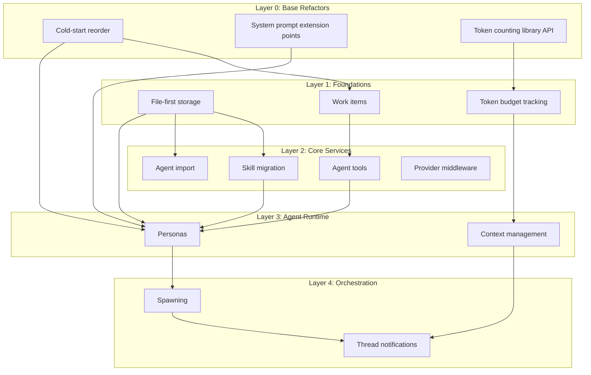

# v1 Backend Implementation

Complete backend feature set for Meridian v1 launch. This work item consolidates all remaining backend work into a single dependency-ordered plan.

## Status: Planning (post-review)

## Review Decisions (accepted)

- **Defer** background execution, thread notifications, provider middleware to post-v1
- **Simplify** SSRF to allowlist-only, skill migration to file-only, token estimation to tiktoken-only
- **Expand** R1 to include turn_creation.go pipeline decomposition
- **Add** error code registry, graceful shutdown, spawn timeout
- **Fix** path canonicalization, ephemeral work item cap, PromptContext decoupling

See [plan/review-synthesis.md](../plan/review-synthesis.md) for full reviewer findings.

## What's Already Done

| Feature | Status | Notes |
|---------|--------|-------|
| Auth (A2) | ✅ Done | Supabase Auth, JWT, route protection |
| Billing (A1) | ✅ Done | Credit ledger, Stripe, settlement, middleware |
| Stream type refactor | ✅ Done | meridian-llm-go library types |
| Backend structural refactor | ✅ Done | Clean arch, proposals, metadata, auth in service layer |
| Provider middleware design | ✅ Designed | Generic middleware + usage metering (not implemented) |

## What Needs to Be Built

### Layer 0: Base Refactors (prerequisites for everything)
Changes to existing code that unblock all feature work.

- [base-refactors.md](base-refactors.md) — Cold-start reorder, system prompt extension points, token tracking library API

### Layer 1: Foundation Features (parallel, no cross-deps)
- [file-first-storage.md](file-first-storage.md) — A3: `.agents/` namespace, frontmatter parser, dual-read resolver
- [work-items.md](work-items.md) — A4: Work item CRUD, ephemeral auto-create, artifact folders
- [token-budget.md](token-budget.md) — Token estimation library, dry-run API, context budget tracking

### Layer 2: Depends on Layer 1
- [skill-migration.md](skill-migration.md) — Dual-read, shadow refresh, backfill (needs A3)
- [agent-import.md](agent-import.md) — Git import with SSRF protection (needs A3)
- [agent-tools.md](agent-tools.md) — A5: Write routing, namespace rewrite, context vars (needs A4)
- [provider-middleware.md](provider-middleware.md) — Generic middleware + usage metering in meridian-llm-go

### Layer 3: Depends on Layer 2
- [personas.md](personas.md) — Persona catalog, resolution, model/tool/skill override (needs A3 + A5)
- [context-management.md](context-management.md) — Autocollapse, autocompact, bookmark pattern (needs token budget)

### Layer 4: Depends on Layer 3
- [spawning.md](spawning.md) — Foreground + background spawning, cancellation cascade (needs personas)
- [thread-notifications.md](thread-notifications.md) — ThreadNotifier, internal turns, WebSocket events (needs context mgmt)

## Dependency Graph

## Cross-references

All designs originate from `.meridian/work/v1-launch/features/` — copied here with implementation-specific notes added.
