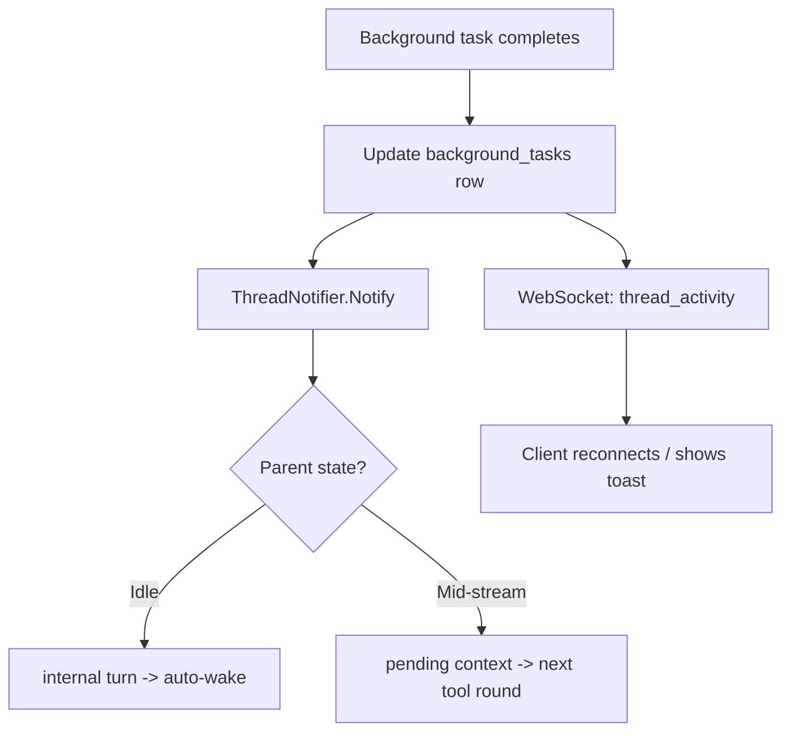

# Background Execution

Async tool primitive: any tool that supports background mode can return immediately and deliver results later. Currently `spawn_agent` and `bash`.

## Key Decision: Tool Executor Owns Background

Background execution is a capability of the tool executor, not individual tools. A tool declares it supports background mode; the executor handles the rest.

```go
// Extends existing ToolMetadata (currently: Name, Description, Guideline)
type ToolMetadata struct {
    Name               string
    Description        string
    Guideline          string
    InputSchema        json.RawMessage
    SupportsBackground bool
}
```

**Integration note**: Current `ToolExecutor.Execute` is synchronous -- returns one result. `ExecuteParallel` waits for all tools. Background mode requires the executor to return a partial result (task handle) immediately while real work continues in a goroutine. This is a prerequisite phase (Phase 2.5 in the migration plan).

## Background Flow

When LLM passes `"background": true` on a tool call:

1. Executor checks `tool.Metadata().SupportsBackground` -- if false, ignores flag, runs foreground
2. Creates a durable `background_tasks` row (status=running)
3. Launches tool in a goroutine
4. Returns `{"task_id": "bg_abc123", "status": "running"}` immediately as tool_result
5. When tool completes, updates DB row with result

```text
// Background spawn
{"agent": "continuity-checker", "prompt": "Check chapters 40-55", "background": true}
-> returns: {"task_id": "bg_abc123", "status": "running", "child_thread_id": "uuid"}

// Background bash
{"command": "long-running-script.sh", "background": true}
-> returns: {"task_id": "bg_def456", "status": "running"}
```

## Durable Task Tracker

Persisted in DB, not in memory. Survives server restarts and spans turns.

```sql
CREATE TABLE ${TABLE_PREFIX}background_tasks (
    id UUID PRIMARY KEY DEFAULT gen_random_uuid(),
    thread_id UUID NOT NULL REFERENCES ${TABLE_PREFIX}threads(id) ON DELETE CASCADE,
    parent_turn_id UUID NOT NULL REFERENCES ${TABLE_PREFIX}turns(id) ON DELETE CASCADE,
    tool_name TEXT NOT NULL,
    tool_use_id TEXT NOT NULL,
    status TEXT NOT NULL DEFAULT 'running',
    result JSONB,
    child_thread_id UUID REFERENCES ${TABLE_PREFIX}threads(id) ON DELETE SET NULL,
    created_at TIMESTAMPTZ NOT NULL DEFAULT NOW(),
    completed_at TIMESTAMPTZ,
    CONSTRAINT ${TABLE_PREFIX}background_tasks_status_check
        CHECK (status IN ('running', 'succeeded', 'failed', 'cancelled'))
);

CREATE INDEX idx_${TABLE_PREFIX}background_tasks_thread
    ON ${TABLE_PREFIX}background_tasks(thread_id, status)
    WHERE status = 'running';
```

The `check_background` tool queries this table.

## Completion

When a background task completes, two things happen:

1. **Backend**: `ThreadNotifier.Notify()` delivers the result to the parent thread (see [thread-notifications](thread-notifications.md)). If idle, creates `internal` turn and triggers assistant response. If mid-stream, queues for next tool round.

2. **Client**: WebSocket event `thread_activity` tells connected clients to reconnect SSE on the affected thread.



For **foreground spawns**: the tool blocks on a channel. Child completion sends result on the channel, tool returns `tool_result` normally. No ThreadNotifier involved -- it's just a slow tool call.

## Admission Control

- **Max concurrent background tasks per thread**: 5 (configurable)
- Enforced at executor level, applies to all backgroundable tools
- Spawn depth/concurrent limits enforced separately by SpawnService

Limit checks and row creation happen in the same transaction using `SELECT ... FOR UPDATE` on the thread row. Prevents TOCTOU when parallel tool calls both check the count simultaneously.

## Server Restart Recovery

On startup, background task service scans for `status = 'running'`:

- **spawn_agent tasks**: Check child thread status. If completed while server was down, mark succeeded. If still running, re-attach watcher.
- **bash tasks**: Mark as failed (process died). LLM can retry.
