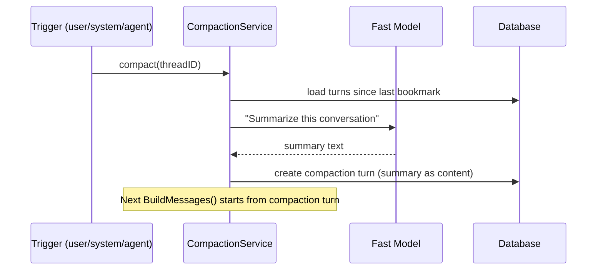

# Context Management

Two context management operations, both using the same **bookmark pattern**: a marker turn in the history that changes how MessageBuilder renders turns before it. No mutation of existing blocks.

**System-driven only for v1.** The LLM does not get `compact` or `collapse` as callable tools. The backend monitors token count and acts directly. The LLM has poor judgment about its own token usage — it might refuse to compact and then error out at the limit.

## Unified Bookmark Pattern

Both operations are marker turns in the turn chain. MessageBuilder respects them:

```text
[1] [2] ... [20] [COLLAPSE] [21] ... [40] [COMPACT: summary of 1-40] [41] [42] [current]
                  |                        |
                  tool_results before      turns before here
                  here → use               → not sent, use summary
                  collapsed_content
```

| Operation | Bookmark type | What it changes | Cache cost |
|-----------|--------------|-----------------|------------|
| **Collapse** | Collapse marker turn | Tool results before marker use `collapsed_content` | One miss when placed, stable after |
| **Compact** | Compaction turn with summary | Turns before marker not sent, summary used instead | One miss when placed, stable after |

Both are additive (no block mutation), reversible (remove marker), and cache-friendly (one miss, then stable).

## Collapse

Replaces verbose tool results with pre-computed summaries for turns before the collapse marker.

### `collapsed_content` on Turn Blocks

Pre-computed at tool execution time — the tool already knows its name, input, and result shape:

```sql
ALTER TABLE ${TABLE_PREFIX}turn_blocks
    ADD COLUMN collapsed_content TEXT;
```

| Tool | `collapsed_content` |
|------|---------------------|
| `str_replace_based_edit_tool` (read) | `"[Read chapter-42.md: 5000 chars, worldbuilding section]"` |
| `str_replace_based_edit_tool` (edit) | `"[Edited chapter-42.md: replaced 'the dark forest' with 'the ancient woods']"` |
| `doc_search` | `"[Searched 'magic system': 3 results in worldbuilding/]"` |
| `skill_invoke` | `"[Invoked story-bible: character lookup for Aria]"` |
| `spawn_agent` | Keep as-is (already compact) |

No `collapsed` flag on the block. The collapse marker turn determines what's collapsed, not per-block mutation.

### Triggers

| Trigger | How |
|---------|-----|
| `/collapse` | User command — places collapse marker at current position |
| `autocollapse` | TokenMonitor fires at threshold (e.g., 60% of model context) — places marker automatically |

### Reversibility

To uncollapse: remove (soft-delete) the collapse marker turn. Next turn, MessageBuilder sends full tool results again. Full content was never modified.

## Compact

Summarizes conversation history before the compaction marker. Heavier than collapse — requires LLM summarization.

### Compaction Flow



### Triggers

| Trigger | How |
|---------|-----|
| `/compact` | User command |
| `autocompact` | TokenMonitor fires at higher threshold (e.g., 80% of model context) — after autocollapse is insufficient |

### Multiple Compaction Segments

```text
[1-20] [COMPACT_1: summary of 1-20] [21-50] [COMPACT_2: summary of 21-50] [51] [52] [current]
                                                |
                                                +-- MessageBuilder starts here
                                                    sends: [summary_2] [51] [52] [current]
```

Each segment is independently queryable via `query_history` tool.

### Integration with Personas

Compaction summary notes which persona was active during compacted turns.

### Integration with Spawning

Spawn results are already compact (4KB summary). Compaction preserves them as-is rather than re-summarizing.

## Escalation Order

When approaching context limits, escalate through lighter operations first:

```text
1. autocollapse — place collapse marker, shrink tool results (cheap, instant)
2. autocompact — summarize + bookmark (requires LLM call, slower)
3. notify user — "context is very long, consider starting a new thread"
```

## Querying Pre-Bookmark History

`query_history` tool lets the agent search/read turns from before any bookmark:

```json
{"query": "what did we decide about the magic system?"}
```

Mirrors Meridian CLI's `meridian session search` and `meridian session log -c 1`.

## MessageBuilder

MessageBuilder respects two things:

1. **Compaction turns**: Skip everything before the latest compaction bookmark. Use its summary.
2. **Collapse markers**: For tool_result blocks in turns before the collapse marker, use `collapsed_content` if available.

No new interface needed. The marker turns are already in the turn chain. MessageBuilder reads them during iteration.

## Why Not Rolling Collapse

Rolling collapse (automatically collapse tool results N turns back) invalidates the cache on every turn because the collapse window moves forward, changing message content each time. Bookmark-style collapses once, then the prefix is stable.

## Implementation Notes

- Compaction uses cheapest/fastest model (haiku-class) for summarization
- `collapsed_content` pre-computed at tool execution time — zero cost to collapse later
- `query_history` reuses existing `TurnNavigator.GetPaginatedTurns()`
- Autocompact/autocollapse thresholds configurable per-model (different context windows)
- ThreadNotifier "approaching context limit" is the trigger for both auto operations
