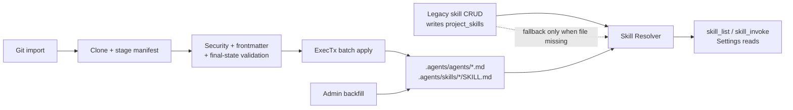

> A3 foundation design

# File-First Storage Model

Core storage model for agents and skills: the `.agents/` document tree, frontmatter schema, validation rules, and domain interfaces.

## Terminology: Files and Documents

"File" refers to a document row in the Postgres-backed document tree, not a filesystem entry. `.agents/` consists of folder and document rows accessed through `DocumentRepository` and `FolderRepository`. "Look for `.agents/skills/<slug>/SKILL.md`" means `documentRepo.GetByPath(ctx, projectID, ".agents/skills/<slug>/SKILL.md")`. "Create the file" means creating a document row via `documentRepo.Create()`.

## Problem

Current skill storage uses a split model:

- `project_skills` stores skill content and Meridian-specific metadata in Postgres.
- `/.meridian/skills/<name>/references/` stores reference files in the document tree.

That split causes:

- two sources of truth that can diverge
- import/export translation logic
- sync bookkeeping (`sync_state`, `is_dirty`, template linkage)
- poor portability to external harnesses that already understand `.agents/`

## Decision

The target storage model is `.agents/` in the project document tree.

Phase 1 keeps a compatibility bridge instead of attempting a destructive cutover:

1. Bootstrap `.agents/` and `.meridian/` transactionally when a project is created.
2. Backfill legacy skills into `.agents/skills/`.
3. Read from `.agents/` first at runtime.
4. Fall back to `project_skills` only when the file copy does not exist.
5. Keep legacy skill CRUD entering through `project_skills` until the Settings UI ships.
6. Regenerate the matching `.agents` shadow file after successful legacy skill mutations.
7. Drop `project_skills` and legacy reference paths in Round 2+.

## Storage Layout

`.agents/` is a system folder in the document tree:

- hidden from the writer-facing explorer
- writable by agents, but review-gated because `.agents/` bootstraps with `autoapply=false`
- readable by Settings, runtime resolvers, and import/export code

```text
.agents/
├── agents/
│   ├── writing-coach.md
│   └── continuity-checker.md
└── skills/
    ├── story-bible/
    │   ├── SKILL.md
    │   └── resources/
    │       └── example-bible.md
    └── prose-analysis/
        ├── SKILL.md
        └── resources/
```

Path rules:

- skill folder names are normalized slugs
- skill instructions must live at `.agents/skills/<slug>/SKILL.md`
- skill resource files must live under `.agents/skills/<slug>/resources/`
- personas must live at `.agents/agents/<slug>.md`

## Phase 1 Architecture



Read/write rules in Phase 1:

| Concern | Phase 1 behavior |
|---|---|
| Runtime skill reads | File first, DB fallback |
| Runtime agent reads | Files only |
| Legacy skill CRUD API | Writes DB, then refreshes the matching file shadow |
| Git import | Writes `.agents/` only |
| Backfill | Writes `.agents/` only |
| Agent-authored edits to `.agents/` | Review-gated by `.agents/ autoapply=false` |
| Table removal | Deferred to Round 2+ |

## Frontmatter Schema

Phase 1 uses a strict minimum schema for files Meridian consumes directly. The schema is intentionally smaller than the current DB metadata model so portable bundles stay simple.

### SKILL.md

Required fields:

- `name` string
- `description` string

Optional fields:

- `enabled` boolean, default `true`
- `position` integer, default unset
- `version` string, optional opaque version label
- `user_invocable` boolean, default `true`
- `model_invocable` boolean, default `true`

Example:

```md
---
name: story-bible
description: Shared canon lookup and continuity rules
enabled: true
position: 10
version: "1.0.0"
user_invocable: true
model_invocable: false
---

# Instructions
...
```

### Persona `.md`

Required fields:

- `name` string
- `description` string
- `model` string

Optional fields:

- `skills` array of strings, default empty list
- `enabled` boolean, default `true`
- `temperature` number, optional
- `max_tokens` integer, optional

Example:

```md
---
name: writing-coach
description: Developmental editor for long-form fiction
model: gpt-5.4
skills:
  - story-bible
  - prose-analysis
enabled: true
temperature: 0.3
max_tokens: 4000
---

You are a writing coach...
```

Invocation policy fields are intentionally not added to agent profile frontmatter in Phase 1. They are only meaningful for skill discovery and execution surfaces (`/skill`, `skill_list`, `skill_invoke`, and system-prompt skill injection). Adding them to agent files now would create metadata with no enforcement point. If external bundles include similarly named agent fields, they remain unknown fields and are ignored.

### Invocation policy semantics

File-backed skills and DB-backed skills must normalize to the same runtime policy model:

- `user_invocable` controls whether a user-facing slash command or Settings action may list or manually invoke the skill
- `model_invocable` controls whether the model may see the skill in prompt injection, `skill_list`, or execute it via `skill_invoke`
- absent frontmatter fields default to `true` so imported files preserve current DB defaults
- legacy DB metadata maps as `userInvocable -> user_invocable` and `disableModelInvocation -> model_invocable = !disableModelInvocation`

Enforcement matrix:

| Surface | Required policy |
|---|---|
| `/skill` listing | `user_invocable = true` |
| `/skill <name>` execution | `user_invocable = true` |
| `skill_list` tool | `model_invocable = true` for active `skills[]`; invalid file-backed slugs still surface in `invalid_entries[]` |
| `skill_invoke` tool | `model_invocable = true` unless the call is explicitly a user-triggered slash invocation |
| System prompt skill injection | `model_invocable = true` |

The resolver remains the source of truth for raw skill records. UI commands, prompt builders, and tools must all read from the same resolved catalog and then apply the appropriate policy filter instead of querying file state and DB state independently.

## Frontmatter Validation Rules

### Shared rules

A file is invalid when any of the following is true:

- missing YAML frontmatter at the top of the file
- YAML syntax does not parse
- required fields are missing
- field types are wrong
- file body is empty after frontmatter
- path does not match the expected structure
- normalized `name` does not match the file path slug

Unknown fields are allowed in Phase 1 but ignored by runtime. They do not fail validation. This keeps import compatible with external tool bundles that carry extra metadata Meridian does not yet use.

### Skill-specific rules

- `name` must normalize to a slug matching the folder name
- `description` must be non-empty
- `position`, when present, must be `>= 0`
- `version`, when present, must be non-empty
- `user_invocable`, when present, must be a boolean
- `model_invocable`, when present, must be a boolean
- `resources/` may contain only regular text files under the size limit

### Agent-specific rules

- `name` must normalize to a slug matching the file basename
- `description` must be non-empty
- `model` must be non-empty
- `skills`, when present, must be a list of normalized skill names
- `temperature`, when present, must be within the model layer's allowed numeric range
- `max_tokens`, when present, must be `> 0`

### Invalid frontmatter behavior

Behavior differs by entry point:

- git import: reject the entire import atomically with `422 Unprocessable Entity`; do not write partial files
- backfill: stop the run and return a structured error summary; do not mark the project complete
- catalog listing: exclude invalid files from the active `agents` or `skills` arrays, but include them in `invalid_entries`
- explicit skill resolve by name: if a matching file exists but is invalid, return validation error and do not silently fall back to DB

That last rule matters. Once a file exists in `.agents/`, it is the authoritative Phase 1 source for that slug. Falling back to the DB when the file is malformed would hide corruption and make debugging impossible.

## Name Normalization

Backfill and import both normalize names for paths:

- lowercase
- trim surrounding whitespace
- replace spaces and underscores with `-`
- strip characters outside `[a-z0-9-]`
- collapse repeated `-`
- trim leading and trailing `-`

Example mappings:

- `Story Bible` -> `story-bible`
- `WritingCoach` -> `writingcoach`
- ` prose_analysis ` -> `prose-analysis`

The normalized slug is used for folder names and file basenames. The frontmatter `name` remains the logical identifier, but it must normalize back to the same slug.

## Settings and Explorer Views

Two views exist over the same storage:

1. Explorer hides `.agents/` entirely.
2. Settings reads `.agents/` and renders agents and skills as structured records.

Phase 1 Settings expectations:

- list agents from `.agents/agents/*.md`
- list skills from merged dual-read catalog
- surface invalid file entries with path + validation error
- support git import entry point

Legacy skill mutation UI can continue using existing DB-backed routes until the file-native settings write flow lands.

Imported file-only agents and skills are read-only in Phase 1 unless changed through file-native system-folder writes. They are not materialized into `project_skills`.

## Domain Interfaces

Phase 1 needs file-first services under a new `agents` domain package instead of overloading the legacy `skill` package with git import and file parsing responsibilities.

```go
package agents

import "context"

type SkillResolver interface {
    ListRuntimeSkills(ctx context.Context, projectID string) ([]RuntimeSkill, []ValidationIssue, error)
    ResolveSkill(ctx context.Context, projectID, skillName string) (*RuntimeSkill, error)
}

// Renamed to PersonaCatalog in personas.md
type PersonaCatalog interface {
    ListPersonas(ctx context.Context, userID, projectID string) ([]Persona, []ValidationIssue, error)
}

type AgentImportService interface {
    ImportGit(ctx context.Context, req ImportGitRequest) (*ImportResult, error)
}

type BackfillService interface {
    BackfillProject(ctx context.Context, projectID string) (*BackfillResult, error)
}
```

`ProjectSkillService` remains in place for legacy CRUD through Phase 1. `skill_list`, `skill_invoke`, slash-skill resolution, and prompt injection should move to `SkillResolver` so the LLM runtime and user-facing UI read the same merged file-first catalog the Settings UI sees.

## Backend Changes

Phase 1 backend work:

- keep `.agents/` as a first-class namespace in `NamespaceService`
- hide `.agents/` from writer-facing explorer responses
- add file-first agent and skill catalog services
- switch runtime skill resolution to the new file-first `SkillResolver`
- enforce invocation policy centrally for `skill_list`, `skill_invoke`, `/skill`, and prompt injection
- keep legacy skill CRUD routes for Round 0 compatibility, but refresh the file shadow after each successful mutation
- add git import service and HTTP endpoint
- add admin backfill endpoint
- surface invalid file entries in catalog responses

## API Contracts

### List agents

`GET /api/projects/{projectId}/agents`

Purpose: Settings UI lists personas from `.agents/agents/*.md`

Response `200`:

```json
{
  "agents": [
    {
      "name": "writing-coach",
      "slug": "writing-coach",
      "path": ".agents/agents/writing-coach.md",
      "description": "Developmental editor for long-form fiction",
      "model": "gpt-5.4",
      "skills": ["story-bible"],
      "enabled": true,
      "temperature": 0.3,
      "max_tokens": 4000
    }
  ],
  "invalid_entries": [
    {
      "path": ".agents/agents/broken.md",
      "code": "invalid_frontmatter",
      "message": "missing required field: model"
    }
  ],
  "count": 1
}
```

Errors: `401` unauthenticated, `403` project access denied, `404` project not found.

### Internal runtime skill resolution

Internal service contract, not a public HTTP route.

Used by: `skill_list`, `skill_invoke`, prompt/tool builders that need available skills.

Behavior:

- list returns merged file-first catalog plus validation issues
- resolve returns file version when present, DB fallback only when absent
- invalid file-backed slugs suppress DB fallback for both list and resolve
- tools and prompt builders must filter on invocation policy fields from the resolved catalog, not re-query legacy metadata
- `skill_list` returns model-invocable valid skills in `skills` plus file-backed validation problems in `invalid_entries` so corrupted files are visible instead of masked

```go
package agents

import "context"

type RuntimeSkill struct {
    Name           string
    Slug           string
    Description    string
    Content        string
    Enabled        bool
    UserInvocable  bool
    ModelInvocable bool
    Position       *int
    Version        *string
    Source         string
    SourcePath     string
}

type SkillResolver interface {
    ListRuntimeSkills(ctx context.Context, projectID string) ([]RuntimeSkill, []ValidationIssue, error)
    ResolveSkill(ctx context.Context, projectID, skillName string) (*RuntimeSkill, error)
}
```

### Legacy routes (Phase 1 only)

Existing skill CRUD remains available and DB-backed:

- `POST /api/projects/{projectId}/skills`
- `GET /api/projects/{projectId}/skills`
- `GET /api/projects/{projectId}/skills/{skillId}`
- `PUT /api/projects/{projectId}/skills/{skillId}`
- `PUT /api/projects/{projectId}/skills/reorder`
- `DELETE /api/projects/{projectId}/skills/{skillId}`

These are the compatibility write path until Round 2+, not the file-native target state.
