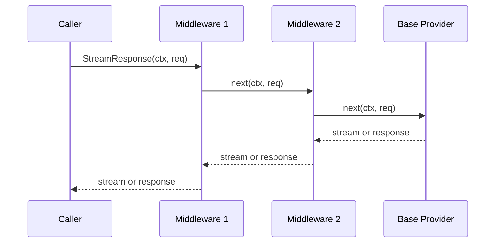
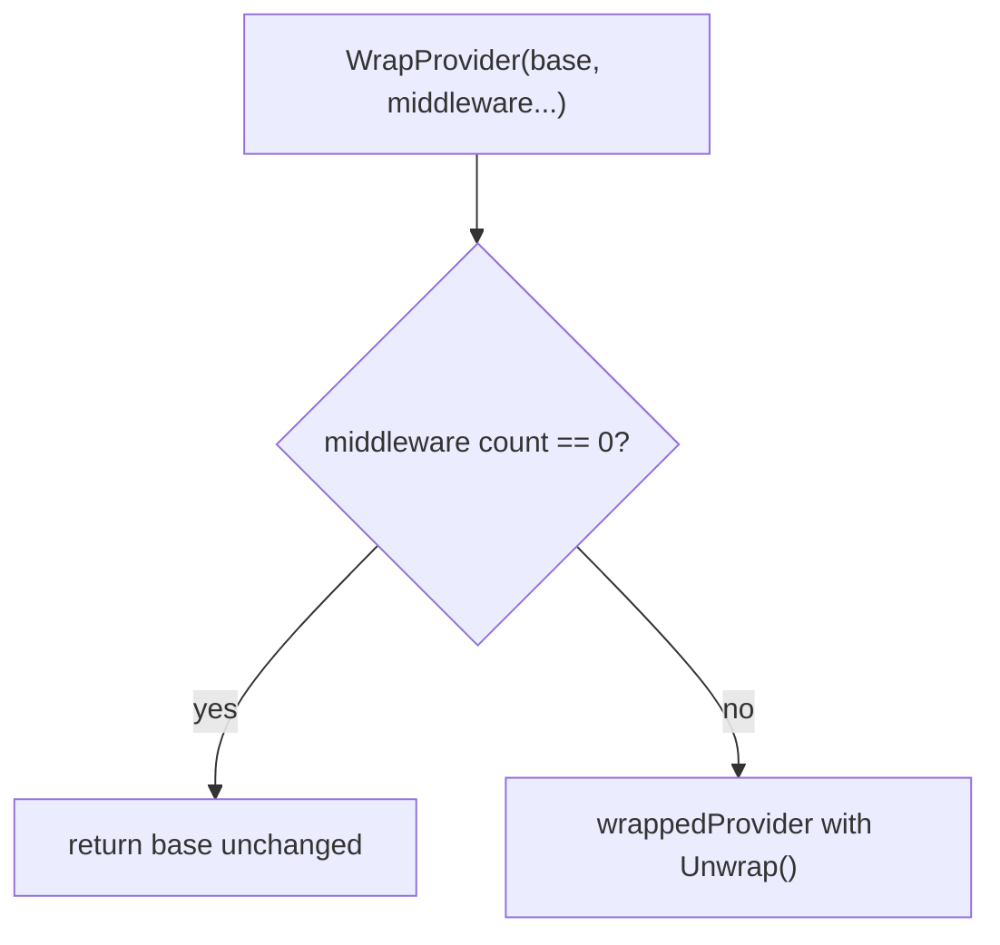

# Provider Middleware Design

## Goal

Add a generic middleware layer to `meridian-llm-go` that wraps any `Provider` without changing the `Provider` interface. Usage metering is the first built-in middleware, not a second generic hook system.

## Why This Exists

Consumers need cross-cutting hooks around provider calls that can:

- deny before provider start
- observe and report usage after completion
- modify requests safely
- short-circuit with cached responses
- preserve current optional capability type assertions

This follows the same broad shape as Vercel AI SDK's `wrapLanguageModel`: one generic wrapper contract, many concrete middleware implementations.

## Non-Goals

- changing `Provider`
- adding a parallel callback bus
- adding registry-only hooks as the primary extension point
- shipping every possible middleware as library code in v1

## Current Constraints

- `Provider` already exposes both `GenerateResponse(...)` and `StreamResponse(...)`
- `GenerateResponse` and final `StreamMetadata` already expose model, token counts, stop reason, and provider-native metadata
- current Meridian consumers type-assert optional capabilities for cancellation and generation stats, so wrapped providers must remain substitutable
- Meridian reuses one provider instance across the initial call and every tool continuation, so wrapping must happen once and survive the whole loop

## Core API

```go
package llmprovider

import "context"

type StreamFunc func(ctx context.Context, req *GenerateRequest) (<-chan StreamEvent, error)

type GenerateFunc func(ctx context.Context, req *GenerateRequest) (*GenerateResponse, error)

type ProviderCallInfo struct {
    Provider ProviderID
}

type ProviderMiddleware interface {
    WrapStream(info ProviderCallInfo, next StreamFunc) StreamFunc
    WrapGenerate(info ProviderCallInfo, next GenerateFunc) GenerateFunc
}

type WrappedProvider interface {
    Provider
    Unwrap() Provider
}

func WrapProvider(provider Provider, middleware ...ProviderMiddleware) Provider
```

Rules:

- `WrapProvider(...)` returns `provider` unchanged when no middleware are supplied
- first middleware listed is outermost
- middleware may deny by returning an error without calling `next`
- middleware may short-circuit by returning its own response or stream without calling `next`
- middleware may modify the request, but it must clone any fields it mutates before calling `next`
- middleware instances must be safe for concurrent use, or document and own their own synchronization

## Composition Order



Build order inside `WrapProvider(...)`:

1. Start from the base provider's `GenerateResponse` and `StreamResponse`
2. Apply middleware from last to first
3. Store the composed functions on one wrapper provider

This avoids rebuilding the chain on every call and keeps ordering explicit.

## Wrapper Shape

`WrapProvider(...)` should build one composed wrapper per call, not ask each middleware to return a new provider. The wrapper:

- delegates `Name()` and `SupportsModel()` directly to the base provider
- stores one composed `GenerateFunc`
- stores one composed `StreamFunc`
- exposes `Unwrap() Provider`

Why one wrapper instead of nested providers:

- optional interface preservation stays explicit
- `Name()` and `SupportsModel()` remain exact passthroughs
- there is one place to implement `Unwrap()`
- middleware composition stays function-shaped, not provider-shaped

### Optional Interface Preservation

The wrapper uses a single struct with `Unwrap() Provider` as the mechanism for accessing optional interfaces. Consumers type-assert the unwrapped base provider for capabilities like `CancelGeneration` or `QueryGenerationStats`. This avoids variant structs and keeps the wrapper simple. The tradeoff is that consumers must know to call `Unwrap()` — but this is explicit and documented.



- `Unwrap()` returns the directly wrapped provider, so repeated `WrapProvider(...)` calls form a simple unwrap chain
- consumers access optional interfaces via `wrapped.(WrappedProvider).Unwrap()` then type-assert

## Usage Metering Middleware

Usage metering becomes one concrete middleware built on top of the generic contract.

```go
package llmprovider

import "context"

type UsageScope struct {
    Operation      string
    Sequence       int
    Phase          string
    IdempotencyKey string
    Attributes     map[string]string
}

type UsageGateRequest struct {
    Provider ProviderID
    Model    string
    Request  *GenerateRequest
    Scope    UsageScope
}

type UsageDecision struct {
    Allowed  bool
    Code     string
    Reason   string
    Metadata map[string]any
}

type UsageGate interface {
    CheckUsage(ctx context.Context, req UsageGateRequest) (*UsageDecision, error)
}

type UsageReport struct {
    Provider         ProviderID
    Model            string
    Scope            UsageScope
    InputTokens      int
    OutputTokens     int
    StopReason       string
    GenerationID     string
    ResponseMetadata map[string]any
}

type UsageReporter interface {
    ReportUsage(ctx context.Context, report UsageReport) error
}

type UsageDeniedError struct {
    Code     string
    Reason   string
    Scope    UsageScope
    Metadata map[string]any
}

func (e *UsageDeniedError) Error() string

func WithUsageScope(ctx context.Context, scope UsageScope) context.Context
func UsageScopeFromContext(ctx context.Context) (UsageScope, bool)

func NewUsageMeteringMiddleware(gate UsageGate, reporter UsageReporter) ProviderMiddleware
```

Design rules:

- `gate` and `reporter` are both optional
- missing scope is allowed; the middleware uses the zero-value `UsageScope`
- denial returns `*UsageDeniedError`
- metering is opt-in; without the middleware the library behaves exactly as it does today

### `GenerateResponse(...)` Behavior

1. Read `UsageScope` from context
2. If `gate != nil`, call `CheckUsage(...)`
3. If denied, return `*UsageDeniedError`
4. Call `next(...)`
5. If `reporter != nil` and the call succeeded, report usage from `GenerateResponse`
6. If reporter returns an error, return that error to the caller

### `StreamResponse(...)` Behavior

1. Read `UsageScope` from context
2. If `gate != nil`, call `CheckUsage(...)`
3. If denied, return `*UsageDeniedError` before the upstream provider starts
4. Call `next(...)` to obtain the upstream stream
5. Proxy all non-terminal events unchanged
6. When final `StreamMetadata` arrives, call `ReportUsage(...)` before forwarding the terminal metadata event
7. If reporter succeeds, forward the metadata event and close normally
8. If reporter fails, emit a terminal `StreamEvent{Error: err}` instead of forwarding the terminal metadata event

Stream-specific notes:

- `GenerationIDDiscovered` passes through unchanged
- if the upstream stream ends with `StreamEvent.Error` or closes without terminal metadata, the reporter is not called
- consumers that want non-blocking settlement should make their `UsageReporter` durable first, then return `nil`

## Middleware Examples

These are documented patterns, not built-in v1 library code.

| Middleware | `WrapGenerate` | `WrapStream` | Typical behavior |
|---|---|---|---|
| Logging | Measure latency, log tokens after response | Measure latency, log tokens after final metadata | Observe only |
| Rate limiting | Check bucket before `next` | Check bucket before `next` | Deny with retry metadata |
| Caching | Return cached response without `next` | Return cached synthetic stream without `next` | Short-circuit on hit, populate after miss |
| Guardrails | Inspect response blocks and replace/block | Inspect final stream result and replace/block | Post-process content |
| Retry | Retry `next` on retryable error | Retry stream start on retryable start failure | Wrap downstream call |

## Decisions

| Question | Decision | Why |
|---|---|---|
| Top-level hook system | Generic `ProviderMiddleware` | One extension point covers metering, logging, rate limits, caching, retries, and guardrails |
| Registry hooks | Rejected as primary API | Too narrow; only helps callers using one registry shape |
| Separate metered runner | Rejected | The library does not own the caller's tool or continuation loop |
| Middleware `Name()` method | No | Adds API surface with little value; callers can log constructor config or `%T` if needed |
| Full provider metadata in middleware | No | Static provider behavior stays on `Provider`; middleware only gets immutable `ProviderCallInfo` |
| Reporter error handling | Surface by default | Keeps library behavior explicit; callers that want best-effort settlement can swallow internally |

## Implementation Notes

Expected library work, split by responsibility:

- `middleware.go`: core interfaces, composition, wrapper structs, `Unwrap()`
- `usage_metering.go`: scope helpers, metering types, denied error, middleware implementation
- tests for no-op wrapping, composition order, generate/stream denial, generate/stream reporting, reporter failure, and optional interface preservation

Verification criteria:

- `WrapProvider(base)` returns `base` unchanged
- composition order is outermost-first
- wrapped providers preserve `Name()` and `SupportsModel()`
- wrapped providers provide `Unwrap()` for optional interface access
- stream reporting happens only after terminal metadata
- a reporter error becomes a terminal stream error
- request mutation in one middleware does not leak into sibling middleware or the caller's original request

## Meridian Integration

Meridian-specific credit behavior is described in [settlement.md](../billing/settlement.md). That doc owns:

- synchronous `402` preflight before background streaming starts
- `CreditUsageGate` and `CreditUsageReporter`
- adapter mapping from `UsageDeniedError` into Meridian domain billing errors
- `CREDITS_EXHAUSTED` SSE behavior for later tool continuations
