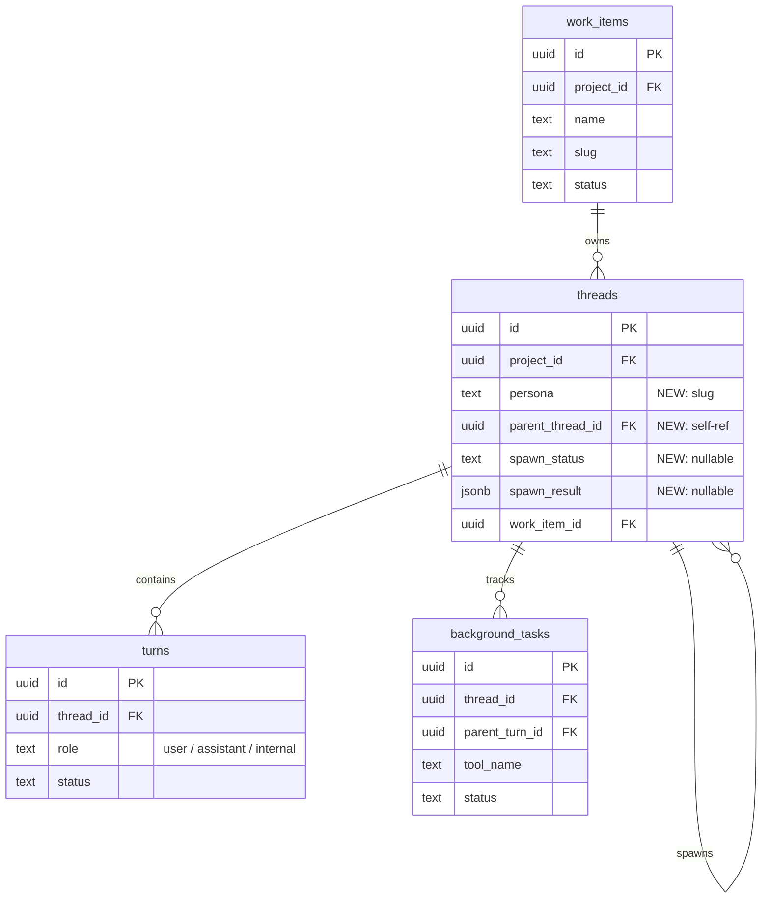
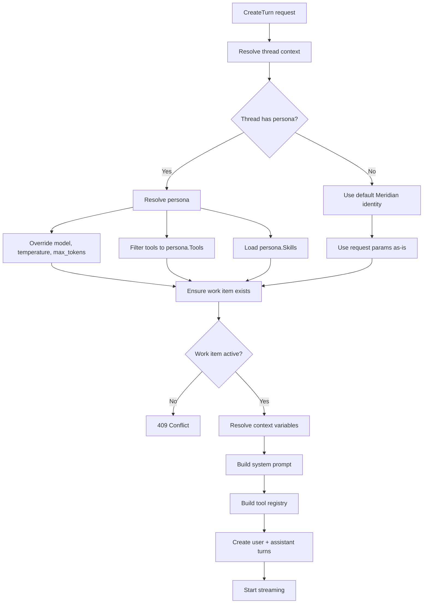

# Streaming Integration

How the existing streaming pipeline changes to support agents: data model, turn creation flow, system prompt composition, internal turns, tool builder.

## Data Model

### Schema Changes



### New Columns on `${TABLE_PREFIX}threads`

Table was renamed from `chats` to `threads` in migration 00007.

```sql
ALTER TABLE ${TABLE_PREFIX}threads
    ADD COLUMN persona TEXT
    CONSTRAINT ${TABLE_PREFIX}threads_persona_format
    CHECK (persona IS NULL OR persona ~ '^[a-z0-9][a-z0-9-]*[a-z0-9]$');

ALTER TABLE ${TABLE_PREFIX}threads
    ADD COLUMN parent_thread_id UUID
    REFERENCES ${TABLE_PREFIX}threads(id)
    ON DELETE RESTRICT;

ALTER TABLE ${TABLE_PREFIX}threads
    ADD COLUMN spawn_status TEXT;

ALTER TABLE ${TABLE_PREFIX}threads
    ADD COLUMN spawn_result JSONB
    CONSTRAINT ${TABLE_PREFIX}threads_spawn_result_type
    CHECK (spawn_result IS NULL OR jsonb_typeof(spawn_result) = 'object');

-- Indexes
CREATE INDEX idx_${TABLE_PREFIX}threads_parent
    ON ${TABLE_PREFIX}threads(parent_thread_id, created_at DESC)
    WHERE deleted_at IS NULL AND parent_thread_id IS NOT NULL;

CREATE INDEX idx_${TABLE_PREFIX}threads_work_item_agent
    ON ${TABLE_PREFIX}threads(work_item_id, persona)
    WHERE deleted_at IS NULL AND work_item_id IS NOT NULL;

CREATE INDEX idx_${TABLE_PREFIX}threads_work_item_running_spawns
    ON ${TABLE_PREFIX}threads(work_item_id)
    WHERE deleted_at IS NULL AND spawn_status = 'running';

ALTER TABLE ${TABLE_PREFIX}threads
    ADD CONSTRAINT ${TABLE_PREFIX}threads_spawn_status_check
    CHECK (spawn_status IS NULL OR spawn_status IN ('running', 'succeeded', 'failed', 'cancelled'));
```

### Thread Domain Model

```go
type Thread struct {
    // ... existing fields ...
    Persona     *string                `json:"persona,omitempty" db:"persona"`
    ParentThreadID   *string                `json:"parent_thread_id,omitempty" db:"parent_thread_id"`
    SpawnStatus      *string                `json:"spawn_status,omitempty" db:"spawn_status"`
    SpawnResult      map[string]interface{} `json:"spawn_result,omitempty" db:"spawn_result"`
}
```

See [thread-notifications](thread-notifications.md) for the `internal` turn role and `ThreadNotifier` primitive.

## Turn Creation Flow



**Cold-start reorder**: On cold-start, thread + work item must be created inside tx BEFORE building system prompt (context resolver needs thread/work-item state). This reorders the current flow where prompt is built before thread creation.

## Prompt Architecture: Cache-Aware Split

LLM prompt caching is prefix-based across all providers (Anthropic, OpenAI, Gemini). The entire input — `[system] + [messages]` — is one flat token sequence. Changing the system prompt invalidates the conversation history cache.

### System Prompt Composition

Persona body goes last to maximize cache hits. Stable prefix stays cached; only the persona section invalidates on switch.

| Position | Section | Stability | Source |
|----------|---------|-----------|--------|
| 1 | Base identity | stable | `"You are Meridian, an AI assistant..."` |
| 2 | Tool section | stable | Auto-generated from tool registry metadata |
| 3 | Work session context | stable per work item | Resolved `$MERIDIAN_WORK_DIR`, `$MERIDIAN_FS_DIR`, `$MERIDIAN_THREAD_ID` |
| 4 | Project system prompt | stable per project | From project settings |
| 5 | Thread system prompt | stable per thread | Thread-specific override |
| 6 | Skill content | stable per persona | From persona.Skills or selected_skills |
| 7 | Persona body | **changes on switch** | Markdown from `.agents/agents/<slug>.md` |

```go
func (r *systemPromptResolver) Resolve(
    ctx context.Context,
    threadID, projectID, userID string,
    selectedSkills []string,
    toolSection string,
    workContext *ResolvedContext,  // NEW
    persona *agents.Persona,      // NEW: body appended last for cache
) (*string, error)
```

### Cache Optimization (post-v1)

If persona switching proves frequent, the persona body can move from system prompt into the current user message (injected by `MessageBuilder`, not stored). This eliminates cache misses entirely since the current message is always new. Deferred because it requires `MessageBuilder` interface changes across all continuation/debug paths.

## Tool Builder

```go
func (b *ToolRegistryBuilder) WithSpawnTool(
    projectID, userID, threadID, workItemID string,
    spawner spawn.SpawnInvoker,  // narrow interface, not full Service
) *ToolRegistryBuilder

func (b *ToolRegistryBuilder) WithCheckBackgroundTool(
    threadID string,
    backgroundService background.Service,
) *ToolRegistryBuilder
```

Spawn tool only registered when thread has a work item and spawn service is available.

## API Contract: Turn Creation (Extended)

```json
{
  "project_id": "uuid",
  "role": "user",
  "turn_blocks": [],
  "request_params": {},
  "work_item_id": "uuid",
  "persona": "writing-coach"
}
```

`persona` accepted on any turn. On cold-start: thread created with that persona. On subsequent turns: persona switches. Set to `null` to revert to default.
