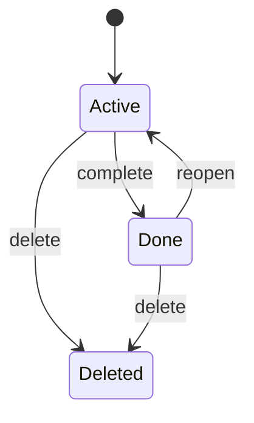
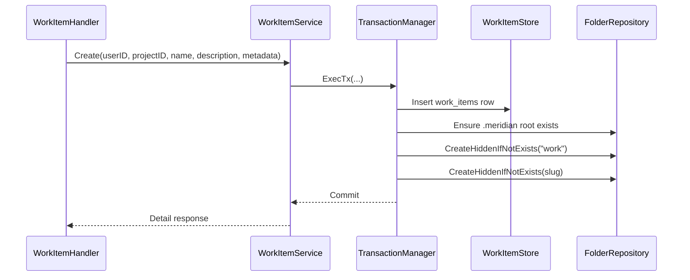

# Work Items: Multi-Thread Work Context

> **Note**: This is the A4 foundation design. It references `${TABLE_PREFIX}chats` — the table was renamed to `${TABLE_PREFIX}threads` in migration 00007. The write routing for `.meridian/work/` was updated in [work-sessions.md](work-sessions.md) — all writes go through the collab pipeline (not direct API writes).

## Summary

Work items are the backend representation of `meridian work`: a named unit of work that owns multiple threads and a shared artifact folder at `.meridian/work/<slug>/`.

This design closes the A4 review gaps:

- Adds explicit domain interfaces for work item services and stores
- Defines the full `work_items` schema and indexes, including `is_ephemeral`
- Keeps the existing nullable FK on `${TABLE_PREFIX}chats`, but guarantees every newly created or resumed thread resolves to a work item
- Makes work item row creation and artifact folder creation a single transaction
- Narrows status to `active` and `done`, with service-layer transition enforcement and explicit `complete`-while-streaming rejection
- Makes slugs immutable, canonical, and collision-safe under concurrent creates
- Adds cursor-based pagination for work item lists and embedded thread lists
- Defines the missing A4 HTTP contracts
- Defines `.meridian/work/<slug>/` import recognition and the zip-pipeline exception required to import it

## Concept

A work item is a named context that groups multiple threads and shared artifacts. It maps directly to the Meridian CLI's `meridian work`: same abstraction, same terminology, same lifecycle.

Writers create work items for focused tasks: "Revise Arc 3," "Worldbuilding pass," "Fix continuity chapters 40-55." Each work item can have multiple threads running concurrently, sharing artifacts in a common workspace.

## CLI ↔ Flow Mapping

| CLI | Flow | Notes |
|-----|------|-------|
| `meridian work start "name"` | Create work item | Named context for grouped work |
| `$MERIDIAN_WORK_DIR` | Work item's artifact space | Always resolves to `.meridian/work/<slug>/`, including auto-created ephemeral work items |
| `meridian spawn -a agent` | Create thread with persona | Thread may belong to one work item |
| Multiple spawns in parallel | Multiple concurrent threads | Agents working simultaneously in shared context |
| `meridian work done` | Complete work item | Marks item `done`; artifacts remain readable |
| `meridian work reopen` | Reopen work item | Returns item to `active` |
| `meridian work` | Work items panel | Overview of active and done work |

## Scope

### In

- Work item CRUD: create, list, show, update, complete, reopen, soft delete
- One-to-many thread association with ephemeral fallback: every new thread ends up attached to exactly one work item
- Shared artifact folder per work item at `.meridian/work/<slug>/`
- Auto-created ephemeral work items for standalone threads
- Import validation and row creation for `.meridian/work/<slug>/` folders
- Show endpoint that returns associated threads and artifact folder metadata
- Cursor-based pagination on list surfaces

### Out

- Many-to-many thread/work-item relationships
- Automatic thread archival or closure on complete
- Per-work-item ACLs separate from project ownership
- Work item templates
- Cross-work-item orchestration

## Review-Driven Decisions

### 1. Keep the CLI abstraction exact

Work items are not a UI-only grouping. They are the server-side mirror of `meridian work`, so the canonical artifact path is `.meridian/work/<slug>/`, and the lifecycle is create, complete, reopen, delete.

### 2. Keep the nullable FK, but normalize runtime behavior

The API and service layer call them "threads", but the current persistence table is `${TABLE_PREFIX}chats`. A4 adds `work_item_id` to that existing table rather than introducing a parallel thread table.

The column stays nullable so the migration is safe for existing rows, but thread creation and thread runtime paths normalize toward "every active thread has a work item." If the caller does not provide one, the service creates an ephemeral work item automatically.

### 3. Standalone threads get ephemeral ghost work items

When a thread is created without an explicit `work_item_id`, the backend creates an ephemeral work item in the same transaction, attaches the thread to it, and hides that work item from the dashboard by default. This preserves Meridian CLI semantics: `$MERIDIAN_WORK_DIR` always exists.

### 4. `.meridian/` is system, work item folders are not

`.meridian/` is bootstrapped transactionally at project creation and remains the only system folder in this path. `.meridian/work/` and `.meridian/work/<slug>/` are hidden regular folders inside that namespace so agents can write artifacts there.

### 5. `done` is a real state, not a soft archive

Status is only `active` or `done`. Delete is separate and remains a soft delete. Completed work items keep their threads and artifacts, but no new activity may be attached until the item is reopened.

### 6. Slugs are stable external identifiers

The slug appears in the artifact path, API route, and CLI vocabulary. It is generated once at creation time, never changes when the display name changes, and is unique per project among non-deleted work items.

## Alternatives Considered

- Join table between threads and work items: rejected because CLI semantics are one thread inside one work item, and the current thread APIs become simpler with a nullable FK.
- Making `.meridian/work/<slug>/` a system folder: rejected because artifacts are meant to be mutable agent-owned output, not immutable infrastructure.
- Mutable slug on rename: rejected because it would break the canonical workspace path and make CLI ↔ Flow drift inevitable.

## Domain Model

### Work Item

- `id UUID`
- `project_id UUID`
- `user_id TEXT`
- `name TEXT`
- `slug TEXT`
- `description TEXT NULL`
- `status TEXT` with allowed values `active`, `done`
- `is_ephemeral BOOLEAN`
- `metadata JSONB`
- `created_at TIMESTAMPTZ`
- `updated_at TIMESTAMPTZ`
- `deleted_at TIMESTAMPTZ NULL`

### Thread → Work Item Relationship

- The FK remains nullable for migration safety, but the service guarantees every newly created thread ends up attached to one work item
- Persistence change is on `${TABLE_PREFIX}chats.work_item_id`, because `${TABLE_PREFIX}chats` is the current backing table for thread APIs
- Existing rows remain `NULL` for backward compatibility
- `CreateThread` accepts optional `work_item_id`
- If `CreateThread` omits `work_item_id`, the service creates an ephemeral work item and stores its ID on the thread before commit
- `ListThreads` accepts optional `work_item_id` filter
- `GetWorkItem` includes associated threads
- Thread detail and agent runtime resolve the attached work item even when it is ephemeral

### Artifact Space

Each work item owns one hidden artifact folder:

```text
.meridian/
└── work/
    ├── revise-arc-3/
    │   ├── notes.md
    │   ├── continuity/issues.md
    │   └── outline.md
    └── worldbuilding-pass/
        └── timeline.md
```

- `.meridian/` is `is_system=true`
- `.meridian/work/` is `is_hidden=true`, `is_system=false`
- `.meridian/work/<slug>/` is `is_hidden=true`, `is_system=false`
- Artifacts are regular documents and folders under the hidden work namespace
- Explorer hides them by default; the work item detail view surfaces them explicitly
- Ephemeral work items use the same folder shape; only the dashboard default filter hides them

## Lifecycle And State Rules



- `complete` is allowed only from `active`
- `reopen` is allowed only from `done`
- No generic arbitrary status patching from handlers
- Delete is a soft delete, not a status value
- Service layer enforces transitions; the DB constrains only the allowed status values

### Thread Behavior By State

- `active`: new threads may be created with this work item, and existing associated threads may create turns
- `done`: associated threads remain attached and visible, but they become idle history until reopen
- `done` work items reject:
  - new thread creation with that `work_item_id`
  - new turns on existing associated threads
- `delete`: service keeps thread associations intact, soft-deletes the artifact subtree, and soft-deletes the work item row
- `deleted` work items are filtered out of dashboard/list queries via `deleted_at IS NULL`, but the preserved FK makes future restore straightforward

## Domain Contracts

Create a new `workitem` domain package rather than burying work item rules inside `llm` or `docsystem`. The thread and document services depend on it, but work item ownership stays isolated.

### Service Interface

```go
package workitem

import (
    "context"

    llm "meridian/internal/domain/models/llm"
)

type Status string

const (
    StatusActive Status = "active"
    StatusDone   Status = "done"
)

type ListFilter struct {
    Status           *Status // nil = active default at handler layer
    IncludeEphemeral bool
    Cursor           *string
    Limit            int
}

type ThreadListFilter struct {
    Cursor *string
    Limit  int
}

type PageInfo struct {
    NextCursor *string `json:"next_cursor,omitempty"`
    Limit      int     `json:"limit"`
}

type ListResult struct {
    Items []Summary `json:"items"`
    PageInfo
}

type ThreadListResult struct {
    Items []ThreadSummary `json:"items"`
    PageInfo
}

// ThreadSummary is a workitem-local DTO for threads. Avoids cross-domain
// dependency on llm.Thread (architecture: workitem must not import llm types).
type ThreadSummary struct {
    ID         string     `json:"id"`
    ProjectID  string     `json:"project_id"`
    UserID     string     `json:"user_id"`
    Title      string     `json:"title"`
    WorkItemID *string    `json:"work_item_id,omitempty"`
    CreatedAt  time.Time  `json:"created_at"`
    UpdatedAt  time.Time  `json:"updated_at"`
    DeletedAt  *time.Time `json:"deleted_at,omitempty"`
}

type ArtifactFolder struct {
    ID       string `json:"id"`
    Path     string `json:"path"`
    IsHidden bool   `json:"is_hidden"`
    IsSystem bool   `json:"is_system"`
}

type Service interface {
    Create(ctx context.Context, req *CreateRequest) (*Detail, error)
    Get(ctx context.Context, projectID, slug, userID string, threadFilter ThreadListFilter) (*Detail, error)
    List(ctx context.Context, projectID, userID string, filter ListFilter) (*ListResult, error)
    Update(ctx context.Context, projectID, slug, userID string, req *UpdateRequest) (*Summary, error)
    // Status transitions are exposed only through Complete() and Reopen().
    // UpdateStatus exists on the Store interface as an implementation primitive.
    Complete(ctx context.Context, projectID, slug, userID string) (*Summary, error)
    Reopen(ctx context.Context, projectID, slug, userID string) (*Summary, error)
    Delete(ctx context.Context, projectID, slug, userID string) (*Summary, error)

    EnsureThreadWorkItem(ctx context.Context, projectID, threadID, userID string) (*WorkItem, error)
    AttachThread(ctx context.Context, projectID, workItemID, threadID, userID string) error
    ListThreads(ctx context.Context, projectID, workItemID, userID string, filter ThreadListFilter) (*ThreadListResult, error)
}
```

### Store Interface

```go
package workitem

import (
    "context"
    "time"

    llm "meridian/internal/domain/models/llm"
)

type Store interface {
    Create(ctx context.Context, item *WorkItem) error
    GetByID(ctx context.Context, projectID, id string) (*WorkItem, error)
    GetBySlug(ctx context.Context, projectID, slug string) (*WorkItem, error)
    ListByProject(ctx context.Context, projectID string, filter ListFilter) ([]WorkItem, *string, error)
    Update(ctx context.Context, item *WorkItem) error
    UpdateStatus(ctx context.Context, projectID, id string, from, next Status, updatedAt time.Time) error
    SoftDelete(ctx context.Context, projectID, id string, deletedAt time.Time) error

    AttachThread(ctx context.Context, projectID, workItemID, threadID string) error
    ListThreads(ctx context.Context, projectID, workItemID string, filter ThreadListFilter) ([]ThreadSummary, *string, error)
    HasStreamingThreads(ctx context.Context, projectID, workItemID string) (bool, error)
    CountAttachedThreads(ctx context.Context, projectID, workItemID string) (int, error)
}
```

### Notes On Layer Ownership

- `WorkItemService` owns validation, auth checks, slug generation, status rules, ephemeral work item creation, and transaction orchestration
- `WorkItemStore` owns row persistence plus thread association writes on `${TABLE_PREFIX}chats`
- `ThreadService` keeps ownership of thread creation, but validates the optional `work_item_id` through `WorkItemService` and auto-creates an ephemeral work item when omitted
- `StreamingService` ensures the thread has a work item, then checks associated work item state before creating turns

### ThreadService Integration

`ThreadService` constructor accepts `WorkItemService` as a dependency.

When creating a thread without a `work_item_id`, `ThreadService` calls `workItemService.EnsureThreadWorkItem(ctx, projectID, userID)` to get or create an ephemeral work item.

Transaction ownership: `ThreadService` opens the `ExecTx`. Inside, it calls `EnsureThreadWorkItem` (which does its own store-level operations within the same tx), then creates the thread row.

The streaming service's lazy work-item provisioning follows the same pattern: before creating a turn, ensure the thread has a work item.

### `$MERIDIAN_WORK_DIR` Resolution

The `$MERIDIAN_WORK_DIR` environment variable is resolved by the agent runtime context builder. It maps the active work item slug to the filesystem path: `.meridian/work/<slug>/`. The context builder reads the work item from the thread association and constructs the path. If no work item exists (pre-A4 threads), the runtime creates an ephemeral work item first.

## Persistence Design

### `work_items` Table

```sql
CREATE TABLE ${TABLE_PREFIX}work_items (
    id UUID PRIMARY KEY DEFAULT uuid_generate_v4(),
    project_id UUID NOT NULL REFERENCES ${TABLE_PREFIX}projects(id) ON DELETE CASCADE,
    user_id TEXT NOT NULL,
    name TEXT NOT NULL,
    slug TEXT NOT NULL,
    description TEXT,
    status TEXT NOT NULL DEFAULT 'active',
    is_ephemeral BOOLEAN NOT NULL DEFAULT FALSE,
    metadata JSONB NOT NULL DEFAULT '{}'::jsonb,
    created_at TIMESTAMPTZ NOT NULL DEFAULT NOW(),
    updated_at TIMESTAMPTZ NOT NULL DEFAULT NOW(),
    deleted_at TIMESTAMPTZ,
    CONSTRAINT ${TABLE_PREFIX}work_items_status_check
        CHECK (status IN ('active', 'done')),
    CONSTRAINT ${TABLE_PREFIX}work_items_slug_check
        CHECK (
            char_length(slug) BETWEEN 1 AND 80
            AND slug ~ '^[a-z0-9]+(?:-[a-z0-9]+)*$'
        ),
    CONSTRAINT ${TABLE_PREFIX}work_items_metadata_check
        CHECK (jsonb_typeof(metadata) = 'object')
);

CREATE UNIQUE INDEX idx_${TABLE_PREFIX}work_items_project_slug_active
    ON ${TABLE_PREFIX}work_items(project_id, slug)
    WHERE deleted_at IS NULL;

CREATE INDEX idx_${TABLE_PREFIX}work_items_project_status_visible_updated
    ON ${TABLE_PREFIX}work_items(project_id, status, is_ephemeral, updated_at DESC, id DESC)
    WHERE deleted_at IS NULL;

CREATE INDEX idx_${TABLE_PREFIX}work_items_project_visible_updated
    ON ${TABLE_PREFIX}work_items(project_id, is_ephemeral, updated_at DESC, id DESC)
    WHERE deleted_at IS NULL;

CREATE INDEX idx_${TABLE_PREFIX}work_items_project_user
    ON ${TABLE_PREFIX}work_items(project_id, user_id)
    WHERE deleted_at IS NULL;
```

Add the standard `updated_at` trigger using the existing `${TABLE_PREFIX}update_updated_at_column()` function.

### Thread FK Migration

Use the existing `${TABLE_PREFIX}chats` table, because that is the current thread backing store.

```sql
ALTER TABLE ${TABLE_PREFIX}chats
    ADD COLUMN work_item_id UUID
    REFERENCES ${TABLE_PREFIX}work_items(id)
    ON DELETE SET NULL;

CREATE INDEX idx_${TABLE_PREFIX}chats_project_work_item
    ON ${TABLE_PREFIX}chats(project_id, work_item_id, updated_at DESC, id DESC)
    WHERE deleted_at IS NULL AND work_item_id IS NOT NULL;
```

Notes:

- Existing rows automatically get `NULL`
- `ON DELETE SET NULL` protects future hard-delete cleanup jobs only
- Soft delete never clears `${TABLE_PREFIX}chats.work_item_id`; thread association is preserved until a future hard delete
- Any active thread that still has `NULL` because it predates A4 gets an ephemeral work item lazily provisioned before agent runtime or turn creation, so `$MERIDIAN_WORK_DIR` is never undefined for active threads
- Cross-project consistency is enforced in service logic: a thread can only attach to a work item in the same project

## Slug Generation

Slug generation follows the existing `identifier.GenerateSlug` pattern, with work-item-specific constraints:

1. Slugify the name: lowercase, strip accents, replace spaces and special characters with hyphens, collapse repeated hyphens
2. If the result is empty, use `work-item`
3. Trim to 80 characters and strip leading or trailing hyphens after truncation
4. Inside the same transaction, attempt the insert with the base slug
5. If the insert hits the active partial unique index, append `-2`, retry, then `-3`, and so on
6. When appending a suffix, re-truncate the base so the final slug still fits in 80 characters
7. Retry at most 5 times; if every candidate collides, return `409 Conflict`
8. Persist once and never regenerate on rename

Examples:

- `Revise Arc 3` → `revise-arc-3`
- `Fix continuity: chapters 40-55` → `fix-continuity-chapters-40-55`
- Duplicate `revise-arc-3` → `revise-arc-3-2`

Imported work item folders do not get re-slugified. Import requires the folder name to already be canonical. Invalid imported slugs are rejected, and import collisions fail rather than renaming because the folder path is part of the imported artifact contract.

## Transaction Boundaries

Work item creation must use the same transaction pattern as project bootstrap: row write plus hidden folder creation in one `ExecTx` call.



### Create Flow

Inside the transaction:

1. Verify project access using the authenticated `user_id`
2. Generate the immutable base slug
3. Insert the `work_items` row
4. Ensure `.meridian/` exists defensively
5. Ensure `.meridian/work/` exists as a hidden non-system folder
6. Create `.meridian/work/<slug>/` as a hidden non-system folder
7. Commit only if every row and folder write succeeds

If the insert hits a slug unique violation, the transaction retries with `-2`, `-3`, and so on up to 5 attempts before surfacing `409 Conflict`.

### Ephemeral Thread Bootstrap Flow

When `CreateThread` or cold-start thread creation omits `work_item_id`, the same transaction:

1. Creates the thread row
2. Derives the ghost work item name from the thread title, or `Thread <short-id>` if the title is empty
3. Creates a `work_items` row with `is_ephemeral = true`
4. Ensures `.meridian/work/<slug>/` exists
5. Updates the new thread row to point at that work item before commit

Ephemeral work items are full work items from the runtime's perspective; only list/dashboard defaults hide them.

### Update Flow

- Update only `name`, `description`, and `metadata`
- Do not update `slug`
- Touch `updated_at`

### Complete Flow

- Validate current state is `active`
- Check whether any associated thread currently has an assistant turn with `status = 'streaming'`
- If any associated thread is still streaming, reject with `409 Conflict` and message `Cannot complete work item while threads are actively streaming`
- Update `status` to `done`
- Do not move, rename, or soft-delete the artifact folder
- Do not detach threads

### Reopen Flow

- Validate current state is `done`
- Update `status` to `active`

### Delete Flow

Inside one transaction:

1. Resolve the work item by slug
2. Soft-delete the artifact folder subtree under `.meridian/work/<slug>/`
3. Soft-delete the `work_items` row
4. Leave `${TABLE_PREFIX}chats.work_item_id` untouched

Delete is intentionally stronger than complete. Complete preserves history in place. Delete removes the work item from active and historical views while leaving soft-deleted data available for later purge or restore tooling. Restore-from-delete is not part of the v1 API, but preserving thread FKs means a future restore only needs to clear `deleted_at` on the row and folder subtree.

## Thread API Integration

### `CreateThread`

Extend the existing thread request DTO:

```go
type CreateThreadRequest struct {
    ProjectID  string  `json:"project_id"`
    UserID     string  `json:"user_id"`
    Title      string  `json:"title"`
    WorkItemID *string `json:"work_item_id,omitempty"`
}
```

Rules:

- `work_item_id` is optional
- If provided, the thread service verifies:
  - the work item exists in the same project
  - the caller can access that project
  - the work item status is `active`
- If validation passes, the created thread row stores `work_item_id`
- If omitted, the thread service auto-creates an ephemeral work item in the same transaction:
  - `is_ephemeral = true`
  - name from thread title or `Thread <short-id>`
  - hidden from the dashboard by default
  - still backed by `.meridian/work/<slug>/`
- Per-project cap: max 100 active ephemeral work items. When cap is hit, reuse the most recent ephemeral work item instead of creating a new one. Enforced in the same transaction as creation.
- Ephemeral work item garbage collection is deferred to post-v1. Thread reassignment (DetachThread, ReassignThread) is not supported in v1. When implemented, GC will soft-delete ephemeral items with zero attached threads.

### `ListThreads`

Extend the existing thread list endpoint to accept optional `work_item_id`:

- `GET /api/threads?project_id=<id>&work_item_id=<uuid>`
- Omit `work_item_id` to keep current behavior
- Pass `work_item_id` to filter threads for a specific work item

### `CreateTurn`

Before creating a turn, the streaming service checks whether the target thread has an associated work item:

- if the thread still has `NULL` from a pre-A4 row, lazily create and attach an ephemeral work item before building runtime context
- `active` work item: existing behavior
- `done` work item: return `409 Conflict` with a message telling the client to reopen the work item first
- soft-deleted work item: return `409 Conflict` telling the client the work item has been deleted and the thread must be reassigned or restored before use

This makes `done` meaningful without destroying thread history, and keeps `$MERIDIAN_WORK_DIR` stable for all active runtime paths.

## HTTP API Contracts

Use the existing project resolver for `{id}` so the route accepts project UUID or project slug. Work item identity in nested routes is the work item slug.

### Shared Response Shapes

`WorkItemSummary`

```json
{
  "id": "4d2acb86-d94f-4e13-bd3f-0535962d7f8d",
  "project_id": "a3df76d5-57bc-4f14-a7a6-e3b7c50f52f6",
  "name": "Revise Arc 3",
  "slug": "revise-arc-3",
  "description": "Rework pacing for chapters 41-55",
  "status": "active",
  "is_ephemeral": false,
  "metadata": {
    "priority": "high"
  },
  "artifact_folder_path": ".meridian/work/revise-arc-3",
  "thread_count": 2,
  "created_at": "2026-03-20T14:12:00Z",
  "updated_at": "2026-03-20T14:12:00Z",
  "deleted_at": null
}
```

`WorkItemDetail`

```json
{
  "id": "4d2acb86-d94f-4e13-bd3f-0535962d7f8d",
  "project_id": "a3df76d5-57bc-4f14-a7a6-e3b7c50f52f6",
  "name": "Revise Arc 3",
  "slug": "revise-arc-3",
  "description": "Rework pacing for chapters 41-55",
  "status": "active",
  "is_ephemeral": false,
  "metadata": {
    "priority": "high"
  },
  "artifact_folder": {
    "id": "9e123756-4e60-4c0b-b40d-f63d65369f4a",
    "path": ".meridian/work/revise-arc-3",
    "is_hidden": true,
    "is_system": false
  },
  "threads": {
    "items": [
      {
        "id": "5ec7a7f5-a97d-4d8f-a4b6-e38f6b03b74f",
        "project_id": "a3df76d5-57bc-4f14-a7a6-e3b7c50f52f6",
        "user_id": "user-123",
        "title": "Continuity pass",
        "work_item_id": "4d2acb86-d94f-4e13-bd3f-0535962d7f8d",
        "created_at": "2026-03-20T14:15:00Z",
        "updated_at": "2026-03-20T14:18:00Z",
        "deleted_at": null
      }
    ],
    "next_cursor": null,
    "limit": 20
  },
  "created_at": "2026-03-20T14:12:00Z",
  "updated_at": "2026-03-20T14:18:00Z",
  "deleted_at": null
}
```

All errors use the existing RFC 7807 problem detail format.

### Cursor Format

Both work item list pagination and embedded thread pagination use an opaque cursor derived from the current sort key: `updated_at DESC, id DESC`. The encoded payload is `{ "updated_at": "<rfc3339 timestamp>", "id": "<uuid>" }`. Handlers treat the cursor as opaque; clients only echo it back.

### `POST /api/projects/{id}/work-items`

Request:

```json
{
  "name": "Revise Arc 3",
  "description": "Rework pacing for chapters 41-55",
  "metadata": {
    "priority": "high"
  }
}
```

Response:

- `201 Created` with `WorkItemDetail`

Errors:

- `400 Bad Request` invalid name, description, or metadata shape
- `401 Unauthorized` missing or invalid JWT
- `404 Not Found` project not found in caller scope
- `409 Conflict` when all 5 slug candidates collide inside the create transaction

### `GET /api/projects/{id}/work-items`

Query:

- `status=active|done|all`
- `cursor=<opaque>`
- `limit=<1..100>` default `20`
- `include_ephemeral=true|false` default `false`
- Default `status`: `active`

Response:

- `200 OK` with:

```json
{
  "items": [
    {
      "id": "4d2acb86-d94f-4e13-bd3f-0535962d7f8d",
      "project_id": "a3df76d5-57bc-4f14-a7a6-e3b7c50f52f6",
      "name": "Revise Arc 3",
      "slug": "revise-arc-3",
      "description": "Rework pacing for chapters 41-55",
      "status": "active",
      "is_ephemeral": false,
      "metadata": {
        "priority": "high"
      },
      "artifact_folder_path": ".meridian/work/revise-arc-3",
      "thread_count": 2,
      "created_at": "2026-03-20T14:12:00Z",
      "updated_at": "2026-03-20T14:12:00Z",
      "deleted_at": null
    }
  ],
  "next_cursor": null,
  "limit": 20
}
```

Errors:

- `400 Bad Request` invalid status filter
- `401 Unauthorized`
- `404 Not Found` project not found in caller scope

### `GET /api/projects/{id}/work-items/{slug}`

Query:

- `threads_cursor=<opaque>`
- `threads_limit=<1..100>` default `20`

Response:

- `200 OK` with `WorkItemDetail`

Behavior:

- Resolves by `project_id + slug`
- Includes associated threads ordered by `updated_at DESC, id DESC`
- Includes artifact folder metadata for `.meridian/work/<slug>/`
- Returns ephemeral work items if the caller addresses them directly by slug; only list/dashboard defaults hide them

Errors:

- `401 Unauthorized`
- `404 Not Found` project or work item not found in caller scope

### `PATCH /api/projects/{id}/work-items/{slug}`

Request:

```json
{
  "name": "Revise Arc 3 - second pass",
  "description": "Narrow scope to chapters 48-55",
  "metadata": {
    "priority": "medium",
    "owner": "continuity-checker"
  }
}
```

Rules:

- All fields optional
- `slug` is not patchable
- `null` description clears the description
- Metadata replaces the full metadata object rather than deep-merging

Response:

- `200 OK` with `WorkItemSummary`

Errors:

- `400 Bad Request` invalid patch shape
- `401 Unauthorized`
- `404 Not Found`

### `POST /api/projects/{id}/work-items/{slug}/complete`

Request body:

- none

Response:

- `200 OK` with updated `WorkItemSummary`

Errors:

- `401 Unauthorized`
- `404 Not Found`
- `409 Conflict` work item is already `done`
- `409 Conflict` with detail `Cannot complete work item while threads are actively streaming` when any associated thread is still streaming

### `POST /api/projects/{id}/work-items/{slug}/reopen`

Request body:

- none

Response:

- `200 OK` with updated `WorkItemSummary`

Errors:

- `401 Unauthorized`
- `404 Not Found`
- `409 Conflict` work item is already `active`

### `DELETE /api/projects/{id}/work-items/{slug}`

Request body:

- none

Response:

- `200 OK` with the soft-deleted `WorkItemSummary` including `deleted_at`

Behavior:

- Soft-deletes artifact folder subtree
- Soft-deletes row
- Preserves associated thread FKs for future restore and auditability

Errors:

- `401 Unauthorized`
- `404 Not Found`

## Import Validation

When importing document content, `.meridian/work/<slug>/` is a special namespace that must create both filesystem artifacts and `work_items` rows.

### Recognized Structure

```text
.meridian/
├── fs/
└── work/
    ├── revise-arc-3/
    │   ├── notes.md
    │   └── outline.md
    └── worldbuilding-pass/
        └── timeline.md
```

### Validation Rules

- `.meridian/work/` must be a folder
- Each first-level child under `.meridian/work/` is treated as one work item candidate
- Candidate folder name must match the canonical slug regex `^[a-z0-9]+(?:-[a-z0-9]+)*$`
- Candidate folder name must be 1-80 characters
- All files under the candidate subtree must pass normal document validation
- Direct zip import must allow `.meridian/work/<slug>/...` through the `zip_file_processor.go` filter while continuing to reject every other `.meridian/**` path, including `.meridian/fs/**`
- Path traversal and non-canonical reserved paths remain rejected by existing namespace validation

### Import Behavior

For each valid `.meridian/work/<slug>/` folder:

1. Ensure `.meridian/` exists
2. Ensure `.meridian/work/` exists
3. Create `work_items` row with:
   - `slug = <folder-name>`
   - `name = deslugified title`, for example `revise-arc-3` → `Revise Arc 3`
   - `status = active`
   - `is_ephemeral = false`
   - `description = NULL`
   - `metadata = {"imported": true}`
4. Create or hydrate the hidden folder subtree
5. Import documents beneath that subtree as regular artifact documents

If a candidate fails validation:

- Record one import error for the work item folder
- Skip the entire subtree so artifacts do not become orphaned documents without a `work_items` row
- Continue importing unrelated non-work-item files where possible, matching the existing partial-success import model

If a candidate slug collides with an existing non-deleted work item in the project:

- Treat it as a conflict
- Skip that subtree
- Return an import error describing the conflicting slug

## Implementation Surface

This design expects changes in these backend areas:

- `backend/internal/domain/models/llm/thread.go`
  - add `WorkItemID *string`
- `backend/internal/domain/services/llm/thread.go`
  - add optional `work_item_id` on create request and thread list filter support
- `backend/internal/domain/services/workitem/`
  - new service contracts and DTOs
- `backend/internal/domain/repositories/workitem/`
  - new store contracts
- `backend/internal/repository/postgres/workitem/`
  - new `work_items` repository plus `${TABLE_PREFIX}chats.work_item_id` association methods, cursor pagination queries, and streaming-state checks
- `backend/internal/service/workitem/`
  - service implementation with `ExecTx`, slug retry-on-unique-violation, and ephemeral-work-item bootstrap/GC
- `backend/internal/handler/work_item.go`
  - new REST handler and route wiring
- `backend/internal/service/llm/thread/service.go`
  - validate optional `work_item_id`, create ephemeral work item when omitted, and reassign away from ephemeral work items safely
- `backend/internal/service/llm/streaming/`
  - reject turns on `done` or soft-deleted work items and ensure every active thread has a work item before runtime/env resolution
- `backend/internal/service/docsystem/import.go`
  - recognize `.meridian/work/<slug>/` during import
- `backend/internal/service/docsystem/zip_file_processor.go`
  - allow `.meridian/work/<slug>/...` paths through while keeping other `.meridian/**` paths filtered
- `backend/internal/service/docsystem/namespace.go`
  - reuse `.meridian/` path helpers, but do not mark `.meridian/work` as system

## Implementation Plan Drift

`implementation-plan.md` needs follow-up edits to match this design:

- The current plan says `complete` makes artifacts read-only and `reopen` restores them. A4 supersedes that: artifacts remain mutable after completion; `done` only blocks new thread activity.
- The current plan predates ephemeral ghost work items. Backend and frontend execution phases need explicit tasks for auto-creation, hidden-by-default filtering, and garbage collection when a thread is reassigned to a real work item.

## Coder Notes

- Reuse `TransactionManager.ExecTx` from project creation; do not invent a separate transaction abstraction
- Reuse `identifier.GenerateSlug` for the base slug; work item service adds the 80-character and immutability rules on top
- Use the partial unique index, not a preflight existence check, as the source of truth for slug uniqueness
- Keep auth in service methods, not handlers
- Keep the work item slug route-param-based; do not expose mutable integer IDs in the UI
- Do not add an `archived` status back in unless product scope changes later
