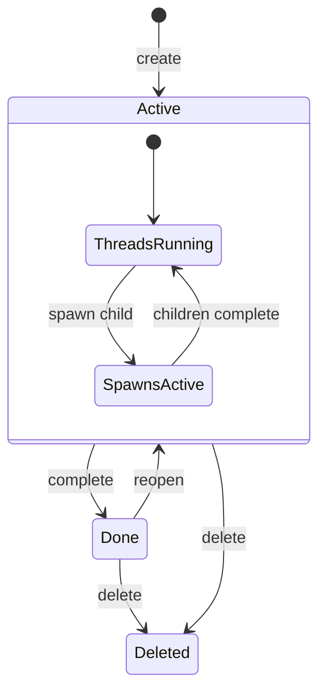

# Work Sessions

Work session enforcement in the streaming pipeline: lifecycle gates, context resolution, FS layout, and write routing.

## Key Decision: Streaming Service Owns Enforcement

The streaming service already owns turn creation and system prompt resolution. Work session checks (is the work item active? does the thread have a work item?) fit naturally here. The work item service provides state; the streaming service enforces the gate.

## Lifecycle Enforcement



### Enforcement Points

| Operation | Work Item State | Behavior |
|-----------|----------------|----------|
| Create turn | `active` | Allowed |
| Create turn | `done` | `409 Conflict`: "Reopen work item first" |
| Create turn | deleted | `409 Conflict`: "Work item deleted" |
| Create turn | no work item (legacy) | Auto-provision ephemeral work item, then allow |
| Spawn child thread | `active` | Allowed |
| Spawn child thread | `done` | `409 Conflict` |
| Complete work item | has streaming threads | `409 Conflict`: "Threads still streaming" |
| Complete work item | has running spawns | `409 Conflict`: "Spawns still running" |

Work item completion uses `SELECT ... FOR UPDATE` on the work item row in the same tx as the status transition. Turn/spawn creation also acquires the same lock to prevent TOCTOU races.

## Context Variable Resolution

Resolved once at turn creation, injected into system prompt as concrete values:

```go
type contextResolver struct {
    workItemService workitem.Service
    threadRepo      domainllm.ThreadStore
}

type ResolvedContext struct {
    WorkDir   string // e.g., ".meridian/work/revise-arc-3"
    FSDir     string // always ".meridian/fs"
    ThreadID    string // thread ID
    WorkItem  string // work item slug
}
```

Injected as system prompt preamble:

```text
## Your Workspace

You are working within the context of work item "Revise Arc 3".

- Work directory: .meridian/work/revise-arc-3/
- Project reference: .meridian/fs/
- Thread ID: <thread-id>

Write notes, plans, and artifacts to your work directory.
Read project-wide reference material from .meridian/fs/.
```

Agents use literal paths in tool calls -- no variable expansion in the tool layer.

## FS Layout

```text
.meridian/
+-- fs/                              # Project-wide reference material
|   +-- architecture.md
|   +-- style-guide.md
+-- work/
    +-- revise-arc-3/                # Work item artifact folder
        +-- notes.md                 # Shared notes across all threads
        +-- plan.md                  # Orchestrator's plan
        +-- continuity/
        |   +-- issues.md           # Written by continuity-checker agent
        +-- review/
            +-- findings.md         # Written by reviewer agent
```

All threads within a work item share the same artifact folder. No per-thread isolation -- agents collaborate through shared artifacts, matching CLI's `$MERIDIAN_WORK_DIR`.

## Write Routing

All writes go through the Yjs collab pipeline. The autoapply flag on the folder determines review gating:

| Target Path | Autoapply | Effect | Why |
|-------------|-----------|--------|-----|
| `.meridian/work/<slug>/` | on | Writes apply immediately | Agent's own scratch space |
| `.meridian/fs/` | on | Writes apply immediately | Shared reference; full history for restore |
| `.agents/` | off | Writes create pending proposals | Agent capability changes need human review |
| Everything else | off | Writes create pending proposals | Writer is the authority on their prose |

One pipeline, one audit trail, one undo/restore mechanism. History retained indefinitely.

### Work-Item Isolation

The `TextEditorTool` enforces work-item isolation at the tool layer (not just prompt instructions):

```go
func (t *TextEditorTool) checkEditNamespaceAccess(path string) interface{} {
    // ... namespace parsing, filepath.Clean canonicalization ...

    if namespace == domaindocsys.NamespaceMeridian {
        if strings.HasPrefix(relativePath, "fs/") {
            return nil // .meridian/fs/ -- any thread can write
        }
        if strings.HasPrefix(relativePath, "work/") {
            // Enforce work-item isolation
            expectedPrefix := "work/" + t.workItemSlug + "/"
            if !strings.HasPrefix(relativePath, expectedPrefix) {
                return ErrorResult(ErrInvalidInput,
                    fmt.Sprintf("cannot write to other work items (expected %s)", expectedPrefix), ...)
            }
            return nil
        }
        return ErrorResult(ErrInvalidInput, "cannot modify this .meridian/ path", ...)
    }
}
```

`workItemSlug` injected at tool construction from resolved context, not from LLM input.
