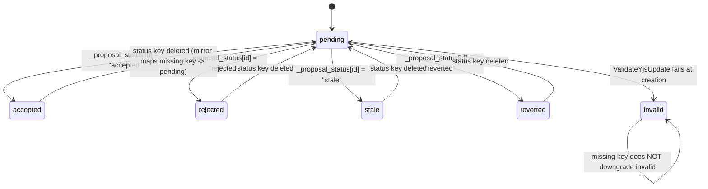

# Collaboration System Exploration

## Scope and Method

This report is an exploration-only pass over the real-time collaboration stack and the document-system model integration.

Files reviewed in full:
- `backend/internal/domain/collab/*`
- `backend/internal/service/collab/*` (including tests)
- `backend/internal/handler/collab*.go` (including tests)
- `backend/internal/domain/docsystem/*`
- `backend/internal/service/docsystem/*` (including tests)
- `backend/internal/handler/document.go`
- `backend/internal/handler/folder.go`
- `backend/internal/handler/tree.go`

Note: delegated explorer spawns (`p483`, `p484`, `p485`) failed due harness filesystem/runtime errors (`EROFS` under `~/.claude`), so this report is based on direct first-party source reading.

---

## 1) Collab WebSocket Lifecycle

### 1.1 Two distinct WS channels

1. **Project WS** (`GET /ws/projects/{projectId}`) for JSON control/event lane (heartbeat + proposal events).
   - Entry: `ConnectProject` and `handleProjectSocket` in `backend/internal/handler/collab_project.go:40`, `:62`.
2. **Document WS** (`GET /ws/documents/{documentId}`) for binary Yjs sync lane (plus heartbeat/error control text).
   - Entry: `ConnectDocument` and `handleDocumentSocket` in `backend/internal/handler/collab_document_handler.go:79`, `:121`.

### 1.2 Authentication and authorization

#### Project WS auth
- First inbound message must be JWT text token (`readFirstJWTMessage`) via `bootstrapAuth` (`backend/internal/handler/collab_authenticator.go:56`, `:201`).
- Token verified through `JWTVerifier`; invalid/expired token maps to `AUTH_EXPIRED` response (`collab_project.go:76-84`).
- Authenticated user must have UUID subject (`collab_authenticator.go:95-103`) and pass project authorization (`bootstrapProjectAuth`, `:122-149`).
- Optional production identity blocking hook enforced before authorization (`collab_authenticator.go:86-93`).

#### Document WS auth
- First message must be text JWT within timeout (`docWSAuthTimeout`) (`collab_document_handler.go:149-171`).
- Token verified; user UUID required (`:173-191`).
- Document ownership verified via `documentResolver.VerifyOwnership` (`:193-206`).
- Per-user document WS connection cap enforced (`docWSMaxConnPerUser=10`) (`:213-221`, `:491-517`).

### 1.3 Lifecycle and message exchange

#### Project WS runtime
- On success, connection is registered in project registry (`collab_project.go:93-96`) and emits `{type:"project:connected"}` (`:103-112`).
- Heartbeat loop emits `{type:"heartbeat"}` periodically; expects ack else closes (`collab.go:152-195`).
- Inbound JSON handled by shared message loop; currently only heartbeat is handled; unknown JSON ignored for forward compatibility (`collab_project.go:130-149`, `collab_message_loop.go:31-87`).

#### Document WS runtime
- After auth, server acquires per-document sync session (`sessionManager.GetOrCreateSession`) and registers socket in per-document fanout map (`collab_document_handler.go:223-236`).
- Sends `connected` JSON envelope and initial Yjs sync-step1 binary frame (`:237-261`).
- Inbound loop:
  - Text frames: heartbeat ack (`wsTypeHeartbeat`) only; unknown types ignored (`:303-324`).
  - Binary frames:
    - Prefix `0x00` = Yjs sync lane (`docWSPrefixSync`) -> `session.HandleSyncPayload` (`:342-376`).
    - Prefix `0x01` = awareness lane (currently logged/no fanout behavior) (`:378-384`).
- Activity + heartbeat + idle loops can close connection on timeout or auth expiry (`:397-489`).

### 1.4 Protocol/message catalog

| Direction | Channel | Type | Purpose |
|---|---|---|---|
| client -> project | text | JWT token | initial auth bootstrap |
| server -> project | json | `project:connected` | auth success ready signal |
| server <-> project | json | `heartbeat` | liveness |
| server -> project | json | `proposal:new` | proposal created event |
| client -> document | text | JWT token | initial auth bootstrap |
| server -> document | json | `connected` | session connected metadata |
| server -> document | binary `0x00+payload` | Yjs sync step1/update frames |
| client -> document | binary `0x00+payload` | Yjs sync payload |
| server <-> document | json | `heartbeat` | liveness |
| server -> document | json | `document:restored` | force rehydrate/reconnect signal |
| server -> either | json | `error` / `doc:error` | policy/auth/protocol errors |

Evidence:
- constants in `collab_proposal.go:12-16`, `collab_project.go:25-27`, `collab.go:49-57`
- framing in `collab_document_handler.go:50-52`, `:657-662`

---

## 2) Proposal System

### 2.1 Proposal model

Core proposal record (`backend/internal/domain/collab/proposal.go:31-51`):
- stores proposal Yjs delta (`YjsUpdate []byte`), creator, thread/turn/run linkage, offsets, and status.
- statuses: `pending`, `accepted`, `rejected`, `stale`, `reverted`, `invalid` (`proposal.go:23-29`).

### 2.2 CreateProposal flow

`ProposalService.CreateProposal` (`backend/internal/service/collab/proposal_service.go:52-177`):
1. Authorize document access (`:53-58`).
2. Validate update presence/size (`max 256KB`) (`:60-68`).
3. Validate Yjs mutation safety against canonical state (`ValidateYjsUpdate`) (`:87-99`).
   - invalid mutation is persisted with terminal `invalid` status (not rejected as request error).
4. Resolve effective autoapply policy (`:101-107`) and owner-tab presence (`:109`).
5. For first AI proposal in turn, create AI-turn bookmark (`:112-122`).
6. Persist proposal.
7. Autoapply behavior:
   - **autoapply=false**: keep pending (`:133-140`).
   - **AI + owner tabs**: serialize per document and queue with cap (`200`) (`:142-169`, `proposal_document_gate.go:9-39`).
   - **otherwise (including no owner tabs)**: backend fallback accept path (`:171-176` + `applyBackendFallbackAccept`).

### 2.3 Auto-apply vs manual-apply

- **Manual/queued path**: proposal row stays `pending`; clients decide acceptance/rejection via `_proposal_status` map synchronization.
- **Backend fallback auto-accept path** (`proposal_service.go:212-234`):
  1. Apply proposal update to runtime.
  2. Build and apply `_proposal_status[proposalID]=accepted` update.
  3. Upsert DB status to `accepted`.

### 2.4 Status synchronization state machine

Status sync is map-driven:
- `session_manager` ensures `_proposal_status` map exists on load/bootstrap (`session_manager.go:636-644`).
- map observer streams key deltas to `StatusMirror.OnStatusChange` (`:656-720`).
- reconciliation pass repairs drift on load/restore (`:722-751`, `status_mirror.go:88-150`).

Evidence:
- normalization/reconcile rules: `status_mirror.go:152-168`, `:108-121`
- invalid terminal exception: `status_mirror.go:110-114`

### 2.5 Offset metadata endpoint

`PATCH /api/proposals/{id}/offset` stores accepted-at offset + monotonic version after ownership verification (`collab_proposal_offset.go:18-75`, `proposal_service.go:186-210`).

---

## 3) OT/CRDT, Update Log, Checkpoints

This system uses **Yjs CRDT sync**, not classic server-side OT transforms.

### 3.1 Sync/application path

- Session builds step1 payload: `BuildSyncStep1Payload` (`session_manager.go:475-487`).
- Session handles inbound sync payload: `HandleSyncPayload` (`:489-523`).
- On sync-update message types, extracted update payload is returned for fanout and session marked dirty (`:507-520`, `extractUpdatePayload :879-897`).
- Panic-safe wrappers around y-crdt library calls are pervasive (`:899-968`) to avoid process crashes from malformed payloads.

### 3.2 Persistence model

Two persisted forms are maintained:
1. `documents.yjs_state` equivalent via `DocumentStateStore.SaveState(state, content)`.
2. append-only update log via `UpdateLogStore.AppendUpdate(...)`.

Important behavior:
- debounced persist every 2s for dirty sessions (`defaultPersistDebounce`) and flush-on-disconnect (`session_manager.go:785-845`, `:753-771`).
- persisted delta is encoded from state vector (`computeStateDeltaLocked`) rather than full state (`:863-868`).
- bootstrap inserts initial state as first update row (`:629-632`).

### 3.3 Offline apply path

If no active session exists, `DocumentSessionManager.ApplyUpdate` applies update directly to persisted state and update log (`session_manager.go:329-374`).
This enables auto-accepted proposals while no editor tab is open.

### 3.4 Checkpoints and compaction

Compaction worker (`compaction_worker.go`):
- interval default 60s (`:17`, `:62-87`)
- compaction threshold `>=20000` updates (`:18`, `:127`)
- batch compacts oldest 10000 rows (`:19`, `:131`)
- acquires per-document compaction lock (`:119`)
- materializes bookmarks before deleting old updates (`:147-158`, `:185-210`)
- merges latest checkpoint + selected update range to new checkpoint (`:139-170`, `mergeCheckpointAndUpdates :212-236`)
- deletes updates up to cutoff (`:172-173`)

### 3.5 Restore/checkpoint interaction

Restore flow (`restore_service.go:92-240`):
- acquires compaction locks
- freezes active sessions
- optionally creates safety_restore bookmarks
- writes restore checkpoint (`upToID=0`) and deletes all updates (`DeleteUpTo(maxint)`)
- saves restored state + derived content
- reconciles `_proposal_status` from restored state
- rebuilds sessions and broadcasts `document:restored`

---

## 4) Broadcasting and Connection Registries

### 4.1 Project connection registry

`InMemoryProjectConnectionRegistry` tracks `connectionID -> {projectID, conn}` and broadcasts only to matching project (`project_connection_registry.go:40-111`).
Project WS sockets register/unregister in `handleProjectSocket` (`collab_project.go:93-96`).

### 4.2 Proposal broadcasting split

`ProposalBroadcasterImpl` splits channels:
- `BroadcastProposalCreated`: JSON `proposal:new` to project WS connections after resolving document->project (`collab_proposal_broadcaster.go:36-60`, `:83-99`).
- `BroadcastProposalAccepted`: encodes Yjs update payload and broadcasts binary sync frame to document WS connections (`:62-81`).

### 4.3 Document WS fanout

`CollabDocumentHandler` maintains `documentID -> set(conn)` (`collab_document_handler.go:37-39`, `:519-543`) and broadcasts with sender-skipping for live echo suppression (`:545-573`).
`BroadcastToDocument` supports server-initiated fanout (`:575-579`).

---

## 5) Document Model, Folder/Project Relations, and Tree Structure

### 5.1 Core data relationships

From domain models:
- `Project` owns folders/documents (`project.go:10-23`)
- `Folder` has `ParentID` nullable (tree), `ProjectID` mandatory (`folder.go:7-21`)
- `Document` has `ProjectID`, optional `FolderID`, extension/fileType/content/metadata (`document.go:18-37`)

Implications:
- Root-level docs/folders are represented by `folder_id = null`.
- Path is computed, not stored (`Document.Path`, `Folder.Path` comments in domain structs).

### 5.2 Path and namespace behavior

- Path notation parser supports relative and absolute (`/`) path creation (`path_parser.go:17-103`).
- Resolver priority: `folder_id` > `folder_path` > root for relative paths (`path_resolver.go:129-178`).
- Reserved root system namespaces include `.meridian`, `.session`, `.agents` (blocked for user folder creation at root) (`folder.go:20-33`, `:107-112`).

### 5.3 Tree construction

Tree service builds nested structure in 4 passes (`service/docsystem/tree.go:63-179`):
1. instantiate all folder nodes
2. compute folder paths
3. link parent-child folder pointers
4. attach documents to folder or root

Hidden/system semantics:
- default tree excludes hidden/system folders (`tree_service opts` + `tree.go:37-39`, `:50-52`).
- documents inside filtered folder ancestry are excluded using `hiddenFolderIDs` ancestry check (`tree.go:108-131`, `:216-238`).

Handler mapping:
- `TreeHandler.GetTree` resolves project identifier then returns DTO via `toTreeResponseDTO` (`handler/tree.go:35-67`, `handler/tree_dto.go:47-120`).

### 5.4 Where collab meets doc model

- Collab accesses doc model through `DocumentResolver` adapter only (DIP boundary) (`service/collab/document_resolver.go:13-63`, `domain/collab/resolver.go:5-14`).
- Effective autoapply derives from **document -> folder ancestry -> project**, with system-folder override semantics (`service/docsystem/autoapply_resolver.go:31-74`).
- Tree/doc metadata includes `pending_proposal_count` so collaboration state is visible in tree responses (`domain/docsystem/document.go:31`, `tree_models.go:44`, `tree_dto.go:42`).

---

## Key Invariants Observed

1. **Auth-first WS invariant**: both project and document sockets require JWT as first message before protocol traffic.
2. **System namespace precedence**: system folder autoapply policy dominates nested non-system overrides.
3. **Status-map authority**: `_proposal_status` map is canonical for mutable proposal status, mirrored into DB rows.
4. **Invalid proposal terminality**: missing status key never downgrades `invalid` to pending.
5. **Append-only + checkpoint hybrid**: runtime persists both deltas and snapshots; compaction bounds log growth.
6. **Restore atomicity intent**: lock -> freeze -> rewrite state/checkpoint/log -> reconcile -> rebuild -> notify.

---

## Open Technical Notes

- Document WS currently logs awareness frames but does not fanout awareness state yet (`collab_document_handler.go:378-384`).
- Project WS currently ignores unknown JSON message types by design for forward compatibility (`collab_project.go:146-149`).
- Proposal acceptance/rejection API is largely CRDT-map driven rather than explicit REST endpoints; the explicit REST endpoint in scope is offset metadata only (`collab_proposal_offset.go`).

