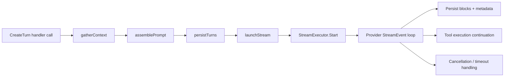
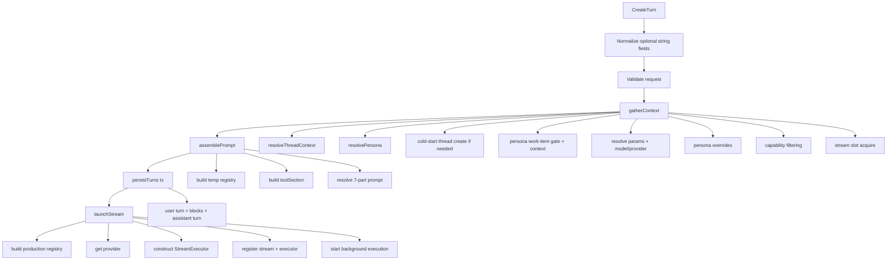
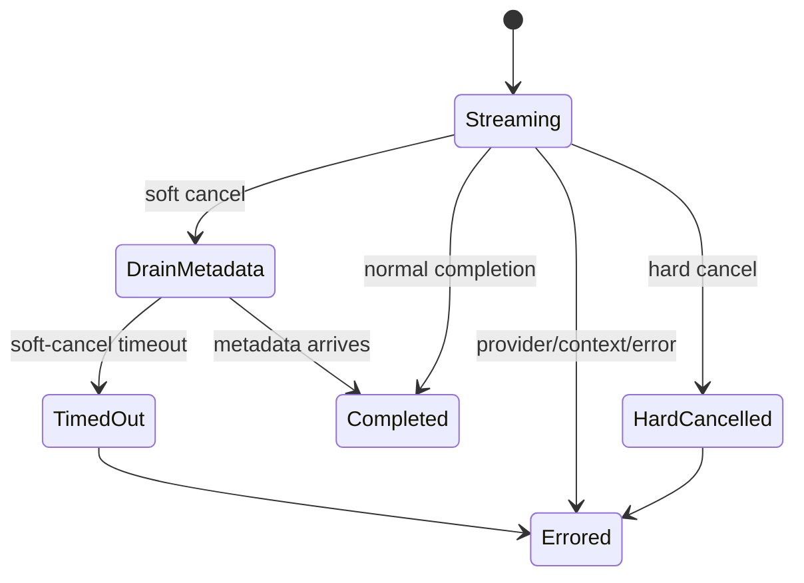

# Exploration: Streaming Pipeline and Prompt System

Date: 2026-03-25
Scope:
- Read all files under `backend/internal/service/llm/streaming/`
- Read all files under `backend/internal/domain/llm/`
- Deep-dive on pipeline architecture, prompt composition, turn creation orchestration, and stream executor lifecycle

---

## System map (high-level)

Primary orchestrator and stage boundary definition:
- `backend/internal/service/llm/streaming/turn_creation.go:5`
- `backend/internal/service/llm/streaming/turn_creation.go:34`
- `backend/internal/service/llm/streaming/turn_creation.go:77`

---

## 1) Pipeline architecture (gatherContext → assemblePrompt → persistTurns → launchStream)

### Key types and relationships

- `turnPipeline` is the per-request mutable state carrier across all four stages (`turn_creation.go:34`).
- `threadContext` contains resolved thread identity and cold/warm-start flags (`turn_creation.go:61`).
- `Service.CreateTurn` is intentionally thin orchestration: normalize → validate → run stages in order (`turn_creation.go:77`, `turn_creation.go:124`, `turn_creation.go:129`, `turn_creation.go:134`, `turn_creation.go:139`).

### Data flow and control flow

### Cold-start vs warm-start path

Cold-start:
- Trigger: request has `project_id` and no resolvable thread (`gather_context.go:532`).
- Thread is created in stage 1 before prompt resolution (`gather_context.go:61`, `gather_context.go:80`).
- Created thread ID is set into pipeline state (`gather_context.go:86`) and returned in response (`launch_stream.go:149`).

Warm-start:
- Trigger: via `prev_turn_id` or `thread_id` (`gather_context.go:485`, `gather_context.go:513`).
- Existing thread is loaded and preserved in `threadCtx.thread` for persona inheritance fallback (`gather_context.go:504`, `gather_context.go:524`).

Why this ordering exists:
- Explicit comment documents the R1 fix: prompt resolution previously saw `threadID=""` on cold start; thread creation moved earlier to guarantee a valid thread ID (`gather_context.go:31`, `gather_context.go:61`; reinforced by resolver contract at `system_prompt_resolver.go:60`).

### Non-obvious invariants and constraints

- `ctx` is not stored on `turnPipeline`; each stage receives it explicitly to follow Go context best practices (`turn_creation.go:32`).
- Stream slot ownership transfer invariant:
  - acquired in stage 1 (`gather_context.go:131`)
  - released by deferred guard on failure (`turn_creation.go:103`)
  - ownership transferred to executor cleanup callback on successful launch (`launch_stream.go:127`, `launch_stream.go:132`).
- Orphan cold-start thread cleanup invariant:
  - if thread was created but user turn was never persisted, delete thread in deferred cleanup (`turn_creation.go:110`).
- Stage 3 no longer creates thread, only turns (enforced by comment + implementation in `persist_turns.go:6`, `persist_turns.go:21`).

### Error handling strategy

- Stage failure returns immediately and aborts downstream stages (`turn_creation.go:125`, `turn_creation.go:130`, `turn_creation.go:135`).
- Non-critical metadata updates are best-effort warnings (example: `TouchLastActivityAt` warning in `persist_turns.go:79`).
- Launch-stage failures mark assistant turn error when possible before returning (`launch_stream.go:41`, `launch_stream.go:61`).

---

## 2) System prompt composition (7-position PromptContext)

### Contract and composition order

PromptContext contract:
- `backend/internal/domain/llm/system_prompt.go:24`
- 7-position order and extension-point behavior:
  - `backend/internal/domain/llm/system_prompt.go:43`
  - `backend/internal/service/llm/streaming/system_prompt_resolver.go:48`

Composition table:

| Position | Source | Code path |
|---|---|---|
| 1 | Base identity | `system_prompt_resolver.go:18`, `:74`, `:202` |
| 2 | Tool section (appended to base) | `system_prompt.go:30`, `system_prompt_resolver.go:74`, `:206` |
| 3 | Work context section | `system_prompt.go:35`, `system_prompt_resolver.go:78`, `:214` |
| 4 | Project system prompt | `system_prompt_resolver.go:91` |
| 5 | User system + thread.system_prompt | `system_prompt_resolver.go:101` |
| 6 | Skills content | `system_prompt_resolver.go:113`, `:137` |
| 7 | Persona body | `system_prompt.go:32`, `system_prompt_resolver.go:120` |

### How tools and skills are injected

Two distinct injection paths are intentionally separated:

1) Tool capabilities in system prompt:
- Temporary tool registry in stage 2 builds the tool section string (`assemble_prompt.go:45`, `:67`, `:71`).
- Resolver includes that tool section in positions 1+2 (`system_prompt_resolver.go:74`).

2) Skill content in prompt body:
- Resolver loads selected skills via `SkillResolver.Resolve` (`system_prompt_resolver.go:162`) and formats them with source path + fenced block (`system_prompt_resolver.go:179`).
- Header is emitted only if at least one skill loaded to avoid lying to model about available skills (`system_prompt_resolver.go:188`, `:194`).

Design rationale captured in comments:
- Skills metadata for tool descriptions is owned by tool system, not resolver, so metadata naturally disappears if model has no tool support (`system_prompt_resolver.go:23`, `assemble_prompt.go:27`).

### Persona override behavior

Persona affects three prompt-adjacent areas:

- Persona body injection at position 7:
  - extracted in stage 2 (`assemble_prompt.go:73`, `:76`)
  - injected by resolver (`system_prompt_resolver.go:120`).

- Persona-selected skills override request-selected skills:
  - if persona declares skills, it replaces client `selected_skills` (`assemble_prompt.go:80`, `:84`).

- Persona model/temperature/max_tokens overrides happen in stage 1:
  - applied after basic model/provider resolution and before capability filtering (`gather_context.go:121`, `:416`, `:428`).

### Non-obvious invariants and constraints

- `PromptContext.PersonaBody` is `*string` intentionally to avoid domain coupling to `domain/agents` type (`system_prompt.go:22`).
- Resolver loads thread and project from repositories even though `projectID` is in context, using thread as authoritative source (`system_prompt_resolver.go:85`, `:92`).
- `Resolve` guarantee: always at least base identity prompt (`system_prompt.go:53`, `assemble_prompt.go:139`).

### Error handling strategy

- Invalid project UUID for skills is non-fatal; resolver logs and returns empty skills section (`system_prompt_resolver.go:148`, `:151`).
- Individual skill load failures are warn-and-continue (`system_prompt_resolver.go:163`, `:164`).
- Thread/project load failures are fatal to prompt resolution (`system_prompt_resolver.go:87`, `:93`).

---

## 3) Turn creation flow (CreateTurn orchestration + error handling)

### Orchestration sequence

`CreateTurn` does:
1. Normalize empty optional IDs/slugs to nil (`turn_creation.go:78`)
2. Validate role/content basics (`turn_creation.go:92`)
3. Initialize `turnPipeline` and defer guards (`turn_creation.go:97`, `:103`, `:110`)
4. Execute 4 stages in strict order (`turn_creation.go:124`, `:129`, `:134`, `:139`)

### Stage responsibilities recap

- Stage 1 (`gatherContext`): thread/persona/work-item/project/params/model/provider/capabilities/stream slot (`gather_context.go:29`, `:44`).
- Stage 2 (`assemblePrompt`): build temporary tool registry + tool section + resolve system prompt into `params.System` (`assemble_prompt.go:16`, `:92`, `:94`).
- Stage 3 (`persistTurns`): transaction for user turn + blocks + assistant streaming turn (`persist_turns.go:17`, `:26`, `:65`).
- Stage 4 (`launchStream`): build production registry, create/register executor, start async execution (`launch_stream.go:17`, `:50`, `:87`, `:116`, `:142`).

### Key decision rationale from code comments

- Pipeline decomposition chosen for SRP/testability; one stage per concern (`turn_creation.go:5`, `:30`).
- Cold-start thread creation moved from persist tx to stage 1 to satisfy prompt-resolution thread ID dependency (`gather_context.go:31`, `:61`).
- Cleanup callback registered before executor registration to avoid lifecycle leak/race (`launch_stream.go:123`).

### Non-obvious invariants and constraints

- Server-side tool policy is authoritative; client-supplied `request_params.tools` is ignored/rewritten (`gather_context.go:304`, `tool_policy.go:9`).
- Capability filtering is fail-open when model missing from registry (`gather_context.go:370`, `:372`).
- Persona turns require work item lifecycle gate and may synthesize ephemeral work item (`gather_context.go:210`, `:241`).

### Error handling strategy

- Persona resolution errors preserve domain typing for proper HTTP mapping (422/etc) by rethrowing `DomainError` unchanged (`gather_context.go:191`).
- Work context resolution is non-fatal warn-and-continue (`gather_context.go:263`, `:267`).
- Provider/thread setup failures during launch attempt to persist assistant-turn error, then return (`launch_stream.go:41`, `:61`).

---

## 4) Stream executor and LaunchStream relationship

### How LaunchStream sets up executor

`launchStream` wiring sequence:
- Resolve thread and provider synchronously (`launch_stream.go:27`, `:53`).
- Build production tool registry (includes spawn tool and optional web search) (`launch_stream.go:156`, `:179`, `:185`, `:191`).
- Construct `StreamExecutor` with all collaborators (`launch_stream.go:87`).
- Register stream immediately before response return (`launch_stream.go:116`).
- Set cleanup callback before executor registration; transfer stream-slot ownership (`launch_stream.go:123`, `:132`).
- Register executor for interrupt lookups (`launch_stream.go:135`).
- Start background request-building + `executor.Start` (`launch_stream.go:142`, `:234`, `:303`).

### Relationship to StreamExecutor internals

`StreamExecutor` is the runtime state machine for one assistant turn (`stream_executor.go:29`):
- Owns provider stream loop, tool continuation logic, cancellation handling, metadata persistence, billing settlement, and AG-UI emission.
- Uses actor-pattern command channel for cancellation commands (`stream_executor.go:60`, `executor_state.go:65`, `cancel_handler.go:21`, `:39`).

### Executor state flow and cancellation model

Critical race guard:
- `PersistenceGuard` is disarmed before queueing cancel command to close cross-goroutine timing window (`cancel_handler.go:22`, `persistence_guard.go:10`).

Why this exists:
- Commented race: cancel intent could be queued while persist callback already passed state check; atomic guard makes cancel visible immediately (`persistence_guard.go:10`-`:19`).

### Data flow in streaming execution

1) `workFunc` admission gate + set turn status + start provider stream (`stream_executor.go:271`, `:288`, `:298`).
2) `processProviderStream` loop handles keepalive, control commands, provider events (`stream_executor.go:381`).
3) On metadata event, `handleCompletion` finalizes tokens, persists metadata, settles billing, and either continues tools or completes (`stream_executor.go:516`, `completion_handler.go:17`, `:115`, `:207`).
4) On errors/cancel/timeout, `handleError` or timeout handler persists partial state best-effort, emits AG-UI run error, and runs cleanup (`completion_handler.go:211`, `cancel_handler.go:56`).

### Error handling strategy

- Provider start has retry loop for retryable startup errors (`stream_executor.go:308`, `:321`).
- Completion path treats generation-record persistence as supplemental warning-only (`completion_handler.go:78`, `:82`).
- Final settlement never fails user-visible turn completion (`completion_handler.go:89`).
- Timeout path uses `context.Background()+deadline` to ensure cleanup even if request context died (`cancel_handler.go:80`, `stream_executor.go:20`).

---

## Additional cross-cutting observations

### Domain/service boundary quality

- Domain contracts are interface-driven (`streaming_service.go:11`, `provider.go:11`) and service depends on narrow ISP interfaces (`service.go:27`).
- Dependency graph is explicit and validated via grouped dependency structs (`deps.go:82`, `deps.go:212`).

### Prompt + tool consistency invariant

There are two tool registries per request:
- Temp registry for prompt tool section (`assemble_prompt.go:45`)
- Production registry for execution (`launch_stream.go:50`)

Both intentionally apply the same persona filter and work-item slug so prompt-advertised capabilities match runtime-enforced capabilities (`assemble_prompt.go:49`, `:62`; `launch_stream.go:161`, `:222`).

### Interrupt behavior contract

- `InterruptTurn` uses model capability `supports_streaming_cancel` to choose hard vs soft cancel (`interruption.go:56`, `:75`).
- Status set to cancelled at service layer; executor avoids overriding cancelled state with generic error (`interruption.go:67`, `completion_handler.go:307`).

---

## Issues / risks found during exploration

1. Explorer subprocesses (`p477`, `p478`) failed with `orphan_run`; all findings here were produced from direct source reading and session-history mining.
2. `applyModelCapabilities` is intentionally fail-open when capability lookup fails (`gather_context.go:372`). This preserves availability but risks tool-policy drift if registry coverage lags new models.
3. `getProviderFromModel` in interruption path uses simple prefix mapping (`interruption.go:157`), while normal request path uses shared mapping helper (`model_mapping.go:5`). This can diverge for future providers/model naming conventions.

---

## Verification performed

- Source exploration across all files in:
  - `backend/internal/service/llm/streaming/`
  - `backend/internal/domain/llm/`
- Spot-checked tests relevant to this flow:
  - `pipeline_stages_test.go`
  - `system_prompt_resolver_test.go`
  - `executor_test.go`
  - `persistence_guard_test.go`
  - `provider_errors_test.go`
  - `context_resolver_test.go`
  - `tool_policy_test.go`

No code changes were made; this was exploration/documentation-only output in `$MERIDIAN_WORK_DIR`.
