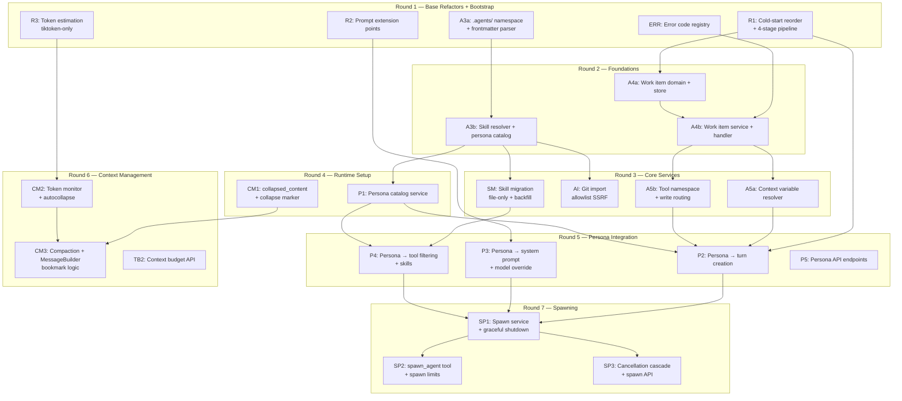

# v1 Backend Implementation Plan

24 steps across 7 rounds. Revised after 5-reviewer design review — deferrals cut ~10 steps, simplifications reduced risk in 3 more.

## How to Read This Plan

- **Steps** are independently testable units of work, bounded to specific files
- **Rounds** define parallelism — all steps in a round can run concurrently unless noted
- **Risk** determines agent staffing: 🔴 Critical → opus, 🟡 Medium → sonnet, 🟢 Low → routine
- **Context files** tell the coder exactly what to read before starting
- **Verification** criteria are concrete and checkable by a verification-tester agent

---

## Master Dependency Graph



---

## Round 1: Base Refactors + Bootstrap

All 5 steps are independent and run in parallel.

### Step R1: Cold-Start Reorder + 4-Stage Pipeline Decomposition

**Risk**: 🔴 Critical — refactoring the 929-line core entry point

| Attribute | Detail |
|-----------|--------|
| **Files to modify** | `backend/internal/service/llm/streaming/turn_creation.go` |
| **Files to create** | `backend/internal/service/llm/streaming/gather_context.go`, `backend/internal/service/llm/streaming/assemble_prompt.go`, `backend/internal/service/llm/streaming/persist_turns.go`, `backend/internal/service/llm/streaming/launch_stream.go` |
| **What changes** | 1) Move `ExecTx` (thread creation) BEFORE system prompt resolution on cold-start path — thread must exist before `resolveSystemPromptForParams()`. 2) Decompose `CreateTurn` into 4-stage pipeline: `gatherContext` (resolve thread, work item, persona), `assemblePrompt` (build tool registry, resolve system prompt), `persistTurns` (ExecTx for turns), `launchStream` (start streaming executor). Each stage is a method on a `turnPipeline` struct, testable in isolation. `CreateTurn` becomes the pipeline orchestrator calling stages in order. |
| **Agent** | opus coder, opus reviewer |
| **Verification** | 1. `make test` passes. 2. Cold-start turn creation still works (smoke test: create turn with only projectID). 3. Existing thread turn creation unchanged. 4. Thread has valid ID before prompt resolution. 5. Debug endpoint produces identical provider requests for same inputs. 6. Each pipeline stage is independently testable. 7. `turn_creation.go` reduced to pipeline orchestration (<200 lines). |
| **Context files** | `design/base-refactors.md` (R1 section), `streaming/turn_creation.go` (full file), `streaming/service.go` (StreamingDeps), `domain/llm/streaming_service.go`, `domain/llm/thread.go` |
| **Invalidates if fails** | A4b (work item gate), P2 (persona resolution), A5a (context variables) — anything that needs threadID before prompt |

### Step R2: System Prompt Extension Points

**Risk**: 🟡 Medium — interface change with known callers

| Attribute | Detail |
|-----------|--------|
| **Files to modify** | `backend/internal/domain/llm/system_prompt.go` (interface), `backend/internal/service/llm/streaming/system_prompt_resolver.go` (implementation), `backend/internal/service/llm/streaming/turn_creation.go` (caller — update `resolveSystemPromptForParams`) |
| **What changes** | Replace 7-param `Resolve()` signature with `PromptContext` struct. Add 7-position composition order. Extension point fields: `PersonaBody *string` (not full Persona struct — keeps domain/llm independent of domain/agents), `WorkContext *WorkContext`. Initially all new fields are nil (no behavioral change). **Prompt position order**: 1) Base identity, 2) Tool section, 3) Work context, 4) Project system prompt, 5) Thread system prompt, 6) Skills content, 7) Persona body. Note: positions 4-5 are project then thread (resolves spec inconsistency between base-refactors.md and streaming-integration.md). |
| **Agent** | sonnet coder, sonnet reviewer |
| **Verification** | 1. `make test` passes. 2. `PromptContext` struct defined with `PersonaBody *string`. 3. All callers updated (search `Resolve(` across codebase). 4. System prompt output identical when new fields are nil. 5. 7-position ordering implemented with positions 3 and 7 producing empty string when nil. 6. No import of `domain/agents` from `domain/llm`. |
| **Context files** | `design/base-refactors.md` (R2 section), `design/streaming-integration.md` (prompt architecture), `domain/llm/system_prompt.go`, `streaming/system_prompt_resolver.go` (full), `streaming/turn_creation.go` (resolveSystemPromptForParams function) |
| **Invalidates if fails** | P3 (persona body injection), work context injection |

**Design fix applied**: PromptContext carries `PersonaBody *string` instead of `*agents.Persona` (Architecture finding A2 — avoids coupling domain/llm → domain/agents). Prompt position spec inconsistency resolved: positions 4-5 are "Project system prompt" then "Thread system prompt" (Simplification bonus finding).

### Step R3: Token Estimation (Tiktoken-Only)

**Risk**: 🟢 Low — new code, no existing behavior changed

| Attribute | Detail |
|-----------|--------|
| **Files to create** | `backend/internal/service/llm/tokens/estimator.go` (interface + tiktoken impl), `backend/internal/service/llm/tokens/estimator_test.go` |
| **Files to modify** | None |
| **What changes** | `TokenEstimator` interface with `EstimateRequest()` and `EstimateText()`. Single `tiktokenEstimator` implementation using `tiktoken-go` with `cl100k_base` encoding. `TokenEstimate` struct with SystemTokens, MessageTokens, ToolTokens, TotalInput, ContextWindow, RemainingInput, UsagePercent. Wired with `CapabilityRegistry` for ContextWindow/MaxOutput lookups per model. No estimator registry, no fallback chain, no Anthropic API calls. ~5% variance is acceptable for 60%/80% threshold triggers. |
| **Agent** | sonnet coder, routine reviewer |
| **Verification** | 1. `make test` passes. 2. Unit tests for tiktoken estimator with known token counts. 3. UsagePercent calculated correctly against model's ContextWindow. 4. `go vet ./...` clean. 5. No external API calls made. |
| **Context files** | `design/base-refactors.md` (R3 section), `design/token-budget.md` (architecture), `tokens/token_counter.go` (existing), `capabilities/registry.go` (ContextWindow/MaxOutput) |
| **Invalidates if fails** | CM2 (token monitor) |

**Simplification applied**: Tiktoken-only (Decision 4). No Anthropic `count_tokens` API integration, no `EstimatorRegistry` with fallback chain, no heuristic estimator, no caching layer. 5% variance is within tolerance for autocollapse (60%) and autocompact (80%) thresholds. Anthropic estimator can be added later as an opt-in optimization.

### Step A3a: `.agents/` Namespace + Frontmatter Parser

**Risk**: 🟢 Low — new package, additive only

| Attribute | Detail |
|-----------|--------|
| **Files to create** | `backend/internal/pkg/frontmatter/parser.go` (YAML frontmatter parser), `backend/internal/pkg/frontmatter/parser_test.go`, `backend/internal/domain/agents/types.go` (Persona, RuntimeSkill, ValidationIssue types), `backend/internal/domain/agents/interfaces.go` (SkillResolver, PersonaCatalog, AgentImportService, BackfillService, GitFetcher interfaces) |
| **What changes** | Shared frontmatter parser: extract YAML between `---` delimiters, return parsed map + remaining body. Domain types for agents package. No service implementations yet. |
| **Agent** | sonnet coder, routine reviewer |
| **Verification** | 1. `make test` passes. 2. Frontmatter parser handles: valid YAML, missing frontmatter (error), empty body (error), unknown fields (allowed). 3. Domain types compile. 4. Interfaces have no concrete dependencies. |
| **Context files** | `design/file-first-storage.md` (frontmatter schema, validation rules, domain interfaces), `design/personas.md` (Persona struct), `domain/skill/project_skill.go` (existing skill types for reference) |
| **Invalidates if fails** | A3b (resolver), SM (skill migration), AI (import), P1 (persona catalog) |

### Step ERR: Error Code Registry

**Risk**: 🟢 Low — new package, no existing behavior changed

| Attribute | Detail |
|-----------|--------|
| **Files to create** | `backend/internal/domain/errors/codes.go` (structured error codes), `backend/internal/domain/errors/errors.go` (error types with codes) |
| **What changes** | Structured error codes for all new v1 error conditions: `WORK_ITEM_DONE` (409), `WORK_ITEM_DELETED` (409), `PERSONA_NOT_FOUND` (422), `PERSONA_INVALID` (422), `SKILL_NOT_FOUND` (404), `SKILL_INVALID` (422), `SPAWN_DEPTH_EXCEEDED` (429), `SPAWN_LIMIT_EXCEEDED` (429), `CONTEXT_BUDGET_EXCEEDED` (413), `IMPORT_VALIDATION_FAILED` (422), `NAMESPACE_ACCESS_DENIED` (403), `PATH_TRAVERSAL_DENIED` (403). Each error type carries a code string, HTTP status, and machine-readable detail. Handler middleware maps these to JSON error responses with `{code, message, detail}` shape. |
| **Agent** | routine coder, routine reviewer |
| **Verification** | 1. `make test` passes. 2. Error types implement `error` interface. 3. Each code has a unique string identifier. 4. HTTP status codes are correct per error type. 5. `go vet ./...` clean. |
| **Context files** | `handler/error.go` (existing error handling), `domain/llm/errors.go` (existing error patterns) |
| **Invalidates if fails** | Nothing critical — steps can fall back to ad-hoc errors, but structured codes are strongly preferred |

---

## Round 2: Foundations

Depends on: R1 (for A4a), A3a (for A3b). All steps run in parallel; A4b starts after A4a completes.

### Step A4a: Work Item Domain + Migration + Store

**Risk**: 🟡 Medium — large schema, but well-specified

| Attribute | Detail |
|-----------|--------|
| **Files to create** | `backend/migrations/00034_create_work_items.sql`, `backend/internal/domain/workitem/types.go`, `backend/internal/domain/workitem/interfaces.go` (Service + Store interfaces), `backend/internal/repository/postgres/workitem/store.go`, `backend/internal/repository/postgres/workitem/store_test.go` |
| **Files to modify** | `backend/migrations/00035_add_work_item_id_to_threads.sql` (add FK on chats/threads table) |
| **What changes** | `work_items` table with all indexes from design. Thread FK `work_item_id` nullable. Postgres store: Create, GetByID, GetBySlug, ListByProject (offset/limit pagination), Update, UpdateStatus, SoftDelete, AttachThread, ListThreads (returns workitem-local DTO, not `[]llm.Thread`), HasStreamingThreads, CountAttachedThreads, CountActiveEphemerals. **Per-project ephemeral cap**: CHECK or application-level enforcement — max 100 active ephemeral work items per project. |
| **Agent** | sonnet coder, opus reviewer (schema review critical) |
| **Verification** | 1. `make migrate-up` succeeds. 2. `make test` passes. 3. Store CRUD integration tests pass against local Supabase. 4. Offset/limit pagination returns correct order. 5. Partial unique index prevents duplicate active slugs. 6. `scripts/lint-migrations.sh` passes. 7. CountActiveEphemerals enforced. 8. ListThreads returns workitem-local DTO, not `[]llm.Thread`. |
| **Context files** | `design/work-items.md` (full — especially persistence section, slug generation, domain contracts), `design/streaming-integration.md` (schema changes), `repository/postgres/llm/thread_store.go` (existing thread pattern), `migrations/AGENTS.md` (migration rules), `domain/llm/thread.go` (Thread struct) |
| **Invalidates if fails** | A4b, A5a, A5b, P2, SP1 — work items are foundational |

**Design fixes applied**: Per-project ephemeral work item cap of 100 (Security finding S6). ListThreads returns workitem-local DTO instead of `[]llm.Thread` (Architecture finding A4). Offset/limit pagination instead of cursor-based (Simplification — expected scale is 10-50 active work items per project).

### Step A4b: Work Item Service + Handler + Thread Integration

**Risk**: 🟡 Medium — service logic + handler wiring

| Attribute | Detail |
|-----------|--------|
| **Files to create** | `backend/internal/service/workitem/service.go`, `backend/internal/service/workitem/service_test.go`, `backend/internal/handler/work_item.go`, `backend/internal/app/domains/workitem.go` (wiring module) |
| **Files to modify** | `backend/internal/service/llm/thread/service.go` (add WorkItemService dep, ephemeral creation), `backend/internal/domain/llm/thread.go` (add WorkItemID field), `backend/internal/repository/postgres/llm/thread_store.go` (persist/read work_item_id), `backend/internal/handler/thread.go` (add work_item_id filter to list) |
| **What changes** | Service: Create (with slug retry-on-collision), Get, List, Update, Complete (with streaming check), Reopen, Delete (with folder soft-delete), EnsureThreadWorkItem (ephemeral auto-create, checks per-project cap from A4a), AttachThread. Handler: all 7 REST endpoints from design. Thread integration: CreateThread accepts optional work_item_id, auto-creates ephemeral if missing. Uses structured error codes from ERR step. |
| **Agent** | sonnet coder, sonnet reviewer |
| **Verification** | 1. `make test` passes. 2. Create work item → artifact folder created in same tx. 3. Slug collision → auto-increment (-2, -3). 4. Complete while streaming → 409 with `WORK_ITEM_DONE` error code. 5. Thread created without work_item_id → ephemeral work item auto-created. 6. Ephemeral cap (100) enforced. 7. All 7 HTTP endpoints return correct status codes. |
| **Context files** | `design/work-items.md` (full — HTTP contracts, lifecycle, thread integration), `design/work-sessions.md` (enforcement points), `service/docsystem/document.go` (ExecTx pattern), `handler/thread.go` (existing handler pattern), `app/domains/` (wiring pattern), `domain/errors/codes.go` (from ERR) |
| **Invalidates if fails** | A5a (context vars need work item), A5b (write routing), SP1 (spawn needs work item) |

### Step A3b: Skill Resolver + Persona Catalog Implementations

**Risk**: 🟡 Medium — file-only resolution (simplified from dual-read)

| Attribute | Detail |
|-----------|--------|
| **Files to create** | `backend/internal/service/agents/skill_resolver.go`, `backend/internal/service/agents/persona_catalog.go`, `backend/internal/service/agents/skill_resolver_test.go`, `backend/internal/service/agents/persona_catalog_test.go` |
| **What changes** | `SkillResolver`: file-only read from `.agents/skills/<slug>/SKILL.md` via DocumentRepository. No DB fallback — file is the source of truth after backfill. Invalid file returns validation error. Listing reads all files, deduplicates by slug, reports invalid entries. `PersonaCatalog`: reads `.agents/agents/*.md`, parses frontmatter, validates fields, returns typed Persona structs + validation issues. |
| **Agent** | sonnet coder, sonnet reviewer |
| **Verification** | 1. `make test` passes. 2. File-backed skill resolves correctly. 3. Missing file → `SKILL_NOT_FOUND` error. 4. Invalid file → `SKILL_INVALID` error (no silent fallback). 5. Persona catalog returns valid personas + invalid entries separately. 6. Frontmatter parsing uses shared parser from A3a. |
| **Context files** | `design/file-first-storage.md` (resolution algorithm, invocation policy, domain interfaces, API contracts), `design/personas.md` (catalog service, Persona struct), `pkg/frontmatter/parser.go` (from A3a), `domain/agents/types.go` (from A3a), `service/skill/project_skill_service.go` (existing skill service for reference), `repository/postgres/docsystem/document_store.go` (DocumentRepository pattern) |
| **Invalidates if fails** | SM (skill migration), P1 (persona catalog), P4 (skill override) |

**Simplification applied**: File-only resolution (Decision 3). No dual-read bridge, no DB fallback logic, no "reserve slug even when invalid" rule. Backfill (SM step) migrates all DB skills to files first, then this resolver reads files only.

---

## Round 3: Core Services

Depends on: A3b (for SM, AI), A4b (for A5a, A5b). All steps run in parallel.

### Step SM: Skill Migration (File-Only After Backfill)

**Risk**: 🟡 Medium — must not break existing skill usage

| Attribute | Detail |
|-----------|--------|
| **Files to create** | `backend/internal/service/agents/backfill.go` (admin backfill — migrates all DB skills to files), `backend/internal/handler/agent_admin.go` (backfill endpoint) |
| **Files to modify** | `backend/internal/service/skill/project_skill_service.go` (legacy CRUD now writes directly to files instead of DB + shadow sync), `backend/internal/service/llm/tools/skill_invoke.go` (switch to SkillResolver), `backend/internal/service/llm/tools/builder.go` (accept SkillResolver for runtime skills), `backend/internal/service/llm/streaming/system_prompt_resolver.go` (switch loadSkills to SkillResolver) |
| **What changes** | Backfill: reads all `project_skills` rows, writes `.agents/skills/<slug>/SKILL.md` files via DocumentRepository, validates parity, tracks completion idempotently. Legacy CRUD routes write to files directly (one write path). Runtime paths (skill_invoke, skill_list, prompt injection) read through SkillResolver (file-only). No shadow file refresh, no dual-read bridge. |
| **Agent** | sonnet coder, sonnet reviewer |
| **Verification** | 1. `make test` passes. 2. Backfill endpoint creates files for all legacy skills. 3. Backfill is idempotent (re-run safe). 4. skill_invoke resolves file-backed skill. 5. Legacy create/update/delete operates on files. 6. Existing skill tests still pass. 7. `project_skills` table can be dropped after successful backfill (verified via migration or manual check). |
| **Context files** | `design/skill-migration.md` (backfill section), `design/file-first-storage.md` (resolution algorithm), `service/skill/project_skill_service.go`, `service/llm/tools/skill_invoke.go`, `service/llm/tools/builder.go`, `service/llm/streaming/system_prompt_resolver.go` (loadSkills), `service/agents/skill_resolver.go` (from A3b) |
| **Invalidates if fails** | P4 (persona skill override relies on SkillResolver) |

**Simplification applied**: File-only after backfill (Decision 3). No dual-read bridge, no shadow file refresh inside ExecTx on every legacy mutation, no "reserve slug even when invalid" rule. One write path instead of two.

### Step AI: Git Import + Import Service (Allowlist SSRF)

**Risk**: 🟡 Medium (downgraded from 🔴 — allowlist is much simpler than DNS-pinning)

| Attribute | Detail |
|-----------|--------|
| **Files to create** | `backend/internal/service/agents/git_fetcher.go` (GitFetcher impl), `backend/internal/service/agents/git_fetcher_test.go`, `backend/internal/service/agents/import_service.go`, `backend/internal/service/agents/import_service_test.go`, `backend/internal/handler/agent_import.go` |
| **What changes** | **GitFetcher**: ValidateURL (HTTPS-only, hostname must be in allowlist: `github.com`, `gitlab.com`, `bitbucket.org`), Clone (depth=1, 50MB repo cap, 1MB file cap), Validate (structure checks, binary detection, symlink rejection). No custom DNS resolver, no IP range checks, no pinned dialer. **Import service**: clone → extract `.agents/` → validate (frontmatter, structure) → always-overwrite collision policy → ExecTx batch write. Handler: `POST /api/projects/{id}/agents/import-git`. |
| **Agent** | sonnet coder, sonnet reviewer |
| **Verification** | 1. `make test` passes. 2. Reject non-HTTPS URLs. 3. Reject hosts not on allowlist. 4. Import from valid repo creates agents + skills. 5. Invalid frontmatter → 422, no partial writes. 6. Binary file → 422. 7. Symlinks rejected. 8. Atomic: all-or-nothing within ExecTx. 9. Clone respects 50MB repo cap. |
| **Context files** | `design/agent-import.md` (full — import semantics, structure validation), `domain/agents/interfaces.go` (GitFetcher interface from A3a), `service/docsystem/document.go` (ExecTx pattern) |
| **Invalidates if fails** | Nothing downstream depends on import |

**Simplifications applied**: Allowlist-only SSRF (Decision 2) — replaces full DNS-pinning with 3-host allowlist. Saves ~150 lines of security-critical code. Always-overwrite collision policy (no `skip` option). **⚠️ Pre-launch gate**: Full DNS-pinning SSRF protection must be implemented before opening agent import to external users.

### Step A5a: Context Variable Resolver

**Risk**: 🟢 Low — new code, simple resolution logic

| Attribute | Detail |
|-----------|--------|
| **Files to create** | `backend/internal/service/llm/streaming/context_resolver.go`, `backend/internal/service/llm/streaming/context_resolver_test.go` |
| **What changes** | `contextResolver` struct with `ResolveWorkContext(ctx, threadID, userID) (*ResolvedContext, error)`. Returns `WorkDir`, `FSDir`, `ThreadID`, `WorkItem` (slug). Looks up thread → work item → constructs paths. If thread has no work item, returns error (caller must ensure work item via A4b's EnsureThreadWorkItem). |
| **Agent** | sonnet coder, routine reviewer |
| **Verification** | 1. `make test` passes. 2. Thread with work item → correct paths. 3. Thread without work item → error. 4. FSDir always `.meridian/fs`. 5. WorkDir is `.meridian/work/<slug>/`. |
| **Context files** | `design/work-sessions.md` (context variable resolution, ResolvedContext struct), `design/agent-tools.md` (context variables table), `domain/workitem/types.go` (from A4a), `service/workitem/service.go` (from A4b) |
| **Invalidates if fails** | P2 (turn creation needs context), system prompt work context section |

### Step A5b: Tool Namespace Rewrite + Write Routing

**Risk**: 🟡 Medium — security boundary changes

| Attribute | Detail |
|-----------|--------|
| **Files to modify** | `backend/internal/service/llm/tools/text_editor.go` (add work-item isolation check, add workItemSlug field), `backend/internal/service/llm/tools/builder.go` (add WithWorkItemSlug, pass to text editor), `backend/internal/service/llm/tools/text_editor_test.go` (new isolation tests) |
| **What changes** | TextEditorTool gains `workItemSlug` field injected at construction. New `checkEditNamespaceAccess()` method with **mandatory order**: canonicalize path → detect namespace → check isolation. Never prefix-match uncanonicalized paths. Access rules: `.meridian/work/<slug>/` → only current work item's slug allowed. `.meridian/fs/` → any thread. `.agents/` → review-gated (autoapply=false on folder). Other `.meridian/` → denied. Write routing: all writes go through Yjs collab pipeline (existing `mutationStrategy`), autoapply flag on folder determines instant vs proposal. |
| **Agent** | sonnet coder, opus reviewer (security review) |
| **Verification** | 1. `make test` passes. 2. Write to own work dir → allowed. 3. Write to other work dir → rejected. 4. Write to `.meridian/fs/` → allowed. 5. Write to `.agents/` → allowed but review-gated. 6. Write to arbitrary `.meridian/` → denied. 7. Path traversal attempts (`..`) rejected after canonicalization. 8. Existing document operations unchanged (non-.meridian paths). 9. Canonicalize is called BEFORE any namespace prefix matching. |
| **Context files** | `design/agent-tools.md` (permission boundaries), `design/work-sessions.md` (write routing table, work-item isolation), `service/llm/tools/text_editor.go` (existing tool), `service/llm/tools/builder.go` (existing builder), `domain/docsystem/namespace.go` (namespace constants) |
| **Invalidates if fails** | P2 (tools built with work item context), SP1 (child threads need scoped tools) |

**Design fix applied**: Mandate canonicalize → namespace detect → isolation check order (Security finding S3). Never prefix-match uncanonicalized paths to prevent `..` traversal attacks.

---

## Round 4: Runtime Setup

Depends on: A3b (for P1), R3 (for CM1 via token awareness). Steps run in parallel.

### Step P1: Persona Domain + Catalog Service

**Risk**: 🟡 Medium — catalog resolution logic

| Attribute | Detail |
|-----------|--------|
| **Files to modify** | `backend/internal/domain/agents/types.go` (ensure Persona has all fields from design), `backend/internal/domain/agents/interfaces.go` (ensure PersonaCatalog has ListUserPersonas, ListSpawnablePersonas, ResolvePersona) |
| **Files to create** | `backend/internal/service/agents/persona_catalog_impl.go`, `backend/internal/service/agents/persona_catalog_impl_test.go` |
| **What changes** | Full PersonaCatalog implementation: reads `.agents/agents/*.md`, parses frontmatter with shared parser, validates all fields (name, description, model required; temperature in range; max_tokens > 0; skills reference check). **Model validation**: ResolvePersona validates that persona's model is available in the capability registry — rejects with `PERSONA_INVALID` if model is unknown or unavailable. ListPersonas returns all + validation issues. ListUserPersonas filters by `user_invocable=true`. ListSpawnablePersonas filters by `disable_model_invocation=false`. ResolvePersona returns single persona or 422. |
| **Agent** | sonnet coder, sonnet reviewer |
| **Verification** | 1. `make test` passes. 2. Valid persona file → resolves correctly. 3. Invalid frontmatter → validation issue, excluded from active list. 4. Missing required fields → error. 5. Unknown model → `PERSONA_INVALID` error. 6. ListUserPersonas excludes `user_invocable=false`. 7. ListSpawnablePersonas excludes `disable_model_invocation=true`. 8. Skills references validated against file tree. |
| **Context files** | `design/personas.md` (full — frontmatter spec, catalog service, visibility combinations), `design/file-first-storage.md` (agent-specific rules), `service/agents/persona_catalog.go` (from A3b — base implementation), `pkg/frontmatter/parser.go` (from A3a), `capabilities/registry.go` (model availability) |
| **Invalidates if fails** | P2, P3, P4, P5, SP1 — entire persona system |

**Design fix applied**: Validate model availability in ResolvePersona via capability registry (Security finding S7). Prevents personas from referencing non-existent or unavailable models.

### Step CM1: `collapsed_content` Column + Collapse Marker Turn Type

**Risk**: 🟢 Low — additive schema + turn type

| Attribute | Detail |
|-----------|--------|
| **Files to create** | `backend/migrations/00036_add_collapsed_content.sql` |
| **Files to modify** | `backend/internal/domain/llm/turn_block.go` (add CollapsedContent field), `backend/internal/service/llm/tools/text_editor.go` (compute collapsed_content on tool result), `backend/internal/service/llm/tools/search.go` (compute collapsed_content for doc_search results) |
| **What changes** | Add `collapsed_content TEXT` column to turn_blocks table. Tools compute collapsed_content at execution time: text_editor read → `"[Read <path>: <chars> chars, <section>]"`, text_editor edit → `"[Edited <path>: replaced '<old>' with '<new>']"`, doc_search → `"[Searched '<query>': <N> results in <dir>/]"`. No collapse marker turn yet — that comes with CM2. |
| **Agent** | sonnet coder, routine reviewer |
| **Verification** | 1. `make migrate-up` succeeds. 2. `make test` passes. 3. Tool execution stores collapsed_content. 4. collapsed_content is human-readable summary. 5. Existing tool results unchanged (collapsed_content is nullable). |
| **Context files** | `design/context-management.md` (collapsed_content section, tool examples), `domain/llm/turn_block.go` (existing TurnBlock), `service/llm/tools/text_editor.go` (tool result format) |
| **Invalidates if fails** | CM3 (MessageBuilder needs collapsed_content for collapse) |

---

## Round 5: Persona Integration (Sequential within round)

Depends on: P1, A5a, A5b, R1, R2. Steps P2-P5 are sequential because each builds on the previous.

### Step P2: Persona → Turn Creation Integration

**Risk**: 🔴 Critical — modifying the core turn creation path

| Attribute | Detail |
|-----------|--------|
| **Files to modify** | `backend/internal/domain/llm/thread.go` (add Persona field), `backend/internal/domain/llm/streaming_service.go` (add persona to CreateTurnRequest), `backend/internal/service/llm/streaming/turn_creation.go` (persona resolution, work item gate, context variable resolution — integrated into gatherContext stage from R1), `backend/internal/service/llm/streaming/service.go` (add PersonaCatalog + WorkItemService + contextResolver deps to StreamingDeps), `backend/internal/repository/postgres/llm/thread_store.go` (persist/read persona, work_item_id) |
| **Files to create** | `backend/migrations/00037_add_thread_persona.sql` (persona column on threads) |
| **What changes** | Turn creation `gatherContext` stage gains: 1) persona resolution via PersonaCatalog (if persona slug provided). 2) work item gate (reject turns on done/deleted work items). 3) context variable resolution (via contextResolver). 4) Lazy work item provisioning for legacy NULL threads. Thread stores persona slug. Cold-start: create thread with persona, then resolve. |
| **Agent** | opus coder, opus reviewer |
| **Verification** | 1. `make test` passes. 2. Turn with persona slug → persona resolved from catalog. 3. Invalid persona → 422 with `PERSONA_NOT_FOUND` code. 4. Turn on done work item → 409 with `WORK_ITEM_DONE` code. 5. Turn on deleted work item → 409 with `WORK_ITEM_DELETED` code. 6. Legacy thread (no work item) → ephemeral auto-provisioned. 7. Cold-start with persona → thread created with persona field. 8. All existing non-persona turns still work. |
| **Context files** | `design/streaming-integration.md` (turn creation flow), `design/work-sessions.md` (lifecycle enforcement), `design/personas.md` (persona application at turn creation), `streaming/turn_creation.go` (full file — this is the file being modified), `streaming/gather_context.go` (from R1), `streaming/service.go` (StreamingDeps), `streaming/context_resolver.go` (from A5a), `domain/llm/thread.go`, `service/workitem/service.go` (from A4b) |
| **Invalidates if fails** | P3, P4, P5, SP1 — all downstream persona features |

### Step P3: Persona → System Prompt + Model Override

**Risk**: 🟡 Medium — prompt composition ordering

| Attribute | Detail |
|-----------|--------|
| **Files to modify** | `backend/internal/service/llm/streaming/system_prompt_resolver.go` (populate positions 3 and 7 from PromptContext), `backend/internal/service/llm/streaming/turn_creation.go` (pass persona body + work context to PromptContext, apply model/temperature/max_tokens override — integrated into assemblePrompt stage from R1) |
| **What changes** | System prompt position 3: work context section (workspace info from ResolvedContext). Position 7: persona body (markdown after frontmatter). Model override: persona.Model replaces request model. Temperature/max_tokens override when persona specifies them. PromptContext carries `PersonaBody *string` extracted by caller. |
| **Agent** | sonnet coder, sonnet reviewer |
| **Verification** | 1. `make test` passes. 2. Persona body appears at position 7 in system prompt. 3. Work context at position 3. 4. Persona model overrides request model. 5. Persona temperature overrides request temperature. 6. No persona → positions 3 and 7 empty (backwards compat). 7. Cache-friendliness: stable prefix, persona body last. 8. PromptContext uses `PersonaBody *string`, not full Persona struct. |
| **Context files** | `design/streaming-integration.md` (prompt architecture, 7-position table), `design/base-refactors.md` (R2 — PromptContext), `design/work-sessions.md` (context variable injection template), `streaming/system_prompt_resolver.go`, `streaming/assemble_prompt.go` (from R1) |
| **Invalidates if fails** | Nothing directly, but persona UX is broken without correct prompts |

### Step P4: Persona → Tool Filtering + Skill Override

**Risk**: 🟡 Medium — tool registry modification

| Attribute | Detail |
|-----------|--------|
| **Files to modify** | `backend/internal/service/llm/tools/builder.go` (add WithPersonaToolFilter, accept SkillResolver for persona skills), `backend/internal/service/llm/streaming/turn_creation.go` (apply persona.Tools filter, load persona.Skills instead of selected_skills — integrated into assemblePrompt stage from R1) |
| **What changes** | When persona has `Tools` list: only register those tools. When persona has `DisallowedTools`: remove from inherited set. When persona has `Skills`: load those skills instead of client-provided `selected_skills`. ToolRegistryBuilder gains `WithPersonaToolFilter(allowedTools, disallowedTools)` that prunes after all tools are registered. |
| **Agent** | sonnet coder, sonnet reviewer |
| **Verification** | 1. `make test` passes. 2. Persona with Tools=["doc_search"] → only doc_search registered. 3. Persona with DisallowedTools=["web_search"] → web_search removed. 4. Persona with Skills=["story-bible"] → story-bible loaded, client skills ignored. 5. No persona → all tools inherited, client skills used. |
| **Context files** | `design/personas.md` (persona application at turn creation — tool filtering, skill override), `design/file-first-storage.md` (invocation policy enforcement), `service/llm/tools/builder.go`, `streaming/assemble_prompt.go` (from R1), `service/agents/skill_resolver.go` (from A3b) |
| **Invalidates if fails** | SP1 (spawned agents need correct tool sets) |

### Step P5: Persona API Endpoints

**Risk**: 🟢 Low — read-only endpoints over existing catalog

| Attribute | Detail |
|-----------|--------|
| **Files to create** | `backend/internal/handler/persona.go` |
| **Files to modify** | `backend/internal/app/domains/agents.go` (wiring), `backend/internal/handler/thread.go` (include persona in thread response) |
| **What changes** | `GET /api/projects/{id}/agents` → list personas from catalog. Thread detail response gains `persona`, `work_item_id`. Turn creation response includes persona info. |
| **Agent** | routine coder, routine reviewer |
| **Verification** | 1. `make test` passes. 2. List agents returns valid personas + invalid entries. 3. Thread detail includes persona slug. 4. Thread detail includes work_item_id. |
| **Context files** | `design/file-first-storage.md` (list agents API), `design/personas.md` (visibility), `handler/thread.go` (existing response format), `service/agents/persona_catalog_impl.go` (from P1) |
| **Invalidates if fails** | Nothing — UI integration only |

---

## Round 6: Context Management

Depends on: R3 (for CM2), CM1 (for CM3). Steps run in parallel.

### Step CM2: Token Monitor + Autocollapse

**Risk**: 🟡 Medium — threshold logic + executor integration

| Attribute | Detail |
|-----------|--------|
| **Files to create** | `backend/internal/service/llm/streaming/token_monitor.go`, `backend/internal/service/llm/streaming/token_monitor_test.go` |
| **Files to modify** | `backend/internal/service/llm/streaming/stream_executor.go` (call TokenMonitor after turn completion) |
| **What changes** | `TokenMonitor` struct: takes TokenEstimator + CapabilityRegistry. `CheckBudget()` returns `BudgetCheck` with ShouldCollapse/ShouldCompact/ShouldWarn. After turn completion in stream_executor: call CheckBudget, if ShouldCollapse → create collapse marker turn. Collapse marker is a system turn with type="collapse_marker". Context limit approaching → emit plain SSE event `{"type": "context_warning", "usage_percent": N}` (replaces deferred ThreadNotifier). |
| **Agent** | sonnet coder, sonnet reviewer |
| **Verification** | 1. `make test` passes. 2. Below 60% → no action. 3. At 60% → ShouldCollapse=true. 4. At 80% → ShouldCompact=true. 5. At 90% → ShouldWarn=true, SSE event emitted. 6. Collapse marker turn created when threshold hit. 7. Monitor doesn't block turn completion (async or fast). |
| **Context files** | `design/context-management.md` (triggers, escalation order), `design/token-budget.md` (token monitor, integration points), `streaming/stream_executor.go` (turn completion callback), `tokens/estimator.go` (from R3) |
| **Invalidates if fails** | CM3 (autocompact) |

### Step CM3: Compaction Service + MessageBuilder Bookmark Logic

**Risk**: 🟡 Medium — LLM call for summarization + message building changes

| Attribute | Detail |
|-----------|--------|
| **Files to create** | `backend/internal/service/llm/streaming/compaction_service.go`, `backend/internal/service/llm/streaming/compaction_service_test.go` |
| **Files to modify** | `backend/internal/service/llm/streaming/message_builder.go` (respect bookmark turns when building messages) |
| **What changes** | **CompactionService**: loads turns since last bookmark, sends to fast model (haiku-class) for summarization, creates compaction turn with summary as content. Autocompact triggered by TokenMonitor when ShouldCompact=true. Multiple compaction segments supported. Spawn results preserved as-is (already compact). **MessageBuilder changes**: 1) Find latest compaction turn → skip everything before it, use summary. 2) Find collapse marker → for tool_result blocks before marker, use collapsed_content if available. No interface change — markers are regular turns in the chain, MessageBuilder reads them during iteration. |
| **Agent** | sonnet coder, sonnet reviewer |
| **Verification** | 1. `make test` passes. 2. Compaction creates summary turn. 3. Summary includes persona context if active. 4. Multiple compaction segments chain correctly. 5. Spawn results not re-summarized. 6. Uses cheapest model for summarization. 7. Compaction turn → turns before it not sent, summary used. 8. Collapse marker → tool results before it use collapsed_content. 9. No bookmark turns → original behavior unchanged. 10. Multiple bookmarks → most recent of each type wins. |
| **Context files** | `design/context-management.md` (compaction flow, MessageBuilder section, bookmark pattern), `streaming/token_monitor.go` (from CM2), `domain/llm/turn.go` (turn types), `domain/llm/turn_block.go` (CollapsedContent from CM1), `domain/llm/message_builder.go`, `streaming/turn_creation.go` (how messages are loaded) |
| **Invalidates if fails** | Context management doesn't actually reduce tokens sent to LLM |

### Step TB2: Context Budget API Endpoint

**Risk**: 🟢 Low — read-only endpoint

| Attribute | Detail |
|-----------|--------|
| **Files to create** | `backend/internal/handler/context_budget.go` |
| **Files to modify** | `backend/internal/app/domains/llm.go` (wire endpoint) |
| **What changes** | `GET /api/threads/{id}/context-budget` → returns current token usage, remaining capacity, thresholds, estimation method. Uses TokenMonitor.CheckBudget() internally. |
| **Agent** | routine coder, routine reviewer |
| **Verification** | 1. `make test` passes. 2. Endpoint returns JSON matching design spec. 3. Includes model, context_window, usage_percent, thresholds. 4. `estimation_method` reports "tiktoken". |
| **Context files** | `design/token-budget.md` (API section), `streaming/token_monitor.go` (from CM2), `handler/thread.go` (existing handler pattern) |
| **Invalidates if fails** | Nothing — UI feature only |

---

## Round 7: Spawning

Depends on: P2-P4 complete. SP2 and SP3 depend on SP1.

### Step SP1: Spawn Service + Child Thread Bootstrap + Graceful Shutdown

**Risk**: 🔴 Critical — new orchestration primitive, circular dep resolution, shutdown coordination

| Attribute | Detail |
|-----------|--------|
| **Files to create** | `backend/internal/service/llm/streaming/spawn_service.go` (SpawnService + ChildThreadBootstrapper), `backend/internal/service/llm/streaming/spawn_service_test.go`, `backend/internal/domain/llm/spawn.go` (SpawnRequest, SpawnResult, SpawnInvoker interface), `backend/internal/service/llm/streaming/shutdown.go` (graceful shutdown coordinator) |
| **Files to modify** | `backend/internal/domain/llm/thread.go` (add ParentThreadID, SpawnStatus, SpawnResult, SpawnDepth fields), `backend/migrations/00038_add_thread_spawn_fields.sql` (parent_thread_id, spawn_status, spawn_result, spawn_depth columns + indexes), `backend/internal/repository/postgres/llm/thread_store.go` (persist/read spawn fields) |
| **What changes** | **SpawnService**: CreateSpawn (validate limits, resolve persona, create child thread, create initial user turn, start streaming, block on completion channel for foreground). `spawn_timeout`: 5-minute default, enforced via `context.WithTimeout`. `spawn_depth`: denormalized on thread row — `parent.spawn_depth + 1`, checked with simple column read (O(1) instead of ancestor walk). **ChildThreadBootstrapper**: extracted from CreateTurn path — creates thread + initial turns + starts streaming. **SpawnInvoker**: narrow interface for StreamingService to depend on — resolves circular dep. **SpawnResult**: extracted from child thread's final turn. **Graceful shutdown**: `ShutdownCoordinator` tracks all active stream executors + spawn wait channels. On SIGTERM: stop accepting new turns, wait for active streams (30s timeout), cascade-cancel remaining, close spawn channels. |
| **Agent** | opus coder, opus reviewer |
| **Verification** | 1. `make test` passes. 2. Foreground spawn creates child thread with parent_thread_id. 3. Child thread inherits work_item_id. 4. Child streams with persona. 5. Foreground spawn blocks until child completes. 6. Spawn result contains summary + artifacts. 7. Circular dependency cleanly resolved via interfaces. 8. spawn_depth denormalized correctly (parent+1). 9. Spawn times out after 5 minutes. 10. Graceful shutdown waits for active streams. 11. SIGTERM → no orphaned goroutines. |
| **Context files** | `design/subagent-spawning.md` (full — spawn flow, SpawnService, result schema, circular dep), `design/streaming-integration.md` (thread domain model, tool builder), `streaming/turn_creation.go` (entry point to extract ChildThreadBootstrapper from), `domain/llm/thread.go`, `repository/postgres/llm/thread_store.go` |
| **Invalidates if fails** | SP2, SP3 — entire orchestration layer |

**Design fixes applied**: spawn_timeout of 5 minutes with context.WithTimeout (Completeness finding C4). Denormalize spawn_depth on thread row for O(1) depth check (Security finding S8). Graceful shutdown for streaming + spawning (Completeness finding C2).

### Step SP2: `spawn_agent` Tool + Spawn Limits

**Risk**: 🟡 Medium — tool registration + limit enforcement

| Attribute | Detail |
|-----------|--------|
| **Files to create** | `backend/internal/service/llm/tools/spawn_agent.go`, `backend/internal/service/llm/tools/spawn_agent_test.go` |
| **Files to modify** | `backend/internal/service/llm/tools/builder.go` (add WithSpawnTool), `backend/internal/service/llm/tools/metadata.go` (add SpawnAgentToolMetadata), `backend/internal/service/llm/streaming/turn_creation.go` (wire spawn tool when work item exists), `backend/internal/service/llm/streaming/spawn_service.go` (add validateSpawnLimits) |
| **What changes** | **SpawnAgentTool**: takes projectID, userID, threadID, workItemID, spawnInvoker (narrow interface). Input schema: `{agent: string, prompt: string}`. Foreground only (background deferred to post-v1). Tool only registered when thread has work item and spawn service available. **Spawn limits**: before creating spawn, check spawn_depth < 3 (O(1) column read) and count running spawns per work item < 5 (with `SELECT ... FOR UPDATE`). Configurable limits. |
| **Agent** | sonnet coder, sonnet reviewer |
| **Verification** | 1. `make test` passes. 2. Tool registered when work item exists. 3. Tool NOT registered when no work item. 4. Valid spawn → child thread created, result returned. 5. Invalid persona slug → error result with `PERSONA_NOT_FOUND`. 6. Depth 3 → rejected with `SPAWN_DEPTH_EXCEEDED`. 7. 5 concurrent spawns → 6th rejected with `SPAWN_LIMIT_EXCEEDED`. 8. Concurrent limit check is race-safe (FOR UPDATE). |
| **Context files** | `design/subagent-spawning.md` (spawn tool, spawn limits section), `design/streaming-integration.md` (tool builder), `service/llm/tools/builder.go`, `service/llm/tools/metadata.go`, `service/llm/streaming/spawn_service.go` (from SP1) |
| **Invalidates if fails** | Nothing critical — spawning works without limits but could run away |

### Step SP3: Cancellation Cascade + Spawn API Endpoints

**Risk**: 🟡 Medium — cascade correctness + API integration

| Attribute | Detail |
|-----------|--------|
| **Files to create** | `backend/internal/handler/spawn.go` |
| **Files to modify** | `backend/internal/service/llm/streaming/stream_executor.go` (on interruption, cascade to children), `backend/internal/service/llm/streaming/spawn_service.go` (add CancelSpawn, add child executor tracking), `backend/internal/handler/thread.go` (extend thread detail response with spawn fields), `backend/internal/app/domains/llm.go` (wire spawn endpoints) |
| **What changes** | **Cancellation cascade**: when parent turn is interrupted, walk child threads (via parent_thread_id), cancel their active executors. SpawnService maintains a map of running child executors for cascade lookup. CancelSpawn: find child executor, call interrupt, update spawn_status to cancelled. **API endpoints**: `GET /api/threads/{id}/spawns` → list child threads with spawn status/result. `GET /api/projects/{id}/work-items/{slug}/thread-tree` → recursive thread tree. Thread detail gains: parent_thread_id, spawn_status, spawn_result, children_count. |
| **Agent** | sonnet coder, sonnet reviewer |
| **Verification** | 1. `make test` passes. 2. Cancel parent → children cancelled. 3. Cancel child → doesn't affect parent. 4. Already-completed children not affected. 5. No orphaned streaming children after parent cancel. 6. spawn_status updated to "cancelled". 7. Spawn list returns child threads. 8. Thread tree is recursive. 9. Thread detail includes all spawn fields. |
| **Context files** | `design/subagent-spawning.md` (cancellation cascade, API contracts), `streaming/stream_executor.go` (interruption handling), `streaming/spawn_service.go` (from SP1), `handler/thread.go` (existing response) |
| **Invalidates if fails** | Nothing critical — orphaned children can be cleaned up manually |

---

## Summary Table

| Round | Steps | Parallelism | Risk Profile | Estimated Sessions |
|:-----:|:-----:|:-----------:|:------------|:------------------:|
| 1 | R1, R2, R3, A3a, ERR | 5 parallel | 1 critical, 1 medium, 3 low | 5 |
| 2 | A4a, A4b, A3b | 3 parallel (A4b after A4a) | 3 medium | 3 |
| 3 | SM, AI, A5a, A5b | 4 parallel | 2 medium, 1 medium, 1 low | 4 |
| 4 | P1, CM1 | 2 parallel | 1 medium, 1 low | 2 |
| 5 | P2, P3, P4, P5 | Sequential | 1 critical, 2 medium, 1 low | 4 |
| 6 | CM2, CM3, TB2 | 3 parallel | 2 medium, 1 low | 3 |
| 7 | SP1, SP2, SP3 | SP2+SP3 after SP1 | 1 critical, 2 medium | 3 |
| **Total** | **24 steps** | | **3 critical, 13 medium, 8 low** | **24 sessions** |

## Agent Staffing Summary

### Reviewer Focus Areas + Model Assignments

Critical steps get 2 reviewers with different focus areas and different models (diversity catches more). Medium steps get 1 focused reviewer. Low-risk steps get a quick sanity check.

| Step | Risk | Coder | Reviewer 1 | Reviewer 2 | Focus Areas |
|------|:----:|-------|-----------|-----------|-------------|
| **R1** | 🔴 | opus | opus: **correctness** | gpt-5.3-codex: **SOLID** | All existing paths preserved? Pipeline decomposition clean? |
| **R2** | 🟡 | sonnet | sonnet: **correctness** | — | All callers updated? Nil-safe extension points? |
| **R3** | 🟢 | sonnet | routine: **correctness** | — | Known token counts match? |
| **A3a** | 🟢 | sonnet | routine: **correctness** | — | Edge cases: no frontmatter, empty body, unknown fields |
| **ERR** | 🟢 | routine | routine: **completeness** | — | All new error conditions covered? |
| **A4a** | 🟡 | sonnet | opus: **data model** | gpt-5.3-codex: **correctness** | Schema, indexes, constraints. Cursor pagination SQL correct? |
| **A4b** | 🟡 | sonnet | sonnet: **correctness** | — | Tx boundaries, ephemeral cap, slug collision retry |
| **A3b** | 🟡 | sonnet | sonnet: **SOLID** | — | ISP split, nil vs empty semantics, file-wins-over-DB rule |
| **SM** | 🟡 | sonnet | gpt-5.3-codex: **correctness** | — | Backfill idempotent? Legacy skill CRUD still works? |
| **AI** | 🟡 | sonnet | sonnet: **correctness** | gpt-5.3-codex: **security** | Atomic import, allowlist enforcement, rollback on failure |
| **A5a** | 🟢 | sonnet | routine: **correctness** | — | Path resolution correct? |
| **A5b** | 🟡 | sonnet | opus: **security** | gpt-5.3-codex: **correctness** | Path traversal, canonicalization order, symlinks |
| **P1** | 🟡 | sonnet | sonnet: **SOLID** | gpt-5.3-codex: **correctness** | ISP split, model validation, nil vs empty tools |
| **CM1** | 🟢 | sonnet | routine: **correctness** | — | Collapsed content human-readable? |
| **P2** | 🔴 | opus | opus: **correctness** | gpt-5.3-codex: **security** | Non-persona path unchanged? Model validation? Work item gate correct? |
| **P3** | 🟡 | sonnet | sonnet: **correctness** | — | Prompt position ordering correct? Cache-friendly? |
| **P4** | 🟡 | sonnet | gpt-5.3-codex: **correctness** | — | nil vs empty tools semantics preserved? |
| **P5** | 🟢 | routine | routine: **completeness** | — | All endpoints return correct shapes? |
| **CM2** | 🟡 | sonnet | sonnet: **correctness** | — | Thresholds trigger correctly? Monitor non-blocking? |
| **CM3** | 🟡 | sonnet | gpt-5.3-codex: **correctness** | — | Bookmark-absent path identical to current MessageBuilder? |
| **TB2** | 🟢 | routine | routine: **correctness** | — | Response matches spec? |
| **SP1** | 🔴 | opus | opus: **correctness** | gpt-5.3-codex: **SOLID** | No import cycles? Timeout works? Shutdown drains? spawn_depth denormalized? |
| **SP2** | 🟡 | sonnet | sonnet: **correctness** | — | Tool registered only with work item? Limits enforced atomically? |
| **SP3** | 🟡 | sonnet | gpt-5.3-codex: **correctness** | — | Cascade reliable? No orphaned children? |

### Model Distribution

| Model | Role | Steps |
|-------|------|:-----:|
| opus | coder | R1, P2, SP1 |
| opus | reviewer (deep) | R1, A4a, A5b, P2, SP1 |
| sonnet | coder | R2, R3, A3a, A3b, A4a, A4b, SM, AI, A5a, A5b, P1, P3, P4, CM1, CM2, CM3, SP2, SP3 |
| sonnet | reviewer | R2, A4b, A3b, AI, P1, P3, CM2, SP2 |
| gpt-5.3-codex | reviewer (diversity) | R1, A4a, SM, AI, A5b, P1, P2, P4, CM3, SP1, SP3 |
| routine | coder | ERR, P5, TB2 |
| routine | reviewer (quick) | R3, A3a, ERR, A5a, CM1, P5, TB2 |

**11 steps** get gpt-5.3-codex as a second reviewer for model diversity — all the medium+ risk steps where a different perspective catches different bugs.

### Background Agents (Run Per-Round)

These agents run after each round completes, not per-step. They operate on the cumulative state of the round's changes.

#### Documenter (per round)

Updates design docs, work item notes, and `_docs/` to reflect what actually shipped vs what was planned. Catches drift between design and implementation early.

| When | What it updates |
|------|----------------|
| After Round 1 | `_docs/technical/` backend architecture if pipeline decomposition changes patterns. `streaming/CLAUDE.md` with new pipeline stages. |
| After Round 2 | Work items design doc if schema changed during implementation. `_docs/features/` work items feature doc. |
| After Round 3 | Skill migration docs if backfill approach changed. Agent tools CLAUDE.md with namespace rules. |
| After Round 5 | Personas design doc with any implementation deviations. Prompt composition doc if positions shifted. |
| After Round 7 | Spawning design doc with actual spawn lifecycle. Update `_docs/future/refactoring-backlog.md` with new technical debt discovered. |

**Agent**: `documenter` (sonnet)

#### Decision Recorder (per round)

Captures implementation decisions with rationale — things that diverged from the plan, tradeoffs made under time pressure, shortcuts taken. Written to `$MERIDIAN_WORK_DIR/decisions/` so future agents can understand WHY something was built the way it was.

| File | Content |
|------|---------|
| `decisions/round-N.md` | Decisions made, alternatives considered, rationale, items flagged for later review |

Format per decision:
```
### D-{round}-{seq}: {title}
**Context**: What was the situation?
**Decision**: What was decided?
**Alternatives**: What was considered?
**Rationale**: Why this choice?
**Review later?**: Yes/No — if yes, what trigger would prompt reconsideration?
```

**Agent**: `documenter` (sonnet) — same agent, different output

#### QA Agents (per step)

Three QA agent types, tiered by risk. Different agents catch different failure classes:

| Agent | What it catches | Cost |
|-------|----------------|------|
| **verification-tester** | Build breaks, type errors, existing tests fail, lint failures | Cheap — runs existing suite |
| **unit-tester** | Edge cases the coder missed — writes NEW tests for tricky logic, boundary values, race conditions | Medium — generates code |
| **smoke-tester** | Integration failures — actual HTTP calls against running server, real DB, end-to-end scenarios | Expensive — needs running backend |

**Tiered QA by risk:**

| Risk | QA Team | Rationale |
|:----:|---------|-----------|
| 🔴 Critical | verification + unit-tester + smoke-tester | All three. Coder's tests pass but are they comprehensive? Unit-tester adds coverage for missed edges. Smoke-tester proves it works end-to-end. |
| 🟡 Medium (with endpoints) | verification + unit-tester + smoke-tester | Endpoints need end-to-end proof. Unit-tester catches edge cases in service logic. |
| 🟡 Medium (no endpoints) | verification + unit-tester | Build green + new tests for edge cases. No HTTP surface to smoke. |
| 🟢 Low | verification | Build green is sufficient for pure additive code. |

**Per-step QA assignments:**

| Step | Risk | verification | unit-tester | smoke-tester | Unit-tester focus |
|------|:----:|:---:|:---:|:---:|------|
| **R1** | 🔴 | yes | yes | yes | Pipeline stage isolation, cold-start vs warm-start edge cases, concurrent CreateTurn calls |
| **R2** | 🟡 | yes | yes | — | Nil PromptContext fields produce empty sections, all callers compile with new signature |
| **R3** | 🟢 | yes | — | — | — |
| **A3a** | 🟢 | yes | — | — | — |
| **ERR** | 🟢 | yes | — | — | — |
| **A4a** | 🟡 | yes | yes | yes | Slug collision retry (concurrent inserts), partial unique index behavior, cursor pagination boundary (empty page, single item, exact page size) |
| **A4b** | 🟡 | yes | yes | yes | Ephemeral cap enforcement (101st thread), complete-while-streaming race (thread starts streaming between check and status update), slug generation with accented characters |
| **A3b** | 🟡 | yes | yes | — | Invalid file reserves slug (no DB fallback), nil vs empty skills/tools, file-wins-over-DB with same slug |
| **SM** | 🟡 | yes | yes | yes | Backfill idempotency (run twice, same result), legacy CRUD still creates shadow files, delete cascades to shadow |
| **AI** | 🟡 | yes | yes | yes | Non-allowlisted host rejected, HTTP (not HTTPS) rejected, valid import creates all files atomically, partial failure rolls back |
| **A5a** | 🟢 | yes | — | — | — |
| **A5b** | 🟡 | yes | yes | yes | Path traversal payloads (`../../.agents/`, `%2e%2e/`, `.meridian/work/other-slug/`), cross-work-item write blocked, `.meridian/fs/` write allowed |
| **P1** | 🟡 | yes | yes | — | Model not in capability registry, temperature out of range, skills reference nonexistent skill, user_invocable=false excluded from user list |
| **CM1** | 🟢 | yes | — | — | — |
| **P2** | 🔴 | yes | yes | yes | Non-persona turn unchanged (regression), invalid persona slug returns 422 not 500, done work item returns 409, legacy thread (null work item) gets ephemeral, persona switch mid-thread |
| **P3** | 🟡 | yes | yes | — | Position ordering stable (compare hashes before/after), model override only when persona specifies it, nil persona = positions 3+7 empty |
| **P4** | 🟡 | yes | yes | — | `tools: null` (omitted) vs `tools: []` (empty) vs `tools: [x]` (explicit), disallowed-tools removes from inherited set, persona skills override client skills |
| **CM2** | 🟡 | yes | yes | — | Below threshold = no action, exactly at threshold = triggers, multiple thresholds in one check, monitor doesn't block turn completion |
| **CM3** | 🟡 | yes | yes | yes | No bookmarks = identical to current MessageBuilder (regression), compaction turn skips pre-bookmark turns, collapse marker uses collapsed_content, multiple bookmark segments chain |
| **TB2** | 🟢 | yes | — | — | — |
| **SP1** | 🔴 | yes | yes | yes | Spawn timeout fires (child cancelled after 5 min), spawn_depth denormalized correctly, circular parent_thread_id prevented by DB constraint, graceful shutdown drains active spawns, SpawnInvoker interface breaks no import cycles |
| **SP2** | 🟡 | yes | yes | yes | Tool registered only when work item exists, invalid persona slug = tool error not crash, concurrent spawn limit (6th spawn rejected), depth 3 allowed / depth 4 rejected |
| **SP3** | 🟡 | yes | yes | yes | Cancel parent cascades to children, already-completed children unaffected, no orphaned streaming children, spawn API returns correct status |

**QA agent totals:**

| Agent | Steps | Sessions |
|-------|:-----:|:--------:|
| verification-tester | 24 | 24 |
| unit-tester | 16 | 16 |
| smoke-tester | 12 | 12 |
| **Total QA sessions** | | **52** |

## Migration Sequence

Migrations must be applied in order and each must pass `scripts/lint-migrations.sh`:

| Migration | Step | What |
|:---------:|:----:|------|
| 00034 | A4a | Create `work_items` table |
| 00035 | A4a | Add `work_item_id` FK to threads |
| 00036 | CM1 | Add `collapsed_content` to turn_blocks |
| 00037 | P2 | Add `persona` column to threads |
| 00038 | SP1 | Add `parent_thread_id`, `spawn_status`, `spawn_result`, `spawn_depth` to threads |

## New Packages Created

| Package | Created in Step |
|---------|:--------------:|
| `backend/internal/pkg/frontmatter/` | A3a |
| `backend/internal/domain/agents/` | A3a |
| `backend/internal/domain/errors/` | ERR |
| `backend/internal/domain/workitem/` | A4a |
| `backend/internal/repository/postgres/workitem/` | A4a |
| `backend/internal/service/workitem/` | A4b |
| `backend/internal/service/agents/` | A3b |

## Risk Mitigation

| Risk | Mitigation |
|------|-----------|
| R1 cold-start reorder + decomposition breaks existing flows | Smoke test cold-start + existing thread creation. Debug endpoint comparison. Each pipeline stage tested independently. |
| A4a migration on large tables | FK is nullable with no backfill. Partial unique index is lightweight. |
| AI allowlist bypass | HTTPS + hostname validation only — simple and verifiable. Full SSRF protection deferred to pre-launch gate. |
| P2 persona integration breaks non-persona turns | All new fields nullable/optional. Non-persona path identical to current code. |
| SP1 circular dependency | Resolved via narrow interfaces (ChildThreadBootstrapper, SpawnInvoker). Opus reviewer verifies no import cycles. |
| CM3 MessageBuilder changes break message formatting | Bookmark-absent path must produce identical output to current MessageBuilder. |
| Graceful shutdown coordination | ShutdownCoordinator tested with simulated SIGTERM. 30s timeout prevents indefinite hang on deploy. |

## Review Decisions Applied

This plan reflects all decisions from the 5-reviewer design review synthesis:

| Decision | Outcome | Impact |
|----------|---------|--------|
| **D1**: Defer background + notifications + middleware | ✅ Accepted | -10 steps, -2 rounds |
| **D2**: Allowlist-only SSRF | ✅ Accepted | Risk ↓, pre-launch gate added |
| **D3**: File-only after backfill | ✅ Accepted | -3 steps of bridge complexity |
| **D4**: Tiktoken-only estimation | ✅ Accepted | -4 steps, no API/cache layer |
| **D5**: Keep collapse + compact | ✅ Accepted | Both retained |
| **D6**: Decompose turn_creation.go in R1 | ✅ Accepted | R1 expanded |

## Design Fixes Incorporated

| Finding | Fix | Step |
|---------|-----|:----:|
| **S3**: Path traversal via `..` | Mandate canonicalize → namespace detect → isolation check order | A5b |
| **S6**: Unbounded ephemeral work items | Per-project cap (100 active ephemerals) | A4a |
| **S7**: Persona model validation | Validate model availability via capability registry | P1 |
| **S8**: Spawn depth O(n) ancestor walk | Denormalize spawn_depth on thread row | SP1 |
| **A2**: PromptContext couples domain/llm → domain/agents | Pass PersonaBody *string, not full Persona struct | R2 |
| **A3**: turn_creation.go decomposition | 4-stage pipeline extraction | R1 |
| **A4**: WorkItemStore.ListThreads returns llm.Thread | Return workitem-local DTO | A4a |
| **C2**: No graceful shutdown | ShutdownCoordinator for streaming + spawning | SP1 |
| **C3**: No structured error codes | Error code registry in domain/errors | ERR |
| **C4**: Foreground spawn timeout | spawn_timeout (5 min) with context.WithTimeout | SP1 |
| **Bonus**: Prompt position spec inconsistency | Resolved: positions 4-5 = project then thread | R2 |

---

## Deferred to Post-v1

Items explicitly deferred. All are additive — they don't require rewriting v1 code.

| Item | Original Steps | Why Deferred | Migration Cost |
|------|:--------------:|-------------|----------------|
| **Background execution** (BG1, BG2) | ~4 | Foreground spawning covers v1 needs. No real users need concurrent agent work yet. | Additive: `background_tasks` table, goroutine manager, `check_background` tool. |
| **Thread notifications** (TN1, TN2) | ~4 | Only v1 use was context warnings — replaced with SSE event in CM2. | Additive: `internal` turn role, ThreadNotifier, WebSocket `thread_activity`. |
| **Provider middleware** (PM1, PM2) | ~4 | Zero v1 functionality. Billing settlement already works. Infrastructure for future hooks only. | Moderate: library refactor in meridian-llm-go + provider instantiation changes. |
| **Full SSRF DNS-pinning** | — | Allowlist is sufficient for admin-only imports. | **⚠️ Pre-launch gate**: must ship before opening agent import to external users. Custom net.Dialer, DNS resolution, IP range validation. |
| **Anthropic token counting API** | ~2 | 5% tiktoken variance is acceptable for threshold triggers. | Additive: new estimator implementation, opt-in per provider. |
| **Cursor-based pagination** | — | Expected scale: 10-50 items. Offset/limit is sufficient. | Schema change if needed later — no backward compat requirement. |
| **`query_history` tool** | — | Searches compacted history. Requires compaction to be battle-tested first. | Additive: new tool implementation reading compaction segments. |
| **`check_background` tool** | — | Only useful with background execution. | Ships with BG2. |
