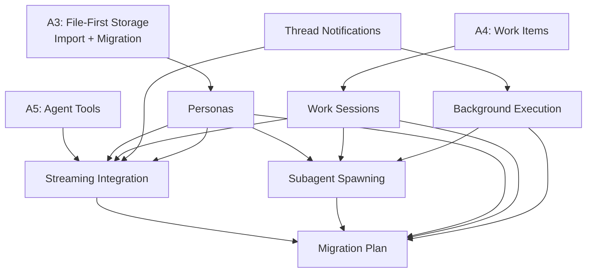

# Agents Feature

Unified agent system: personas define who runs and how, work sessions define where, spawning defines how they delegate.

## Doc Index

| Doc | Purpose |
|-----|---------|
| [personas](personas.md) | Persona schema, visibility flags, catalog service, skill visibility, distribution |
| [work-sessions](work-sessions.md) | Work item enforcement, context resolution, FS layout, write routing |
| [subagent-spawning](subagent-spawning.md) | Spawn-as-thread model, spawn tool, limits, cancellation cascade |
| [background-execution](background-execution.md) | Async tool primitive, durable task tracker, completion paths |
| [thread-notifications](thread-notifications.md) | ThreadNotifier, internal turns, WebSocket events, auto-wake |
| [context-management](context-management.md) | Autocollapse + autocompact: bookmark pattern, system-driven |
| [streaming-integration](streaming-integration.md) | Turn creation changes, system prompt composition, data model |
| [migration-plan](migration-plan.md) | Phased rollout, implementation surface, review findings |

## Foundation (prior designs — still valid as detailed specs)

| Doc | Purpose |
|-----|---------|
| [file-first-storage](file-first-storage.md) | A3: Storage model, .agents/ layout, frontmatter schema, validation, domain interfaces |
| [agent-import](agent-import.md) | A3: Git import flow, security, DNS rebinding, backfill, import-git endpoint |
| [skill-migration](skill-migration.md) | A3: Dual-read precedence, shadow refresh, reference migration, table drop plan |
| [work-items](work-items.md) | A4: Work item schema, lifecycle, artifact folders |
| [agent-tools](agent-tools.md) | A5: Document-native tools, bash sidecar |

## Dependency Graph

## v1 Scope

Mirrors Meridian CLI's core semantics (spawn, wait, check, cancel). Post-v1: continue/fork, stats, reports, --from context passing, permission tiers, marketplace UI.
