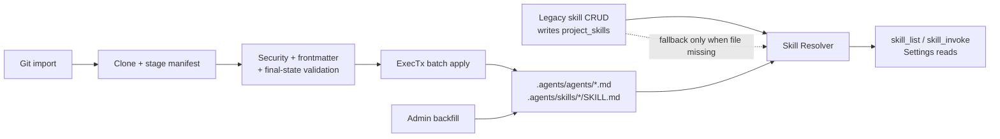

# File-First Agents & Skills

## Summary

Meridian is moving agents and skills to a file-first model rooted at `.agents/` in the project document tree. The long-term target is simple: the files are the configuration, and the Settings UI is a view over those files.

Phase 1 is intentionally transitional so the cutover is rollback-safe:

- `.agents/` is the new canonical read surface for agents and skills.
- `project_skills` remains the legacy write entrypoint for existing skill CRUD in Round 0.
- successful legacy DB writes regenerate the matching `.agents` shadow file for that skill.
- Runtime skill resolution is dual-read in Phase 1: file first, DB fallback only when the file is missing.
- Table drop is deferred to Round 2+ after the Settings UI validates parity.

This document fixes the Phase 1 gaps called out in review: transactional git import, git import security, invocation-policy frontmatter, dual-read precedence, invalid-file handling, backfill recovery, reference migration, domain interfaces, and backend API contracts.

## Problem

Current skill storage uses a split model:

- `project_skills` stores skill content and Meridian-specific metadata in Postgres.
- `/.meridian/skills/<name>/references/` stores reference files in the document tree.

That split causes:

- two sources of truth that can diverge
- import/export translation logic
- sync bookkeeping (`sync_state`, `is_dirty`, template linkage)
- poor portability to external harnesses that already understand `.agents/`

## Decision

The target storage model is `.agents/` in the project document tree.

Phase 1 keeps a compatibility bridge instead of attempting a destructive cutover:

1. Bootstrap `.agents/` and `.meridian/` transactionally when a project is created.
2. Backfill legacy skills into `.agents/skills/`.
3. Read from `.agents/` first at runtime.
4. Fall back to `project_skills` only when the file copy does not exist.
5. Keep legacy skill CRUD entering through `project_skills` until the Settings UI ships.
6. Regenerate the matching `.agents` shadow file after successful legacy skill mutations.
7. Drop `project_skills` and legacy reference paths in Round 2+.

This keeps existing flows working while allowing imported file-native agents and skills to exist immediately.

## Storage Layout

`.agents/` is a system folder in the document tree:

- hidden from the writer-facing explorer
- writable by agents, but review-gated because `.agents/` bootstraps with `autoapply=false`
- readable by Settings, runtime resolvers, and import/export code

Layout:

```text
.agents/
├── agents/
│   ├── writing-coach.md
│   └── continuity-checker.md
└── skills/
    ├── story-bible/
    │   ├── SKILL.md
    │   └── resources/
    │       └── example-bible.md
    └── prose-analysis/
        ├── SKILL.md
        └── resources/
```

Path rules:

- skill folder names are normalized slugs
- skill instructions must live at `.agents/skills/<slug>/SKILL.md`
- skill resource files must live under `.agents/skills/<slug>/resources/`
- agent profiles must live at `.agents/agents/<slug>.md`

## Phase 1 Architecture



Read/write rules in Phase 1:

| Concern | Phase 1 behavior |
|---|---|
| Runtime skill reads | File first, DB fallback |
| Runtime agent reads | Files only |
| Legacy skill CRUD API | Writes DB, then refreshes the matching file shadow |
| Git import | Writes `.agents/` only |
| Backfill | Writes `.agents/` only |
| Agent-authored edits to `.agents/` | Review-gated by `.agents/ autoapply=false` |
| Table removal | Deferred to Round 2+ |

## Frontmatter Schema

Phase 1 uses a strict minimum schema for files Meridian consumes directly. The schema is intentionally smaller than the current DB metadata model so portable bundles stay simple.

### SKILL.md

Required fields:

- `name` string
- `description` string

Optional fields:

- `enabled` boolean, default `true`
- `position` integer, default unset
- `version` string, optional opaque version label
- `user_invocable` boolean, default `true`
- `model_invocable` boolean, default `true`

Example:

```md
---
name: story-bible
description: Shared canon lookup and continuity rules
enabled: true
position: 10
version: "1.0.0"
user_invocable: true
model_invocable: false
---

# Instructions
...
```

### Agent Profile `.md`

Required fields:

- `name` string
- `description` string
- `model` string

Optional fields:

- `skills` array of strings, default empty list
- `enabled` boolean, default `true`
- `temperature` number, optional
- `max_tokens` integer, optional

Example:

```md
---
name: writing-coach
description: Developmental editor for long-form fiction
model: gpt-5.4
skills:
  - story-bible
  - prose-analysis
enabled: true
temperature: 0.3
max_tokens: 4000
---

You are a writing coach...
```

Invocation policy fields are intentionally not added to agent profile frontmatter in Phase 1. They are only meaningful for skill discovery and execution surfaces (`/skill`, `skill_list`, `skill_invoke`, and system-prompt skill injection). Adding them to agent files now would create metadata with no enforcement point. If external bundles include similarly named agent fields, they remain unknown fields and are ignored.

### Invocation policy semantics

File-backed skills and DB-backed skills must normalize to the same runtime policy model:

- `user_invocable` controls whether a user-facing slash command or Settings action may list or manually invoke the skill
- `model_invocable` controls whether the model may see the skill in prompt injection, `skill_list`, or execute it via `skill_invoke`
- absent frontmatter fields default to `true` so imported files preserve current DB defaults
- legacy DB metadata maps as `userInvocable -> user_invocable` and `disableModelInvocation -> model_invocable = !disableModelInvocation`

Enforcement matrix:

| Surface | Required policy |
|---|---|
| `/skill` listing | `user_invocable = true` |
| `/skill <name>` execution | `user_invocable = true` |
| `skill_list` tool | `model_invocable = true` for active `skills[]`; invalid file-backed slugs still surface in `invalid_entries[]` |
| `skill_invoke` tool | `model_invocable = true` unless the call is explicitly a user-triggered slash invocation |
| System prompt skill injection | `model_invocable = true` |

The resolver remains the source of truth for raw skill records. UI commands, prompt builders, and tools must all read from the same resolved catalog and then apply the appropriate policy filter instead of querying file state and DB state independently.

## Frontmatter Validation Rules

### Shared rules

A file is invalid when any of the following is true:

- missing YAML frontmatter at the top of the file
- YAML syntax does not parse
- required fields are missing
- field types are wrong
- file body is empty after frontmatter
- path does not match the expected structure
- normalized `name` does not match the file path slug

Unknown fields are allowed in Phase 1 but ignored by runtime. They do not fail validation. This keeps import compatible with external tool bundles that carry extra metadata Meridian does not yet use.

### Skill-specific rules

- `name` must normalize to a slug matching the folder name
- `description` must be non-empty
- `position`, when present, must be `>= 0`
- `version`, when present, must be non-empty
- `user_invocable`, when present, must be a boolean
- `model_invocable`, when present, must be a boolean
- `resources/` may contain only regular text files under the size limit

### Agent-specific rules

- `name` must normalize to a slug matching the file basename
- `description` must be non-empty
- `model` must be non-empty
- `skills`, when present, must be a list of normalized skill names
- `temperature`, when present, must be within the model layer's allowed numeric range
- `max_tokens`, when present, must be `> 0`

### Invalid frontmatter behavior

Behavior differs by entry point:

- git import: reject the entire import atomically with `422 Unprocessable Entity`; do not write partial files
- backfill: stop the run and return a structured error summary; do not mark the project complete
- catalog listing: exclude invalid files from the active `agents` or `skills` arrays, but include them in `invalid_entries`
- explicit skill resolve by name: if a matching file exists but is invalid, return validation error and do not silently fall back to DB

That last rule matters. Once a file exists in `.agents/`, it is the authoritative Phase 1 source for that slug. Falling back to the DB when the file is malformed would hide corruption and make debugging impossible.

## Name Normalization

Backfill and import both normalize names for paths:

- lowercase
- trim surrounding whitespace
- replace spaces and underscores with `-`
- strip characters outside `[a-z0-9-]`
- collapse repeated `-`
- trim leading and trailing `-`

Example mappings:

- `Story Bible` -> `story-bible`
- `WritingCoach` -> `writingcoach`
- ` prose_analysis ` -> `prose-analysis`

The normalized slug is used for folder names and file basenames. The frontmatter `name` remains the logical identifier, but it must normalize back to the same slug.

## Dual-Read Conflict Resolution

Phase 1 dual-read behavior is strict:

- DB remains the sole mutation entrypoint for legacy skill CRUD.
- Runtime reads are file first.
- DB is fallback only when the file copy does not exist.
- If both file and DB exist and disagree, the file wins.

Why file wins:

- backfill creates the file copy specifically so the runtime can start consuming the future storage format
- imported skills may exist only in files
- allowing DB to override a present file would make the cutover nondeterministic

For legacy-managed skills, successful DB writes must immediately refresh the corresponding `.agents` shadow file. "DB is the Phase 1 write path" means callers mutate through the DB-backed service, not that the file copy is allowed to drift.

Resolution algorithm for `ResolveSkill(projectID, name)`:

1. Normalize `name` to slug.
2. Look for `.agents/skills/<slug>/SKILL.md`.
3. If the file exists:
   - parse and validate it
   - return the file-backed skill
   - if invalid, return validation error
4. If the file does not exist:
   - query `project_skills` by legacy name
   - if found, materialize a runtime skill from DB fields
5. If neither exists, return not found

Listing behavior for runtime and Settings:

1. Enumerate all file-backed skill slugs under `.agents/skills/`
2. Parse and validate each file-backed skill, recording slug state as `valid` or `invalid`
3. Add valid file-backed skills to the resolved catalog
4. Query legacy DB skills
5. Add DB skills only when their normalized slug is not already present in the file scan, including invalid file-backed slugs
6. Report invalid file entries separately

That "reserve the slug even when invalid" rule is what keeps `skill_list`, `/skill`, and `ResolveSkill` consistent. If `.agents/skills/foo/SKILL.md` exists but is corrupted, `foo` must appear as invalid rather than disappearing behind a DB fallback row.

Transition timeline:

- Round 0 / Phase 1: legacy CRUD writes DB and refreshes the file shadow, runtime reads file first
- Round 1-2: Settings UI reads file catalog and validates parity
- Round 2+: CRUD moves fully to files, DB writes stop, `project_skills` is dropped

## Settings and Explorer Views

Two views exist over the same storage:

1. Explorer hides `.agents/` entirely.
2. Settings reads `.agents/` and renders agents and skills as structured records.

Phase 1 Settings expectations:

- list agents from `.agents/agents/*.md`
- list skills from merged dual-read catalog
- surface invalid file entries with path + validation error
- support git import entry point

Legacy skill mutation UI can continue using existing DB-backed routes until the file-native settings write flow lands.

Imported file-only agents and skills are read-only in Phase 1 unless changed through file-native system-folder writes. They are not materialized into `project_skills`.

## Git Import

Git import is a backend service, not a direct filesystem clone. It clones to a temp directory, stages a complete manifest, validates the final post-import tree, then applies the approved batch to the project's `.agents/` folder in a single DB transaction.

### Security requirements

Every import must enforce all of the following before any document write:

- HTTPS-only remote URLs
- reject `git://`, `ssh://`, `file://`, bare SCP syntax, and local paths
- resolve all A and AAAA records for the hostname before clone
- reject the import when resolution returns zero records
- reject the import when any resolved record is loopback, RFC 1918 private, IPv6 ULA, link-local, multicast, or otherwise non-public
- pin the validated IP set for the actual outbound git connection; do not re-resolve during clone
- clone with `--depth 1 --no-recurse-submodules`
- reject submodules even if present in the repo metadata
- enforce total clone size cap of `50 MB`
- enforce per-file size cap of `1 MB`
- reject symlinks
- reject binary files
- validate `.agents/` structure after clone and before import

The SSRF check applies to the resolved host, not just the URL string. DNS resolution is part of validation, and the validated resolution result must be the one actually used for the network connection.

### DNS rebinding mitigation

DNS rebinding protection is mandatory because a one-time DNS check is insufficient if the clone step performs a fresh lookup. Phase 1 therefore requires one of these concrete implementations:

1. preferred: a fetcher implementation that controls dialing directly and binds the git HTTPS connection to the previously validated IPs while preserving TLS verification against the original hostname
2. acceptable fallback: a Meridian-controlled outbound proxy that receives the validated hostname plus approved IP set and refuses to connect anywhere else

Running the raw `git` CLI against the original hostname without a pinned dial path is not sufficient for Phase 1 because it can re-resolve after validation and bypass the SSRF check.

### Host policy

Phase 1 does not hardcode a marketplace-only allowlist, but the interface supports both:

- `AllowedHosts`: optional allowlist, empty means allow all public hosts
- `BlockedHosts`: optional denylist, applied before allowlist success

This supports a future marketplace mode without changing the service boundary.

### Import semantics

Import is atomic at the service layer and must follow a stage then commit flow:

1. clone remote into temp dir
2. extract only `.agents/` files into an in-memory staged manifest of target folders, documents, and parsed frontmatter
3. validate remote, structure, security rules, frontmatter, cross-file references, and collision policy against the current project tree
4. materialize the final post-import tree in memory after applying the requested collision policy
5. if any fatal validation issue exists, return `422` and do not write
6. apply the entire import plan inside one `ExecTx` transaction
7. if any folder or document write fails, rollback the transaction and return an error

`ExecTx` is the hard boundary for "no partial `.agents/` state." Import must not call a per-file helper that commits independently. The batch applier must use tx-aware repository operations so the create/update set for `.agents/agents/**` and `.agents/skills/**` commits or rolls back as one unit.

Imported content is allowed to target system folders. That is intentional. `.agents/` is a first-class writable namespace, and import must use the normal `.agents/` write path rather than a privileged bypass so the existing system-folder policy remains authoritative.

### Import collision policy

Import collisions are resolved per target path after staging and before commit:

- request field: `collision_policy`
- allowed values: `overwrite`, `skip`
- default: `overwrite`
- overwrite means the staged document replaces the existing `.agents/` document or resource at that exact path
- skip means the existing project document wins and the staged entry is omitted from the commit plan
- type conflicts that cannot be reconciled safely, such as an existing document where the import requires a folder, remain `409 Conflict`

Validation always runs on the final post-policy tree snapshot. Overwrite does not bypass validation. The imported replacement must itself parse and validate, and the merged resulting tree must still satisfy path, schema, and reference rules before `ExecTx` begins.

### Git import domain abstraction

The import service must depend on a domain interface, not a concrete git implementation:

```go
package agents

import "context"

type GitCloneOptions struct {
	AllowedHosts []string
	BlockedHosts []string
	MaxRepoBytes int64
	MaxFileBytes int64
}

type ImportCollisionPolicy string

const (
	ImportCollisionOverwrite ImportCollisionPolicy = "overwrite"
	ImportCollisionSkip      ImportCollisionPolicy = "skip"
)

type ValidationIssue struct {
	Path     string
	Code     string
	Message  string
	Severity string
}

type GitFetcher interface {
	Clone(ctx context.Context, rawURL string, opts GitCloneOptions) (string, error)
	Validate(ctx context.Context, dir string) ([]ValidationIssue, error)
}
```

`Clone` returns a temp directory containing the fetched repo snapshot. `Validate` performs structure and safety validation over the cloned contents, including `.agents/` schema checks.

The concrete implementation may use the `git` binary only if the network path is pinned through a controlled proxy that enforces the validated host to IP mapping. Otherwise the implementation should use a fetcher that owns DNS resolution and dialing directly. The service consumes only `GitFetcher`.

## Structure Validation

Validation runs on the temp clone before any project write:

- repository must contain `.agents/`
- `.agents/skills/` entries must be directories
- each skill directory must contain exactly one `SKILL.md`
- `.agents/agents/` entries must be regular `.md` files
- no nested `.git` directories
- no path traversal segments
- no symlinks anywhere under `.agents/`
- only text files are allowed in Phase 1

Files outside `.agents/` are ignored by import.

Validation also runs against the computed post-import tree, not just the clone contents:

- no duplicate normalized skill slugs in the final tree
- no duplicate agent slugs in the final tree
- agent `skills` references must resolve against the final tree snapshot, not just the imported subset
- overwrite and skip decisions must be reflected in that final-tree validation before commit

## Backfill

Backfill migrates legacy DB-backed skills into `.agents/skills/` without breaking existing routes.

### Backfill rules

- idempotent per project
- safe to retry after partial failure
- uses privileged system-folder writes
- writes only missing files
- never deletes legacy DB rows or legacy reference files in Phase 1

### Algorithm

1. ensure `.agents/` exists
2. ensure `.agents/skills/` exists
3. list active `project_skills`
4. for each skill:
   - normalize `skill.Name` to slug
   - if `.agents/skills/<slug>/SKILL.md` already exists, skip document creation
   - otherwise create `SKILL.md` with generated frontmatter + DB content
   - copy legacy references into `.agents/skills/<slug>/resources/` when target files do not already exist
5. update backfill completion metadata

Backfill does not overwrite an existing `.agents` skill. Existing file content is treated as the newer source.

### Privileged context

Backfill is backend-controlled maintenance work, not a user or agent edit. It must use a privileged path that:

- can create documents inside `.agents/`
- bypasses review gating and reserved-name checks needed only for untrusted callers
- still runs inside a transaction boundary for each skill's document and resource creation

This matches the same privileged bootstrap path used when system folders are created at project creation time.

### Crash recovery and completion tracking

Progress is tracked on the `.agents/` system folder metadata:

- `agents_skills_backfill_version`
- `agents_skills_backfill_completed_at`
- `agents_skills_backfill_counts`

That metadata is advisory, not authoritative. The operation remains idempotent because the true guard is file existence:

- if `SKILL.md` exists, skip it
- if a copied resource already exists, skip it

The admin endpoint returns a structured summary so an interrupted run can be retried safely.

## Reference File Migration

Reference migration is copy-only in Phase 1:

- source: `/.meridian/skills/<legacy-name>/references/`
- destination: `.agents/skills/<slug>/resources/`

Why copy, not move:

- legacy code still expects the old location in Phase 1
- the Settings UI is not yet the sole management surface
- move semantics would make rollback harder

Phase plan:

- Phase 1: both locations exist
- Phase 1 runtime: file-native imports and future Settings use `resources/`
- legacy code: continues to read old reference location where needed
- Phase 2: after Settings UI validates parity, delete old reference trees and remove legacy readers

No bidirectional sync is attempted in Phase 1.

## Domain Interfaces

Phase 1 needs file-first services under a new `agents` domain package instead of overloading the legacy `skill` package with git import and file parsing responsibilities.

Suggested interfaces:

```go
package agents

import "context"

type SkillResolver interface {
	ListRuntimeSkills(ctx context.Context, projectID string) ([]RuntimeSkill, []ValidationIssue, error)
	ResolveSkill(ctx context.Context, projectID, skillName string) (*RuntimeSkill, error)
}

type AgentCatalogService interface {
	ListAgents(ctx context.Context, userID, projectID string) ([]AgentProfile, []ValidationIssue, error)
}

type AgentImportService interface {
	ImportGit(ctx context.Context, req ImportGitRequest) (*ImportResult, error)
}

type BackfillService interface {
	BackfillProject(ctx context.Context, projectID string) (*BackfillResult, error)
}
```

`ProjectSkillService` remains in place for legacy CRUD through Phase 1. `skill_list`, `skill_invoke`, slash-skill resolution, and prompt injection should move to `SkillResolver` so the LLM runtime and user-facing UI read the same merged file-first catalog the Settings UI sees.

## Backend Changes

Phase 1 backend work:

- keep `.agents/` as a first-class namespace in `NamespaceService`
- hide `.agents/` from writer-facing explorer responses
- add file-first agent and skill catalog services
- switch runtime skill resolution to the new file-first `SkillResolver`
- enforce invocation policy centrally for `skill_list`, `skill_invoke`, `/skill`, and prompt injection
- keep legacy skill CRUD routes for Round 0 compatibility, but refresh the file shadow after each successful mutation
- add git import service and HTTP endpoint
- add admin backfill endpoint
- surface invalid file entries in catalog responses

## API Contracts

Phase 1 adds file-first A3 endpoints without removing legacy skill routes.

### 1. List agents

`GET /api/projects/{projectId}/agents`

Purpose:

- Settings UI lists agent profiles from `.agents/agents/*.md`

Response `200`:

```json
{
  "agents": [
    {
      "name": "writing-coach",
      "slug": "writing-coach",
      "path": ".agents/agents/writing-coach.md",
      "description": "Developmental editor for long-form fiction",
      "model": "gpt-5.4",
      "skills": ["story-bible"],
      "enabled": true,
      "temperature": 0.3,
      "max_tokens": 4000
    }
  ],
  "invalid_entries": [
    {
      "path": ".agents/agents/broken.md",
      "code": "invalid_frontmatter",
      "message": "missing required field: model"
    }
  ],
  "count": 1
}
```

Errors:

- `401` unauthenticated
- `403` project access denied
- `404` project not found

### 2. Import agents and skills from git

`POST /api/projects/{projectId}/agents/import-git`

Request:

```json
{
  "url": "https://github.com/example/fiction-agents.git",
  "collision_policy": "overwrite"
}
```

Response `200`:

```json
{
  "imported_agents": 2,
  "imported_skills": 5,
  "imported_resources": 8,
  "overwritten": 3,
  "skipped": 0,
  "warnings": []
}
```

Errors:

- `400` malformed URL
- `401` unauthenticated
- `403` project access denied
- `409` imported path collides with an existing document that cannot be merged
- `422` validation failure, unsafe repo, invalid frontmatter, invalid structure, binary file, symlink, size cap exceeded

Import failure is atomic. No partial writes.

### 3. Internal runtime skill resolution

This is an internal service contract, not a public HTTP route.

Used by:

- `skill_list`
- `skill_invoke`
- prompt/tool builders that need available skills

Behavior:

- list returns merged file-first catalog plus validation issues
- resolve returns file version when present, DB fallback only when absent
- invalid file-backed slugs suppress DB fallback for both list and resolve
- tools and prompt builders must filter on invocation policy fields from the resolved catalog, not re-query legacy metadata
- `skill_list` returns model-invocable valid skills in `skills` plus file-backed validation problems in `invalid_entries` so corrupted files are visible instead of masked

Interface sketch:

```go
package agents

import "context"

type RuntimeSkill struct {
	Name           string
	Slug           string
	Description    string
	Content        string
	Enabled        bool
	UserInvocable  bool
	ModelInvocable bool
	Position       *int
	Version        *string
	Source         string
	SourcePath     string
}

type SkillResolver interface {
	ListRuntimeSkills(ctx context.Context, projectID string) ([]RuntimeSkill, []ValidationIssue, error)
	ResolveSkill(ctx context.Context, projectID, skillName string) (*RuntimeSkill, error)
}
```

### 4. Admin backfill trigger

`POST /api/admin/projects/{projectId}/agents/backfill`

Purpose:

- one-shot or retryable migration endpoint for Phase 1 rollout

Response `200`:

```json
{
  "project_id": "proj_123",
  "skills_total": 4,
  "skills_created": 3,
  "skills_skipped": 1,
  "resources_copied": 6,
  "completed_at": "2026-03-20T15:04:05Z"
}
```

Errors:

- `401` unauthenticated
- `403` non-admin caller
- `404` project not found
- `409` another backfill is already running for the project
- `422` generated file content failed validation

### Legacy routes that stay in Phase 1

Existing skill CRUD remains available and DB-backed:

- `POST /api/projects/{projectId}/skills`
- `GET /api/projects/{projectId}/skills`
- `GET /api/projects/{projectId}/skills/{skillId}`
- `PUT /api/projects/{projectId}/skills/{skillId}`
- `PUT /api/projects/{projectId}/skills/reorder`
- `DELETE /api/projects/{projectId}/skills/{skillId}`

Those routes are not the file-native target state. They are the compatibility write path until Round 2+.

## What Gets Removed in Round 2+

After Settings can validate and edit the file tree directly:

- `project_skills` table
- legacy skill CRUD handlers and services
- `/.meridian/skills/<name>/references/`
- dual-read fallback logic
- deprecated `EnsureMeridianSubfolder("skills")` path

## Non-Goals for Phase 1

- full marketplace trust model
- file-native write UI for every agent and skill field
- bidirectional sync between legacy DB and `.agents/`
- support for binary assets inside imported bundles
- destructive cleanup of legacy storage
