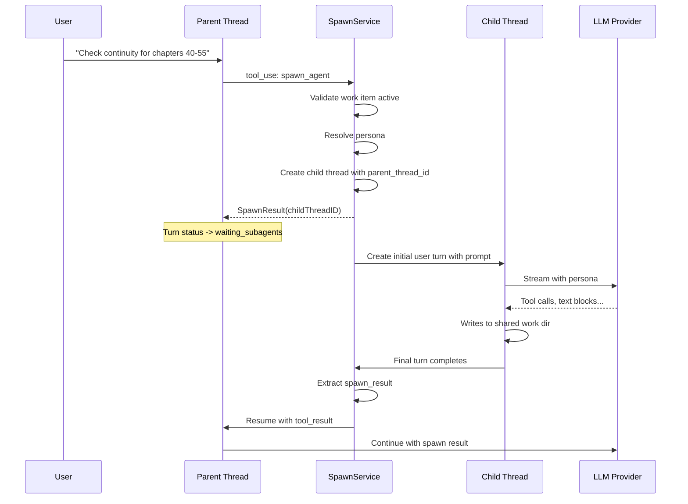

# Subagent Spawning

How agents delegate to other agents: spawn model, tool, lifecycle, limits, cancellation.

## Key Decision: Spawns Are Threads

No new "spawn" abstraction. A child thread is a regular thread with `parent_thread_id` set. Reuses all existing thread infrastructure (turns, blocks, streaming, SSE).

**Alternative considered**: Separate `spawns` table. Rejected because spawns ARE threads -- they have turns, they stream, they use tools. A parallel table would duplicate all thread infrastructure.

## Spawning Flow



## Spawn Tool

Exposed as a document-native tool (LLM decides when to spawn):

```go
type SpawnAgentTool struct {
    projectID    string
    userID       string
    threadID     string       // Parent thread
    workItemID   string       // Inherited work item
    spawnService SpawnService
}

// Tool input schema:
// {
//   "agent": "continuity-checker",     // required: persona slug
//   "prompt": "Check chapters 40-55",  // required: task description
//   "background": false                // optional: run in background (default false)
// }
```

## SpawnService Interface

```go
package spawn

type SpawnRequest struct {
    ProjectID      string
    UserID         string
    ParentThreadID string
    WorkItemID     string  // Inherited from parent
    AgentSlug      string
    Prompt         string
    Wait           bool    // If true, parent blocks until child completes
}

type SpawnResult struct {
    ChildThreadID string                 `json:"child_thread_id"`
    Status        string                 `json:"status"`
    Summary       string                 `json:"summary,omitempty"`
    Artifacts     []string               `json:"artifacts,omitempty"`
    Metadata      map[string]interface{} `json:"metadata,omitempty"`
}

type Service interface {
    CreateSpawn(ctx context.Context, req *SpawnRequest) (*SpawnResult, error)
    GetSpawnStatus(ctx context.Context, parentThreadID, childThreadID string) (*SpawnResult, error)
    ListSpawns(ctx context.Context, parentThreadID string) ([]SpawnResult, error)
    CancelSpawn(ctx context.Context, parentThreadID, childThreadID string) error
}
```

## Foreground vs Background

| Mode | Behavior | LLM sees |
|------|----------|----------|
| Foreground (default) | Tool blocks on channel/waitgroup. Child completion sends result, tool returns `tool_result` normally. | Slow tool call |
| Background | Returns immediately with task handle. Real work in goroutine. See [background-execution](background-execution.md). | `{"task_id": "bg_abc123", "status": "running"}` |

## Spawn Limits

- **Max spawn depth**: 3 (configurable). Orchestrator -> coder -> reviewer, no deeper.
- **Max concurrent spawns per work item**: 5 (configurable).
- **Credit gating**: Each spawn goes through `CreditGate` middleware. No separate budget -- credit gating prevents sequential drain.

Limit checks use `SELECT ... FOR UPDATE` in the same tx as row creation to prevent TOCTOU races under parallel tool execution.

```go
func (s *spawnService) validateSpawnLimits(ctx context.Context, req *SpawnRequest) error {
    depth, err := s.countAncestorDepth(ctx, req.ParentThreadID)
    if depth >= s.config.MaxSpawnDepth {
        return domain.NewValidationError(...)
    }
    running, err := s.countRunningSpawns(ctx, req.WorkItemID)
    if running >= s.config.MaxConcurrentSpawns {
        return domain.NewValidationError(...)
    }
    return nil
}
```

## Cancellation Cascade

When parent turn is interrupted, cascade cancel to all running children. This MUST ship with spawn support -- without it, cancelling a parent orphans children that keep consuming credits.

Interruption handler walks child threads and cancels their active executors.

## Spawn Result Schema

Typed schema enforced at service layer before DB write:

| Field | Type | Limit | Notes |
|-------|------|-------|-------|
| `summary` | string | 4KB | Required. Extraction fallback: explicit report > last text block > status message |
| `status` | string | -- | "succeeded" / "failed" |
| `artifacts` | []string | -- | File paths written |
| `metadata` | map | 8KB total | Free-form |

## API Contracts

### Spawn Status: `GET /api/threads/{id}/spawns`

```json
{
  "spawns": [
    {
      "child_thread_id": "uuid",
      "persona": "continuity-checker",
      "title": "Check chapters 40-55",
      "spawn_status": "succeeded",
      "spawn_result": {
        "summary": "Found 3 continuity issues...",
        "artifacts": [".meridian/work/revise-arc-3/continuity/issues.md"]
      },
      "created_at": "2026-03-22T10:00:00Z",
      "completed_at": "2026-03-22T10:02:30Z"
    }
  ]
}
```

### Thread Tree: `GET /api/projects/{id}/work-items/{slug}/thread-tree`

```json
{
  "threads": [
    {
      "id": "uuid",
      "title": "Orchestrate arc 3 revision",
      "persona": null,
      "spawn_status": null,
      "children": [
        {
          "id": "uuid",
          "title": "Check continuity chapters 40-55",
          "persona": "continuity-checker",
          "spawn_status": "succeeded",
          "children": []
        }
      ]
    }
  ]
}
```

### Thread Detail: `GET /api/threads/{id}` (extended)

Gains: `persona`, `work_item_id`, `parent_thread_id`, `spawn_status`, `spawn_result`, `children_count`.

## Circular Dependency Resolution

SpawnService needs to create child turns (-> StreamingService), but StreamingService needs SpawnService for the spawn_agent tool. Break via narrow interfaces:

- **`ChildThreadBootstrapper`**: Extracted from turn creation path. Creates thread + initial turns + starts streaming. SpawnService depends on this.
- **`SpawnInvoker`**: Narrow interface (CreateSpawn, GetStatus, Cancel). StreamingService depends on this.

Neither depends on the other's full interface.
