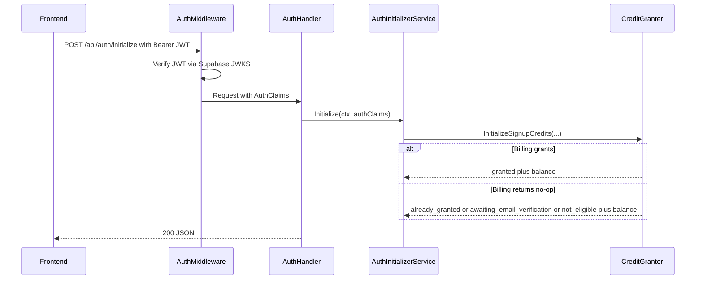

# Auth Design: Supabase JWT Context + Signup Initialization

> **Status: Implemented.** Auth handler, route wiring, and credit initialization are shipped. See `backend/internal/handler/auth_handler.go`, `backend/internal/app/domains/auth.go`, `backend/internal/service/billing/credit_granter.go`. This doc is retained as the design reference.

## Goal

A2 owns:

1. Supabase JWT verification and auth-context enrichment
2. Request-context propagation for authenticated fields needed by downstream services
3. `POST /api/auth/initialize`, the idempotent backend hook that turns a successful Supabase login into Meridian-side signup initialization

Frontend sign-in, sign-up, sign-out, password reset, and session management remain Supabase-client concerns.

## Why This Exists

A1 Billing depends on auth context richer than `user_id`. The credit-grant flow needs:

- `user_id`
- `email`
- `email_verified`
- `auth_provider`

Today the backend already verifies Supabase JWTs, but the authenticated request context only exposes `user_id`. A2 closes that gap and owns the backend contract for signup initialization so billing does not need to call Supabase on every request.

## Existing Code To Extend

- `backend/internal/auth/jwt_verifier.go`
- `backend/internal/auth/supabase_claims.go`
- `backend/internal/middleware/auth.go`
- `backend/internal/httputil/context.go`
- `backend/internal/domain/models/auth.go`
- `backend/cmd/server/main.go`

Related dependency owned by A1 Billing:

- `CreditGranter.InitializeSignupCredits(...)`
- unique partial index on billing lots for `(user_id, grant_reason)` with `grant_reason = 'signup_bonus_v1'`

## Scope

### In Scope

- Extend parsed Supabase JWT claims to derive `email_verified` and `auth_provider`
- Inject a full auth context into request context while keeping existing `user_id` helpers working
- Add `POST /api/auth/initialize`
- Define domain/service/handler boundaries and Go interfaces
- Document JWKS validation and deployment implications
- Define verification criteria for coder handoff

### Out of Scope

- Replacing Supabase Auth
- Server-side password reset, sign-in, sign-up, or session refresh routes
- Anonymous auth flows
- Billing schema design itself

## Key Decisions

### 1. JWT Is The Only Per-Request Auth Source

`POST /api/auth/initialize` must not call Supabase on every request. Eligibility comes from claims already present in the access token plus A1's idempotent billing interface.

### 2. Backward-Compatible Auth Context Enrichment

Existing handlers that call `httputil.GetUserID(r)` continue to work. New code gets richer helpers without forcing a repo-wide migration.

### 3. A2 Owns The Initialize Endpoint

The route lives in the auth handler/service layer, not billing. Billing supplies `CreditGranter`; auth owns request parsing, auth-context interpretation, and response shaping.

### 4. "Guest" Means Free-Tier Authenticated User, Not Anonymous Session

For v1 free tier:

- Google OAuth users get credits on first successful initialize call
- Email users get credits only after email verification
- No payment method is required

This design does not introduce unauthenticated or anonymous "guest" sessions.

## Auth Context Model

Expand the existing `backend/internal/domain/models/auth.go` type instead of introducing a second parallel auth model. The verified JWT result and the request-scoped auth context should be the same struct: `models.AuthClaims`.

```go
package models

import "time"

type AuthClaims struct {
    UserID        string
    Email         string
    EmailVerified bool
    AuthProvider  string
    ExpiresAt     *time.Time
}
```

This is the explicit A2 choice:

- keep `JWTVerifier.VerifyToken(...) (*models.AuthClaims, error)` unchanged
- expand `models.AuthClaims` with `EmailVerified` and `AuthProvider`
- store `models.AuthClaims` in request context

### Canonical `auth_provider` Values

For v1, A2 must normalize provider values to:

- `google`
- `email`
- `unknown`

Future providers can be added later without changing the handler contract.

### `email_verified` Derivation

Extend `SupabaseClaims` to parse the fields needed to derive verification state from the JWT:

```go
type SupabaseClaims struct {
    jwt.RegisteredClaims
    Email            string                 `json:"email"`
    EmailVerified    *bool                  `json:"email_verified,omitempty"`
    EmailConfirmedAt *string                `json:"email_confirmed_at,omitempty"`
    ConfirmedAt      *string                `json:"confirmed_at,omitempty"`
    AppMetadata      SupabaseAppMetadata    `json:"app_metadata"`
    Role             string                 `json:"role"`
    SessionID        string                 `json:"session_id"`
    IsAnonymous      bool                   `json:"is_anonymous"`
}

type SupabaseAppMetadata struct {
    Provider  string   `json:"provider"`
    Providers []string `json:"providers"`
}
```

Derivation rules:

1. If `email_verified` claim is present, use it.
2. Else if `email_confirmed_at` or `confirmed_at` is non-empty, treat email as verified.
3. Else if normalized provider is `google`, treat email as verified for signup-credit eligibility.
4. Else `email_verified = false`.

Provider derivation rules:

1. If `is_anonymous == true`, force provider to `unknown`.
2. Use `app_metadata.provider` if present.
3. Else use the first entry in `app_metadata.providers`.
4. Else if `email` is non-empty, use `email`.
5. Else `unknown`.

If `is_anonymous == true`, A2 must also force `email_verified = false` for initialize purposes even if other claims are unexpectedly present.

`unknown` is valid auth context for general authenticated requests, but `POST /api/auth/initialize` treats it as not eligible for signup credits.

## Request Context Enrichment

`backend/internal/httputil/context.go` should stop storing only a bare `user_id` value. Store the full auth context once, then provide helpers for individual fields.

```go
func WithAuthContext(r *http.Request, authClaims models.AuthClaims) *http.Request
func AuthClaimsFromContext(ctx context.Context) (models.AuthClaims, bool)

func UserIDFromContext(ctx context.Context) string
func EmailFromContext(ctx context.Context) string
func EmailVerifiedFromContext(ctx context.Context) bool
func AuthProviderFromContext(ctx context.Context) string

// Backward-compatible shims
func WithUserID(r *http.Request, userID string) *http.Request
func GetUserID(r *http.Request) string
```

Design notes:

- `GetUserID(r)` remains supported and should read from the stored auth context.
- New handlers/services should prefer `AuthClaimsFromContext(r.Context())` or the field helpers.
- Missing auth context returns zero values, matching current helper behavior.

## Middleware Design

`backend/internal/middleware/auth.go` remains transport-only:

1. Read `Authorization: Bearer <token>`
2. Call `JWTVerifier.VerifyToken`
3. Run blocklist check
4. Inject `AuthClaims` into request context
5. Call next handler

No billing logic and no signup logic belong in middleware.

### Middleware Pseudocode

```go
claims, err := jwtVerifier.VerifyToken(tokenString)
if err != nil {
    httputil.RespondError(w, http.StatusUnauthorized, "Invalid or expired token")
    return
}

if isIdentityBlocked != nil && isIdentityBlocked(claims.UserID, claims.Email) {
    httputil.RespondError(w, http.StatusForbidden, "Access denied")
    return
}

r = httputil.WithAuthContext(r, *claims)
next.ServeHTTP(w, r)
```

This preserves all current auth middleware behavior while making richer auth context available downstream.

## Service Architecture

Clean architecture split:

- handler: parse request, extract auth context, map service result to JSON
- service: determine eligibility and orchestrate `CreditGranter`
- domain: define interfaces and transport-agnostic result types

### Domain Interface

Add `backend/internal/domain/services/auth_initializer.go`:

```go
package services

import (
    "context"
    "meridian/internal/domain/models"
)

type AuthInitializer interface {
    Initialize(ctx context.Context, authClaims models.AuthClaims) (*InitializeAuthResult, error)
}

type InitializeAuthResult struct {
    UserID             string
    SignupCreditStatus string
    CreditsGranted     bool
    GrantReason        *string
    Balance            *CreditBalanceSnapshot
}

type CreditBalanceSnapshot struct {
    TotalBalanceMillicredits       int64
    PromotionalBalanceMillicredits int64
    PurchasedBalanceMillicredits   int64
    DisplayTotalCredits            string
}
```

### Billing Dependency

A2 consumes A1's billing-owned interface. The exact package path is owned by A1, but the contract used by A2 must be:

```go
type CreditGranter interface {
    InitializeSignupCredits(ctx context.Context, req InitializeSignupCreditsRequest) (*InitializeSignupCreditsResult, error)
}

// InitializeSignupCreditsRequest is the input to CreditGranter.InitializeSignupCredits.
type InitializeSignupCreditsRequest struct {
    UserID       string
    Email        string
    AuthProvider string // "google", "github", "email"
    EmailVerified bool
}

// InitializeSignupCreditsResult is the output of CreditGranter.InitializeSignupCredits.
type InitializeSignupCreditsResult struct {
    CreditsGranted              int64  // millicredits granted (0 if already initialized or email unverified)
    AlreadyInitialized          bool   // true if user was already initialized
    PromotionalBalanceMillicredits int64
    PurchasedBalanceMillicredits   int64
    TotalBalanceMillicredits       int64
}
```

For A2 to stay decoupled from the rest of billing, `InitializeSignupCreditsResult` must include:

- `signup_credit_status`
- `credits_granted`
- `grant_reason`
- `balance`

This is intentional: A2 needs a balance snapshot for all initialize outcomes, including `awaiting_email_verification` and `not_eligible`. The single billing interface must therefore return balance even when it decides not to mint a signup lot.

### Service Implementation

Create `backend/internal/service/auth/initializer.go`:

```go
type AuthInitializerService struct {
    creditGranter billing.CreditGranter
}
```

#### Initialize Algorithm

1. Validate required auth context:
   - `user_id` must be non-empty
2. Normalize provider into `google`, `email`, or `unknown`
3. Call `creditGranter.InitializeSignupCredits(...)` for all normalized providers
4. Let billing return the authoritative initialize status:
   - `granted`
   - `already_granted`
   - `awaiting_email_verification`
   - `not_eligible`
5. Map the billing result directly into the auth response model

Returned statuses:

- `granted`
- `already_granted`
- `awaiting_email_verification`
- `not_eligible`

`awaiting_email_verification` and `not_eligible` are successful `200` responses, not errors.

Why the billing call still happens for non-grant outcomes:

- one idempotent boundary owns signup initialization
- A2 gets an accurate balance snapshot without depending on a second billing reader interface
- duplicate-grant handling stays inside the billing-owned service

## Endpoint Contract

### `POST /api/auth/initialize`

Authenticated. No request body required beyond `{}`.

Purpose:

- finalize Meridian-side signup initialization after a Supabase session exists
- no-op safely if the user is not yet eligible
- no-op safely if the signup bonus was already granted

#### Request

Headers:

- `Authorization: Bearer <supabase_access_token>`

Body:

```json
{}
```

The handler accepts an empty body or no body. It must not require transport fields because all input comes from authenticated request context.

Implementation note: do not call `httputil.ParseJSON()` for this endpoint. An empty request body is valid.

#### Response `200`

```json
{
  "user_id": "8d4d8d94-0f72-45c5-9558-7d65c2c4e90f",
  "signup_credit_status": "granted",
  "credits_granted": true,
  "grant_reason": "signup_bonus_v1",
  "balance": {
    "total_balance_millicredits": 300000,
    "promotional_balance_millicredits": 300000,
    "purchased_balance_millicredits": 0,
    "display_total_credits": "300.0"
  }
}
```

Other valid success examples:

Email not yet verified:

```json
{
  "user_id": "8d4d8d94-0f72-45c5-9558-7d65c2c4e90f",
  "signup_credit_status": "awaiting_email_verification",
  "credits_granted": false,
  "grant_reason": null,
  "balance": {
    "total_balance_millicredits": 0,
    "promotional_balance_millicredits": 0,
    "purchased_balance_millicredits": 0,
    "display_total_credits": "0.0"
  }
}
```

Already initialized:

```json
{
  "user_id": "8d4d8d94-0f72-45c5-9558-7d65c2c4e90f",
  "signup_credit_status": "already_granted",
  "credits_granted": false,
  "grant_reason": "signup_bonus_v1",
  "balance": {
    "total_balance_millicredits": 300000,
    "promotional_balance_millicredits": 300000,
    "purchased_balance_millicredits": 0,
    "display_total_credits": "300.0"
  }
}
```

Unsupported provider:

```json
{
  "user_id": "8d4d8d94-0f72-45c5-9558-7d65c2c4e90f",
  "signup_credit_status": "not_eligible",
  "credits_granted": false,
  "grant_reason": null,
  "balance": {
    "total_balance_millicredits": 0,
    "promotional_balance_millicredits": 0,
    "purchased_balance_millicredits": 0,
    "display_total_credits": "0.0"
  }
}
```

#### Errors

- `401 Unauthorized`: missing, malformed, expired, or invalid JWT
- `403 Forbidden`: identity blocked by server blocklist
- `500 Internal Server Error`: billing dependency or internal persistence failed

No `409` is exposed for duplicate grants. Idempotency is resolved inside the billing layer and surfaced as `already_granted`.

This contract is auth-owned and supersedes the provisional `POST /api/auth/initialize` snippet in the billing design doc if they diverge.

## Other Auth Endpoints

None are added in A2 backend scope.

Rationale:

- sign-in/sign-up/sign-out are already handled by Supabase client code in the frontend
- password reset and email verification stay Supabase-managed
- backend only needs authenticated JWT verification plus initialization hook

If a future backend-owned `/api/auth/me` endpoint is added, it should be a separate work item. It is not required for v1 billing integration.

## Route Wiring

Add an auth handler and register:

```go
authInitializer := authservice.NewAuthInitializerService(creditGranter)
authHandler := handler.NewAuthHandler(authInitializer, logger, cfg)

mux.HandleFunc("POST /api/auth/initialize", authHandler.Initialize)
```

This route stays behind the existing global auth middleware. No auth bypass is needed.

## Request Flow



## JWKS Validation

Existing behavior in `backend/internal/auth/jwt_verifier.go` remains the base design:

- JWKS URL is derived from `SUPABASE_URL + /auth/v1/.well-known/jwks.json`
- keys are cached and refreshed by `keyfunc`
- allowed algorithms remain `RS256` and `ES256`
- JWT validation happens server-side for every authenticated API request

### New Frontend Domain Impact

No JWT verifier change is required when the frontend domain changes. JWKS validation is tied to the Supabase project, not the frontend host.

Deployment changes required for a new frontend domain:

- add the new frontend origin to backend `CORS_ORIGINS`
- add the domain to Supabase redirect URL configuration if auth redirects use it

No A2 code change is required just because the frontend hostname changes.

## Migration Impact

### A2-Owned Migrations

None.

### A2 Dependency On A1

A2 depends on A1 billing migration work for idempotency:

- signup bonus lot creation
- unique partial index preventing duplicate `signup_bonus_v1` grants

That migration remains billing-owned. A2 adds no new tables or columns.

## File Plan

Expected implementation touch points:

- `backend/internal/domain/models/auth.go`
- `backend/internal/domain/services/auth_initializer.go`
- `backend/internal/auth/supabase_claims.go`
- `backend/internal/auth/jwt_verifier.go`
- `backend/internal/middleware/auth.go`
- `backend/internal/httputil/context.go`
- `backend/internal/service/auth/initializer.go`
- `backend/internal/handler/auth.go`
- `backend/cmd/server/main.go`

## Verification Criteria

### Unit Tests

`backend/internal/auth/jwt_verifier_test.go`

- parses `email_verified=true`
- derives verified from `email_confirmed_at`
- derives provider from `app_metadata.provider`
- falls back to provider list or `email`
- rejects invalid signature, invalid alg, missing `sub`, wrong role

`backend/internal/middleware/auth_test.go`

- stores full auth context in request context
- `GetUserID(r)` still returns the correct user id
- new helpers return email, verification state, and provider
- blocked identities still return `403`

`backend/internal/service/auth/initializer_test.go`

- google user grants credits on first call
- google user returns `already_granted` on second call
- email user with `email_verified=false` returns `awaiting_email_verification`
- email user with `email_verified=true` returns `granted` or `already_granted`
- unsupported provider returns `not_eligible`
- all successful statuses include a balance snapshot from billing
- empty `user_id` or malformed auth context returns validation/internal error according to chosen implementation

`backend/internal/handler/auth_test.go`

- `POST /api/auth/initialize` returns `200` on all non-error statuses
- `401` on missing or invalid auth
- `500` when service fails
- response body matches contract including `user_id`, `credits_granted`, and `balance`

### Integration / Smoke Tests

- login with Google in local/dev environment, call `/api/auth/initialize`, confirm 300 free credits
- login with email/password before verification, confirm `awaiting_email_verification`
- verify email, call `/api/auth/initialize` again, confirm grant
- call `/api/auth/initialize` repeatedly, confirm no duplicate lots

## Coder Handoff Notes

- Prefer typed `app_metadata` parsing over `map[string]interface{}` for the fields A2 depends on.
- Keep handler logic thin. Eligibility rules belong in `AuthInitializerService`.
- Do not add outbound Supabase API calls to initialize flow.
- Do not parse a JSON request body for `POST /api/auth/initialize`; empty body is part of the contract.
- Keep the legacy `GetUserID(r)` helper working so A2 can land without a whole-backend handler rewrite.
