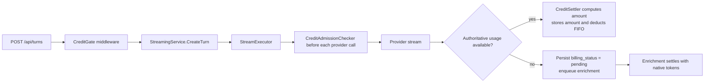
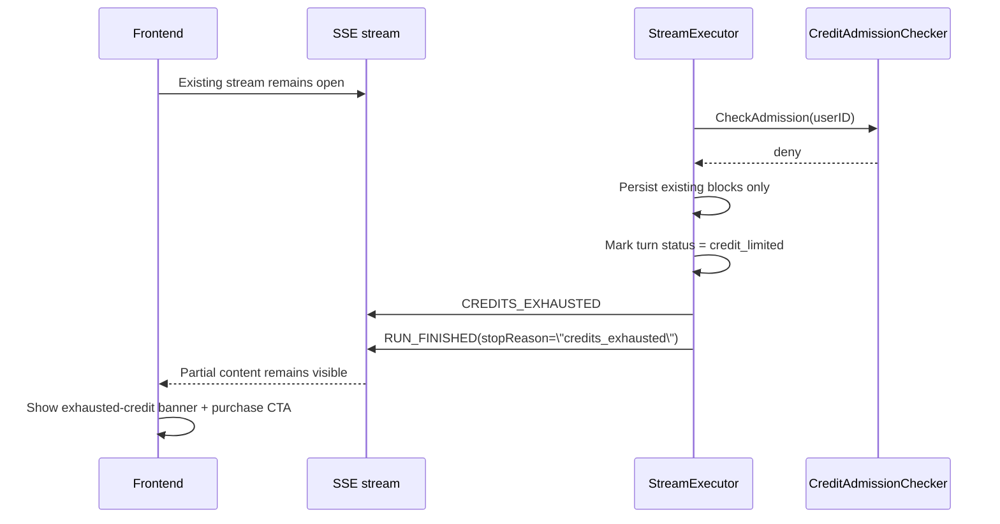

# Billing Design: Prepaid Credit Wallet

## Model

Prepaid credit packs purchased via Stripe Checkout. No subscriptions at v1. Credits are the single billing currency across all AI features.

This document resolves the A1 review blockers:

- Real FIFO multi-lot deduction with row locking and full auditability
- Accepted negative-balance model with explicit worst-case exposure
- Stripe webhook signature verification and session verification
- Signup-to-credit initialization flow
- Concrete Go service/store interfaces
- Metered-provider design that matches the current streaming executor
- Two-layer credit gate design with `402` only before SSE starts
- Exact billing API contracts
- Mid-stream exhausted-credit SSE event and turn state
- Complete migration SQL for billing tables, view, and FIFO function
- Integer-only cost calculation and bounded failure handling

## Credit System

### Credit Unit

- 1 credit = $0.01 of compute at Meridian pricing
- Internally, all balances and charges use `millicredits`
- 1 credit = 1,000 millicredits
- 1 millicredit = $0.00001
- All database amounts are stored as integer millicredits
- UI displays credits, not millicredits

### Credit Packs

| Pack ID | Label | Price | Credits | Bonus |
|---------|-------|-------|---------|-------|
| `starter` | Starter | $5 | 500 | - |
| `writer` | Writer | $10 | 1,100 | 10% bonus |
| `studio` | Studio | $25 | 3,000 | 20% bonus |

The backend owns this catalog. The frontend never sends raw dollar or credit amounts to Stripe.

### Free Tier

- New signups receive 300 free credits
- Free credits expire after 30 days
- Free tier has access to standard models only
- Core writing features remain free; only AI features consume credits

### Credit Expiration

- Purchased credits do not expire
- Promotional and free credits expire after 30 days
- Consumption order is:
  1. Earliest expiring promotional lot
  2. Next earliest expiring promotional lot
  3. Non-expiring purchased lots by `created_at`

## Cost Mapping

### Per-Action Estimates

- Rewrite paragraph: about 3 credits
- Generate chapter outline: about 8 credits
- Continuity check: about 15 credits
- Quick suggestion: about 1 credit

These are UX estimates only. Billing uses exact token usage after the step completes.

### Model Tiers

| Tier | Models | Markup | Access |
|------|--------|--------|--------|
| Standard | Haiku, GPT-4o-mini, fast models | about 20% | Free + paid |
| Premium | Sonnet, GPT-4o | about 25% | Paid only |
| Frontier | Opus, o3, deep reasoning | about 25% | Paid only |

Model cost drift is absorbed by changing the pricing table, not by changing pack definitions.

## Architecture

### Source of Truth

- `credit_lots` is the only balance source of truth
- `credit_transactions` is append-only audit history
- `credit_balances` is a filtered view over spendable lots plus any negative debt rows
- Existing assistant-turn generation records remain the durable source for exact token usage per billable step
- `CreditGate` middleware can reject obviously empty balances, but authoritative per-step admission and settlement happen at executor request boundaries

### Data Model

```text
credit_lots
├── id: uuid
├── user_id: uuid
├── source_type: enum (purchase, grant)
├── original_amount_millicredits: bigint
├── remaining_millicredits: bigint
├── expires_at: timestamptz NULL
├── stripe_session_id: text NULL UNIQUE WHERE NOT NULL
├── grant_reason: text NULL
├── metadata: jsonb NOT NULL DEFAULT '{}'
└── created_at: timestamptz

credit_transactions
├── id: uuid
├── user_id: uuid
├── transaction_type: enum (purchase, grant, consumption, expiration, refund)
├── amount_millicredits: bigint
├── lot_id: uuid NULL
├── consumption_group_id: uuid NULL
├── usage_event_id: text NULL
├── metadata: jsonb NOT NULL DEFAULT '{}'
└── created_at: timestamptz

credit_balances
├── user_id
├── total_balance_millicredits
├── promotional_balance_millicredits
├── purchased_balance_millicredits
└── debt_balance_millicredits
```

Required indexes and constraints:

- `UNIQUE (stripe_session_id) WHERE stripe_session_id IS NOT NULL`
- `UNIQUE (user_id, grant_reason) WHERE grant_reason IS NOT NULL`
- `INDEX (user_id, expires_at, created_at) WHERE remaining_millicredits > 0`
- No `CHECK (remaining_millicredits >= 0)` constraint; negative remaining is intentional
- `INDEX (consumption_group_id) WHERE consumption_group_id IS NOT NULL`
- `INDEX (usage_event_id) WHERE usage_event_id IS NOT NULL`

Notes:

- `grant_reason` values are stable machine values such as `signup_bonus_v1`
- `consumption_group_id` groups all lot rows consumed by one exact billable step
- `usage_event_id` is the deterministic id for one exact billable step, for example `assistant_turn_id:request_index`
- One billable step may create multiple `credit_transactions` rows if it consumes multiple lots
- When concurrent in-flight requests overspend the wallet, the final FIFO lot is allowed to go negative instead of raising an insufficiency error
- Negative debt must stay visible even if the anchor lot later expires, so the balance view includes negative rows regardless of `expires_at`

### Balance View

`credit_balances` must filter expired positive lots so reads do not report stale usable balance:

```sql
CREATE OR REPLACE VIEW ${TABLE_PREFIX}credit_balances AS
SELECT
  user_id,
  COALESCE(SUM(remaining_millicredits), 0) AS total_balance_millicredits,
  COALESCE(SUM(remaining_millicredits) FILTER (
    WHERE expires_at IS NOT NULL
      AND expires_at > NOW()
      AND remaining_millicredits > 0
  ), 0) AS promotional_balance_millicredits,
  COALESCE(SUM(remaining_millicredits) FILTER (
    WHERE expires_at IS NULL
      AND remaining_millicredits > 0
  ), 0) AS purchased_balance_millicredits,
  COALESCE(SUM(-remaining_millicredits) FILTER (
    WHERE remaining_millicredits < 0
  ), 0) AS debt_balance_millicredits
FROM ${TABLE_PREFIX}credit_lots
WHERE expires_at IS NULL
   OR expires_at > NOW()
   OR remaining_millicredits < 0
GROUP BY user_id;
```

### Billing Boundaries



### Two-Level Credit Gate

#### 1. HTTP `CreditGate` Middleware

`POST /api/turns` starts streaming in a background goroutine today (`backend/internal/service/llm/streaming/service.go:618-621`), so the only reliable HTTP `402` path is the synchronous middleware before `CreateTurn`.

- Responsibility: produce HTTP `402` when the initial request cannot start because the wallet is already exhausted
- Implementation: `CreditGate` calls `CreditAdmissionChecker.CheckAdmission(...)` synchronously before `CreateTurn`
- Failure mode: fail closed
- This is the coarse fast-fail path, not the authoritative request-boundary check

#### 2. Executor Step Gate

`StreamExecutor` runs `CreditAdmissionChecker` immediately before every provider call:

- Initial assistant response
- Every continuation after a tool round
- Graceful-completion continuation

This is the authoritative trust boundary. If a later step has no credits, the executor stops before any new provider bytes are emitted.

If the initial executor check denies after the HTTP middleware admitted, the stream emits `CREDITS_EXHAUSTED` and ends gracefully. It does not attempt to turn the already-started `201` + SSE flow back into HTTP `402`.

### Bounded Negative Exposure

We still accept small negative balances instead of reservations.

The real worst-case exposure is:

`max_concurrent_streams_per_user x max_billable_steps_per_stream x max_step_cost_credits`

Design budget for v1:

- `max_concurrent_streams_per_user = 3`
- `max_billable_steps_per_stream = 20`
- `max_step_cost_credits = 15`

Worst-case negative exposure: `3 x 20 x 15 = 900 credits`, which is `$9.00`.

This is the accepted v1 risk envelope. Runtime limits must remain at or below these values. The doc no longer claims the exposure is "one inference step."

### Go Interfaces

Billing interfaces live in `internal/domain/` because services consume them and repositories implement them. The broad service owns user-facing billing operations; the executor depends on narrow collaborators.

```go
package billing

import "context"

type CreditService interface {
    GetBalance(ctx context.Context, userID string) (*CreditBalance, error)
    ListCreditPacks(ctx context.Context) ([]CreditPack, error)
    ListTransactions(ctx context.Context, userID string, req ListTransactionsRequest) (*CreditTransactionPage, error)
    CreateCheckoutSession(ctx context.Context, userID string, req CreateCheckoutSessionRequest) (*CheckoutSession, error)
    HandleStripeWebhook(ctx context.Context, req StripeWebhookRequest) error
}

type CreditAdmissionChecker interface {
    CheckAdmission(ctx context.Context, userID string) error
}

type CreditSettler interface {
    SettleAuthoritativeRequest(ctx context.Context, req SettleRequestInput) error
    RetryPendingSettlement(ctx context.Context, req RetryPendingSettlementInput) error
}

type CreditGranter interface {
    InitializeSignupCredits(ctx context.Context, req InitializeSignupCreditsRequest) (*InitializeSignupCreditsResult, error)
}

// InitializeSignupCreditsRequest is the input to CreditGranter.InitializeSignupCredits.
type InitializeSignupCreditsRequest struct {
    UserID       string
    Email        string
    AuthProvider string // "google", "github", "email"
    EmailVerified bool
}

// InitializeSignupCreditsResult is the output of CreditGranter.InitializeSignupCredits.
type InitializeSignupCreditsResult struct {
    CreditsGranted              int64  // millicredits granted (0 if already initialized or email unverified)
    AlreadyInitialized          bool   // true if user was already initialized
    PromotionalBalanceMillicredits int64
    PurchasedBalanceMillicredits   int64
    TotalBalanceMillicredits       int64
}

type CreditStore interface {
    GetBalance(ctx context.Context, userID string) (*CreditBalance, error)
    ListTransactions(ctx context.Context, userID string, req ListTransactionsRequest) (*CreditTransactionPage, error)
    CreatePurchaseLot(ctx context.Context, req CreatePurchaseLotRequest) error
    CreateGrantLot(ctx context.Context, req CreateGrantLotRequest) error
    ConsumeFIFO(ctx context.Context, req ConsumeFIFORequest) error
    ExpireAvailableLots(ctx context.Context, nowUTC string, batchSize int) ([]ExpiredLot, error)
}

type SettleRequestInput struct {
    UserID           string
    TurnID           string
    RequestIndex     int
    Model            string
    InputTokens      int64
    OutputTokens     int64
    ReasoningTokens  int64
    CachedTokens     int64
}

type RetryPendingSettlementInput struct {
    TurnID       string
    RequestIndex int
}
```

Key request objects:

- `SettleRequestInput` includes `user_id`, `assistant_turn_id`, `request_index`, `model`, and all billable token dimensions
- `RetryPendingSettlementInput` includes the assistant turn id plus request index for loading stored billing fields from the generation record
- `InitializeSignupCreditsRequest` includes `user_id`, `auth_provider`, and `email_verified`
- `CreateCheckoutSessionRequest` includes `pack_id`, `success_url`, and `cancel_url`

### Executor-Level Settlement

Detailed design lives in [executor-settlement-design.md](./executor-settlement-design.md).

Summary:

- `CreditGate` middleware is the only HTTP `402` path.
- `StreamExecutor` performs a second admission check immediately before every provider call. If the initial executor check fails after the HTTP gate passed, it emits `CREDITS_EXHAUSTED`; it does not try to rewrite the HTTP response.
- Providers with authoritative stream usage settle inline. Providers whose authoritative usage only exists in enrichment defer settlement until native tokens are available.
- The first authoritative settlement attempt writes `billing_amount_millicredits` to the generation record. Reconciliation reuses that stored amount.
- `STEP_STARTED` is emitted only after executor admission succeeds, so denied requests do not create fake started steps.

### CreditGate Middleware

Middleware stays thin and delegates to the service layer:

```go
func CreditGate(checker billing.CreditAdmissionChecker) func(http.Handler) http.Handler {
    return func(next http.Handler) http.Handler {
        return http.HandlerFunc(func(w http.ResponseWriter, r *http.Request) {
            userID := httputil.GetUserID(r)
            if err := checker.CheckAdmission(r.Context(), userID); err != nil {
                handleError(w, err, cfg)
                return
            }
            next.ServeHTTP(w, r)
        })
    }
}
```

This middleware is applied only to billable AI entrypoints, not to normal document CRUD and not to Stripe webhooks.

### Cost Calculation

`CalculateCreditCost` is a pure domain function. No floats. No database access. No Stripe calls.

```go
type TokenUsage struct {
    InputTokens     int64
    OutputTokens    int64
    ReasoningTokens int64
    CachedTokens    int64
}

type ModelPricing struct {
    InputMicrousdPer1K     int64
    OutputMicrousdPer1K    int64
    ReasoningMicrousdPer1K int64
    CachedMicrousdPer1K    int64
    MarkupBasisPoints      int64
}

func CalculateCreditCost(pricing ModelPricing, usage TokenUsage) int64 {
    rawMicrousd :=
        ceilDiv(usage.InputTokens*pricing.InputMicrousdPer1K, 1000) +
        ceilDiv(usage.OutputTokens*pricing.OutputMicrousdPer1K, 1000) +
        ceilDiv(usage.ReasoningTokens*pricing.ReasoningMicrousdPer1K, 1000) +
        ceilDiv(usage.CachedTokens*pricing.CachedMicrousdPer1K, 1000)

    markedMicrousd := ceilDiv(rawMicrousd*(10_000+pricing.MarkupBasisPoints), 10_000)

    // 1 millicredit = 10 microusd because:
    // 1 credit = $0.01 = 10_000 microusd = 1_000 millicredits
    millicredits := ceilDiv(markedMicrousd, 10)

    if millicredits < 1 {
        return 1
    }
    return millicredits
}

func ceilDiv(numerator, denominator int64) int64 {
    return (numerator + denominator - 1) / denominator
}
```

Rules:

- exact charge uses integer math end-to-end
- every division rounds up
- minimum charge is 1 millicredit, not 1 whole credit
- UI rounds for presentation; ledger never rounds to whole credits

### Model Pricing Registry

```go
// ModelPricing contains per-model cost rates for credit calculation.
type ModelPricing struct {
    InputMicrousdPer1K  int64
    OutputMicrousdPer1K int64
}

// DefaultModelPricing contains launch-day pricing.
// Loaded from config in production; hardcoded defaults for development.
var DefaultModelPricing = map[string]ModelPricing{
    "claude-sonnet-4-20250514":    {InputMicrousdPer1K: 3000, OutputMicrousdPer1K: 15000},
    "claude-haiku-4-5-20251001":   {InputMicrousdPer1K: 800, OutputMicrousdPer1K: 4000},
    "claude-opus-4-20250515":      {InputMicrousdPer1K: 15000, OutputMicrousdPer1K: 75000},
    "gpt-4o":                      {InputMicrousdPer1K: 2500, OutputMicrousdPer1K: 10000},
    "gpt-4o-mini":                 {InputMicrousdPer1K: 150, OutputMicrousdPer1K: 600},
}
```

Note: these prices are approximate and will be tuned. This map is the data source for `CalculateCreditCost`.

### FIFO Multi-Lot Deduction

The repository does not assemble FIFO in Go with multiple ad hoc updates. It calls one PostgreSQL function that locks rows, updates lots, and writes audit rows atomically.

```sql
-- +goose StatementBegin
CREATE OR REPLACE FUNCTION ${TABLE_PREFIX}consume_credit_lots_fifo(
  p_user_id uuid,
  p_amount_millicredits bigint,
  p_consumption_group_id uuid,
  p_usage_event_id text,
  p_metadata jsonb DEFAULT '{}'::jsonb
)
RETURNS TABLE(lot_id uuid, amount_millicredits bigint)
LANGUAGE plpgsql
AS $func$
DECLARE
  v_remaining bigint;
  v_lot RECORD;
  v_consumed bigint;
  v_anchor_lot_id uuid;
BEGIN
  -- Prevent TOCTOU race: two concurrent calls with the same consumption_group_id
  -- could both pass the EXISTS idempotency check before either inserts. The advisory
  -- lock serializes callers per consumption_group_id within the transaction.
  PERFORM pg_advisory_xact_lock(hashtext(p_consumption_group_id::text));

  IF p_amount_millicredits <= 0 THEN
    RAISE EXCEPTION '${TABLE_PREFIX}invalid_credit_amount'
      USING MESSAGE = 'p_amount_millicredits must be greater than zero';
  END IF;

  -- Idempotent retry path: if this group already settled, do nothing.
  IF EXISTS (
    SELECT 1
    FROM ${TABLE_PREFIX}credit_transactions
    WHERE consumption_group_id = p_consumption_group_id
  ) THEN
    RETURN;
  END IF;

  v_remaining := p_amount_millicredits;

  FOR v_lot IN
    SELECT id, remaining_millicredits
    FROM ${TABLE_PREFIX}credit_lots
    WHERE user_id = p_user_id
      AND remaining_millicredits > 0
      AND (expires_at IS NULL OR expires_at > NOW())
    ORDER BY
      CASE WHEN expires_at IS NULL THEN 1 ELSE 0 END,
      expires_at,
      created_at,
      id
    FOR UPDATE
  LOOP
    EXIT WHEN v_remaining = 0;

    v_anchor_lot_id := v_lot.id;
    v_consumed := LEAST(v_remaining, v_lot.remaining_millicredits);

    UPDATE ${TABLE_PREFIX}credit_lots
    SET remaining_millicredits = remaining_millicredits - v_consumed
    WHERE id = v_lot.id;

    INSERT INTO ${TABLE_PREFIX}credit_transactions (
      id,
      user_id,
      transaction_type,
      amount_millicredits,
      lot_id,
      consumption_group_id,
      usage_event_id,
      metadata,
      created_at
    ) VALUES (
      gen_random_uuid(),
      p_user_id,
      'consumption',
      -v_consumed,
      v_lot.id,
      p_consumption_group_id,
      p_usage_event_id,
      COALESCE(p_metadata, '{}'::jsonb) || jsonb_build_object('lot_id', v_lot.id),
      NOW()
    );

    lot_id := v_lot.id;
    amount_millicredits := v_consumed;
    RETURN NEXT;

    v_remaining := v_remaining - v_consumed;
  END LOOP;

  -- Accepted v1 behavior:
  -- if concurrent in-flight requests already passed admission and drained the wallet,
  -- anchor the remainder on the final FIFO lot and allow that lot to go negative.
  IF v_remaining > 0 THEN
    IF v_anchor_lot_id IS NULL THEN
      SELECT id
      INTO v_anchor_lot_id
      FROM ${TABLE_PREFIX}credit_lots
      WHERE user_id = p_user_id
        AND (
          expires_at IS NULL
          OR expires_at > NOW()
          OR remaining_millicredits < 0
        )
      ORDER BY
        CASE WHEN expires_at IS NULL THEN 1 ELSE 0 END,
        expires_at,
        created_at,
        id
      FOR UPDATE
      LIMIT 1;
    END IF;

    IF v_anchor_lot_id IS NULL THEN
      RAISE EXCEPTION '${TABLE_PREFIX}credit_anchor_missing'
        USING MESSAGE = format(
          'cannot anchor negative balance for user %s because no credit lot exists',
          p_user_id
        );
    END IF;

    UPDATE ${TABLE_PREFIX}credit_lots
    SET remaining_millicredits = remaining_millicredits - v_remaining
    WHERE id = v_anchor_lot_id;

    INSERT INTO ${TABLE_PREFIX}credit_transactions (
      id,
      user_id,
      transaction_type,
      amount_millicredits,
      lot_id,
      consumption_group_id,
      usage_event_id,
      metadata,
      created_at
    ) VALUES (
      gen_random_uuid(),
      p_user_id,
      'consumption',
      -v_remaining,
      v_anchor_lot_id,
      p_consumption_group_id,
      p_usage_event_id,
      COALESCE(p_metadata, '{}'::jsonb) || jsonb_build_object(
        'lot_id', v_anchor_lot_id,
        'overspend', true
      ),
      NOW()
    );

    lot_id := v_anchor_lot_id;
    amount_millicredits := v_remaining;
    RETURN NEXT;
  END IF;

  RETURN;
END;
$func$;
-- +goose StatementEnd
```

Why this shape:

- `FOR UPDATE` prevents concurrent consumers from spending the same lot balance
- `(expires_at IS NULL OR expires_at > NOW())` prevents consuming expired lots even if the cron has not run yet
- `consumption_group_id` makes a multi-lot deduction queryable as one logical usage event
- retrying the same usage event is safe because the function short-circuits if that group already exists
- overspend is bounded by admission plus runtime limits, so the function does not raise insufficiency once settlement starts
- the final FIFO lot becomes the debt anchor when concurrent in-flight requests overrun the wallet

### Audit Trail

One billable step can consume many lots. Auditability requires both ids:

- `usage_event_id` identifies the logical billable step
- `consumption_group_id` identifies the exact settlement batch

Example:

- assistant turn request index 2 costs 6,500 millicredits
- 2,000 millicredits come from signup bonus lot
- 4,500 millicredits come from purchased lot

The ledger writes:

- 1 transaction row for `-2000` against promotional lot
- 1 transaction row for `-4500` against purchased lot
- both rows share the same `consumption_group_id`

### Generation Record Integration

Existing assistant-turn generation records become the durable receipt for exact billable usage.

Each generation record should be extended with:

- `billing_usage_event_id`
- `billing_consumption_group_id`
- `billing_amount_millicredits`
- `billing_status` (`pending`, `settled`, `failed`)
- `billing_last_error`

This keeps exact usage, billing status, and retry state attached to the assistant turn that produced the cost.

### Failure Mode and Reconciliation

#### Admission Check Failure

- If balance lookup fails, reject the request
- If step-level check fails, reject the next provider call
- No "best effort" on admission

This is fail-closed by design.

#### Transport Behavior for Insufficient Credits

`402 Payment Required` is only valid before the SSE stream begins.

- `POST /api/turns`: `CreditGate` middleware returns HTTP `402`
- executor denial on the initial request after middleware admit: the stream is already on the `201` path, so the backend must emit `CREDITS_EXHAUSTED`
- later tool continuations: the SSE stream is already open, so the backend must emit a terminal exhausted-credit event instead of trying to write a new HTTP status

Add a Meridian AG-UI extension event:

```go
const MeridianEventTypeCreditsExhausted = "CREDITS_EXHAUSTED"

type MeridianCreditsExhaustedEvent struct {
    Type                  string `json:"type"`
    TurnID                string `json:"turnId"`
    ThreadID              string `json:"threadId"`
    RequestIndex          int    `json:"requestIndex"`
    Phase                 string `json:"phase"`
    BalanceMillicredits   int64  `json:"balanceMillicredits"`
    RequiredMillicredits  int64  `json:"requiredMillicredits"`
    ShortfallMillicredits int64  `json:"shortfallMillicredits"`
    Message               string `json:"message"`
    BillingURL            string `json:"billingUrl"`
}
```

Sequence for a continuation that runs out of credits:



Turn-state rules:

- preserve all blocks already persisted for earlier successful steps
- do not delete or rewrite partial assistant output that already exists
- set assistant turn `status = credit_limited`
- set assistant turn `error = 'insufficient credits'`
- set final stop reason to `credits_exhausted`

Frontend behavior:

- keep the streamed partial answer on screen
- show a non-toast exhausted-credit message in the thread UI
- render a purchase CTA that routes to `/settings/billing`
- do not treat this as a generic stream error

Implementation note for the current executor:

- `mstream_adapter.go` and `tool_executor.go` should branch on `CreditAdmissionChecker` denial and call a dedicated `handleCreditsExhausted(...)` path
- that path emits `CREDITS_EXHAUSTED` and marks the turn `credit_limited`
- do not route insufficient-credit failures through the generic `handleError(...)`, because that emits `RUN_ERROR` and marks the turn `error`

#### Deduction Failure After Successful Inference

The provider may finish successfully but FIFO deduction may fail because of a transient DB problem.

Required behavior:

1. Persist exact usage plus deterministic billing identifiers on the generation record first
2. On the first authoritative settlement attempt, compute and store `billing_amount_millicredits`
3. Attempt FIFO deduction using the stored amount
4. If deduction succeeds, mark the generation record `billing_status = settled`
5. If deduction fails, mark the generation record `billing_status = pending` and enqueue reconciliation that reuses the stored amount

Reconciliation key:

- `usage_event_id = assistant_turn_id:request_index`
- `consumption_group_id = uuid_v5(usage_event_id)`

This keeps retries idempotent.

The user still receives the successful model output. Billing is corrected asynchronously.

Generation-record migration note:

- existing generation records already live under `turns.response_metadata.openrouter.generations[]`
- add the billing fields there as JSON keys, not as new table columns
- no schema migration is required for those keys; implementation is an application-level JSON shape change

### Expiration Cron

Expiration must be atomic and race-safe with consumption.

Implementation shape:

```sql
WITH expired AS (
  SELECT id, user_id, remaining_millicredits
  FROM ${TABLE_PREFIX}credit_lots
  WHERE expires_at IS NOT NULL
    AND expires_at <= NOW()
    AND remaining_millicredits > 0
  FOR UPDATE SKIP LOCKED
),
updated AS (
  UPDATE ${TABLE_PREFIX}credit_lots l
  SET remaining_millicredits = 0
  FROM expired e
  WHERE l.id = e.id
  RETURNING e.id, e.user_id, e.remaining_millicredits
)
INSERT INTO ${TABLE_PREFIX}credit_transactions (
  id,
  user_id,
  transaction_type,
  amount_millicredits,
  lot_id,
  metadata,
  created_at
)
SELECT
  gen_random_uuid(),
  user_id,
  'expiration',
  -remaining_millicredits,
  id,
  '{}'::jsonb,
  NOW()
FROM updated;
```

Consumption still filters expired lots, so correctness does not depend on cron timing.

## Stripe Integration

### Purchase Initiation

Flow:

1. Frontend requests a checkout session with `pack_id`
2. Backend resolves the pack from its own catalog
3. Backend creates Stripe Checkout Session with:
   - `client_reference_id = user_id`
   - `metadata.user_id`
   - `metadata.pack_id`
   - server-side amount and description
4. Frontend redirects to `checkout_url`
5. Stripe webhook confirms completion and the backend mints credits

No client-supplied amounts are trusted.

### Webhook Security

The webhook handler must do all of the following:

1. Read raw request body before JSON parsing
2. Verify signature with `stripe.ConstructEvent`
3. Use `STRIPE_WEBHOOK_SECRET`
4. Enforce Stripe's timestamp tolerance through Stripe's verifier
5. For `checkout.session.completed`, fetch the session from Stripe again using the server secret key
6. Verify:
   - session exists
   - `payment_status = paid`
   - `mode = payment`
   - `metadata.user_id` exists
   - `metadata.pack_id` maps to a known pack
   - fetched Stripe amount matches the server-side pack definition
7. In one DB transaction:
   - insert purchase lot if `stripe_session_id` not already seen
   - insert purchase transaction

Duplicate webhook deliveries are harmless because `stripe_session_id` is unique.

### JWT Bypass for Webhook Route

Stripe does not send Meridian JWTs. The auth middleware must bypass exactly:

- `POST /api/billing/webhooks/stripe`

Security for this route comes from Stripe signature verification plus session re-fetch, not from JWT.

## Signup Credit Initialization

### Why Frontend-Mediated Initialization

Supabase signup does not automatically invoke Meridian backend business logic. The backend needs an explicit hook to grant the one-time signup lot.

Chosen design:

- frontend calls `POST /api/auth/initialize` after login session becomes available
- frontend calls it again after email verification completes
- backend decides whether to mint the signup lot or no-op

This works for both:

- Google OAuth: first authenticated session is already verified, so credits are granted immediately
- Email/password: initialize may no-op until verification is complete, then grants on the next call

### Auth Context Required

To make `POST /api/auth/initialize` cheap and deterministic, A2 must extend authenticated request context with:

- `user_id`
- `email`
- `email_verified`
- `auth_provider`

Do not force billing to call back out to Supabase on every initialize request.

### Idempotency

The signup grant uses:

- `grant_reason = signup_bonus_v1`
- unique partial index on `(user_id, grant_reason)`

If the endpoint is called 20 times, only the first successful eligible call creates the lot.

## Billing API

All responses use JSON. Errors use RFC 7807 problem details, including `402 Payment Required` for insufficient credits.

### `GET /api/billing/packs`

Authenticated. Returns the server-authoritative pack catalog.

Response `200`:

```json
{
  "packs": [
    {
      "pack_id": "starter",
      "label": "Starter",
      "price_cents": 500,
      "credits": 500,
      "bonus_credits": 0
    }
  ]
}
```

Errors:

- `401` unauthenticated

### `GET /api/billing/balance`

Authenticated.

Response `200`:

```json
{
  "total_balance_millicredits": 845000,
  "promotional_balance_millicredits": 120000,
  "purchased_balance_millicredits": 725000,
  "debt_balance_millicredits": 0,
  "display_total_credits": "845.0"
}
```

Errors:

- `401` unauthenticated

### `GET /api/billing/transactions?limit=50&offset=0`

Authenticated. Returns usage history and purchase history.

Response `200`:

```json
{
  "items": [
    {
      "id": "tx_123",
      "transaction_type": "consumption",
      "amount_millicredits": -2875,
      "created_at": "2026-03-20T12:00:00Z",
      "metadata": {
        "assistant_turn_id": "turn_1",
        "request_index": 0,
        "model": "claude-sonnet-4-6"
      }
    }
  ],
  "limit": 50,
  "offset": 0,
  "total": 137
}
```

Errors:

- `401` unauthenticated

### `POST /api/billing/checkout-sessions`

Authenticated. Starts a Stripe Checkout flow.

Request:

```json
{
  "pack_id": "writer",
  "success_url": "http://localhost:3000/settings/billing?checkout=success",
  "cancel_url": "http://localhost:3000/settings/billing?checkout=cancel"
}
```

Response `201`:

```json
{
  "session_id": "cs_test_123",
  "checkout_url": "https://checkout.stripe.com/...",
  "expires_at": "2026-03-20T12:30:00Z"
}
```

Errors:

- `400` invalid `pack_id`
- `401` unauthenticated
- `502` Stripe session creation failed

### `POST /api/billing/webhooks/stripe`

Unauthenticated Stripe callback. JWT bypassed intentionally.

Response `200`:

```json
{
  "received": true
}
```

Errors:

- `400` invalid signature
- `400` malformed event
- `400` invalid pack metadata
- `500` internal persistence failure

### `POST /api/auth/initialize`

See auth.md for the POST /api/auth/initialize endpoint specification.

### `402` Initial Exhausted Credit Error Shape

Billable AI endpoints return `402` only when the request cannot start billing at all.

Example:

```json
{
  "type": "about:blank",
  "title": "Payment Required",
  "status": 402,
  "detail": "insufficient credits",
  "balance_millicredits": 0,
  "required_millicredits": 1,
  "shortfall_millicredits": 1
}
```

### SSE Exhausted Credit Event

Once the SSE stream is open, exhausted credits are reported as an SSE event instead of an HTTP error:

```json
{
  "type": "CREDITS_EXHAUSTED",
  "turnId": "turn_123",
  "threadId": "thread_456",
  "requestIndex": 3,
  "phase": "tool_continue",
  "balanceMillicredits": -2500,
  "requiredMillicredits": 1,
  "shortfallMillicredits": 2501,
  "message": "Credits exhausted. Buy more credits to continue this thread.",
  "billingUrl": "/settings/billing"
}
```

## UX

### Balance Display

- Status bar shows a compact credit balance
- Billing page shows purchased vs promotional balance
- Usage history shows model, tokens, and charge per step

### Purchase Flow

- Billing page or exhausted-credit CTA opens hosted Stripe Checkout
- Pack prices come from `GET /api/billing/packs`
- Post-purchase balance updates through normal polling or refetch after webhook settlement

### Empty State

- AI features show a non-blocking exhausted-credit state
- Core writing features remain fully usable

### Pre-Action Estimate

- UI shows a rounded estimate before expensive actions
- Server still charges exact post-step usage

## Free Credit Grant Policy

| Signup method | When credits are granted | Why |
|---------------|--------------------------|-----|
| Google OAuth | First successful `POST /api/auth/initialize` | identity already verified |
| Email/password | First successful initialize after email is verified | prevents disposable-email abuse |

## Anti-Abuse

- Max concurrent billable streams per user: 3
- Model-tier allowlists by plan
- Signup bonus limited to one grant reason per user
- Webhook idempotency by Stripe session id
- Rate limiting remains transport-level defense; billing remains service-level defense

## Domain Error and Handler Mapping

Billing needs a first-class domain error rather than ad hoc string matching.

```go
package domain

var ErrInsufficientCredits = errors.New("insufficient credits")

type InsufficientCreditsError struct {
    BalanceMillicredits   int64
    RequiredMillicredits  int64
    ShortfallMillicredits int64
}

func (e *InsufficientCreditsError) Error() string {
    return "insufficient credits"
}

func (e *InsufficientCreditsError) Is(target error) bool {
    return target == ErrInsufficientCredits
}
```

Handler mapping in `backend/internal/handler/helpers.go`:

```go
func domainErrorStatusCode(err error) (int, bool) {
    var insufficientErr *domain.InsufficientCreditsError
    if errors.As(err, &insufficientErr) {
        return http.StatusPaymentRequired, true
    }
    // existing mappings...
}

func handleError(w http.ResponseWriter, err error, cfg *config.Config) {
    var insufficientErr *domain.InsufficientCreditsError
    if errors.As(err, &insufficientErr) {
        httputil.RespondErrorWithExtras(w, http.StatusPaymentRequired, err.Error(), map[string]interface{}{
            "balance_millicredits":   insufficientErr.BalanceMillicredits,
            "required_millicredits":  insufficientErr.RequiredMillicredits,
            "shortfall_millicredits": insufficientErr.ShortfallMillicredits,
        })
        return
    }

    // existing mappings...
}
```

`backend/internal/httputil/response.go` should also map `402` in `errorTypeFromStatus(...)` so the emitted RFC 7807 body has a stable type URI.

## Migration SQL

The migration below is the coder-facing source of truth for A1 billing storage. It intentionally covers only:

- `credit_lots`
- `credit_transactions`
- `credit_balances`
- `consume_credit_lots_fifo(...)`

Generation-record billing fields remain a JSON shape change inside existing `turns.response_metadata`.

### Up

```sql
-- +goose Up
-- +goose ENVSUB ON
-- +goose StatementBegin
CREATE TYPE ${TABLE_PREFIX}credit_source_type AS ENUM ('purchase', 'grant');
CREATE TYPE ${TABLE_PREFIX}credit_transaction_type AS ENUM (
  'purchase',
  'grant',
  'consumption',
  'expiration',
  'refund'
);

CREATE TABLE ${TABLE_PREFIX}credit_lots (
  id uuid PRIMARY KEY DEFAULT gen_random_uuid(),
  user_id uuid NOT NULL REFERENCES auth.users(id) ON DELETE CASCADE,
  source_type ${TABLE_PREFIX}credit_source_type NOT NULL,
  original_amount_millicredits bigint NOT NULL CHECK (original_amount_millicredits > 0),
  remaining_millicredits bigint NOT NULL,
  expires_at timestamptz NULL,
  stripe_session_id text NULL,
  grant_reason text NULL,
  metadata jsonb NOT NULL DEFAULT '{}'::jsonb,
  created_at timestamptz NOT NULL DEFAULT NOW(),
  CONSTRAINT ${TABLE_PREFIX}credit_lots_stripe_session_required CHECK (
    (source_type = 'purchase' AND stripe_session_id IS NOT NULL AND grant_reason IS NULL)
    OR
    (source_type = 'grant' AND stripe_session_id IS NULL)
  ),
  CONSTRAINT ${TABLE_PREFIX}credit_lots_grant_reason_required CHECK (
    (source_type = 'grant' AND grant_reason IS NOT NULL)
    OR
    (source_type = 'purchase' AND grant_reason IS NULL)
  )
);

CREATE UNIQUE INDEX ${TABLE_PREFIX}credit_lots_stripe_session_uidx
  ON ${TABLE_PREFIX}credit_lots (stripe_session_id)
  WHERE stripe_session_id IS NOT NULL;

CREATE UNIQUE INDEX ${TABLE_PREFIX}credit_lots_signup_grant_uidx
  ON ${TABLE_PREFIX}credit_lots (user_id, grant_reason)
  WHERE grant_reason IS NOT NULL;

CREATE INDEX ${TABLE_PREFIX}credit_lots_fifo_spend_idx
  ON ${TABLE_PREFIX}credit_lots (user_id, expires_at, created_at, id)
  WHERE remaining_millicredits > 0;

CREATE INDEX ${TABLE_PREFIX}credit_lots_user_created_idx
  ON ${TABLE_PREFIX}credit_lots (user_id, created_at, id);

CREATE TABLE ${TABLE_PREFIX}credit_transactions (
  id uuid PRIMARY KEY DEFAULT gen_random_uuid(),
  user_id uuid NOT NULL REFERENCES auth.users(id) ON DELETE CASCADE,
  transaction_type ${TABLE_PREFIX}credit_transaction_type NOT NULL,
  amount_millicredits bigint NOT NULL,
  lot_id uuid NULL REFERENCES ${TABLE_PREFIX}credit_lots(id) ON DELETE SET NULL,
  consumption_group_id uuid NULL,
  usage_event_id text NULL,
  metadata jsonb NOT NULL DEFAULT '{}'::jsonb,
  created_at timestamptz NOT NULL DEFAULT NOW(),
  CONSTRAINT ${TABLE_PREFIX}credit_transactions_non_zero_amount CHECK (
    amount_millicredits <> 0
  ),
  CONSTRAINT ${TABLE_PREFIX}credit_transactions_consumption_group_required CHECK (
    (
      transaction_type = 'consumption'
      AND consumption_group_id IS NOT NULL
      AND usage_event_id IS NOT NULL
      AND lot_id IS NOT NULL
      AND amount_millicredits < 0
    )
    OR
    (
      transaction_type <> 'consumption'
      AND consumption_group_id IS NULL
    )
  )
);

CREATE INDEX ${TABLE_PREFIX}credit_transactions_user_created_idx
  ON ${TABLE_PREFIX}credit_transactions (user_id, created_at DESC, id DESC);

CREATE INDEX ${TABLE_PREFIX}credit_transactions_group_idx
  ON ${TABLE_PREFIX}credit_transactions (consumption_group_id)
  WHERE consumption_group_id IS NOT NULL;

CREATE INDEX ${TABLE_PREFIX}credit_transactions_usage_event_idx
  ON ${TABLE_PREFIX}credit_transactions (usage_event_id)
  WHERE usage_event_id IS NOT NULL;

CREATE OR REPLACE VIEW ${TABLE_PREFIX}credit_balances AS
SELECT
  user_id,
  COALESCE(SUM(remaining_millicredits), 0) AS total_balance_millicredits,
  COALESCE(SUM(remaining_millicredits) FILTER (
    WHERE expires_at IS NOT NULL
      AND expires_at > NOW()
      AND remaining_millicredits > 0
  ), 0) AS promotional_balance_millicredits,
  COALESCE(SUM(remaining_millicredits) FILTER (
    WHERE expires_at IS NULL
      AND remaining_millicredits > 0
  ), 0) AS purchased_balance_millicredits,
  COALESCE(SUM(-remaining_millicredits) FILTER (
    WHERE remaining_millicredits < 0
  ), 0) AS debt_balance_millicredits
FROM ${TABLE_PREFIX}credit_lots
WHERE expires_at IS NULL
   OR expires_at > NOW()
   OR remaining_millicredits < 0
GROUP BY user_id;

CREATE OR REPLACE FUNCTION ${TABLE_PREFIX}consume_credit_lots_fifo(
  p_user_id uuid,
  p_amount_millicredits bigint,
  p_consumption_group_id uuid,
  p_usage_event_id text,
  p_metadata jsonb DEFAULT '{}'::jsonb
)
RETURNS TABLE(lot_id uuid, amount_millicredits bigint)
LANGUAGE plpgsql
AS $func$
DECLARE
  v_remaining bigint;
  v_lot RECORD;
  v_consumed bigint;
  v_anchor_lot_id uuid;
BEGIN
  -- Prevent TOCTOU race: two concurrent calls with the same consumption_group_id
  -- could both pass the EXISTS idempotency check before either inserts. The advisory
  -- lock serializes callers per consumption_group_id within the transaction.
  PERFORM pg_advisory_xact_lock(hashtext(p_consumption_group_id::text));

  IF p_amount_millicredits <= 0 THEN
    RAISE EXCEPTION '${TABLE_PREFIX}invalid_credit_amount'
      USING MESSAGE = 'p_amount_millicredits must be greater than zero';
  END IF;

  IF EXISTS (
    SELECT 1
    FROM ${TABLE_PREFIX}credit_transactions
    WHERE consumption_group_id = p_consumption_group_id
  ) THEN
    RETURN;
  END IF;

  v_remaining := p_amount_millicredits;

  FOR v_lot IN
    SELECT id, remaining_millicredits
    FROM ${TABLE_PREFIX}credit_lots
    WHERE user_id = p_user_id
      AND remaining_millicredits > 0
      AND (expires_at IS NULL OR expires_at > NOW())
    ORDER BY
      CASE WHEN expires_at IS NULL THEN 1 ELSE 0 END,
      expires_at,
      created_at,
      id
    FOR UPDATE
  LOOP
    EXIT WHEN v_remaining = 0;

    v_anchor_lot_id := v_lot.id;
    v_consumed := LEAST(v_remaining, v_lot.remaining_millicredits);

    UPDATE ${TABLE_PREFIX}credit_lots
    SET remaining_millicredits = remaining_millicredits - v_consumed
    WHERE id = v_lot.id;

    INSERT INTO ${TABLE_PREFIX}credit_transactions (
      id,
      user_id,
      transaction_type,
      amount_millicredits,
      lot_id,
      consumption_group_id,
      usage_event_id,
      metadata,
      created_at
    ) VALUES (
      gen_random_uuid(),
      p_user_id,
      'consumption',
      -v_consumed,
      v_lot.id,
      p_consumption_group_id,
      p_usage_event_id,
      COALESCE(p_metadata, '{}'::jsonb) || jsonb_build_object('lot_id', v_lot.id),
      NOW()
    );

    lot_id := v_lot.id;
    amount_millicredits := v_consumed;
    RETURN NEXT;

    v_remaining := v_remaining - v_consumed;
  END LOOP;

  IF v_remaining > 0 THEN
    IF v_anchor_lot_id IS NULL THEN
      SELECT id
      INTO v_anchor_lot_id
      FROM ${TABLE_PREFIX}credit_lots
      WHERE user_id = p_user_id
        AND (
          expires_at IS NULL
          OR expires_at > NOW()
          OR remaining_millicredits < 0
        )
      ORDER BY
        CASE WHEN expires_at IS NULL THEN 1 ELSE 0 END,
        expires_at,
        created_at,
        id
      FOR UPDATE
      LIMIT 1;
    END IF;

    IF v_anchor_lot_id IS NULL THEN
      RAISE EXCEPTION '${TABLE_PREFIX}credit_anchor_missing'
        USING MESSAGE = format(
          'cannot anchor negative balance for user %s because no credit lot exists',
          p_user_id
        );
    END IF;

    UPDATE ${TABLE_PREFIX}credit_lots
    SET remaining_millicredits = remaining_millicredits - v_remaining
    WHERE id = v_anchor_lot_id;

    INSERT INTO ${TABLE_PREFIX}credit_transactions (
      id,
      user_id,
      transaction_type,
      amount_millicredits,
      lot_id,
      consumption_group_id,
      usage_event_id,
      metadata,
      created_at
    ) VALUES (
      gen_random_uuid(),
      p_user_id,
      'consumption',
      -v_remaining,
      v_anchor_lot_id,
      p_consumption_group_id,
      p_usage_event_id,
      COALESCE(p_metadata, '{}'::jsonb) || jsonb_build_object(
        'lot_id', v_anchor_lot_id,
        'overspend', true
      ),
      NOW()
    );

    lot_id := v_anchor_lot_id;
    amount_millicredits := v_remaining;
    RETURN NEXT;
  END IF;

  RETURN;
END;
$func$;
-- +goose StatementEnd
```

### Down

```sql
-- +goose Down
-- +goose ENVSUB ON
-- +goose StatementBegin
DROP FUNCTION IF EXISTS ${TABLE_PREFIX}consume_credit_lots_fifo(uuid, bigint, uuid, text, jsonb);
DROP VIEW IF EXISTS ${TABLE_PREFIX}credit_balances;

DROP INDEX IF EXISTS ${TABLE_PREFIX}credit_transactions_usage_event_idx;
DROP INDEX IF EXISTS ${TABLE_PREFIX}credit_transactions_group_idx;
DROP INDEX IF EXISTS ${TABLE_PREFIX}credit_transactions_user_created_idx;
DROP TABLE IF EXISTS ${TABLE_PREFIX}credit_transactions;

DROP INDEX IF EXISTS ${TABLE_PREFIX}credit_lots_user_created_idx;
DROP INDEX IF EXISTS ${TABLE_PREFIX}credit_lots_fifo_spend_idx;
DROP INDEX IF EXISTS ${TABLE_PREFIX}credit_lots_signup_grant_uidx;
DROP INDEX IF EXISTS ${TABLE_PREFIX}credit_lots_stripe_session_uidx;
DROP TABLE IF EXISTS ${TABLE_PREFIX}credit_lots;

DROP TYPE IF EXISTS ${TABLE_PREFIX}credit_transaction_type;
DROP TYPE IF EXISTS ${TABLE_PREFIX}credit_source_type;
-- +goose StatementEnd
```

## Explicit Non-Goals for A1

- No Stripe subscriptions in v1
- No Stripe Meters in v1
- No automatic refund or chargeback reversal in A1
- No client-authoritative balance calculations

Refund support is deferred, but the `refund` transaction type remains reserved in the schema.

## Future Upgrade Path

1. Subscriptions with monthly included credits
2. Auto top-up
3. Team shared pools and budgets
4. Outcome-priced premium workflows
