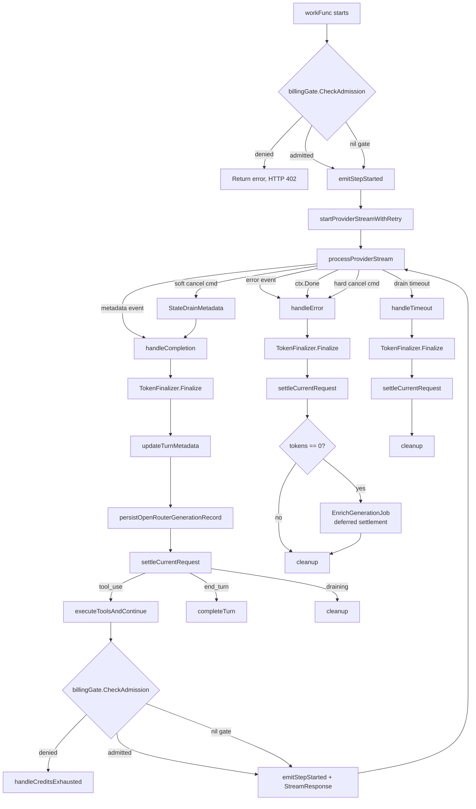
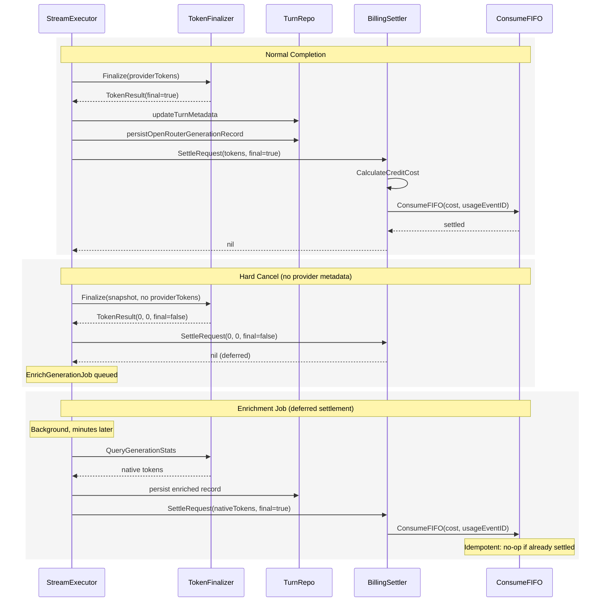

# Executor-Owned Billing Settlement

## Problem

The billing design doc (billing-design.md) puts credit settlement in `CreditUsageReporter`, a library middleware that wraps the provider. This doesn't work:

1. **Hard cancel kills the context.** The middleware's `ReportUsage` runs in `OnDone` or `OnClose`, both of which need a live context. On hard cancel (Anthropic), the request context is cancelled, so `ReportUsage` fails silently.

2. **Soft cancel has a separate token resolution path.** The executor already has `QueryGenerationStats` and `EnrichGenerationJob` for getting authoritative OpenRouter token counts after cancel. If the middleware also tries to report, you get two settlement paths racing.

3. **Double-count risk.** Two independent components (middleware + executor) both trying to record usage for the same LLM request. The FIFO function's idempotency guard (`consumption_group_id`) prevents actual double-deduction, but the architecture shouldn't depend on the database to fix a structural concurrency bug.

4. **Missing lifecycle context.** The middleware doesn't know `requestIndex`, can't distinguish initial from continuation, doesn't have the turn ID, and can't emit SSE events on denial. All of this lives in the executor.

## Solution

Move both admission (gate check) and settlement into the `StreamExecutor`. The executor is the only component with full lifecycle visibility:

- Knows whether this is initial request or tool continuation (`requestIndex`)
- Knows the cancel strategy (state machine: `StateStreaming`, `StateDrainMetadata`, `StateHardCancelled`, `StateTimedOut`)
- Has the generation ID for native stats queries
- Has the background job queue for deferred enrichment
- Runs every terminal path (completion, cancel, error, timeout)
- Has `userID`, `turnID`, and `model` for billing context
- Can emit SSE events (CREDITS_EXHAUSTED) on denial

The library's `UsageMeteringMiddleware` is **not used** for billing. It exists for generic metering use cases; Meridian's billing is executor-level.

## Interfaces

Two narrow interfaces injected into `StreamExecutor`:

```go
// BillingGate checks whether the user has sufficient credits to start an LLM request.
// Returns nil if admitted, *domain.InsufficientCreditsError if denied.
// Fail-closed: any non-nil error rejects the request.
type BillingGate interface {
    CheckAdmission(ctx context.Context, userID string) error
}

// BillingSettler computes cost and deducts credits for one completed LLM request.
// Idempotent by turnID + requestIndex (internally generates usageEventID and consumptionGroupID).
// Returns nil on success, or if tokens are zero (deferred to enrichment job).
// Returns error on settlement failure (caller marks billing_status = pending).
type BillingSettler interface {
    SettleRequest(ctx context.Context, req SettleRequestInput) error
}

type SettleRequestInput struct {
    UserID       string
    TurnID       string
    RequestIndex int
    Model        string
    InputTokens  int
    OutputTokens int
    TokensFinal  bool   // false means background enrichment may provide better numbers later
}
```

`BillingSettler.SettleRequest` implementation (in the billing service, not in the executor):

1. If `InputTokens == 0 && OutputTokens == 0` and `!TokensFinal`: return nil (deferred)
2. Generate `usageEventID = fmt.Sprintf("%s:%d", turnID, requestIndex)`
3. Generate `consumptionGroupID = uuid.NewSHA1(billingNamespace, []byte(usageEventID))`
4. Look up model pricing, call `CalculateCreditCost`
5. Call `ConsumeFIFO` with the computed cost
6. Return nil on success, error on failure

ISP compliance: the executor depends on two small interfaces, not on the full `CreditService`.

## Executor Changes

### New Fields

```go
type StreamExecutor struct {
    // ... existing fields ...

    // Billing: injected by service layer. nil when billing is disabled.
    billingGate    BillingGate
    billingSettler BillingSettler
}
```

Both are nil-safe: nil means billing is disabled (development, tests). All call sites guard with `if se.billingGate != nil` / `if se.billingSettler != nil`.

### Constructor

`NewStreamExecutor` gets two new optional parameters:

```go
func NewStreamExecutor(
    // ... existing params ...
    billingGate BillingGate,       // nil to disable admission checks
    billingSettler BillingSettler,  // nil to disable settlement
) *StreamExecutor
```

## Admission Flow

Gate checks happen at three points, all immediately before a provider call:

### 1. Initial Request (workFunc)

```
workFunc
  |
  +-- updateTurnStatus("streaming")
  |
  +-- GATE CHECK  <--- new
  |     |
  |     +-- denied? -> return error (propagates to service layer -> HTTP 402)
  |     +-- admitted? -> continue
  |
  +-- emitStepStarted()  <--- moved after gate
  |
  +-- startProviderStreamWithRetry()
  |
  +-- processProviderStream()
```

The initial gate denial returns an error from `workFunc`. The service layer maps `*domain.InsufficientCreditsError` to HTTP 402 (since SSE hasn't started yet).

### 2. Tool Continuation (executeToolsAndContinue)

```
executeToolsAndContinue
  |
  +-- execute tools, persist results
  |
  +-- check interjection buffer
  |
  +-- toolIteration++, requestIndex++
  |
  +-- GATE CHECK  <--- new
  |     |
  |     +-- denied? -> handleCreditsExhausted()
  |     |               |
  |     |               +-- emit CREDITS_EXHAUSTED SSE event
  |     |               +-- mark turn status = credit_limited
  |     |               +-- emit RUN_FINISHED(stopReason="credits_exhausted")
  |     |               +-- return nil (graceful end, not an error)
  |     |
  |     +-- admitted? -> continue
  |
  +-- emitStepStarted()  <--- moved after gate
  |
  +-- provider.StreamResponse(contReq)
```

Key: a denied continuation does NOT kill the turn or discard existing blocks. It emits an SSE event and ends gracefully. The user sees their partial content plus a purchase CTA.

### 3. Graceful Completion (executeToolsAndContinueWithLimit)

Same pattern as tool continuation: gate check before `provider.StreamResponse`, handle denial with `handleCreditsExhausted`.

### handleCreditsExhausted

New method on `StreamExecutor`:

```go
func (se *StreamExecutor) handleCreditsExhausted(
    ctx context.Context,
    send func(mstream.Event),
    err error,
) error {
    // Extract denial details
    var insuffErr *domain.InsufficientCreditsError
    errors.As(err, &insuffErr)

    // Mark turn as credit-limited (not errored)
    se.turnRepo.UpdateTurnStatus(ctx, se.turnID, "credit_limited", &err.Error())

    // Emit SSE event
    se.aguiEmitter.EmitCreditsExhausted(
        se.turnID, se.threadID, se.requestIndex,
        insuffErr.BalanceMillicredits,
        insuffErr.RequiredMillicredits,
        insuffErr.ShortfallMillicredits,
    )

    // Emit run finished (not error - this is a controlled stop)
    se.aguiEmitter.EmitStepFinished()
    se.aguiEmitter.EmitRunFinished("credits_exhausted", 0, 0)

    if se.onCleanup != nil {
        se.onCleanup()
    }

    return nil // Graceful end
}
```

## Settlement Flow

Settlement happens in every terminal path. One helper method, `settleCurrentRequest`, centralizes the call:

```go
func (se *StreamExecutor) settleCurrentRequest(ctx context.Context, inputTokens, outputTokens int, tokensFinal bool) {
    if se.billingSettler == nil {
        return
    }

    err := se.billingSettler.SettleRequest(ctx, SettleRequestInput{
        UserID:       se.userID,
        TurnID:       se.turnID,
        RequestIndex: se.requestIndex,
        Model:        se.model,
        InputTokens:  inputTokens,
        OutputTokens: outputTokens,
        TokensFinal:  tokensFinal,
    })
    if err != nil {
        se.logger.Warn("billing settlement failed, marked pending",
            "turn_id", se.turnID,
            "request_index", se.requestIndex,
            "input_tokens", inputTokens,
            "output_tokens", outputTokens,
            "error", err,
        )
        // Mark billing_status = pending on generation record
        se.markBillingPending(ctx, err)
    }
}
```

### Terminal Path: Normal Completion (handleCompletion)

```
handleCompletion(metadata)
  |
  +-- TokenFinalizer.Finalize() -> tokens
  +-- updateTurnMetadata()
  +-- persistOpenRouterGenerationRecord()
  |
  +-- settleCurrentRequest(tokens)  <--- new
  |
  +-- if isDraining -> cleanup and return
  +-- if collectedTools -> executeToolsAndContinue (next request gets its own settlement)
  +-- if interjection -> stream switch
  +-- completeTurn()
```

Settlement uses the finalized tokens from `TokenFinalizer`. For normal completion with provider metadata, `tokensFinal = true`. For soft cancel draining, tokens come from the provider finishing, also `tokensFinal = true`.

### Terminal Path: Error / Hard Cancel (handleError)

```
handleError(err)
  |
  +-- TokenFinalizer.Finalize() -> tokens
  +-- persistTokenMetadata()
  +-- persistPartialBlocks()
  |
  +-- settleCurrentRequest(tokens)  <--- new
  |
  +-- enqueue enrichment job (if cancel + OpenRouter)
  +-- updateTurnError() or skip (if cancelled)
  +-- emitRunError()
  +-- cleanup()
```

On hard cancel, tokens may be zero (no provider metadata). `TokensFinal = false`. The `SettleRequest` implementation returns nil for zero tokens (deferred). The enrichment job will settle later.

### Terminal Path: Soft Cancel Timeout (handleTimeoutInStreamingGoroutine)

```
handleTimeoutInStreamingGoroutine()
  |
  +-- stream.Cancel()
  +-- TokenFinalizer.Finalize(snapshot) -> tokens
  +-- persistTokenMetadata()
  |
  +-- settleCurrentRequest(tokens)  <--- new
  |
  +-- emitRunError(isCancelled=true)
  +-- cleanup()
```

Tokens come from the cancel-time snapshot or OpenRouter API query. May be final or not.

## Token Source Priority

Settlement uses whatever tokens the `TokenFinalizer` already resolved. The priority chain (unchanged):

1. **Provider metadata** (Anthropic: always present on completion; OpenRouter: usually present)
2. **OpenRouter generation stats API** (queried inline with 2s timeout)
3. **None** (IsFinal=false, settlement deferred to enrichment job)

The executor doesn't add a new token resolution path. It takes the tokens that `TokenFinalizer` already computed and passes them to `settleCurrentRequest`.

## Deferred Settlement via Enrichment Job

When tokens aren't immediately available (OpenRouter eventual consistency on cancel), the existing `EnrichGenerationJob` already retries with exponential backoff. It needs one extension:

```go
// In EnrichGenerationJob.Execute(), after successfully getting native tokens:
func (j *EnrichGenerationJob) Execute(ctx context.Context) error {
    // ... existing: query stats, persist enriched generation record ...

    // NEW: Trigger billing settlement with authoritative tokens
    if j.billingSettler != nil {
        err := j.billingSettler.SettleRequest(ctx, SettleRequestInput{
            UserID:       j.userID,    // new field on job
            TurnID:       j.turnID,
            RequestIndex: j.requestIndex,
            Model:        j.model,
            InputTokens:  stats.NativeTokensPrompt,
            OutputTokens: stats.NativeTokensCompletion,
            TokensFinal:  true,
        })
        if err != nil {
            j.logger.Warn("billing settlement from enrichment failed",
                "turn_id", j.turnID,
                "error", err,
            )
            // Don't fail the enrichment job - token data is already persisted
        }
    }

    return nil
}
```

The FIFO function's idempotency guard (`consumption_group_id` check) prevents double-deduction if the executor already settled synchronously.

## Interaction with Existing Infrastructure

### persistOpenRouterGenerationRecord

**Unchanged.** This method captures per-request generation metadata for auditing (provider name, native tokens, cost from OpenRouter). It runs before `settleCurrentRequest`.

The generation record is extended with billing fields (as specified in billing-design.md):
- `billing_usage_event_id`
- `billing_consumption_group_id`
- `billing_amount_millicredits`
- `billing_status` (pending | settled | failed)
- `billing_last_error`

`settleCurrentRequest` updates these fields after FIFO deduction succeeds or fails.

### TokenFinalizer

**Unchanged.** Settlement consumes the `TokenResult` that `TokenFinalizer` already produces. No new token resolution logic.

### EnrichGenerationJob

**Extended** with `BillingSettler` and `userID`. After enrichment succeeds, it calls `SettleRequest` with the authoritative native token counts.

### JobQueue

**Unchanged.** The existing job queue handles enrichment retry. A new reconciliation job type is added for settlement retry (separate from enrichment):

```go
// ReconcileBillingJob retries failed FIFO settlement.
// Created when settleCurrentRequest fails due to transient DB errors.
type ReconcileBillingJob struct {
    UserID       string
    TurnID       string
    RequestIndex int
    Model        string
    InputTokens  int
    OutputTokens int
}
```

This job calls `SettleRequest` again. Idempotency key prevents double-deduction.

## Complete Lifecycle Diagram



## Settlement Sequence for Each Terminal Path



## Changes to billing-design.md

### Remove

- "Provider Middleware Integration" section's reliance on `CreditUsageReporter` for settlement
- "Settlement order inside CreditUsageReporter" (6-step list)
- References to `UsageMeteringMiddleware` wrapping the provider for billing purposes
- "Meridian library wiring" paragraph about `WrapProvider`
- "Meridian attaches UsageScope" paragraph and the three call site references
- "Scope values" list

### Replace With

A new subsection: "Executor-Level Settlement Architecture" that references this document for the detailed design.

Key points for the replacement text:
- Settlement lives in `StreamExecutor`, not in library middleware
- Gate check before each provider call (3 points)
- Settlement after each request's terminal path
- Deferred settlement via enrichment job when tokens unavailable
- No billing code in meridian-llm-go

### Keep Unchanged

- `BillingGate` concept (renamed from `CreditUsageGate`, moved to executor)
- `CreditGate` HTTP middleware (coarse fast-fail for `POST /api/turns`)
- `CalculateCreditCost` pure function
- FIFO multi-lot deduction
- Generation record billing fields
- `CREDITS_EXHAUSTED` SSE event and turn state rules
- `handleCreditsExhausted` implementation note (already aligned)
- Failure mode and reconciliation section
- All Stripe, API, and migration sections

### Update

- "Billing Boundaries" diagram: replace `UsageMeteringMiddleware` flow with executor-level settlement
- "Two-Level Credit Gate" section: clarify that "step-level" gate is in the executor, not middleware
- "Executor ordering changes" paragraph: restate in terms of this design's gate-before-step pattern
- "Denial mapping rules": simplify since executor handles denial directly (no library error mapping needed for settlement path)
