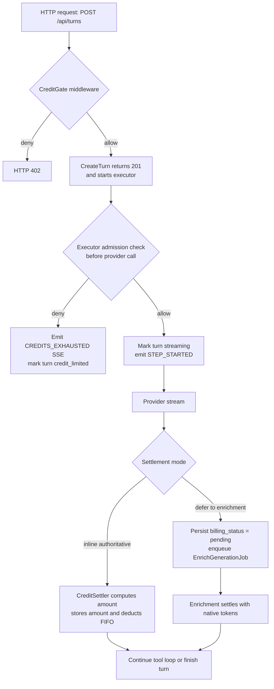
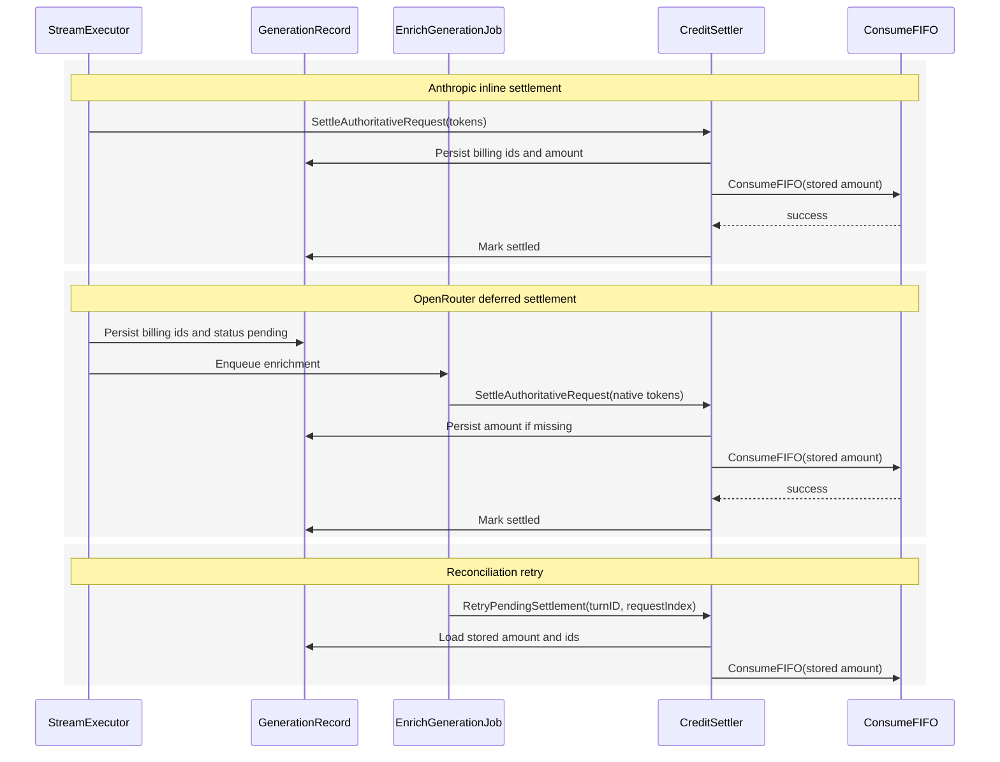

# Executor-Owned Credit Settlement

## Problem

The original billing design still treated settlement as library middleware work. That breaks in Meridian's actual control flow:

1. Middleware does not own the stream lifecycle details Meridian needs: `requestIndex`, initial vs continuation, generation IDs, cancel strategy, SSE emission, and turn status transitions all live in `StreamExecutor`.
2. OpenRouter stream metadata is not authoritative for billing. `CalculateCreditCost` charges for `ReasoningTokens` and `CachedTokens`, but those dimensions only arrive from generation enrichment.
3. `CreateTurn` returns `201` before `workFunc` runs, so the executor cannot produce the initial `402` response. Any denial that happens inside `workFunc` is already on the SSE path.
4. Reconciliation cannot recompute from the current pricing table without drift. The first authoritative settlement attempt must persist `billing_amount_millicredits`, and retries must reuse it.
5. Nil billing collaborators are a production footgun. Missing wiring should fail startup, not silently disable billing.

## Decisions

- Keep `CreditGate` HTTP middleware as the only synchronous `402` path for `POST /api/turns`.
- Move authoritative step-level admission into `StreamExecutor`, immediately before every provider call.
- Settle inline only when streaming metadata is authoritative for all billable token dimensions.
- Defer OpenRouter settlement to `EnrichGenerationJob`, because enrichment is the first point where native prompt, completion, reasoning, and cached tokens are all available together.
- Persist `billing_usage_event_id`, `billing_consumption_group_id`, and `billing_amount_millicredits` on the generation record. Reconciliation retries use those stored values; they do not recalculate price.
- Keep billing as explicit executor collaborators rather than introducing a generic `StreamLifecycleObserver` abstraction.

## Naming

Use `CreditAdmissionChecker` and `CreditSettler`.

- `CreditGate` remains the HTTP middleware name.
- `CreditAdmissionChecker` is the executor-facing collaborator that answers "may this request start?"
- `CreditSettler` is the executor-facing collaborator that records authoritative usage and deducts credits.

This avoids overloading "gate" across the HTTP and executor layers.

## Settlement Modes

The executor resolves one settlement mode per provider request:

```go
type CreditSettlementMode string

const (
    CreditSettlementInlineAuthoritative  CreditSettlementMode = "inline_authoritative"
    CreditSettlementDeferredToEnrichment CreditSettlementMode = "deferred_to_enrichment"
)
```

Current mapping:

- Anthropic: `inline_authoritative`
- OpenRouter: `deferred_to_enrichment`

Future providers can opt into inline settlement only if the stream terminal metadata includes every billable token dimension Meridian prices today.

## Interfaces

```go
// CreditAdmissionChecker answers whether a user may start the next provider call.
// Returns nil on admit, or *domain.InsufficientCreditsError on denial.
// Fail closed: any other error also blocks the call.
type CreditAdmissionChecker interface {
    CheckAdmission(ctx context.Context, userID string) error
}

// CreditSettler consumes authoritative usage for one request index.
// The first authoritative attempt persists usage ids and billing_amount_millicredits
// on the generation record before FIFO deduction. RetryPendingSettlement reuses that
// stored amount; it does not re-price from the current pricing table.
type CreditSettler interface {
    SettleAuthoritativeRequest(ctx context.Context, req SettleRequestInput) error
    RetryPendingSettlement(ctx context.Context, req RetryPendingSettlementInput) error
}

type SettleRequestInput struct {
    UserID           string
    TurnID           string
    RequestIndex     int
    Model            string
    InputTokens      int64
    OutputTokens     int64
    ReasoningTokens  int64
    CachedTokens     int64
}

type RetryPendingSettlementInput struct {
    TurnID       string
    RequestIndex int
}
```

`SettleAuthoritativeRequest` performs:

1. Derive `usageEventID = fmt.Sprintf("%s:%d", turnID, requestIndex)`.
2. Derive `consumptionGroupID = uuid.NewSHA1(billingNamespace, []byte(usageEventID))`.
3. Compute `amountMillicredits = CalculateCreditCost(...)` from all four token dimensions.
4. Persist `billing_usage_event_id`, `billing_consumption_group_id`, and `billing_amount_millicredits` on the generation record before attempting FIFO deduction.
5. Call `ConsumeFIFO` with the stored amount.
6. Mark the generation record `settled` on success, or `pending` with `billing_last_error` on failure.

`RetryPendingSettlement` loads the persisted billing fields from the generation record and retries only the deduction/writeback path.

## Wiring And Nil Safety

The executor constructor takes interfaces, not optional pointers. Nil is a programming error.

```go
type StreamExecutor struct {
    // ... existing fields ...
    creditAdmissionChecker CreditAdmissionChecker
    creditSettler          CreditSettler
    settlementMode         CreditSettlementMode
}
```

Wiring rules:

- Production startup must provide non-nil implementations and fail fast if either dependency is missing.
- Test and development wiring uses explicit no-op implementations such as `NoopCreditAdmissionChecker` and `NoopCreditSettler`.
- Call sites do not branch on nil. Billing being "disabled" is an explicit dependency choice, not an implicit absence.

## Admission Flow

There are two admission layers with different jobs.

### 1. HTTP `CreditGate` Middleware

This is the only `402` path for the initial request.

- Runs before `CreateTurn`.
- Performs a coarse fail-closed balance check.
- Returns HTTP `402` when the wallet is already exhausted.

Because `CreateTurn` starts the executor in a background goroutine, no denial that happens later can rewrite the response code.

### 2. Executor Step Gate

The executor runs `CreditAdmissionChecker.CheckAdmission` immediately before every provider call:

- initial assistant request
- each tool continuation
- graceful-completion continuation

If the initial executor check denies after the HTTP middleware admitted, the executor emits `CREDITS_EXHAUSTED` and ends the run gracefully. It does not attempt to surface a second HTTP `402`.

### Initial Request Ordering

```text
workFunc
  |
  +-- Emit RUN_STARTED
  |
  +-- CheckAdmission()            <--- belt-and-suspenders race check
  |     |
  |     +-- denied -> handleCreditsExhausted(initial request)
  |     +-- admitted -> continue
  |
  +-- updateTurnStatus("streaming")
  +-- emitStepStarted()
  +-- startProviderStreamWithRetry()
```

Important ordering change: a denied request does not emit a fake `STEP_STARTED`, and does not transiently mark the turn `streaming`.

### Continuation Ordering

```text
executeToolsAndContinue
  |
  +-- persist tool results
  +-- emitStepFinished() for the completed step
  +-- requestIndex++
  +-- CheckAdmission()
  |     |
  |     +-- denied -> handleCreditsExhausted(continuation)
  |     +-- admitted -> continue
  |
  +-- emitStepStarted()
  +-- provider.StreamResponse(...)
```

Continuation denial preserves all previously persisted blocks and ends the run with `credit_limited`.

## Settlement Flow

### Inline-Authoritative Providers

For providers such as Anthropic, the terminal stream metadata is authoritative. The executor settles in the terminal handler for that request index.

Terminal-path behavior:

- `handleCompletion`: settle inline after final metadata and generation record persistence.
- `handleError` / timeout paths: settle inline only if the token finalizer already produced authoritative usage.

### Deferred-To-Enrichment Providers

For OpenRouter, the executor never settles from streaming metadata.

Instead it:

1. Persists the generation record for the request index.
2. Persists deterministic billing ids and marks `billing_status = pending`.
3. Enqueues `EnrichGenerationJob`.
4. Lets enrichment call `SettleAuthoritativeRequest` once native tokens are available.

This prevents the "first writer wins" idempotency bug where approximate inline settlement would permanently underbill reasoning-heavy requests.

### Stored Amount And Retry Semantics

The authoritative attempt is also the moment that fixes price.

- First authoritative attempt computes `billing_amount_millicredits` and persists it.
- `ReconcileBillingJob` retries deduction by loading the stored amount and ids from the generation record.
- Reconciliation never calls `CalculateCreditCost` again.

That keeps retries stable even if the pricing table changes after inference.

### Deferred Settlement Recovery

OpenRouter settlement depends on enrichment, so the durable recovery point is the generation record, not the in-memory queue.

- Before enqueueing enrichment, the executor persists `billing_status = pending` plus deterministic usage identifiers.
- If the process dies before the in-memory queue runs the job, a startup sweep or periodic reconciler can find pending generation records and re-enqueue enrichment or settlement.

The queue remains an operational dependency, but billing state is not lost just because a single in-memory job was dropped.

## Lifecycle Diagram



## Settlement Sequence



## Why Not `StreamLifecycleObserver`

I considered collapsing admission and settlement behind a generic observer such as:

```go
type StreamLifecycleObserver interface {
    OnRequestStart(ctx context.Context, requestIndex int) error
    OnRequestEnd(ctx context.Context, requestIndex int, usage TokenUsage) error
}
```

I am not using that abstraction in this design.

Reasons:

- Billing is still the only concrete lifecycle concern here.
- Denial handling is not pure observation. The executor must decide whether to emit `STEP_STARTED`, emit `CREDITS_EXHAUSTED`, and mark the turn `credit_limited`.
- A generic observer would hide important control-flow edges without reducing much real complexity; it would replace two explicit collaborators with one more abstract collaborator plus executor-specific branches anyway.

If a second executor-level lifecycle concern arrives with similar hooks, revisit this and extract a shared observer then.

## Required Alignment In `billing-design.md`

`billing-design.md` should now reflect:

- `CreditGate` middleware is the only HTTP `402` source.
- Step-level admission and settlement are executor-owned.
- OpenRouter settlement is always deferred to enrichment.
- `billing_amount_millicredits` is stored on the first authoritative settlement attempt and reused by reconciliation.
- No Meridian billing behavior depends on library middleware.
