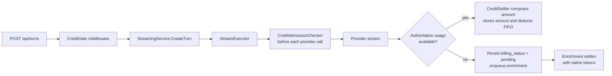
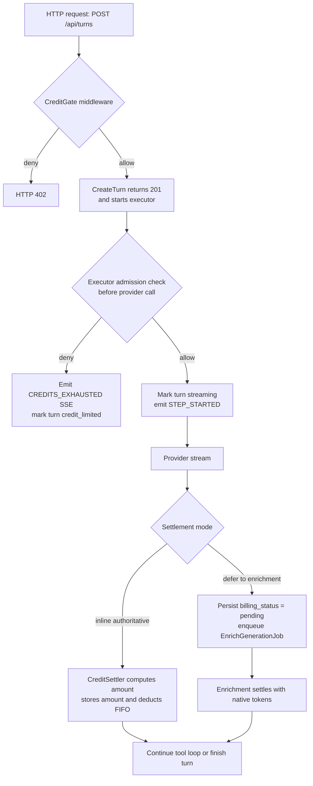
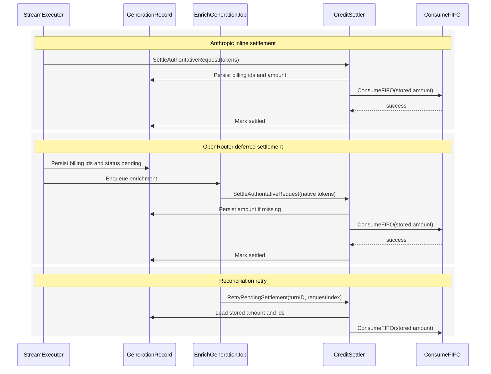
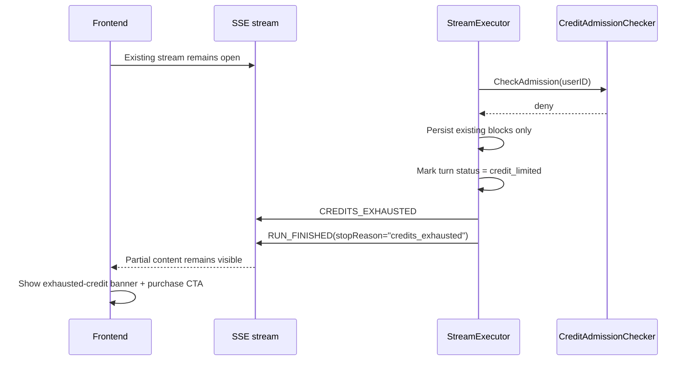

# Credit Settlement

How credits are admitted and consumed during AI streaming. This covers the two-layer gate, inline vs deferred settlement, reconciliation, and the CREDITS_EXHAUSTED SSE event.

## Architecture



## Naming

| Name | Layer | Role |
|------|-------|------|
| `CreditGate` | HTTP middleware | Coarse fail-closed `402` before `CreateTurn` |
| `CreditAdmissionChecker` | Executor collaborator | "May this request start?" |
| `CreditSettler` | Executor collaborator | Records authoritative usage and deducts FIFO |

## Two-Level Credit Gate

### 1. HTTP `CreditGate` Middleware

`POST /api/turns` starts streaming in a background goroutine (`backend/internal/service/llm/streaming/service.go:618-621`). This is the **only** reliable HTTP `402` path.

- Runs synchronously before `CreateTurn`
- Coarse fail-closed balance check via `CreditAdmissionChecker.CheckAdmission`
- Returns HTTP `402` when wallet is already exhausted
- Does not attempt authoritative per-step admission

```go
func CreditGate(checker billing.CreditAdmissionChecker) func(http.Handler) http.Handler {
    return func(next http.Handler) http.Handler {
        return http.HandlerFunc(func(w http.ResponseWriter, r *http.Request) {
            userID := httputil.GetUserID(r)
            if err := checker.CheckAdmission(r.Context(), userID); err != nil {
                handleError(w, err, cfg)
                return
            }
            next.ServeHTTP(w, r)
        })
    }
}
```

Applied only to billable AI entrypoints — not document CRUD, not Stripe webhooks.

### 2. Executor Step Gate

`StreamExecutor` runs `CreditAdmissionChecker.CheckAdmission` immediately before every provider call:

- Initial assistant response
- Every tool continuation
- Graceful-completion continuation

If the initial executor check denies after the HTTP middleware admitted: stream emits `CREDITS_EXHAUSTED`, ends gracefully. It does not attempt to rewrite the already-started `201` + SSE flow back to HTTP `402`.

## Bounded Negative Exposure

No reservations. Small negative balances are accepted.

Worst-case exposure formula: `max_concurrent_streams × max_billable_steps × max_step_cost`

v1 budget:

| Limit | Value |
|-------|-------|
| `max_concurrent_streams_per_user` | 3 |
| `max_billable_steps_per_stream` | 20 |
| `max_step_cost_credits` | 15 |
| **Worst-case exposure** | **900 credits ($9.00)** |

OpenRouter deferred settlement creates an exposure window between request completion and enrichment settlement (admission gate checks a stale balance). V1 mitigates via `max_concurrent_streams_per_user = 3` on a single-replica deployment. Multi-replica deployment requires shared admission state. Future mitigation: reservation model (hold estimated credits at gate, settle actual at enrichment).

## Settlement Modes

```go
type CreditSettlementMode string

const (
    CreditSettlementInlineAuthoritative  CreditSettlementMode = "inline_authoritative"
    CreditSettlementDeferredToEnrichment CreditSettlementMode = "deferred_to_enrichment"
)
```

| Provider | Mode | Reason |
|----------|------|--------|
| Anthropic | `inline_authoritative` | Terminal stream metadata includes all billable token dimensions |
| OpenRouter | `deferred_to_enrichment` | Native prompt/completion/reasoning/cached tokens only available after enrichment |

Future providers can use inline only if stream terminal metadata includes every billable dimension.

## Go Interfaces

```go
// CreditAdmissionChecker answers whether a user may start the next provider call.
// Returns nil on admit, or *domain.InsufficientCreditsError on denial.
// Fail closed: any other error also blocks the call.
type CreditAdmissionChecker interface {
    CheckAdmission(ctx context.Context, userID string) error
}

// CreditSettler consumes authoritative usage for one request index.
// The first authoritative attempt persists usage ids and billing_amount_millicredits
// on the generation record before FIFO deduction. RetryPendingSettlement reuses that
// stored amount; it does not re-price from the current pricing table.
type CreditSettler interface {
    SettleAuthoritativeRequest(ctx context.Context, req SettleRequestInput) error
    RetryPendingSettlement(ctx context.Context, req RetryPendingSettlementInput) error
}

type SettleRequestInput struct {
    UserID          string
    TurnID          string
    RequestIndex    int
    Model           string
    InputTokens     int64
    OutputTokens    int64
    ReasoningTokens int64
    CachedTokens    int64
}

type RetryPendingSettlementInput struct {
    TurnID       string
    RequestIndex int
}
```

`SettleAuthoritativeRequest` steps:
1. Derive `usageEventID = fmt.Sprintf("%s:%d", turnID, requestIndex)`
2. Derive `consumptionGroupID = uuid.NewSHA1(billingNamespace, []byte(usageEventID))`
3. Compute `amountMillicredits = CalculateCreditCost(...)` from all four token dimensions
4. Persist `billing_usage_event_id`, `billing_consumption_group_id`, `billing_amount_millicredits` on generation record (write-ahead before deduction)
5. Call `ConsumeFIFO` with the stored amount
6. Mark generation record `settled` on success, or `pending` with `billing_last_error` on failure

`RetryPendingSettlement` loads persisted billing fields from the generation record and retries only the deduction/writeback path.

## Wiring and Nil Safety

The executor takes interfaces, not optional pointers. Nil is a programming error.

```go
type StreamExecutor struct {
    // ... existing fields ...
    creditAdmissionChecker CreditAdmissionChecker
    creditSettler          CreditSettler
    settlementMode         CreditSettlementMode
}
```

- Production startup must provide non-nil implementations; fail fast if missing
- Tests and development use explicit no-ops: `NoopCreditAdmissionChecker`, `NoopCreditSettler`
- Call sites do not branch on nil — "billing disabled" is an explicit dependency choice, not an implicit absence

## Admission Flow

### Initial Request

```text
workFunc
  |
  +-- Emit RUN_STARTED
  |
  +-- CheckAdmission()            <--- belt-and-suspenders race check
  |     |
  |     +-- denied -> handleCreditsExhausted(initial request)
  |     +-- admitted -> continue
  |
  +-- updateTurnStatus("streaming")
  +-- emitStepStarted()
  +-- startProviderStreamWithRetry()
```

A denied request does not emit a fake `STEP_STARTED` and does not transiently mark the turn `streaming`.

### Continuation

```text
executeToolsAndContinue
  |
  +-- persist tool results
  +-- emitStepFinished() for the completed step
  +-- requestIndex++
  +-- CheckAdmission()
  |     |
  |     +-- denied -> handleCreditsExhausted(continuation)
  |     +-- admitted -> continue
  |
  +-- emitStepStarted()
  +-- provider.StreamResponse(...)
```

Continuation denial preserves all previously persisted blocks and ends the run with `credit_limited`.

## Settlement Flow





### Inline-Authoritative Providers (Anthropic)

Terminal stream metadata is authoritative. Executor settles in the terminal handler for that request index:
- `handleCompletion`: settle inline after final metadata and generation record persistence
- `handleError` / timeout paths: settle inline only if token finalizer already produced authoritative usage

### Deferred-To-Enrichment Providers (OpenRouter)

Executor never settles from streaming metadata. Instead:
1. Persists the generation record for the request index
2. Persists deterministic billing ids and marks `billing_status = pending`
3. Enqueues `EnrichGenerationJob`
4. Enrichment calls `SettleAuthoritativeRequest` once native tokens are available

This prevents the "first writer wins" idempotency bug where approximate inline settlement would permanently underbill reasoning-heavy requests.

### Stored Amount and Retry Semantics

- First authoritative attempt computes `billing_amount_millicredits` and persists it
- `ReconcileBillingJob` retries by loading the stored amount from the generation record
- Reconciliation **never** calls `CalculateCreditCost` again — retries are stable even if the pricing table changes

### Deferred Settlement Recovery

The durable recovery point is the generation record, not the in-memory queue:
- Before enqueueing enrichment, executor persists `billing_status = pending` plus deterministic usage identifiers
- If the process dies before the in-memory queue runs, a startup sweep or periodic reconciler finds pending generation records and re-enqueues enrichment or settlement

## Failure Modes

### Admission Check Failure

- Balance lookup failure: reject the request (fail closed)
- Step-level check failure: reject the next provider call
- No best-effort on admission

### Transport: `402` vs SSE

`402 Payment Required` is only valid before the SSE stream begins.

| Scenario | Transport |
|----------|-----------|
| `POST /api/turns` with empty wallet | `CreditGate` returns HTTP `402` |
| Initial executor denial after middleware admitted | Emit `CREDITS_EXHAUSTED` SSE (stream already on `201` path) |
| Tool continuation denial | Emit `CREDITS_EXHAUSTED` SSE (stream already open) |

Turn-state rules on exhaustion:
- Preserve all blocks already persisted for earlier successful steps
- Do not delete or rewrite partial assistant output
- Set assistant turn `status = credit_limited`
- Set assistant turn `error = 'insufficient credits'`
- Set final stop reason to `credits_exhausted`



Implementation note: `mstream_adapter.go` and `tool_executor.go` must branch on `CreditAdmissionChecker` denial and call a dedicated `handleCreditsExhausted(...)` path — do not route through the generic `handleError(...)` (that emits `RUN_ERROR` and marks the turn `error`).

### Deduction Failure After Successful Inference

1. Persist exact usage plus deterministic billing identifiers on the generation record first
2. On the first authoritative settlement attempt, compute and store `billing_amount_millicredits`
3. Attempt FIFO deduction using the stored amount
4. On success: mark `billing_status = settled`
5. On failure: mark `billing_status = pending`, enqueue reconciliation

The user receives the successful model output. Billing is corrected asynchronously.

### Reconciliation

| Property | Value |
|----------|-------|
| Trigger | Startup sweep scans generation records with `billing_status = pending` |
| Periodic | Cron every 15 minutes; checks pending settlements older than 5 minutes |
| Action | Load stored `billing_amount_millicredits`, call `CreditSettler.RetryPendingSettlement` |
| Retry policy | Exponential backoff, max 5 attempts over 24 hours |
| Terminal | After 5 failures: mark `billing_status = failed`, fire monitoring alert |
| Durability | Requires generation record persisted before settlement (write-ahead pattern) |

## Why Not `StreamLifecycleObserver`

A generic observer interface was considered:

```go
type StreamLifecycleObserver interface {
    OnRequestStart(ctx context.Context, requestIndex int) error
    OnRequestEnd(ctx context.Context, requestIndex int, usage TokenUsage) error
}
```

Not used because:
- Billing is currently the only concrete lifecycle concern
- Denial handling is not pure observation — the executor must decide whether to emit `STEP_STARTED`, emit `CREDITS_EXHAUSTED`, and mark the turn `credit_limited`
- A generic observer would hide important control-flow edges without reducing real complexity

If a second executor-level lifecycle concern arrives with similar hooks, extract a shared observer then.
