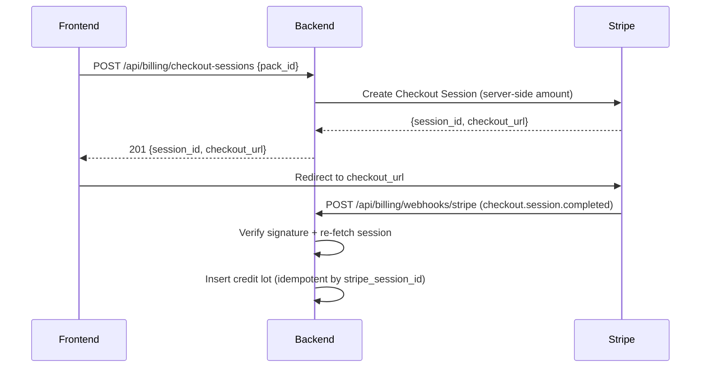

# Stripe Integration

Purchase flow, webhook security, and signup credit initialization.

## Purchase Flow



Session parameters:
- `client_reference_id = user_id`
- `metadata.user_id`
- `metadata.pack_id`
- Amount and description set server-side

**No client-supplied amounts are trusted.**

## Webhook Security

The webhook handler must do all of the following:

1. Read raw request body before JSON parsing
2. Verify signature with `stripe.ConstructEvent` using `STRIPE_WEBHOOK_SECRET`
3. Enforce Stripe's timestamp tolerance through Stripe's verifier
4. For `checkout.session.completed`, fetch the session from Stripe again using the server secret key
5. Verify:
   - Session exists
   - `payment_status = paid`
   - `mode = payment`
   - `metadata.user_id` exists
   - `metadata.pack_id` maps to a known pack
   - Fetched Stripe amount matches the server-side pack definition
6. In one DB transaction:
   - Insert purchase lot if `stripe_session_id` not already seen
   - Insert purchase transaction

Duplicate webhook deliveries are harmless — `stripe_session_id` has a unique partial index.

## JWT Bypass for Webhook Route

Stripe does not send Meridian JWTs. Auth middleware must bypass exactly:

```
POST /api/billing/webhooks/stripe
```

Security comes from Stripe signature verification plus session re-fetch, not from JWT.

## Signup Credit Initialization

### Why Frontend-Mediated Initialization

Supabase signup does not automatically invoke Meridian backend business logic. The backend needs an explicit hook to grant the one-time signup lot.

Design: frontend calls `POST /api/auth/initialize` after login session becomes available, and again after email verification completes. Backend decides whether to mint the signup lot or no-op.

| Signup method | When credits are granted | Why |
|---------------|--------------------------|-----|
| Google OAuth | First successful `POST /api/auth/initialize` | Identity already verified |
| Email/password | First successful initialize after email is verified | Prevents disposable-email abuse |

### Auth Context Required

`POST /api/auth/initialize` requires authenticated request context with:
- `user_id`
- `email`
- `email_verified`
- `auth_provider`

Do not force billing to call back out to Supabase on every initialize request. This is an A2 dependency.

### Idempotency

The signup grant uses:
- `grant_reason = signup_bonus_v1`
- Unique partial index on `(user_id, grant_reason)`

If the endpoint is called 20 times, only the first successful eligible call creates the lot.
