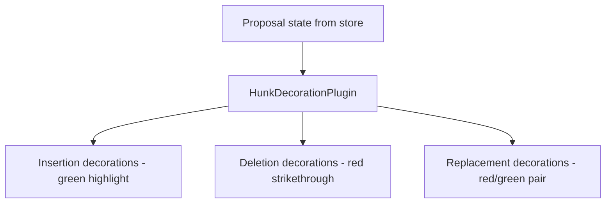

# Collab v2 Integration with Workspace Modes

## Principle: Review Components Are Mode-Agnostic

The collab v2 review experience (inline hunks, accept/reject, undo) is built as standalone components. The layout shell places them -- components don't know which mode they're in.

## Editor-Side Components (CM6)

These render inside the CodeMirror editor, regardless of mode.

### Inline Hunk Decorations



- Decorations are a separate CM6 layer, independent of live preview decorations
- Each hunk is a `Decoration.mark` with CSS classes for ins/del styling
- Decorations rebuild when proposal state changes (reactive, not imperative)

### Hunk Toolbar

Floating toolbar appears above the active hunk (hunk nearest cursor).

| Action | Effect |
|---|---|
| Accept | Apply hunk to Y.Text, remove from proposal |
| Reject | Remove hunk from proposal, no text change |
| Next/Prev | Jump cursor to adjacent hunk |

- Toolbar positioned via CM6 `tooltipPlugin` relative to hunk range
- Keyboard shortcuts: `Cmd+Shift+A` (accept), `Cmd+Shift+R` (reject), `Cmd+Shift+N/P` (navigate)
- Toolbar component is a React portal rendered inside CM6

### Undo

Thread-scoped undo reverts the last accepted/rejected hunk for that thread's proposal.

- `Cmd+Z` in the document editor is handled by Y.UndoManager. CM6 built-in undo is disabled in the document editor -- Y.UndoManager is the single source of truth for document editor undo. See [Undo Design](undo.md).
- Chat input uses independent CM6 local history (isolated from the document editor undo stack)
- Thread undo is a separate action: button in hunk toolbar or thread panel

## Thread-Side Components

These render in the thread panel (primary in Converse, sidecar in Studio).

### ProposalQuickActions

Rendered on tool result blocks that contain proposals.

```
┌─────────────────────────────────────┐
│  ✎ Edited chapter-3.md             │
│  +12 lines, -4 lines, 3 hunks     │
│                                     │
│  [Accept All]  [Reject All]  [Review] │
└─────────────────────────────────────┘
```

| Action | Effect |
|---|---|
| Accept All | Apply all hunks in this proposal |
| Reject All | Discard all hunks |
| Review | Open document with hunks highlighted, jump to first hunk |

### Status Badges

Thread messages show proposal status:

| Badge | Meaning |
|---|---|
| `pending` | Hunks awaiting review |
| `partial` | Some hunks accepted/rejected |
| `accepted` | All hunks accepted |
| `rejected` | All hunks rejected |
| `mixed` | Some accepted, some rejected |

### Thread Undo/Reapply

Per-thread undo stack for proposal operations:

- "Undo last accept" -- reverts text change, moves hunk back to pending
- "Reapply" -- re-applies the undone operation
- Stack is linear per-thread, displayed as a subtle undo button near the proposal block

## Layout Integration

The layout shell is the **only** mode-aware layer for review:

### Converse Mode

```
Thread (primary)              Editor (secondary)
┌──────────────────┐         ┌──────────────────┐
│ ... messages ... │         │                  │
│ ┌──────────────┐ │         │  [hunk toolbar]  │
│ │ ProposalQuick│ │ ──────> │  ===insertion=== │
│ │ Actions      │ │ Review  │  ~~~deletion~~~  │
│ └──────────────┘ │         │                  │
│ ... messages ... │         │                  │
└──────────────────┘         └──────────────────┘
```

- "Review" action auto-expands editor if collapsed
- Editor scrolls to first pending hunk

### Studio Mode

```
Editor (primary)                     Chat (sidecar)
┌────────────────────────┐          ┌──────────────┐
│  [hunk toolbar]        │          │ ... msgs ... │
│  ===insertion===       │          │ ┌──────────┐ │
│  ~~~deletion~~~        │   <───── │ │ Proposal │ │
│                        │  Accept  │ │ Quick    │ │
│                        │          │ │ Actions  │ │
│                        │          │ └──────────┘ │
└────────────────────────┘          └──────────────┘
```

- Hunks always visible in the primary editor
- Quick actions in sidecar for bulk operations

## Decoration Layer Ordering

CM6 decorations are layered with explicit precedence:

```
Layer 0 (base):     Syntax highlighting (Lezer)
Layer 1:            Live preview decorations (heading, emphasis, code, etc.)
Layer 2:            Block rendering (math, mermaid, images)
Layer 3:            Proposal hunk decorations (ins/del/replace)
Layer 4:            Cursor/selection decorations
Layer 5:            Collab cursors (other users)
```

Each layer is a separate CM6 `ViewPlugin` with its own `DecorationSet`. Layers compose via CM6's built-in decoration merging -- no manual conflict resolution needed.

## Cross-References

- [Layout Architecture](layout-architecture.md) -- panel sizing and mode switching
- [Editor Direction](editor-direction.md) -- live preview and decoration architecture
- [Frontend Diff Model](frontend-diff-model.md) -- hunk data model
- [Undo Design](undo.md) -- undo mechanics
