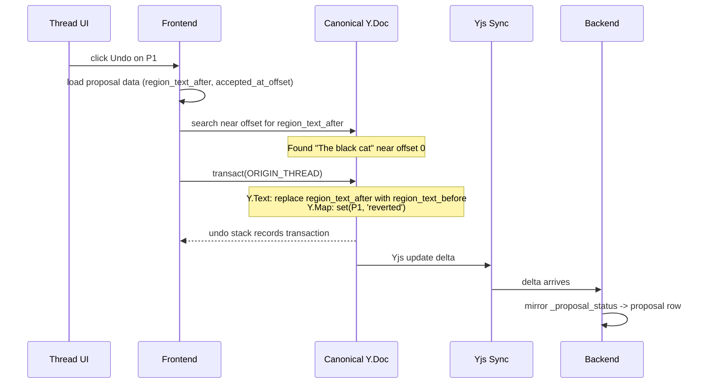

# Undo Design

## Overview

Two complementary undo systems handle different scopes:

| System | Trigger | Scope | Persistence | Mechanism |
|--------|---------|-------|-------------|-----------|
| **Session Ctrl-Z** | Keyboard shortcut | Recent local history | No (session-scoped) | UndoManager over Yjs shared types |
| **Thread-level** | Click in thread UI | One persisted proposal | Yes (survives reload) | Offset-anchored text search and replace |

Both systems write to `_proposal_status` Y.Map and both are tracked in the session undo stack. They compose: a thread undo can be Ctrl-Z'd, and vice versa.

## Session Undo (Ctrl-Z)

### UndoManager Setup

```typescript
const ORIGIN_HUMAN = 'human';
const ORIGIN_ACCEPT = 'accept';
const ORIGIN_REJECT = 'reject';
const ORIGIN_GC = 'gc';
const ORIGIN_THREAD = 'thread';

const undoManager = new Y.UndoManager(
  [doc.getText('content'), doc.getMap('_proposal_status')],
  {
    trackedOrigins: new Set([
      ORIGIN_HUMAN,
      ORIGIN_ACCEPT,
      ORIGIN_REJECT,
      ORIGIN_THREAD,
    ]),
    // null is intentionally excluded — sync providers use null as origin.
    // Tracking null would make remote changes undoable, breaking local-first authority.
    // Never add null or the sync provider instance to trackedOrigins.
  }
);

// On collaboration mode change (auto-apply <-> manual)
// Intentionally drops session undo history to prevent cross-mode undo confusion.
// Thread undo (via sidebar) is unaffected — it uses stored text, not the undo stack.
// IMPORTANT: prompt for confirmation if the undo stack is non-empty before clearing.
if (undoManager.undoStack.length > 0) {
  const confirmed = await showConfirmation(
    "Switching modes will clear your undo history. Thread undo is unaffected."
  );
  if (!confirmed) return; // abort mode switch
}
undoManager.clear();
```

### Ctrl-Z Behavior

`undoManager.undo()` reverts the most recent tracked transaction.

**Important:** UndoManager has a default `captureTimeout` of 500ms. Consecutive tracked transactions within this window are merged into a single undo item. To ensure each discrete action (Accept, Reject, Thread op) is its own undo step, call `undoManager.stopCapturing()` before each action. Without this, accepting a hunk and then immediately typing would merge into one undo step.

| Last action | Undo effect |
|-------------|-------------|
| Accept hunk | Reverts all grouped proposal updates and status writes as one step |
| Reject hunk | Reverts all grouped status writes as one step |
| Typing | Reverts recent text change |

### Example: Interleaved Undo Stack

Writer performs these actions in order:

```
1. Type "Hello "                          (ORIGIN_HUMAN)
2. Accept hunk [P1]                       (ORIGIN_ACCEPT)
3. Type "world"                           (ORIGIN_HUMAN)
4. Reject hunk [P2, P3]                   (ORIGIN_REJECT)
```

Undo stack (top = most recent):

```
[4] Reject [P2,P3]:  Y.Map set(P2,'rejected') + set(P3,'rejected')
[3] Type:            Y.Text insert "world"
[2] Accept [P1]:     Y.Text apply P1 update + Y.Map set(P1,'accepted')
[1] Type:            Y.Text insert "Hello "
```

Ctrl-Z sequence:

```
1st Ctrl-Z -> undo [4]: P2 and P3 rejections reverted, both hunks reappear
2nd Ctrl-Z -> undo [3]: "world" removed from text
3rd Ctrl-Z -> undo [2]: P1 text reverted + P1 back to pending, hunk reappears
4th Ctrl-Z -> undo [1]: "Hello " removed
```

All operations interleave in one chronological stack. No separate stacks for typing vs actions.

### Redo (Ctrl-Y / Ctrl-Shift-Z)

Redo works symmetrically via `undoManager.redo()`. Same origin tracking, same scope. Redo replays the most recently undone transaction.

### Ctrl-Z of Thread Operations

Thread undo/reapply uses `ORIGIN_THREAD` which IS tracked. When UndoManager reverses a thread operation, it restores the previous Y.Map value and text, creating additional transitions not shown in the main state diagram:

- `reverted → accepted` via Ctrl-Z (undoing a thread undo)
- `accepted → reverted` via Ctrl-Z (undoing a thread reapply from reverted)
- `accepted → rejected` via Ctrl-Z (undoing a thread reapply from rejected)

These are mechanical consequences of UndoManager tracking — no special handling needed.

### Why ORIGIN_GC Is Not Tracked

Projection GC uses `ORIGIN_GC` which is NOT in `trackedOrigins`. If GC marks P4 as `stale`, that write is invisible to UndoManager. Ctrl-Z will never directly "un-stale" a proposal. However, stale is **non-terminal**: if Ctrl-Z reverses the accept or edit that caused canonical to match P4's text, the next re-derive detects that the stale pre-check no longer passes and deletes P4's Y.Map entry (also via `ORIGIN_GC`), returning it to `pending`. The unstale transition is driven by re-derive, not by UndoManager.

### Persistence

| State | Persistent? | Notes |
|-------|-------------|-------|
| Canonical text | Yes | Yjs synced |
| `_proposal_status` entries | Yes | Yjs synced |
| Undo stack | No | In-memory session state |

### Offset Persistence

`accepted_at_offset` and `proposed_at_offset` must survive reloads for thread-level undo. Persistence path:

1. **`proposed_at_offset`** — set by the backend at proposal creation time. The backend computes the target position in canonical when generating the `yjs_update`. Stored directly in the proposal row. Always present for proposals created via `edit_document`. NULL for future non-offset proposal types (e.g., suggest-mode human proposals where offset is implicit).
2. **`accepted_at_offset`** — set by the frontend at accept time. The frontend makes an API call to persist the offset to the proposal row after the Yjs transaction succeeds. If the API call fails, thread undo falls back to `proposed_at_offset` with the same ±500 char tolerance window.

Both offsets are stored in the Postgres proposal row, not in the Y.Map (which only stores status). The Y.Map stays lightweight (status strings only); offsets are metadata that don't need CRDT merge semantics.

## Thread-Level Undo

Thread-level undo lets the writer revert or reapply any individual proposal through the conversation thread UI. It persists across sessions and works days or weeks later.

This works in both collaboration modes:
- **Auto-apply**: the edit landed automatically -- writer clicks undo in thread UI to revert it
- **Manual**: the writer accepted or rejected a hunk containing the proposal -- later clicks undo/reapply in thread UI



Thread ops are **local-first** -- the frontend applies the transaction directly, same as accept/reject hunk. `ORIGIN_THREAD` is tracked by UndoManager, so the operation enters the session undo stack.

### Storage

Thread-level operations use fields on `${TABLE_PREFIX}proposals` (schema not yet documented separately):

| Column | Type | Purpose |
|---|---|---|
| `region_text_before` | `TEXT NULL` | Original text before the edit (from `edit_document` find param) |
| `region_text_after` | `TEXT NULL` | Replacement text after the edit (from `edit_document` replacement param) |
| `proposed_at_offset` | `INT NULL` | Character offset where the edit targets in canonical; set at proposal creation time. Used as search anchor for reapply-from-rejected. |
| `accepted_at_offset` | `INT NULL` | Character offset where the edit was applied; set at accept time. Used as search anchor for undo-of-accepted. |
| `turn_id` | `UUID NULL` | Tool call turn; used for per-tool-call status overlays in thread UI |
| `status` | `TEXT` | Gates which operations are available |

### Operations

All thread operations use offset-anchored text search:

| Operation | Source status | Find | Replace with | Target status |
|-----------|-------------|------|-------------|---------------|
| Undo | `accepted` | `region_text_after` near `accepted_at_offset` | `region_text_before` | `reverted` |
| Reapply | `reverted` | `region_text_before` near `accepted_at_offset` | `region_text_after` | `accepted` |
| Reapply | `rejected` | `region_text_before` near `proposed_at_offset` | `region_text_after` | `accepted` |

If the find text is not found in canonical, the operation returns a conflict.

### Offset-Anchored Search

Unlike blind `indexOf`, the search uses the stored offset to disambiguate repeated phrases:

1. Search for the target text starting at the stored offset (within a tolerance window, e.g. ±500 chars to account for subsequent edits shifting positions).
2. If multiple matches exist within the window, use the one closest to the stored offset.
3. If no match within the tolerance window, return conflict. **No full-document fallback** — expanding beyond the window risks replacing the wrong occurrence in fiction with repeated phrases.

For `accepted → reverted` (undo), the stored offset is `accepted_at_offset`. For `rejected → accepted` (reapply from rejected), the stored offset is `proposed_at_offset` (set at proposal creation time).

This handles fiction writing's repeated phrases ("she said", "he nodded") by anchoring to the original edit position.

### Undo Flow (`accepted -> reverted`)

1. User clicks Undo on tool call in thread UI.
2. Frontend loads proposal data (`region_text_after`, `region_text_before`, `accepted_at_offset`).
3. Search canonical `Y.Text('content')` for `region_text_after` near `accepted_at_offset`.
4. If found, transact with `ORIGIN_THREAD`:
   - Delete match and insert `region_text_before` on `Y.Text('content')`.
   - Set `_proposal_status[proposalId] = 'reverted'` on `Y.Map('_proposal_status')`.
5. Transaction enters session undo stack (Ctrl-Z can reverse it).
6. Yjs sync delivers delta to backend; backend mirrors status to proposal row.
7. If not found, show conflict in thread UI.

### Reapply Flow (`reverted -> accepted` or `rejected -> accepted`)

1. User clicks Reapply on tool call in thread UI.
2. Frontend loads proposal data (`region_text_before`, `region_text_after`).
3. Search canonical `Y.Text('content')` for `region_text_before` near stored offset.
4. If found, transact with `ORIGIN_THREAD`:
   - Delete match and insert `region_text_after` on `Y.Text('content')`.
   - Set `_proposal_status[proposalId] = 'accepted'` on `Y.Map('_proposal_status')`.
   - Record new `accepted_at_offset` for future undo.
5. Transaction enters session undo stack (Ctrl-Z can reverse it).
6. Persist new `accepted_at_offset` via `PATCH /api/proposals/{id}/offset` (same endpoint as initial accept, same monotonic version guard).
7. Yjs sync delivers delta to backend; backend mirrors status to proposal row.
8. If not found, show conflict in thread UI.

### Undo All

Writers can undo all proposals in a thread at once. This iterates through each `accepted` proposal in the thread in **reverse chronological order** (newest first) and attempts to undo it individually.

- Reverse order minimizes avoidable conflicts -- a later proposal may have edited text introduced by an earlier one, so undoing newest first succeeds where oldest first would conflict.
- Each proposal is independent -- some may succeed while others conflict.
- Per-proposal results (success or conflict) are returned to the UI.
- Proposals that conflict stay `accepted`; successfully undone proposals become `reverted`.

### Overlapping Proposal Limitation

When proposals are accepted as a grouped hunk containing overlapping proposals (e.g., P1 and P5 both editing "The morning light"), the CRDT-composed canonical text may differ from either proposal's individual `region_text_after`. Individual thread undo will search for the solo `region_text_after` and return a conflict because that exact text doesn't exist in the composed result.

This is correct behavior — the writer should use session Ctrl-Z for recently-accepted grouped hunks, or Undo All for the thread. Overlapping proposals within a single hunk are rare in practice (the AI typically produces non-overlapping edits per turn).

### Turn-Level Restore

When per-proposal thread undo fails (e.g., due to conflict or overlapping edits), the writer can restore the document to the state before an entire AI turn. This uses `ai_turn` bookmarks from the append-only update log (append-only persistence not yet documented separately).

| Action | Scope | Mechanism | Availability |
|--------|-------|-----------|-------------|
| Per-proposal Undo/Reapply | One proposal | Offset-anchored text search | Always (text-based) |
| Undo All | All accepted in thread | Iterates per-proposal undo | Always |
| **Restore to before this turn** | All documents edited in turn | Bookmark restore | Only while `ai_turn` bookmark exists (pre-compaction) |
| **Undo restore** | All documents restored | Safety bookmark restore | Only while `safety_restore` bookmark exists (pre-compaction) |

#### Multi-Document Restore

An AI turn can edit multiple documents (e.g., several chapters). The `turn_id` on `ai_turn` bookmarks links them across documents. Restore operates on all documents that have an `ai_turn` bookmark matching the turn.

#### Restore Flow

1. Writer clicks "Restore to before this turn" in thread UI
2. UI shows confirmation with scope: "This will restore N document(s) to their state before this turn. All changes since then (including your own edits) will be lost."
3. Backend acquires `pg_advisory_xact_lock(document_id)` for **all** affected documents (sorted by document ID to prevent deadlocks)
4. Backend tears down live `SessionManager` instances for all affected documents — stops accepting WebSocket updates, drains in-flight mutations. No new updates can land after this point.
5. Backend creates `safety_restore` bookmarks for **all** affected documents atomically (idempotent: `INSERT ... ON CONFLICT (document_id, turn_id, bookmark_type) DO NOTHING`). If any bookmark creation fails, abort — release locks, re-attach sessions, no state changes.
6. For each document with an `ai_turn` bookmark for this `turn_id`:
   a. Backend replaces persisted state: write new checkpoint from `ai_turn` bookmark state, delete post-bookmark update rows
   b. Backend broadcasts `document:restored` event
   c. Clients reconnect, rehydrate Y.Doc from fresh persisted state (standard Yjs sync)
   d. All reconnected tabs call `undoManager.clear()` on receiving `document:restored`
7. Backend reconciliation runs on each restored document, resetting proposal row statuses from the restored `_proposal_status` Y.Map
8. Release advisory locks, rebuild `SessionManager` instances
9. Thread UI updates to `[Restored] [Undo restore]` on the turn
10. UI shows "Restoring..." interstitial during the operation

**Idempotency:** The `safety_restore` bookmark is keyed by `(document_id, turn_id, bookmark_type)`. If the client retries due to a lost response, the second call finds the existing bookmark and proceeds without creating a duplicate — preventing the "retry destroys rollback point" failure mode.

#### Undo Restore Flow

1. Writer clicks "Undo restore" on the turn in thread UI
2. Backend acquires `pg_advisory_xact_lock(document_id)` for all affected documents (sorted by document ID)
3. Backend tears down live `SessionManager` instances for all affected documents
4. For each document with a `safety_restore` bookmark for this `turn_id`:
   a. Backend replaces persisted state with `safety_restore` bookmark state
   b. Backend broadcasts `document:restored`
   c. Clients reconnect, rehydrate, call `undoManager.clear()`
5. Backend reconciliation runs, restoring proposal row statuses
6. Release advisory locks, rebuild `SessionManager` instances
7. Thread UI returns to pre-restore state with per-proposal actions

#### Why Not UndoManager

Restore replaces the persisted document state entirely — it is not a normal Yjs transaction. Yjs is an append-only CRDT; you cannot "replace" a Y.Doc's state in-place. Instead, the backend replaces the persisted state (new checkpoint from bookmark), disconnects all clients, and clients reconnect to rehydrate a fresh Y.Doc from the new persisted state. After rehydration, struct IDs from the post-bookmark period are gone. UndoManager on all tabs must call `clear()` (triggered by the `document:restored` event). The "Undo restore" button in the thread UI (backed by the `safety_restore` bookmark) is the only way to reverse a restore. Ctrl-Z does nothing — the undo stack is empty.

#### Not Local-First

Unlike per-proposal undo (which is a local Yjs transaction), turn-level restore is a **backend-coordinated operation**. The frontend calls a single REST endpoint (`POST /api/turns/{id}/restore`); the backend handles all steps:
1. Create safety bookmarks for all affected documents (atomic — abort if any fails)
2. For each document: acquire advisory lock, replace persisted state, disconnect clients
3. Clients reconnect and rehydrate automatically via standard Yjs sync

This requires network connectivity. If the backend is unreachable, the restore button should be disabled.

#### Status Transitions on Restore

The bookmarked Y.Doc includes the `_proposal_status` Y.Map as it was before the turn. Proposals applied during that turn lose their Y.Map entries — they return to `pending` (missing key = pending). Since canonical now matches the pre-turn state (which is what the proposals' `yjs_update`s were diffed against), these proposals re-enter the projection as diff hunks. The writer can re-review them.

Proposals that were accepted *before* the restored turn retain their Y.Map entries and remain accepted.

### Thread UI: Immutable History + Status Overlay

Thread messages (tool_use, tool_result) are **immutable**. Thread-level undo/reapply does not modify conversation history. This preserves prompt caching and conversation integrity.

Instead, the thread UI renders a **status overlay** on each `edit_document` tool call by reading the associated proposal's current status from the proposal row:

```
Tool call: edit_document("insert black before cat")
  tool_result: "Edit applied successfully"     <- immutable, never changes
  overlay: [Undo]                               <- from proposal.status = 'accepted'

After writer clicks Undo:
  tool_result: "Edit applied successfully"     <- still immutable
  overlay: [Reverted] [Reapply]                   <- from proposal.status = 'reverted'

After conflict:
  tool_result: "Edit applied successfully"     <- still immutable
  overlay: [Undo failed -- text was edited]      <- transient UI state
```

The overlay is purely derived from proposal row status. No writes to thread/message storage.

At the turn level (grouping all tool calls in one AI turn):

```
Before restore:
  Turn: AI Assistant - Chapter 4 Review
    [Undo All Accepted]
    [Restore to before this turn]    <- only shown while ai_turn bookmark exists

After restore:
  Turn: AI Assistant - Chapter 4 Review
    [Restored] [Undo restore]        <- only shown while safety_restore bookmark exists
    (per-proposal actions hidden — proposals are back to pending as diff hunks)
```

### Relationship to `_proposal_status`

Thread-level undo/reapply writes to `_proposal_status` Y.Map in the same transaction as the text mutation. This keeps the Y.Map, proposal row (via backend mirror), and canonical text in sync.

Reverted proposals are not projection inputs. After accept, proposal CRDT items were already applied to canonical; thread undo then replaces canonical text. There is no remaining pending proposal update to project.

## Examples

For thread-level undo/reapply/conflict walkthroughs, see Thread Undo UX (not yet documented separately).

### Why Reject Needs Y.Map

Reject doesn't change the document text -- the proposal was never applied to canonical. So how is Ctrl-Z possible?

Canonical: `The cat sat on the mat.`
Pending P1: insert "black " -> would produce `The black cat sat on the mat.`

**Writer rejects P1:**

```
Transaction (ORIGIN_REJECT):
  Y.Text('content'):       unchanged -- "The cat sat on the mat."
  Y.Map('_proposal_status'): set(P1, 'rejected')
```

The text didn't change, but the Y.Map mutation IS a Yjs operation. UndoManager tracks it.

**Writer presses Ctrl-Z:**

```
UndoManager reverses the transaction:
  Y.Map('_proposal_status'): delete(P1) -> back to no entry = pending
  Projection re-derives -> P1 reappears as a diff hunk
```

Without Y.Map, reject would be invisible to Yjs and un-undoable.

### Accept Then Session Undo

Canonical: `The cat sat on the mat.`
Pending P1: insert "black "

**Writer accepts:**

```
Transaction (ORIGIN_ACCEPT):
  Y.Text('content'):       "The cat sat" -> "The black cat sat on the mat."
  Y.Map('_proposal_status'): set(P1, 'accepted')
```

Both mutations in one transaction = one undo entry.

**Writer presses Ctrl-Z:**

```
UndoManager reverses:
  Y.Text('content'):       "The black cat sat" -> "The cat sat on the mat."
  Y.Map('_proposal_status'): delete(P1) -> back to pending
  P1 reappears as a diff hunk
```

## Implementation Notes

- Projection GC stale writes must use a non-tracked origin (`ORIGIN_GC`) so they never pollute the undo stack.
- `ORIGIN_THREAD` is tracked -- thread undo/reapply enters the session undo stack and is Ctrl-Z-able.

## Cross-References

- Architecture -- not yet documented separately; see [foundations/domain-architecture.md](../../foundations/domain-architecture.md)
- Local-First Authority -- not yet documented separately (transaction code, backend mirror)
- [Frontend Diff Model](frontend-diff-model.md)
- Schema Design -- not yet documented separately (proposal table, `_proposal_status` shape)
- Implementation Plan -- see [plan/implementation-plan.md](../../plan/implementation-plan.md)
