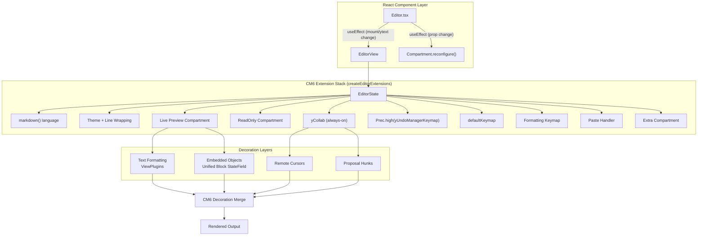
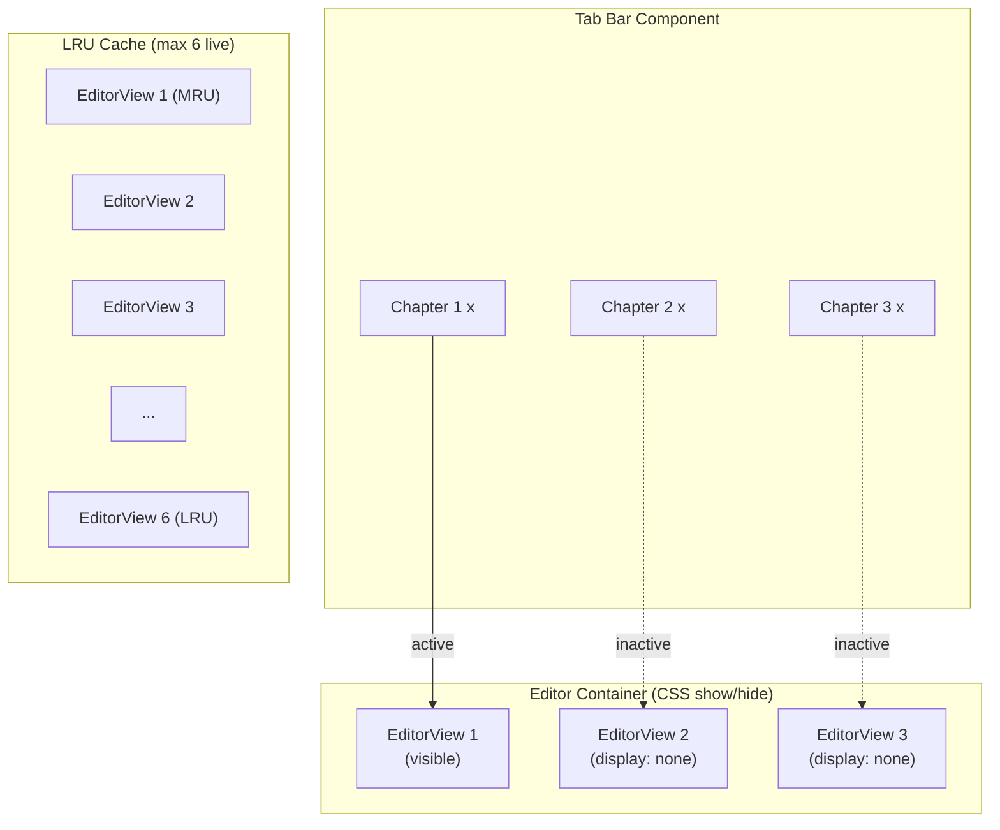

# CM6 Architecture

## Extension Stack

Editor is an uncontrolled component — CM6 + Yjs own document state. Mount `EditorView` once per `ytext` (recreate only when Yjs resources change). Dynamic configuration flows through CM6 Compartments.

**Editor props:** `ytext`, `awareness`, `undoManager` (caller-owned Yjs resources). When not provided, creates a local `Y.Doc` internally via `createLocalEditorSession()` and exposes it through `sessionRef`. No `value`/`onChange` props — the controlled-component pattern is explicitly avoided.

See `frontend-v2/src/editor/Editor.tsx` and `frontend-v2/src/editor/extensions.ts`.



## Compartments

Extensions are composed at `EditorState` creation via `createEditorExtensions()` and never replaced wholesale. Only things that actually toggle at runtime get compartments. See `frontend-v2/src/editor/extensions.ts`.

| Compartment | Controls | Reconfigure trigger |
|---|---|---|
| `readOnly` | `EditorState.readOnly` + `EditorView.editable` | `readOnly` prop change |
| `placeholder` | Placeholder text | `placeholder` prop change |
| `livePreview` | All decoration extensions | `livePreview` prop toggle |
| `extra` | Consumer-provided extensions | `extensions` prop change |

**Always-on (no compartment):** yCollab binding, `Prec.high(yUndoManagerKeymap)`, formatting keymap, paste handler, interaction handlers, `defaultKeymap`, focus/reveal state fields.

**Why no collab or undo compartments:** Yjs is always the content model — even standalone editors use a local `Y.Doc` via `createLocalEditorSession()`. This eliminates the compartment swap complexity (no CM6 history → Y.UndoManager transition). yCollab and yUndoManagerKeymap are wired at mount time and never reconfigured.

Toggling live preview is a single compartment reconfiguration — empty `[]` when off, all decoration ViewPlugins + StateFields when on. CM6 preserves cursor position and scroll across reconfigurations.

## Content Model

**Source of truth:** `Y.Text`, always. Every editor (collab or standalone) binds to a `Y.Text` via `yCollab`. `EditorState.doc` is the CM6-side mirror, bidirectionally synced by `y-codemirror.next`. Rendered decorations are derived views — never mutate rendered DOM to change content.

**Pull-based API:** Do NOT call `doc.toString()` on every keystroke. Use `getContent()` at save time only. Word count is debounced (500ms). See `frontend-v2/src/editor/content/content-api.ts`.

**Save:** Debounced flush (1–2s inactivity) to backend API. Only when collab is NOT active (Yjs owns persistence when connected). See `editor-collab.md`.

**Content reconciliation:** Use diff-based `ChangeSpec` entries, not full-document replace. Full-document replace (`from: 0, to: doc.length`) destroys decoration state, selection state, and causes full reflow.

## Tab Architecture

Each open document gets its own `EditorView` (VS Code approach). Switching is CSS show/hide — no DOM creation/destruction, no state swap. See `frontend-v2/src/editor/tabs/tab-manager.ts`.



**LRU eviction states:**

| State | What's kept | Restore cost |
|---|---|---|
| Live (in LRU) | EditorView + DOM + Yjs binding + IndexedDB | Instant (CSS show) |
| Evicted (overflow) | EditorState serialization + scroll position + Yjs state vector | Fast (~100ms) |
| Closed (tab closed) | Nothing | Full load from IndexedDB/server |

**Per-tab independence:**

| State | Per-tab? |
|---|---|
| EditorView, EditorState, document content | Yes |
| Live preview toggle | Yes |
| Undo history (Y.UndoManager, always) | Yes |
| Yjs binding, WebSocket connection | Yes |
| Cursor position, scroll position | Yes |
| Word count, modified indicator | Yes |

**Caveat:** `display: none` causes CM6 to report viewport as 0. On tab show, `requestMeasure()` recalculates viewport (handled by `TabManager.switchTo`).

## Performance

**ViewPlugin:** Iterate only `view.visibleRanges`. For a 10,000-line doc with ~100 visible lines, this reduces work by ~99%. See all files in `frontend-v2/src/editor/decorations/`.

**StateField (block decorations):** Use incremental `DecorationSet.map(tr.changes)` per keystroke. Full rebuild only when necessary:

| Trigger | Who rebuilds |
|---|---|
| `docChanged` | All decoration plugins |
| `selectionSet` (crossed decorated range) | Plugins whose ranges were crossed |
| `viewportChanged` | ViewPlugin-based plugins only |
| `focusChanged` | All (focus affects reveal guards) |
| `revealElement`/`concealElement` effect | All embedded object plugins |
| None of the above | Nobody |

**Lazy loading:**

| Module | Load trigger |
|---|---|
| `mermaid.js` | First mermaid block enters viewport |
| `@codemirror/language-data` | First fenced code block with language info |
| Syntax highlighting grammars | Per-language, on first use |

**IME:** Use `view.composing` (not `isUserEvent`) to skip decoration rebuilds during IME composition. Always map decorations through `tr.changes` before skipping rebuild.

## Known Pitfalls

| Pitfall | Affected files | Notes |
|---|---|---|
| RangeSetBuilder ascending order violation | `emphasis.ts`, `inline-code.ts` | `add()` calls must be ascending `from`. Non-overlapping pattern: replace markers first, then mark content. |
| Multi-line replace in ViewPlugin | `code-blocks.ts` (fenced) | CM6 forbids it. Must use StateField with `block: true`. |
| Widget `eq()` missing | All WidgetType subclasses | Without it, CM6 recreates DOM on every rebuild → flicker + cursor displacement. |
| Full-document replace dispatch | Any programmatic edit | Use diff-based reconciliation or `key={documentId}` remount for document switches. |
| Active-tab eviction from LRU | `tab-manager.ts` | Filter active tab from candidates BEFORE popping — post-pop `continue` loses it from tracking. |
| Mermaid `innerHTML` injection | `mermaid-widget.ts` | Validate returned string starts with `<iframe` before assigning. `securityLevel: "sandbox"` required. |
| Image auto-fetch in collab | `images.ts` | Remote peers can inject tracking pixels. Only auto-render trusted sources (project uploads). |

**RangeSetBuilder non-overlapping rule:**
```
WRONG:  mark(0, 12), replace(0, 2), replace(10, 12)   -- overlapping, startSide violation
CORRECT: replace(0, 2), mark(2, 10), replace(10, 12)   -- ascending from, non-overlapping
```

## Migration: Current Code Status

**What's correct — keep:**

| Pattern | File |
|---|---|
| Mount-once useEffect (recreate on ytext change) | `Editor.tsx` |
| Compartments for dynamic config (readOnly, placeholder, livePreview, extra) | `Editor.tsx` |
| Always-Yjs via `createEditorExtensions()` | `extensions.ts` |
| `createLocalEditorSession()` for standalone editors | `extensions.ts` |
| Pull-based `getContent()` / debounced word count | `content-api.ts` |
| `cursorInRange` / `cursorOnLine` utilities | `cursor-utils.ts` |
| `hasInteracted` WeakMap guard | `cursor-utils.ts` |
| ViewPlugin pattern for inline decorations | All decoration files |
| Per-element single-responsibility files | `decorations/*.ts` |
| Ascending-order blockquote fix | `blockquote.ts` |
| URL validation (http/https only) | `links.ts`, `images.ts` |
| Theme with CSS custom properties | `theme.ts` |

**What needs to change:**

| Issue | File | Change |
|---|---|---|
| Overlapping mark+replace | `emphasis.ts` | Non-overlapping pattern |
| Overlapping mark+replace | `code-blocks.ts` (inline) | Non-overlapping pattern |
| Multi-line replace in ViewPlugin | `code-blocks.ts` (fenced) | Move to `blockDecorationField` StateField with `block: true` |
| Trailing HeaderMark bug | `heading.ts` | Use `marks[0].to` not `marks[marks.length-1].to` |
| Heading uses mark, not line deco | `heading.ts` | Change to `Decoration.line` for heading level class |
| HR missing visibleRanges | `horizontal-rule.ts` | Add `view.visibleRanges` constraint |
| Nested blockquote markers | `blockquote.ts` | Recursive QuoteMark collection |
| Links use cursor-reveal only | `links.ts` | Always-rendered + multi-modal interaction |
| Images steal mousedown | `images.ts` | Always-rendered + multi-modal interaction |
| IME uses `isUserEvent` | All plugins | Switch to `view.composing` |

## Future Work

| Feature | Notes |
|---|---|
| Tables | Unified block StateField (reuses fenced code infra). Important for character sheets, timelines. |
| Strikethrough (`~~text~~`) | Same non-overlapping pattern as bold/italic. |
| Task list checkboxes | `- [ ]` / `- [x]` with click-to-toggle. |
| Single tree walk unification | Merge independent ViewPlugin tree walks into one dispatcher. Defer until profiling needed. |
| Image proxy | Server-side proxy for external images. Eliminates SSRF, enables caching, strips EXIF. |
| Focus mode / typewriter scrolling | Dim non-current paragraph, center current line. |
| Find/replace + decorations | Reveal raw syntax when search match is inside hidden syntax. |
| RTL / bidi support | CSS logical properties, `unicode-bidi: isolate` on widget containers. |
| Tab reordering via drag | Drag-and-drop tab reordering. |

## UI Components

**Title header** (`frontend-v2/src/editor/title-header/`): Bar above editor, below tab bar.

| Element | Behavior |
|---|---|
| Document name | Click to rename (inline edit, Enter confirms, Escape cancels) |
| Connection status | Colored dot + label (Connected / Reconnecting / Offline) |
| Word count | Debounced (500ms), format: `1,847 words` or `127 / 1,847 words` with selection |
| Last saved time | Relative ("Saved 2m ago", "Saving...", "Unsaved changes") |
| Export dropdown | See `frontend-v2/src/editor/export/` |

**Export formats** (`frontend-v2/src/editor/export/exporters.ts`):

| Format | Client/Server |
|---|---|
| Markdown (.md) | Client — direct download of `getContent()` |
| Plain Text (.txt) | Client — strip markdown, download |
| HTML (.html) | Client — parse to HTML, sanitize with DOMPurify, download |
| PDF (.pdf) | Server — backend Pandoc conversion |
| DOCX (.docx) | Server — backend Pandoc conversion |
| EPUB (.epub) | Server — may export full project (all chapters) |
