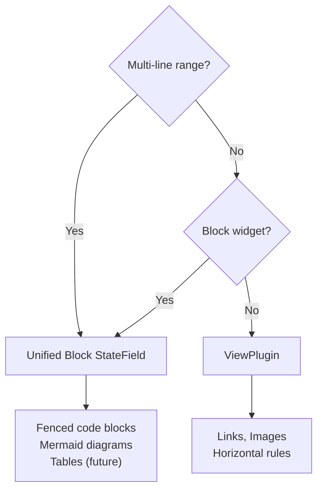
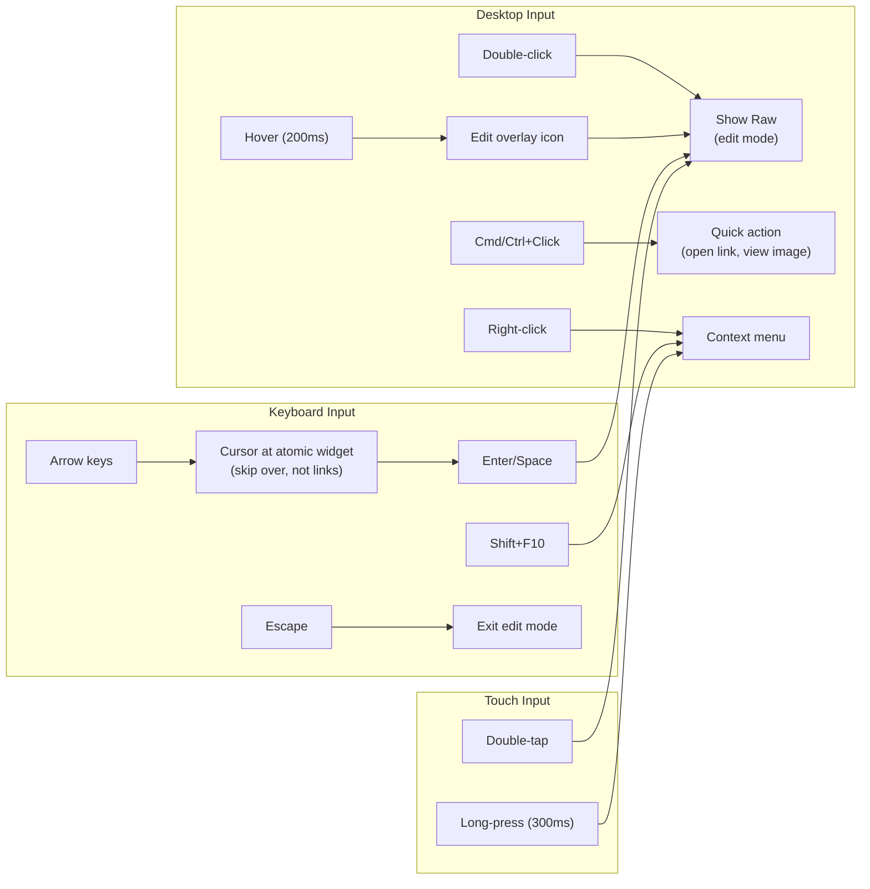
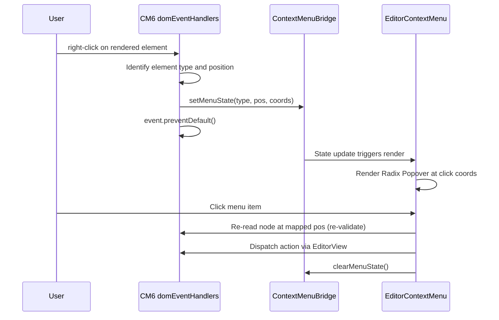

# Decorations

## Interaction Categories

| Category | Elements | Reveal trigger | Edit mechanism |
|---|---|---|---|
| Text formatting | Headings, bold, italic, inline code, blockquotes, lists | Cursor proximity (automatic) | Type directly in raw source |
| Embedded objects (widgets) | Images, fenced code blocks, mermaid, tables | Double-click / Show Raw / Enter+Space when cursor adjacent (never auto-reveal) | Double-click / Show Raw reveals source |
| Links (special case) | Links | Cursor inside link range (automatic, padding=0) OR Show Raw | Cursor proximity reveals source; Cmd+Click opens URL |
| HR (exception) | Horizontal rules | Double-click only | Double-click reveals `---` |

## ViewPlugin vs StateField

**Rule:** Multi-line `Decoration.replace` and any `Decoration.replace({ block: true })` MUST use StateField. CM6 forbids function-provided decorations (ViewPlugin) from replacing ranges that span line breaks.

**Unified block StateField** (`blockDecorationField`): fenced code + mermaid share one StateField. Single syntax tree walk, one incremental mapping pass per transaction, consistent reveal behavior. See `frontend-v2/src/editor/decorations/block-decorations.ts`.

## Text Formatting (ViewPlugin, cursor-reveal)

All text formatting hides markdown syntax characters and applies CSS styling. Syntax reveals when the cursor is nearby. CSS opacity transitions (`theme.ts`) make reveal/hide smooth (100ms hide, 80ms reveal).

| Element | Decoration approach | Reveal rule |
|---|---|---|
| Headings | `Decoration.line` for heading class on `.cm-line`; `Decoration.replace` on `#` markers | Cursor anywhere on heading line |
| Bold/Italic | Non-overlapping: replace opening marker, mark content, replace closing marker | Cursor within 1 char of span |
| Inline code | Non-overlapping: replace opening backtick, mark content, replace closing backtick | Cursor within 1 char of span |
| Blockquotes | `Decoration.replace` on `QuoteMark` per line; `Decoration.mark` on line content | Cursor on same line (per-line reveal) |
| Lists | `Decoration.mark` on `ListMark` nodes (accent color) | Always visible (no hiding) |

**Why `Decoration.line` for headings:** Styles the entire `.cm-line` DOM element including padding/margins. `Decoration.mark` only styles text content within range. Full-width heading styling requires line decoration.

**Trailing HeaderMark fix:** Use `marks[0].to` (first `HeaderMark`) for text start position, not `marks[marks.length - 1].to`. Lezer produces both leading and trailing `HeaderMark` nodes for headings like `# title #`.

**Nested blockquotes:** Collect all `QuoteMark` nodes recursively across nesting depths, then apply `Decoration.replace` to each in ascending position order. See `frontend-v2/src/editor/decorations/blockquote.ts`.

## Embedded Objects (StateField/ViewPlugin, always-rendered)

The cursor never enters these elements during normal editing. Replace decorations make ranges atomic — arrow keys skip over them. Entry requires explicit "Show Raw" action.

**Hover affordance:** Edit icon overlay fades in after 200ms on `:hover`, positioned top-right. CSS-only, `pointer-events: none` except the icon. See `theme.ts`.

**Focus state:** StateFields can't check `view.hasFocus` directly. A `focusState` StateField tracks focus via DOM events. Blur dispatch is debounced 50ms to avoid flash during context menu interactions. See `frontend-v2/src/editor/decorations/focus-state.ts`.

**Reveal state:** `revealState` StateField tracks which element ranges are in "Show Raw" mode. Persists through focus loss. Auto-conceals when cursor moves outside revealed range. Mapped through `tr.changes` on every transaction to handle remote Yjs edits shifting positions. See `frontend-v2/src/editor/decorations/reveal-state.ts`.

**Per-element details:**

| Element | Category | Key constraints |
|---|---|---|
| Links | ViewPlugin | NOT atomic — mark decoration, cursor enters text naturally. Cmd+Click opens URL. No Enter/Space activation. |
| Images | ViewPlugin | Single-line syntax, CSS `display: block` workaround (not `block: true`). Only project-upload URLs auto-render; external URLs show "Click to load" placeholder. `referrerPolicy: "no-referrer"`. |
| Fenced code | Unified block StateField | `Decoration.replace({ block: true, widget })`. Content via `textContent` (NEVER `innerHTML`). |
| Mermaid | Unified block StateField | `securityLevel: "sandbox"` MANDATORY. Render queue (max 2 concurrent). SVG cache by source hash. Validate returned string starts with `<iframe` before `innerHTML`. |
| Horizontal rules | ViewPlugin | Uses `.md-hr-wrapper` (not `.md-widget-wrapper`) — excluded from context menu and Enter/Space handler. Double-click only. |

**Widget `eq()` requirements** — without `eq()`, CM6 recreates DOM on every rebuild:

| Widget | `eq()` comparison |
|---|---|
| `ImageWidget` | `src === other.src && alt === other.alt` |
| `FencedCodeWidget` | `code === other.code && language === other.language` |
| `MermaidWidget` | `source === other.source` |
| `HorizontalRuleWidget` | `true` (all instances identical) |

**Atomic ranges:** `EditorView.atomicRanges` facet returns ranges of all active replace decorations. Boundaries MUST exactly match the replace decoration ranges — if wider, cursor gets stuck; if narrower, cursor enters hidden content. Links are NOT atomic. See `frontend-v2/src/editor/decorations/atomic-ranges.ts`.

## Cursor-Aware Reveal System

**Canonical reveal rule (all elements):** An element reveals its raw markdown when EITHER:
- The cursor/selection intersects the element's range (category-appropriate padding), OR
- The element's range is in `state.field(revealState)` (explicit "Show Raw")

Either condition alone is sufficient.

| Category | Used by | Padding | Practical effect |
|---|---|---|---|
| Proximity reveal (padded) | Text formatting | 1 char (inline), whole line (block) | Reveals when cursor is near syntax markers |
| Proximity reveal (strict) | Links | 0 (strict containment) | Reveals when cursor is inside link range |
| Explicit reveal | Atomic widgets (images, code, mermaid, HR) | 0 | OR reduces to `revealState`-only; requires double-click or Show Raw |

**Guards (prevent false reveals):**

| Guard | Description |
|---|---|
| `hasFocus` / `focusState` | Editor unfocused → preview mode. Exception: active `revealState` entries stay revealed. |
| `hasInteracted` | Default cursor at position 0 before first click/keypress must NOT trigger proximity reveal. Tracked via `WeakMap<EditorView, boolean>`. |
| `isComposing` | Use `view.composing` (not `isUserEvent`) — IME composition must not change reveal state. |
| `revealState` | Explicit reveals persist through focus loss until cursor moves outside range. |

**Yjs interaction:** Remote cursor positions from collaborators MUST NOT trigger reveal. `cursorInRange` reads `view.state.selection` (local selection only). Remote cursors are rendered via a separate decoration layer.

## Interaction Model

**Context menu bridge:** CM6 detects events and extracts metadata; React renders the menu via Radix `Popover` (not `ContextMenu` — Radix `ContextMenu` requires owning the trigger element, which conflicts with CM6 DOM ownership).

See `frontend-v2/src/editor/interaction/`.

**Menu entries per element type:**

| Element | Menu items |
|---|---|
| Link | Edit Link..., Copy URL, Open in New Tab, separator, Show Raw |
| Image | Edit Alt Text..., Edit URL..., View Full Size, separator, Show Raw |
| Code Block | Edit Source, Copy Code, separator, Show Raw |
| Mermaid | Edit Source, Export SVG, separator, Show Raw |
| HR | No context menu |

**Show Raw mechanism:**
1. Dispatch `revealElement` effect with element range
2. Place cursor at `node.from + 1` (inside range, not at boundary)
3. Next decoration rebuild omits hide/replace decorations
4. Cursor moves out → `revealState` auto-clears → syntax re-hides

**Position mapping:** The stored `pos` in `MenuState` can go stale if a Yjs remote edit arrives while the menu is open. `ContextMenuBridge` accumulates `ChangeDesc` mappings via a ViewPlugin. **Re-validate** element type at mapped position before executing any action — do NOT trust cached metadata (collaborator may have changed link URL or image source). See `frontend-v2/src/editor/interaction/context-menu-bridge.ts` and `menu-actions.ts`.

**Spellcheck conflict:** `contextmenu` handler checks if target is inside `.md-widget-wrapper` or `.md-link`. If yes → custom menu. If no → browser native context menu (spellcheck works). Spellcheck inside widgets: use "Show Raw" first.

**URL validation** (`frontend-v2/src/editor/url-validation.ts`):
- Links: `safeExternalUrl` — must be absolute `https:`/`http:`, not same-origin
- Images: `safeImageUrl` — blocks private network targets (localhost, 127.0.0.1, 10.x, 192.168.x, *.local), distinguishes trusted (project uploads) vs external (show placeholder)
