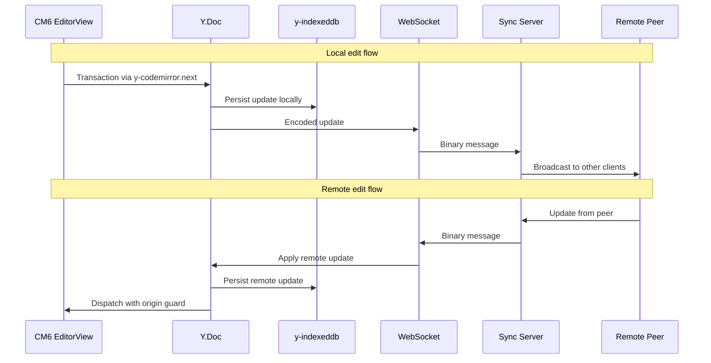

# Collab Integration

## Yjs Binding

Uses `y-codemirror.next` for CM6 ↔ Yjs binding. Provides two-way sync between `EditorState.doc` and `Y.Text`, remote cursor display via `yCollab`, and awareness protocol integration. See `frontend-v2/src/editor/collab/yjs-binding.ts`.

## Per-Chapter Y.Doc (Hard Constraint)

Each chapter gets its own `Y.Doc` instance. This is a hard architectural constraint.

**Why per-chapter:**
- Yjs tombstones (deleted content metadata) never GC within a `Y.Doc`. A shared doc accumulates tombstones proportional to ALL edits across ALL chapters — unbounded growth.
- Per-chapter isolation limits tombstones to that chapter's edit churn.
- Corrupted chapter doesn't affect others.
- WebSocket connections are per-chapter.

**Tombstone compaction:** When tombstone metadata exceeds ~2x live content size (or on a weekly schedule), the server compacts by snapshotting the `Y.Doc`, creating a fresh one from current text, and replacing stored state. Clients receive a full state sync naturally via Yjs sync protocol step 1.

## IndexedDB Persistence

Each per-chapter `Y.Doc` uses `y-indexeddb` for offline safety. Fast document open (IDB loads before WebSocket connects). Keep IDB alive continuously — do NOT destroy and recreate after initial sync (unlike v1 pattern). See `frontend-v2/src/editor/collab/idb-persistence.ts`.

Load IDB with a 3-second timeout fallback before connecting WebSocket.

## Tab Interaction

Each tab has its own `Y.Doc` + awareness + IDB provider. On LRU eviction: `Y.Doc` is destroyed, WebSocket closed. On restore: new `Y.Doc` created, synced from IDB, then WebSocket.

## Save Suppression

**Editor has no `onChange` prop.** The component is uncontrolled — CM6 + Yjs own document state. Save logic lives outside Editor, triggered by the document session layer (debounced flush on inactivity, suppressed when collab WebSocket is active since Yjs owns persistence).

`suppressOnChange` annotation still exists in `frontend-v2/src/editor/annotations.ts` for use by update listeners that consumers attach via the `extra` compartment — e.g., programmatic edits (dialog-applied changes) that should not trigger saves.

## Origin Guards

| Origin | Used by | Undoable? |
|---|---|---|
| `ORIGIN_HUMAN` | User typing, formatting shortcuts, paste | Yes |
| `ORIGIN_ACCEPT` | Proposal accept action | Yes |
| `ORIGIN_REJECT` | Proposal reject action | Yes |
| `ORIGIN_THREAD` | Thread-initiated edits | Yes |
| `ORIGIN_GC` | Projection GC stale writes | No |
| `null` | Remote peer edits (sync providers) | No |

`null` origin is intentionally excluded from `trackedOrigins`. Tracking `null` would make remote peer changes undoable, violating collaborative semantics.

Sync provider echo loops: check `origin === collabRuntime` in `ydoc.on("update")` to avoid re-broadcasting own updates.

## Remote Cursors

Rendered via `yCollab` extension's built-in awareness support. Colored cursor widgets + selection highlights + user name labels. This is Layer 4 in the decoration stack — independent of live preview decorations. See `frontend-v2/src/editor/collab/remote-cursors.ts`.

Remote cursor positions MUST NOT trigger syntax reveal. `cursorInRange` reads `view.state.selection` (local selection only) — remote cursors are handled by a separate decoration layer and never touch reveal state.

## Undo/Redo

See `frontend-v2/src/editor/collab/undo-manager.ts`.

**Always Y.UndoManager.** CM6 `history()` is never loaded. Even standalone editors use `Y.UndoManager` via `createLocalEditorSession()`. This eliminates compartment swap complexity — no two-phase transition, no history cliff on collab connect.

**Why not CM6 history:** Y.UndoManager tracks both text edits and proposal status changes (`Y.Text` + `Y.Map`) in one unified timeline. Provides collaborative undo semantics — undoes YOUR changes only, not other users' changes. CM6 built-in history cannot do either. Using Y.UndoManager everywhere means one undo model, one set of keybindings, one code path.

**Keybinding precedence:** `Prec.high(keymap.of(yUndoManagerKeymap))` ensures Mod-z/Mod-y are intercepted before `defaultKeymap`'s built-in undo/redo bindings.

**UndoManager scope:** Tracks both `ytext` (document content) and `yProposalStatus` (metadata). Only origins listed in `trackedOrigins` are recorded in the undo stack (see Origin Guards table above).

**`stopCapturing()` before discrete actions (CRITICAL):** UndoManager has a 500ms `captureTimeout` that merges consecutive transactions into one undo item. Call `undoManager.stopCapturing()` before each discrete action (Accept, Reject, Thread op) to ensure it gets its own undo step.
