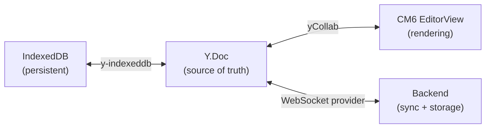
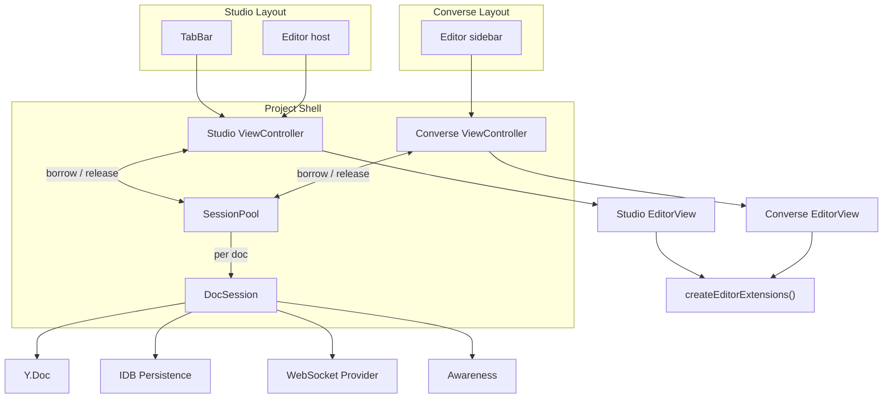
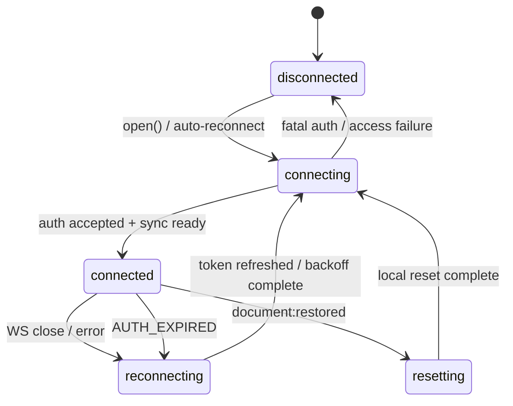

# Editor Design

Local-first CM6 markdown editor. Y.Doc is the source of truth, persisted to IndexedDB. WebSocket is a sync channel, not a requirement. The editor works offline by default.

## Core Principles

1. **Y.Doc owns the document.** Not React state, not the server, not CM6. The Y.Doc is the single source of truth. CM6 renders it. IDB persists it. WebSocket syncs it.

2. **Offline by default.** Opening a doc loads from IDB (instant). WebSocket connects in the background. If it can't connect, the editor works fine — edits accumulate in the Y.Doc and sync when connectivity returns. No "save" button.

3. **CM6 is uncontrolled.** No `value` prop. CM6 and Yjs share ownership of the document via `yCollab`. React observes but never drives content.

4. **One extension stack.** Single function assembles the CM6 extensions. Every EditorView in the app — whether in a story, in Studio tabs, or in the Converse sidebar — uses the same stack.

## Data Flow



**Open document:**
1. Create Y.Doc
2. Load from IDB (instant, cached from last session)
3. Create EditorView with yCollab binding — content appears immediately
4. Connect WebSocket in background
5. Run the Yjs sync protocol handshake (see transport docs for exact framing)
6. Merged state flows into Y.Doc, CM6 updates automatically

**Edit while offline:**
1. User types — CM6 dispatches to Y.Doc via yCollab
2. Y.Doc persists to IDB continuously (y-indexeddb)
3. When WebSocket reconnects, accumulated updates sync automatically

**Close document:**
1. ViewController closes or detaches the EditorView immediately
2. SessionPool releases the DocSession into the warm pool
3. Y.Doc + IDB + WebSocket stay alive during the idle window so remote edits can still land
4. After idle timeout (for example 5 minutes) with no attached view and no pending local changes, SessionPool destroys Y.Doc + WebSocket; IDB data persists for next open

## Architecture



A given `DocSession` may be rendered by Studio or Converse, but not by both as live `yCollab`-bound views at the same time. That is a hard constraint, not an implementation detail.

### DocSession

One per open document in the SessionPool. Owns only document-scoped resources. It does not own an `EditorView`.

```
DocSession {
  id: string
  ydoc: Y.Doc
  ytext: Y.Text
  awareness: Awareness
  undoManager: Y.UndoManager
  idbPersistence: IdbPersistence     // continuous, always on
  wsProvider: WebSocketProvider       // binary sync + control-plane events
  attachedViewCount: 0 | 1           // hard constraint: at most one live EditorView per DocSession
  idleTimer: Timeout | null          // tier-2 eviction when attachedViewCount hits 0
  generation: number                 // monotonic lease generation for idle-timer race safety
  lastDetachedAt: number | null      // LRU timestamp for warm-session eviction
  frozenReason: null | 'document-deleted' | 'access-revoked'
  hasPendingLocalChanges: boolean
  cachedScroll: ScrollSnapshot | null // last detached scroll hint; per-surface controllers keep authoritative restore state

  syncState: 'connected' | 'local-changes-pending' | 'disconnected'
  connectionState: 'disconnected' | 'connecting' | 'connected' | 'reconnecting' | 'resetting'
}
```

Key: the Y.Doc + IDB persistence can stay alive even when every `EditorView` is gone. The session never caches CM6 `EditorState` because once the view is destroyed, that state stops tracking Yjs updates.

### SessionPool + ViewController

Split into two headless layers so Studio and Converse can stay mounted simultaneously while showing different docs.

```
SessionPool
  ensureSession(id)         // create DocSession if needed, load from IDB, connect WS
  releaseSession(id)        // drop one borrower; maybe start idle timer
  preload(id)               // warm Y.Doc + IDB + WS without creating a view
  invalidateSession(id, reason) // freeze a session that can no longer sync (delete/access loss)
  getSession(id)            // access DocSession for state inspection
  subscribe(listener)       // for useSyncExternalStore
  destroy()                 // cleanup everything (project close)

ViewController
  open(id)                  // borrow session from pool and show/create a view
  switchTo(id)              // hide current view, show/create target view
  close(id)                 // destroy this surface's view and release its session
  getActiveView()           // current visible EditorView for this surface
  getOpenDocuments()        // list for tab bar / UI on this surface
  subscribe(listener)       // for useSyncExternalStore
```

If a second surface asks for a doc that already has a live collab-bound view, SessionPool transfers the live-view lease before attaching the new surface. There is never a moment where Studio and Converse both own live `yCollab` views for the same `DocSession`.

**Tier 1: view eviction** (per ViewController, LRU, max ~6 live views per surface):
- **Live**: EditorView exists, mounted in DOM, CSS show/hide for tab switching
- **Hidden**: EditorView still exists but is CSS-hidden because another doc is active on that surface
- **Evicted**: EditorView destroyed, only view-local state is kept (`cachedScroll`, optional selection as `Y.RelativePosition`). Y.Doc + IDB + WS stay alive in the pool.
- **Restored**: create a fresh `EditorState` from current `ytext.toString()` with the full extension stack, then restore scroll. Selection may also be restored by resolving the saved `Y.RelativePosition` back into the current document.

**Tier 2: session eviction** (SessionPool, idle timeout, default ~5 minutes):
- **Warm session**: no `EditorView` is attached, but the `DocSession` stays alive so remote edits can continue landing and reopen is instant
- **Evictable**: `attachedViewCount === 0` and there are no local pending changes
- **Warm budget**: cap warm sessions at ~10 by default (configurable). `preload()` counts against this budget. If the pool exceeds it, evict the oldest idle session by `lastDetachedAt` immediately even if its idle timeout has not expired.
- **Destroyed**: SessionPool tears down Y.Doc + WebSocket after the idle timeout. IndexedDB remains the durable source for the next cold open.

**Lease generation guard:** every new lease epoch increments `DocSession.generation` (`ensureSession()`, `preload()`, explicit lease transfer, and invalidation all count). When SessionPool schedules an idle timer, it captures the current generation; when the timer fires, it destroys the session only if the generation is unchanged. If another surface re-borrowed, preloaded, or invalidated the session in the meantime, the stale timer is a no-op.

**Why Y.Doc stays alive after view eviction:** Remote edits keep flowing into the live Y.Doc while the view is gone. On restore, the controller rebuilds from the current Yjs text rather than stale CM6 state, so the reopened editor reflects all background changes.

#### Awareness lifecycle

Hard constraint: a `DocSession` can have at most one active `EditorView` at a time across all surfaces. Yjs awareness is local-state-per-`Y.Doc`, not per surface, so two simultaneous live `yCollab` views for the same doc would race on the same cursor/selection payload. If Studio has `ch-1` open and the user opens `ch-1` in Converse, SessionPool detaches the Studio view first, then attaches the Converse view. We explicitly do not build per-surface awareness multiplexing for this refactor because the UX value is low and the complexity is high.

Within that constraint, awareness is view-scoped:
- On **view hide** (CSS tab switch or mode switch), clear cursor/selection awareness for the active view. If we want "user has this doc open" presence, keep that as a separate field rather than reusing cursor presence.
- On **view eviction** (destroyed `EditorView`), clear all awareness state for that doc from this client.
- On **lease transfer** to another surface, clear awareness from the old surface before mounting the new live view.
- On **view restore/show**, republish cursor/selection awareness from the new live view.

### useDocumentSessions

React hook wrapping one `ViewController`. The shared `SessionPool` lives above it in ProjectShell or context. Each editor surface gets its own hook instance.

```tsx
const {
  activeDocId,
  openDocs,           // DocInfo[] for tab bar
  open,               // (id) => void
  switchTo,           // (id) => void
  close,              // (id) => void
  getSession,         // (id) => DocSession
  getActiveView,      // () => EditorView | null
  hostRef,            // ref for the editor mount container
} = useDocumentSessions()
```

Studio mode and Converse mode each create their own `ViewController`, so they can keep independent `activeDocId` values while borrowing shared `DocSession`s from the same pool. If both surfaces target the same doc, the pool transfers the single live-view lease to the newly active surface and detaches the old one. The hook does not own the Y.Doc lifecycle; it only drives view lifecycle for one surface.

### Editor Component

Thin React wrapper for simple single-doc use cases (stories, embeds, Converse sidebar when not using the full session manager).

```tsx
interface EditorProps {
  /** Y.Doc text to bind to. If not provided, creates a standalone local Y.Doc. */
  ytext?: Y.Text
  awareness?: Awareness
  undoManager?: Y.UndoManager
  readOnly?: boolean
  placeholder?: string
  livePreview?: boolean
  extensions?: Extension[]
  className?: string
  contentApiRef?: React.RefObject<EditorContentAPI | null>
  /** When ytext is not provided, Editor creates internal Yjs resources.
      This ref exposes them so the parent can observe/read content. */
  sessionRef?: React.RefObject<{
    ydoc: Y.Doc
    ytext: Y.Text
    awareness: Awareness
    undoManager: Y.UndoManager
  } | null>
  onReady?: (view: EditorView) => void
}
```

When `ytext` is provided: CM6 binds to it via yCollab. The caller (DocSession) owns the Y.Doc lifecycle.

When `ytext` is not provided: Editor creates a local Y.Doc internally for standalone use (stories, simple embeds). No persistence, no sync. The internal Yjs session is exposed through `sessionRef` so the parent can observe/read content without a `value` prop.

No `value` prop. No `onChange` prop. The Y.Doc is the API — read content from `ytext.toString()`, observe changes via `ytext.observe()`. For standalone editors that create their own Yjs resources, `sessionRef.current?.ytext` is the observation path.

### createEditorExtensions

Single function. Every EditorView calls it.

```
createEditorExtensions(config)
  ├── theme + lineWrapping
  ├── markdown parser (Lezer)
  ├── focusState + revealState + focusTracker
  ├── livePreview decorations (compartment — togglable for preview/source mode)
  ├── readOnly (compartment — togglable)
  ├── placeholder (compartment — togglable)
  ├── yCollab binding (from caller — always Yjs, never CM6 history)
  ├── Prec.high(keymap.of(yUndoManagerKeymap))
  ├── formatting keymap
  ├── paste handler
  ├── interaction handlers (context menu, double-click, Cmd+Click)
  ├── defaultKeymap
  ├── wordCount
  └── extra extensions (compartment — consumer-provided)
```

Changes from current:
- No undo compartment swap. Always Yjs. Even standalone editors use a local Y.UndoManager. CM6 history is never loaded.
- Fewer compartments — only for things that actually toggle at runtime.
- yCollab binding provided by caller, not managed as a compartment.
- Preserve the explicit origin/capture policy from `frontend-v2/src/editor/collab/undo-manager.ts` for accept/reject/programmatic edits. `Y.UndoManager` defaults are not sufficient for non-typing actions.
- `Prec.high(keymap.of(yUndoManagerKeymap))` must be installed before `defaultKeymap` so `Mod-z` / `Mod-y` hit `Y.UndoManager`, not CM6's default undo bindings.

## WebSocket Provider

The WebSocket provider implements the backend's document sync protocol. This design intentionally does not restate the frame-by-frame handshake; [editor-collab.md](./editor-collab.md) and the technical collab transport docs are the authority for wire framing, sync message ordering, heartbeat semantics, and auth error handling. Key points relevant to the editor design:

- Uses `y-protocols/sync` (`writeSyncStep1`, `readSyncMessage`) rather than a hand-rolled raw state-vector exchange.
- The provider abstraction must surface both binary Yjs updates and JSON control-plane events (`connected`, heartbeat/auth failures, rate-limit/auth errors, `AUTH_EXPIRED`, `document:restored`).
- The provider's connection state machine drives `DocSession.connectionState`.
- `AUTH_EXPIRED` is a first-class reconnect path: refresh auth, then reconnect.
- `document:restored` is a full reset path: destroy the current `Y.Doc`, clear all local persistence for that document, create a fresh session, and cold-open from server state.
- Awareness relay is wired to the provider interface, but the current backend only logs awareness frames rather than fanning them out to peers.

**Handshake summary:** on connect, the provider runs the standard Yjs sync handshake defined in the transport docs, not a custom editor-specific sequence. The only editor-level requirement is that `DocSession` treat transport docs as authoritative and react correctly to control-plane events.

**Reconnection:**
- Exponential backoff with jitter
- On normal reconnect: rerun the Yjs sync protocol with the existing doc unless the session entered `resetting`.
- `AUTH_EXPIRED` pauses normal reconnect, refreshes auth, then resumes connect.
- `document:restored` destroys the existing session, clears y-indexeddb plus doc-scoped Dexie records, creates a fresh `Y.Doc`, and reconnects from a cold state.
- Accumulated offline edits flow to server. Missed remote edits flow to client.
- Awareness state is re-published from the new live view after reconnect/reset.

**Connection state machine:**



`document:restored` means the server replaced the canonical document state, for example after a version restore. The client must not reuse the existing `Y.Doc` in that case: stale local structs could resurrect reverted content. Destroy the current session, clear y-indexeddb plus doc-scoped Dexie rows, create a fresh doc, and cold-open from the server's new state.

## Sync State Tracking

Each DocSession tracks a coarse connectivity-facing sync state:

```
connected               — WS is open and updates are flowing; this does not imply durable server persistence
local-changes-pending   — local edits exist that cannot currently be sent because the session is offline/reconnecting
disconnected            — no active WS connection and no known unsent local edits
```

This drives UI indicators ("Connected" / "Offline — changes saved locally" / "Offline"). There is no "Saved" or "Synced" state in this design because the backend does not emit a sender-specific durable persistence acknowledgment.

Implementation: listen to Y.Doc update events and connection events. While the socket is open, show `connected`. If local edits occur while disconnected or reconnecting, show `local-changes-pending`. If the socket closes before local edits occur, show `disconnected`. This is transport truth only — not a durability guarantee.

## Offline Capabilities

| Capability | How |
|---|---|
| Edit open documents | Y.Doc + yCollab, persisted to IDB continuously |
| Survive browser crash | IDB persistence is continuous, not on-close |
| Reconnect without data loss | Yjs sync protocol exchanges only the missing updates |
| Accept/reject AI proposals offline | Proposals persisted in Dexie, accept/reject queued for server sync |
| See document list | Document metadata cached in Dexie (future — not in editor scope) |
| Create new documents offline | Needs offline-capable document service (future — not in editor scope) |

## Local Persistence: Two Stores

The editor depends on two IndexedDB layers with distinct ownership. Both are requirements, not optional.

| Store | Holds | Purpose |
|---|---|---|
| **y-indexeddb** | Y.Doc binary state per chapter | CRDT persistence — document content survives offline, crash, reload |
| **Dexie** | AI proposals, queued ops, document metadata | Application state persistence — proposals and user actions survive offline |

### AI Proposal Persistence (Dexie)

AI proposals are persisted separately from the canonical Y.Doc. The frontend clones the canonical doc, applies pending proposals, and diffs to derive hunks for the decoration layer (see [frontend-diff-model.md](../collab/frontend-diff-model.md)).

Dexie record shape:

```
{
  proposalId: string
  documentId: string
  yjsUpdate: Uint8Array          // the Yjs binary update
  status: 'pending' | 'accepted' | 'rejected' | 'stale'
  createdAt: number
  createdByUserId: string
  regionTextBefore: string        // canonical text in affected region before proposal
  regionTextAfter: string         // projected text after applying this proposal
  proposedAtOffset: number        // character offset when proposal was created
  acceptedAtOffset: number | null // character offset when accepted (null if pending)
}
```

These fields are required for offline diff re-derivation, stale detection / GC, and thread-level undo/reapply per [frontend-diff-model.md](../collab/frontend-diff-model.md).

Proposals must survive offline. The flow:

1. AI generates proposal → backend stores it → sends to client via project WS
2. Client receives proposal → persists the full Dexie record (including `yjsUpdate`, region text snapshots, and offsets) to Dexie
3. User goes offline — proposals are still in Dexie, decoration pipeline still works
4. User accepts/rejects — accepting applies the `yjsUpdate` to the local Y.Doc (persisted to y-indexeddb). The status change queues in Dexie for server sync on reconnect and records `acceptedAtOffset` when applicable.
5. User reconnects → queued status changes sync to server

Without Dexie persistence, proposals evaporate on page reload. The user loses the ability to review and act on AI suggestions offline — which is a core workflow.

### Document Deletion While Offline

If a document is deleted or access is revoked while the client is offline, local y-indexeddb data can outlive the server record. The recovery flow is:

1. On WS reconnect, if the server returns `404` or `403` for the document, the client freezes the `DocSession` immediately and prevents further local edits.
2. The UI shows a "Document deleted" indicator with two actions: `Recover as new document` or `Discard local changes`.
3. `Discard local changes` clears y-indexeddb data plus doc-scoped Dexie rows for that document ID and removes the frozen session from the pool.
4. `Recover as new document` clones the local Yjs content into a new document creation flow rather than trying to resurrect the deleted document ID.
5. On a cold connect for a deleted doc, if the WS/auth layer rejects access but local IDB still contains data for that document ID, the client still shows the same recovery prompt.

`SessionPool` should expose `invalidateSession(id, reason)` for this path so project-level UI can freeze the session, annotate the reason, and route the recovery/discard actions.

### IDB Health (Requirement)

The editor must track IDB health explicitly. If y-indexeddb or Dexie fails to open or write (private browsing, quota exceeded, corrupt DB), surface a degraded mode warning — "changes are not being saved locally." Silent failure with no save button = data loss. See review finding from p546.

### Cache Budget

- `y-indexeddb` creates one IndexedDB database per document. It does not provide cross-document pruning.
- SessionPool's tier-2 eviction bounds the hot set for documents opened in the current session, but it does not reclaim cold document databases by itself.
- Persist per-document `lastAccessedAt` metadata so cleanup can identify cold databases deterministically.
- On project open, run a periodic cleanup pass that enumerates document databases and deletes any that have not been accessed in more than 30 days.
- Track aggregate IDB usage and quota telemetry (`usage`, `quota`, cleanup count, cleanup failures) and warn the user when storage approaches browser quota limits.
- This is a post-launch operational concern, but the design needs the hooks from day one to avoid silent quota failures.

## Decoration Performance Checklist

Audit each ViewPlugin for:

| Check | Why |
|-------|-----|
| `visibleRanges` scoping | Large docs: don't iterate full syntax tree |
| Rebuild guards | Only rebuild on `docChanged`, `viewportChanged`, or syntax tree change |
| Widget `eq()` + `updateDOM()` | Avoid unnecessary DOM recreation |
| Block decorations in StateField | Required by CM6 for layout-affecting decorations |

## Implementation Phases

### Phase 1: Yjs-first Editor

Rewrite Editor component around Y.Doc as source of truth. Remove `value`/`onChange`. Create standalone Y.Doc when no `ytext` prop provided and expose it through `sessionRef`. Always use yCollab + Y.UndoManager (no CM6 history). Extract shared `createEditorExtensions()`. Delete the duplicate `createMeridianExtensions()`.

Verify: stories work with the new API. StandaloneEditor creates local Y.Docs and parents can observe them through `sessionRef`.

### Phase 2: DocSession + SessionPool local persistence

Build DocSession and SessionPool. DocSession owns Y.Doc, IDB persistence (y-indexeddb), awareness, undo manager, sync state, and connection state. SessionPool implements `ensureSession()`, `releaseSession()`, `preload()`, and `invalidateSession()`. Opening a doc loads from IDB first. Releasing the last view starts tier-2 idle eviction instead of immediate teardown. Session eviction must destroy Y.Doc + WebSocket only after the idle timeout and only when there are no attached views and no pending local changes, while also respecting the warm-session budget cap and the generation guard for stale timers. Set up Dexie schema for proposal cache and queued ops, including region text snapshots and offsets required by the diff model. Track IDB health — surface degraded mode if persistence fails.

Verify: open a doc, type, close, reopen — content persists via IDB. Preloaded docs hydrate without a view. Idle sessions tear down after timeout and cold reopen rehydrates from IDB. The 11th warm session evicts the oldest idle session immediately. A stale idle timer does not destroy a re-borrowed session. IDB failure in private browsing shows warning. Deleted-offline documents freeze and show recover/discard actions on reconnect, and discard clears both y-indexeddb and Dexie state for that document.

### Phase 3: ViewController + useDocumentSessions

Build per-surface ViewControllers and update `useDocumentSessions` to wrap one controller instance. Implement tier-1 LRU view eviction per surface (destroy view, keep session alive), CSS show/hide for non-evicted views, and restore by rebuilding `EditorState` from current `Y.Text` plus restoring scroll. Optionally preserve selection through `Y.RelativePosition`. Enforce the single-live-view-per-DocSession rule across Studio and Converse; if both surfaces target the same doc, transfer the lease and detach the old live view before mounting the new one. Add awareness lifecycle rules: clear cursor/selection on hide, clear all awareness on evict, clear on lease transfer, republish on show.

Verify: TabbedEditor story uses `useDocumentSessions`. Studio and Converse can hold different active docs at the same time, but only one live collab-bound view exists for a given doc. Opening the same doc on the other surface detaches the first live view before the second mounts. Tab switching is instant. Evicted tabs restore from current Yjs state, not stale CM6 state. Ghost cursors do not remain after hide/evict/lease transfer.

### Phase 4: WebSocket provider

Real WebSocket connection matching backend protocol. Follow the transport docs for auth handshake, binary framing, Yjs sync messages, heartbeat, reconnection with backoff, `AUTH_EXPIRED` refresh, control-plane events, and `document:restored` full-reset behavior.

Verify: two browser tabs editing same doc see each other's changes. Disconnect one, edit both, reconnect — changes merge. Mid-session `AUTH_EXPIRED` refreshes auth and reconnects. `document:restored` destroys the old local doc, clears y-indexeddb plus doc-scoped Dexie state, and reloads fresh server state.

### Phase 5: Proposal persistence + offline accept/reject

Persist AI proposals to Dexie on receipt. Derive diff hunks from Dexie-cached proposals (clone canonical Y.Doc, apply `yjsUpdate`, diff). Accept/reject applies to local Y.Doc immediately, queues status change in Dexie for server sync.

Verify: receive proposal, go offline, reload page — proposal still visible. Accept offline — change applied to Y.Doc. Reconnect — status syncs to server.

### Phase 6: Sync state + connection UI

Per-doc sync state tracking. Connection state machine. UI indicators in title header ("Connected" / "Offline — changes saved locally" / "Offline"). Do not show "Saved", "Synced", or "Syncing" because the backend does not provide a durable sender acknowledgment.

Verify: disconnect network before editing — indicator shows "Offline". Edit while offline — shows "changes saved locally". Reconnect — shows "Connected".

### Phase 7: Decoration audit

Audit ViewPlugins for viewport scoping, rebuild guards, widget eq(). Fix issues.

Verify: no unconditional rebuilds, all widgets implement eq().

## Cross-References

- [Editor Direction](./editor-direction.md) — decoration layers, preview/edit mode
- [Frontend Diff Model](../collab/frontend-diff-model.md) — AI proposal derivation pipeline
- [Data Architecture](../../foundations/data-architecture.md) — Dexie vs y-indexeddb split, transport architecture
- [Layout Architecture](../layouts/layout-architecture.md) — where the editor sits in each mode
- [CM6 Research](/home/jimyao/gitrepos/meridian-collab/.meridian/fs/research/cm6-live-preview-editor-research-2026-03.md) — best practices
