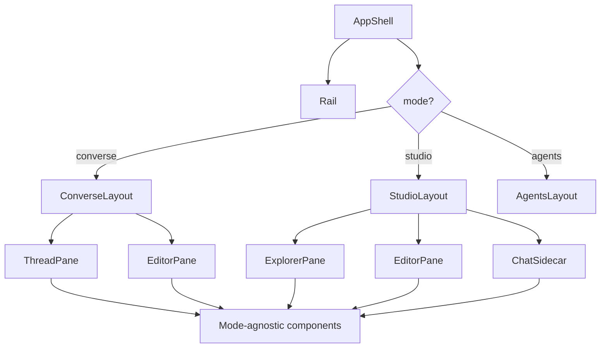

# Layout Architecture

## Principle: Mode = Layout, Not Logic

Workspace modes (`Converse`, `Studio`) are a **layout concern only**. Components are mode-agnostic. The layout shell selects which panels are visible and how they are sized -- nothing else changes between modes.

## Mode Definitions

### Converse

Chat-primary, editor-secondary.

```
┌─────────────────────────────────────────────────┐
│  Rail │  Thread (primary)    │  Editor (secondary)│
│       │                      │  (collapsible)     │
│  [A]  │  ┌──────────────┐   │  ┌──────────────┐  │
│  [C]  │  │  messages     │   │  │  document     │  │
│  [S]  │  │              │   │  │  content      │  │
│       │  │              │   │  │              │  │
│       │  ├──────────────┤   │  │              │  │
│       │  │  composer     │   │  └──────────────┘  │
│       │  └──────────────┘   │                     │
└─────────────────────────────────────────────────┘
```

- Thread pane: ~55% width, always visible
- Editor pane: ~45% width, collapsible to zero
- Resizable divider between panes
- Editor collapse/expand toggle in the divider or toolbar

### Studio

Editor-primary, chat-secondary.

```
┌──────────────────────────────────────────────────┐
│ Rail │ Explorer │  Editor (primary)   │  Chat     │
│      │          │  (tabbed)           │  (sidecar)│
│ [A]  │ folders/ │  ┌──────────────┐  │  ┌──────┐ │
│ [C]  │ files    │  │  tab bar     │  │  │ msgs │ │
│ [S]  │          │  ├──────────────┤  │  │      │ │
│      │          │  │  document    │  │  │      │ │
│      │          │  │  content     │  │  ├──────┤ │
│      │          │  │             │  │  │ comp │ │
│      │          │  └──────────────┘  │  └──────┘ │
└──────────────────────────────────────────────────┘
```

- File explorer: ~200px fixed, collapsible
- Editor pane: ~60% of remaining width, always visible
- Chat sidecar: ~40% of remaining width, collapsible
- Tab bar above editor for open documents

## Mode Switching

**All three mode shells stay mounted simultaneously.** Switching modes is a CSS visibility change — the inactive shells are hidden (`display: none` or `visibility: hidden` + `inert`), never unmounted. This makes mode switching instant (zero render cost, zero state reconstruction).

- Rail icons switch modes instantly (CSS swap, not component mount)
- All state preserved: active thread, open documents, scroll positions, editor content, CM6 instances
- URL reflects mode: `/projects/{id}/converse/...` vs `/projects/{id}/studio/...`
- URL change updates the visible shell — does not trigger unmount/remount

### Mount Lifecycle

```
ProjectShell (mounted when project opens, unmounted when project closes)
├── StudioLayout    (always mounted while project is open)
├── ConverseLayout  (always mounted while project is open)
└── AgentsLayout    (always mounted while project is open)

Mode switch: toggle CSS visibility on the three layouts.
Project switch: unmount entire ProjectShell, mount new one.
```

### Why Not Unmount

- CM6 editors are expensive to initialize — remounting on every mode switch would cause visible lag
- Y.Doc sessions, WebSocket connections, scroll positions all survive naturally
- Thread streaming continues in background when switching to Studio
- The memory cost of three mounted shells is negligible vs the UX cost of remounting

## State Scoping

All layout state is **project-scoped**. Switching projects resets everything. Switching modes within a project preserves everything.

| State | Scope | Survives mode switch | Survives project switch |
|---|---|---|---|
| Active thread | Project | Yes | No |
| Open documents | Project | Yes | No |
| Editor content (Y.Doc) | Document | Yes | No (reconnects) |
| Scroll positions | Per-pane | Yes | No |
| Panel sizes | Per-mode, per-project | Yes | No (restores from localStorage) |
| File explorer state | Project | Yes | No |
| CM6 instances | Project (LRU) | Yes | No (destroyed) |

## Panel Sizing

Use `react-resizable-panels` for all resizable layouts. Each mode stores its own panel size configuration independently.

### Persistence

Panel sizes persist to localStorage keyed by mode:

```
meridian:panels:converse -> { thread: 55, editor: 45 }
meridian:panels:studio -> { explorer: 200, editor: 60, chat: 40 }
```

### Collapse Behavior

- Collapsed panels animate to zero width
- Collapse state persists per-mode
- Double-click divider resets to default sizes

## Rail

The rail is the leftmost column, shared across all modes.

| Icon | Mode | Shortcut |
|---|---|---|
| Agents | Agents view | `Cmd+1` |
| Converse | Converse mode | `Cmd+2` |
| Studio | Studio mode | `Cmd+3` |

Rail width: 48px fixed. Icons are 24px with tooltips on hover.

## Responsive Behavior: Three-Tier Adaptive

Not mobile-first, not desktop-only. Three adaptive tiers that progressively reduce simultaneous panes while preserving capability.

| Tier | Width | Behavior |
|------|-------|----------|
| **Expanded** | ≥1200px | Full multi-pane desktop layout. All panels visible. Drag-resize enabled. |
| **Medium** | 840–1199px | Desktop IA preserved, but show one secondary pane at a time. Tertiary panes become overlays/drawers. |
| **Compact** | ≤839px | Single primary pane with mode switcher. Secondary panes as temporary drawers. |

### Per-Mode Adaptive Behavior

**Studio:**
- Expanded: explorer + tabbed editor + chat sidecar (3-pane)
- Medium: editor + one toggle (explorer OR chat, not both)
- Compact: editor only, explorer/chat as slide-over drawers

**Converse:**
- Expanded: chat primary + resizable editor secondary (2-pane)
- Medium: chat full, editor as slide-over
- Compact: chat only, editor as fullscreen modal

**Agents:**
- Expanded: work dashboard + thread detail + output pane (3-pane)
- Medium: dashboard + one detail pane
- Compact: list → detail navigation stack

### Implementation

- Breakpoints defined in design system tokens, consumed by layout shells
- Components are tier-agnostic — they fill their container at any width
- Layout shells handle pane visibility/overlay logic per tier
- Rail: vertical at expanded/medium, collapses to bottom tab bar at compact (post-v1)
- All sub-components use Pointer Events for unified mouse/touch/pen input

## Component Boundaries



Only `AppShell`, `ConverseLayout`, `StudioLayout`, and `AgentsLayout` are mode-aware. Everything below them is reusable.

## Cross-References

- [Workspace Modes README](./README.md) -- mode rationale and writer profiles
- [Studio Chrome](studio-chrome.md) -- tab bar, explorer details
- [Collab v2 Integration](../collab/collab-v2-integration.md) -- how proposal review works in both modes
