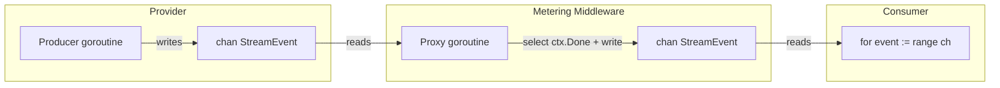
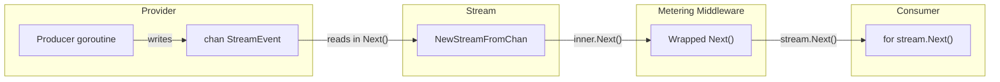
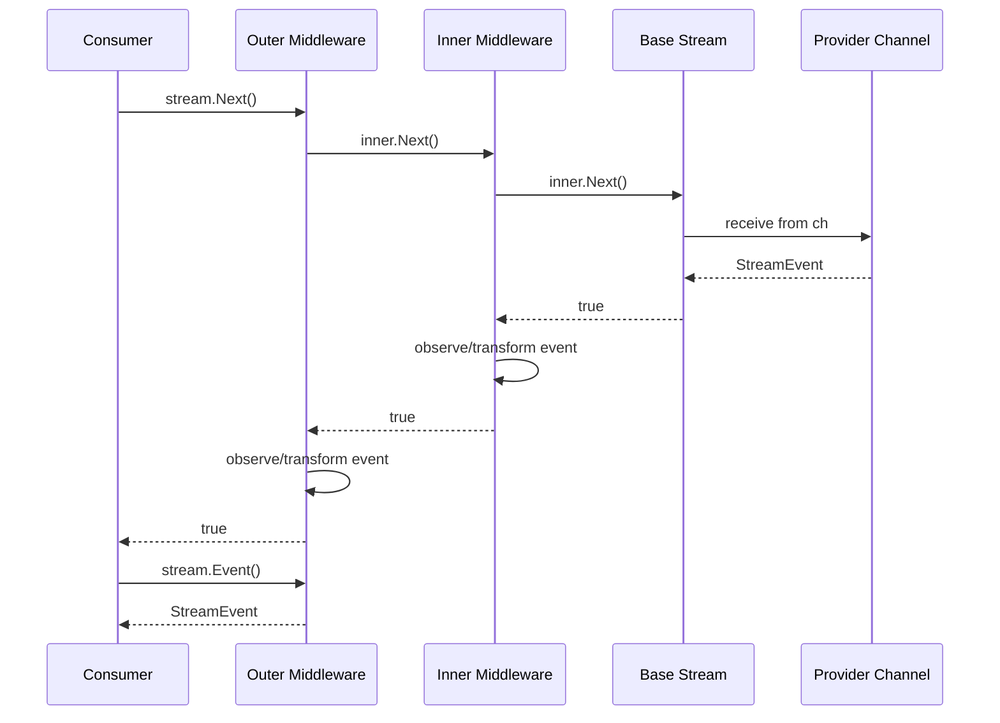

# Stream Type and Middleware API Redesign

## Problem

The current `StreamResponse` returns `<-chan StreamEvent`. Every middleware that needs to observe or modify stream events must spawn a proxy goroutine with its own channel, select on `ctx.Done()`, and manage close semantics. This creates:

1. **Goroutine leaks** -- if the consumer stops reading (HTTP disconnect, context cancel), proxy goroutines block on channel sends. The `select` on `ctx.Done()` mitigates this but is easy to get wrong and must be duplicated in every middleware.
2. **Double-reporting** -- the metering middleware's `reported` flag is fragile. Nothing structurally prevents a second metadata event from reaching the reporter.
3. **Scaling problem** -- N middleware = N proxy goroutines per stream. Each adds latency, channel buffering, and a potential leak site.

The fix: replace `<-chan StreamEvent` with a `*Stream` type. Middleware wraps the stream's iteration, not its transport. Zero goroutines in middleware.

## 1. Stream Type

### API choice: Scanner-style vs Recv-style

| Style | Shape | Pros | Cons |
|---|---|---|---|
| Scanner | `Next() bool` + `Event() StreamEvent` + `Err() error` + `Close() error` | Matches `bufio.Scanner`, `sql.Rows`, `anthropic-sdk-go`. Separates advance from read. Natural `for` loop. | Two calls per event instead of one. |
| Recv | `Recv() (StreamEvent, error)` + `Close() error` | Matches `go-openai`. One call per event. `io.EOF` signals end. | Error and end-of-stream share the return path. Callers must check `io.EOF` explicitly. |

**Decision: Scanner-style.** It separates "is there another event?" from "what is it?" and "did something fail?". This is safer for middleware that wraps iteration -- a wrapper's `Next()` can call the inner `Next()`, inspect `Event()`, and decide whether to expose it, without conflating EOF with errors.

### Full type definition

```go
// Stream provides pull-based iteration over streaming LLM events.
// It is single-consumer and not safe for concurrent use.
//
// Usage:
//
//   stream, err := provider.StreamResponse(ctx, req)
//   if err != nil { return err }
//   defer stream.Close()
//
//   for stream.Next() {
//       ev := stream.Event()
//       // process ev
//   }
//   if err := stream.Err(); err != nil {
//       return err
//   }
type Stream struct {
    // next advances to the next event. Returns false when the stream is
    // exhausted or an error occurred. After Next returns false, call Err()
    // to distinguish clean completion from failure.
    nextFn  func() bool
    // event returns the current event. Only valid after Next() returns true.
    // Calling Event() before Next() or after Next() returns false is undefined.
    eventFn func() StreamEvent
    // err returns the terminal error, or nil if the stream completed cleanly.
    // Only meaningful after Next() returns false.
    errFn   func() error
    // close releases resources associated with the stream (goroutines, HTTP
    // bodies, channels). Close is idempotent. After Close, Next returns false.
    closeFn func() error
}

// Next advances to the next event. Returns false when done or on error.
func (s *Stream) Next() bool  { return s.nextFn() }

// Event returns the current StreamEvent. Only valid after Next() returns true.
func (s *Stream) Event() StreamEvent { return s.eventFn() }

// Err returns the terminal error after Next() returns false. Returns nil on
// clean completion. Context cancellation surfaces here as ctx.Err().
func (s *Stream) Err() error { return s.errFn() }

// Close releases all resources. Idempotent. Safe to call even if Next() has
// not been exhausted. Blocks until the internal producer goroutine exits.
func (s *Stream) Close() error { return s.closeFn() }
```

### Why concrete struct, not interface

- There is one `Stream` type in the package. An interface would invite unnecessary mock implementations and make the zero value ambiguous.
- Middleware wraps streams by constructing a new `*Stream` with different function pointers, not by implementing an interface. This is function composition, not polymorphism.
- If a consumer needs to mock `Stream` in tests, they construct one with `NewStream(...)` and a test source.

### Constructor

```go
// StreamSource produces events for a Stream. The source function is called
// repeatedly by Next(). It returns the next event and true, or the zero
// StreamEvent and false when exhausted. If the source encounters an error,
// it stores it internally and returns false; the Stream retrieves it via errFn.
//
// This is the low-level constructor. Providers typically use NewStreamFromChan.

// NewStream creates a Stream from explicit function pointers.
// This is for advanced use cases (middleware, testing). Most providers
// should use NewStreamFromChan.
func NewStream(
    next func() bool,
    event func() StreamEvent,
    errFn func() error,
    closeFn func() error,
) *Stream {
    return &Stream{
        nextFn:  next,
        eventFn: event,
        errFn:   errFn,
        closeFn: closeFn,
    }
}
```

### Channel-backed constructor (for providers)

Providers still use goroutines internally to decode HTTP responses and emit events. This constructor bridges the gap:

```go
// NewStreamFromChan creates a Stream backed by a channel and context.
// The channel must be closed by the producer when done. The producer
// goroutine must observe ctx cancellation and exit promptly.
//
// If the last event on the channel has a non-nil Error field, that error
// becomes the stream's terminal error (returned by Err()).
//
// Close cancels the internal context, which signals the producer to stop.
// It then drains remaining channel events to unblock the producer.
func NewStreamFromChan(ctx context.Context, ch <-chan StreamEvent, cancel context.CancelFunc) *Stream {
    var (
        current StreamEvent
        err     error
        done    bool
    )

    next := func() bool {
        if done {
            return false
        }
        ev, ok := <-ch
        if !ok {
            done = true
            return false
        }
        // In-band errors from legacy providers become terminal errors
        if ev.Error != nil {
            err = ev.Error
            done = true
            // Drain remaining events so producer goroutine can exit
            go func() {
                for range ch {}
            }()
            return false
        }
        current = ev
        return true
    }

    event := func() StreamEvent {
        return current
    }

    errFunc := func() error {
        return err
    }

    closeFn := func() error {
        if done {
            return nil
        }
        done = true
        cancel()
        // Drain channel so producer goroutine is not blocked on send
        go func() {
            for range ch {}
        }()
        return nil
    }

    return NewStream(next, event, errFunc, closeFn)
}
```

## 2. Updated Provider Interface

```go
type Provider interface {
    // GenerateResponse generates a complete response (blocking).
    GenerateResponse(ctx context.Context, req *GenerateRequest) (*GenerateResponse, error)

    // StreamResponse returns a Stream of events. The caller must call
    // stream.Close() when done (use defer). The stream respects ctx
    // cancellation.
    StreamResponse(ctx context.Context, req *GenerateRequest) (*Stream, error)

    // Name returns the provider identifier.
    Name() ProviderID

    // SupportsModel returns true if the provider supports the given model.
    SupportsModel(model string) bool
}
```

This is a breaking change to `StreamResponse`'s return type. Since the module is at v0.0.X, this is acceptable.

## 3. Updated ProviderMiddleware

### The key insight

With `<-chan StreamEvent`, middleware had to create a proxy channel and spawn a goroutine to forward events. With `*Stream`, middleware wraps the stream's iteration functions -- no goroutines, no channels.

```go
// StreamFunc is the function signature for streaming operations.
// Returns *Stream instead of <-chan StreamEvent.
type StreamFunc func(ctx context.Context, req *GenerateRequest) (*Stream, error)

// GenerateFunc is unchanged.
type GenerateFunc func(ctx context.Context, req *GenerateRequest) (*GenerateResponse, error)

// ProviderMiddleware wraps provider operations for cross-cutting concerns.
// Implementations must be safe for concurrent use across calls.
//
// IMPORTANT: WrapStream must NOT spawn goroutines for stream observation.
// Instead, wrap the Stream's iteration by constructing a new *Stream whose
// Next/Event/Err/Close delegate to the inner stream with additional logic.
type ProviderMiddleware interface {
    WrapStream(info ProviderCallInfo, next StreamFunc) StreamFunc
    WrapGenerate(info ProviderCallInfo, next GenerateFunc) GenerateFunc
}
```

### WrapProvider (unchanged shape, updated types)

```go
func WrapProvider(provider Provider, middleware ...ProviderMiddleware) Provider {
    if len(middleware) == 0 {
        return provider
    }

    info := ProviderCallInfo{
        Provider: provider.Name(),
    }

    streamFn := StreamFunc(provider.StreamResponse)
    generateFn := GenerateFunc(provider.GenerateResponse)

    for i := len(middleware) - 1; i >= 0; i-- {
        streamFn = middleware[i].WrapStream(info, streamFn)
        generateFn = middleware[i].WrapGenerate(info, generateFn)
    }

    return &wrappedProvider{
        base:       provider,
        streamFn:   streamFn,
        generateFn: generateFn,
    }
}
```

### How middleware wraps a stream (the pattern)

This is the general recipe for any middleware that observes events:

```go
func (m *exampleMiddleware) WrapStream(info ProviderCallInfo, next StreamFunc) StreamFunc {
    return func(ctx context.Context, req *GenerateRequest) (*Stream, error) {
        // Pre-call logic (gate checks, request modification, etc.)

        inner, err := next(ctx, req)
        if err != nil {
            return nil, err
        }

        // Wrap the inner stream's iteration. No goroutines.
        var current StreamEvent

        next := func() bool {
            if !inner.Next() {
                return false
            }
            ev := inner.Event()
            // Observe or transform ev here
            current = ev
            return true
        }

        event := func() StreamEvent { return current }
        errFn := func() error { return inner.Err() }
        closeFn := func() error { return inner.Close() }

        return NewStream(next, event, errFn, closeFn), nil
    }
}
```

No proxy goroutine. No proxy channel. The middleware runs on the consumer's goroutine during `Next()`. This is the structural fix for the goroutine leak.

## 4. Usage Metering Middleware (Full Rewrite)

```go
func (m *usageMeteringMiddleware) WrapGenerate(info ProviderCallInfo, next GenerateFunc) GenerateFunc {
    // Unchanged from current implementation -- no streams involved.
    // See current usage_metering.go WrapGenerate for reference.
    // Included here for completeness.

    if m.gate == nil && m.reporter == nil {
        return next
    }

    return func(ctx context.Context, req *GenerateRequest) (*GenerateResponse, error) {
        scope, _ := UsageScopeFromContext(ctx)

        if m.gate != nil {
            decision, err := m.gate.CheckUsage(ctx, UsageGateRequest{
                Provider: info.Provider,
                Model:    req.Model,
                Request:  req,
                Scope:    scope,
            })
            if err != nil {
                return nil, err
            }
            if !decision.Allowed {
                return nil, &UsageDeniedError{
                    Code:     decision.Code,
                    Reason:   decision.Reason,
                    Scope:    scope,
                    Metadata: decision.Metadata,
                }
            }
        }

        resp, err := next(ctx, req)
        if err != nil {
            return nil, err
        }

        if m.reporter != nil {
            report := UsageReport{
                Provider:         info.Provider,
                Model:            resp.Model,
                Scope:            scope,
                InputTokens:      resp.InputTokens,
                OutputTokens:     resp.OutputTokens,
                StopReason:       resp.StopReason,
                ResponseMetadata: resp.ResponseMetadata,
            }
            if err := m.reporter.ReportUsage(ctx, report); err != nil {
                return nil, err
            }
        }

        return resp, nil
    }
}

func (m *usageMeteringMiddleware) WrapStream(info ProviderCallInfo, next StreamFunc) StreamFunc {
    if m.gate == nil && m.reporter == nil {
        return next
    }

    return func(ctx context.Context, req *GenerateRequest) (*Stream, error) {
        scope, _ := UsageScopeFromContext(ctx)

        // Gate check (synchronous, before stream starts)
        if m.gate != nil {
            decision, err := m.gate.CheckUsage(ctx, UsageGateRequest{
                Provider: info.Provider,
                Model:    req.Model,
                Request:  req,
                Scope:    scope,
            })
            if err != nil {
                return nil, err
            }
            if !decision.Allowed {
                return nil, &UsageDeniedError{
                    Code:     decision.Code,
                    Reason:   decision.Reason,
                    Scope:    scope,
                    Metadata: decision.Metadata,
                }
            }
        }

        // Get the inner stream
        inner, err := next(ctx, req)
        if err != nil {
            return nil, err
        }

        // If no reporter, pass through unchanged
        if m.reporter == nil {
            return inner, nil
        }

        // Wrap iteration to intercept terminal metadata for reporting.
        // This runs on the consumer's goroutine -- no proxy goroutine needed.
        var (
            current  StreamEvent
            reported bool
            termErr  error
        )

        wrappedNext := func() bool {
            if !inner.Next() {
                return false
            }

            ev := inner.Event()

            // Terminal metadata: report usage before exposing to consumer
            if ev.Metadata != nil && !reported {
                reported = true
                report := UsageReport{
                    Provider:         info.Provider,
                    Model:            ev.Metadata.Model,
                    Scope:            scope,
                    InputTokens:      ev.Metadata.InputTokens,
                    OutputTokens:     ev.Metadata.OutputTokens,
                    StopReason:       ev.Metadata.StopReason,
                    GenerationID:     ev.Metadata.GenerationID,
                    ResponseMetadata: ev.Metadata.ResponseMetadata,
                }
                if err := m.reporter.ReportUsage(ctx, report); err != nil {
                    // Reporter failed: surface as terminal error.
                    // The metadata event is swallowed; consumer sees the error
                    // via Err() after Next() returns false.
                    termErr = err
                    return false
                }
            }

            current = ev
            return true
        }

        wrappedEvent := func() StreamEvent { return current }

        wrappedErr := func() error {
            if termErr != nil {
                return termErr
            }
            return inner.Err()
        }

        wrappedClose := func() error { return inner.Close() }

        return NewStream(wrappedNext, wrappedEvent, wrappedErr, wrappedClose), nil
    }
}
```

### How the bugs are structurally eliminated

| Bug | Old cause | New prevention |
|---|---|---|
| Goroutine leak | Proxy goroutine blocks on `proxy <- event` when consumer disconnects. `select` on `ctx.Done()` mitigates but must be replicated in every middleware. | No proxy goroutine exists. Iteration runs on consumer's goroutine. When consumer stops calling `Next()`, nothing blocks. |
| Double-reporting | `reported` flag guards against multiple metadata events, but nothing prevents a second middleware in the chain from re-emitting metadata. | The `reported` flag still exists, but structurally there is only one metadata event (the inner stream produces it once). The wrapper is synchronous -- it sees each event exactly once in `Next()`. |
| Channel buffer amplification | N middleware = N buffered proxy channels. | Zero additional channels. Middleware is function composition on the same goroutine. |

## 5. How Providers Change

Providers still use goroutines internally -- that's fine. The goroutine is owned by the `Stream` via `NewStreamFromChan`, which handles cancellation and draining.

### Lorem provider example (before and after)

**Before:**

```go
func (p *Provider) StreamResponse(ctx context.Context, req *GenerateRequest) (<-chan StreamEvent, error) {
    // ... validation ...
    eventChan := make(chan StreamEvent, 10)
    go func() {
        defer close(eventChan)
        emitter := NewEventEmitter(eventChan)
        // ... stream words, emit events ...
        emitter.Metadata(&StreamMetadata{...})
    }()
    return eventChan, nil
}
```

**After:**

```go
func (p *Provider) StreamResponse(ctx context.Context, req *GenerateRequest) (*Stream, error) {
    // ... validation (unchanged) ...

    // Create a cancellable child context so Close() can stop the producer.
    ctx, cancel := context.WithCancel(ctx)
    eventChan := make(chan StreamEvent, 10)

    go func() {
        defer close(eventChan)
        emitter := NewEventEmitter(eventChan)
        // ... stream words, emit events (unchanged internal logic) ...
        // The emitter still writes to eventChan.
        // Context cancellation is already checked in the loop.
        emitter.Metadata(&StreamMetadata{...})
    }()

    return NewStreamFromChan(ctx, eventChan, cancel), nil
}
```

The diff is minimal:
1. Return type changes from `(<-chan StreamEvent, error)` to `(*Stream, error)`.
2. Create a child context with cancel.
3. Wrap the channel with `NewStreamFromChan(ctx, eventChan, cancel)`.

The internal goroutine and `EventEmitter` usage are unchanged. The provider still owns the goroutine; `Stream` owns its shutdown.

### Pattern for real providers (Anthropic, OpenRouter)

Same pattern. The HTTP response body decoding goroutine writes to a channel, and the channel is wrapped:

```go
func (p *AnthropicProvider) StreamResponse(ctx context.Context, req *GenerateRequest) (*Stream, error) {
    // ... build API request, call Anthropic SDK ...
    ctx, cancel := context.WithCancel(ctx)
    ch := make(chan StreamEvent, 10)

    go func() {
        defer close(ch)
        emitter := NewEventEmitter(ch)
        // ... decode SSE, emit AG-UI events, emit metadata ...
    }()

    return NewStreamFromChan(ctx, ch, cancel), nil
}
```

## 6. EventEmitter

### Does it change?

**No.** The `EventEmitter` writes to a `chan<- StreamEvent`. It is used inside provider goroutines, which still write to channels. The `Stream` type sits between the channel and the consumer -- the emitter is below the stream, not above it.

### Should it be context-aware?

**No, not now.** The emitter's sends are non-blocking because the channel is buffered and the consumer is pulling. Making the emitter context-aware would add `select` logic to every emit call, which is unnecessary when the producer goroutine already checks `ctx.Done()` in its main loop.

If a future provider has sends that could block (unbuffered channel, slow consumer), the provider should handle that in its own goroutine. The emitter remains a thin wrapper.

### EventEmitter type (unchanged)

```go
type EventEmitter struct {
    eventChan chan<- StreamEvent
}

func NewEventEmitter(ch chan<- StreamEvent) *EventEmitter {
    return &EventEmitter{eventChan: ch}
}
```

## 7. StreamEvent Changes

### Should `StreamEvent.Error` be removed?

**No. Keep it, but document its reduced role.**

| Use case | Old behavior | New behavior |
|---|---|---|
| Provider transport error | `StreamEvent{Error: err}` sent on channel, consumer checks each event | Error from inner stream surfaces via `stream.Err()` after `Next()` returns false. `NewStreamFromChan` intercepts `StreamEvent.Error` and converts it to `Err()`. |
| AG-UI `RUN_ERROR` | `StreamEvent{Event: RunErrorEvent{...}}` -- a normal AG-UI event | Unchanged. This is a protocol event, not a Go error. |
| Reporter failure in middleware | Old: `StreamEvent{Error: err}` sent on proxy channel | New: middleware returns `false` from `Next()` and surfaces via `Err()` |

`StreamEvent.Error` stays because:
1. It is part of the channel protocol between providers and `NewStreamFromChan`. Providers emit errors in-band on the channel; `NewStreamFromChan` converts them to out-of-band `Err()`.
2. Removing it would force providers to use a side-channel for errors, adding complexity.
3. It costs nothing to keep -- consumers of `*Stream` never see it (they use `Err()`).

**Document clearly:** consumers of `*Stream` should use `stream.Err()`, not check `StreamEvent.Error`. The `Error` field is an internal transport detail between providers and `NewStreamFromChan`.

### StreamEvent type (unchanged)

```go
type StreamEvent struct {
    Event                 events.Event         `json:"event,omitempty"`
    Block                 *Block               `json:"block,omitempty"`
    Metadata              *StreamMetadata      `json:"metadata,omitempty"`
    GenerationIDDiscovered *GenerationIDEvent   `json:"generationIDDiscovered,omitempty"`
    Error                 error                `json:"error,omitempty"` // Internal: provider -> NewStreamFromChan only
}
```

## 8. Backward Compatibility

Provide a `StreamResponseChan` adapter on `WrappedProvider` or as a standalone helper:

```go
// StreamResponseChan adapts a Stream-returning provider to the legacy channel
// API. The returned channel is closed when the stream is exhausted or errors.
// Errors surface as StreamEvent{Error: err} on the channel (legacy behavior).
//
// Deprecated: Use StreamResponse and the *Stream API directly.
func StreamResponseChan(ctx context.Context, provider Provider, req *GenerateRequest) (<-chan StreamEvent, error) {
    stream, err := provider.StreamResponse(ctx, req)
    if err != nil {
        return nil, err
    }

    ch := make(chan StreamEvent, 10)
    go func() {
        defer close(ch)
        defer stream.Close()

        for stream.Next() {
            select {
            case ch <- stream.Event():
            case <-ctx.Done():
                return
            }
        }
        if err := stream.Err(); err != nil {
            select {
            case ch <- StreamEvent{Error: err}:
            case <-ctx.Done():
            }
        }
    }()

    return ch, nil
}
```

This is a standalone function, not a method on `Provider`, to avoid polluting the interface. Callers migrating from the old API change one call site.

## 9. Architecture Diagrams

### Before: channel + proxy goroutine middleware



Problems visible in this diagram:
- Two goroutines per middleware layer (proxy goroutine + its select loop)
- Two channels per middleware layer
- If consumer stops reading MCH, MG blocks on write even with `select` guard
- Each middleware replicates the `select`/`ctx.Done()` boilerplate

### After: Stream wrapping (no proxy goroutines)



- One goroutine total (the provider's producer)
- One channel total (provider internal)
- Middleware is synchronous function wrapping on consumer's goroutine
- No channel send can block because there are no proxy channels

### Middleware composition (N middleware)



All on the consumer's goroutine. No goroutine spawned by any middleware.

## 10. Decisions Table

| # | Question | Decision | Rationale |
|---|---|---|---|
| 1 | Scanner-style vs Recv-style | Scanner: `Next()` + `Event()` + `Err()` + `Close()` | Separates advance/read/error. Safer for middleware wrapping. Matches `anthropic-sdk-go`, `bufio.Scanner`, `sql.Rows`. |
| 2 | Interface vs concrete struct | Concrete `*Stream` | Only one stream type exists. Function-pointer composition is simpler than interface polymorphism. No mock interface needed (construct with `NewStream`). |
| 3 | Generic `Stream[T]` vs concrete | Concrete `Stream` (not generic) | Only one event type (`StreamEvent`). Generics add no value and complicate the API. |
| 4 | Middleware goroutine policy | Middleware must NOT spawn goroutines for stream wrapping | This is the core fix. Goroutine-free wrapping eliminates the leak class entirely. |
| 5 | Provider internal goroutines | Still allowed, wrapped by `NewStreamFromChan` | Providers need goroutines for HTTP decoding. `NewStreamFromChan` owns shutdown and draining. |
| 6 | `StreamEvent.Error` field | Keep, but document as internal transport | Providers emit errors in-band on channels. `NewStreamFromChan` converts to out-of-band `Err()`. Consumers of `*Stream` use `Err()`. |
| 7 | EventEmitter changes | None | Emitter writes to channels inside provider goroutines. It sits below the Stream abstraction. |
| 8 | EventEmitter context-awareness | Not now | Producer goroutines already check `ctx.Done()`. Adding it to emitter is redundant. |
| 9 | Backward compat approach | `StreamResponseChan()` standalone function | Avoids polluting `Provider` interface. One-line migration for old callers. Marked deprecated. |
| 10 | Channel in `NewStreamFromChan` | Drain on Close to prevent producer goroutine leak | If Close is called before stream is exhausted, remaining channel events are drained so the producer goroutine can exit. |
| 11 | Buffer size | Providers keep their existing buffer (typically 10) | No change to provider internals. The `Stream` layer adds zero additional buffering. |
| 12 | `Close()` idempotency | Yes, Close is idempotent | Matches `io.Closer` convention. Prevents double-close panics with `defer`. |
| 13 | Method name: `Event()` vs `Current()` | `Event()` | Domain-specific: we're streaming events. `Current()` is generic. `Event()` reads naturally: `stream.Event()`. |

## Implementation Plan

### File changes

| File | Change |
|---|---|
| `streaming.go` | Add `Stream` struct, `NewStream`, `NewStreamFromChan` |
| `provider.go` | Change `StreamResponse` return type to `(*Stream, error)` |
| `middleware.go` | Update `StreamFunc` type signature. Update `wrappedProvider`. |
| `usage_metering.go` | Rewrite `WrapStream` (remove proxy goroutine, use stream wrapping) |
| `event_emitter.go` | No changes |
| `request.go` | No changes |
| `response.go` | No changes |
| `errors.go` | No changes |
| `providers/lorem/provider.go` | Wrap channel with `NewStreamFromChan` |
| `providers/anthropic/*.go` | Wrap channel with `NewStreamFromChan` |
| `providers/openrouter/*.go` | Wrap channel with `NewStreamFromChan` |

### Implementation order

1. Add `Stream`, `NewStream`, `NewStreamFromChan` to `streaming.go`
2. Update `Provider` interface in `provider.go`
3. Update `StreamFunc` and `wrappedProvider` in `middleware.go`
4. Update all providers (lorem, anthropic, openrouter) to return `*Stream`
5. Rewrite `usageMeteringMiddleware.WrapStream` in `usage_metering.go`
6. Add `StreamResponseChan` backward-compat helper
7. Update tests
8. Update examples

### Testing requirements

- `NewStreamFromChan`: clean completion, error propagation, Close before exhaustion, context cancellation
- `Stream` wrapping: middleware sees all events, middleware can transform events, middleware can terminate early
- Usage metering: gate denial, clean reporting, reporter error surfaces via `Err()`, no double-reporting
- Backward compat: `StreamResponseChan` produces same event sequence as old API
- Lorem provider: streams work end-to-end with new return type
- Goroutine leak: use `goleak` or `runtime.NumGoroutine` to verify zero leaked goroutines after Close, after context cancel, and after partial consumption
